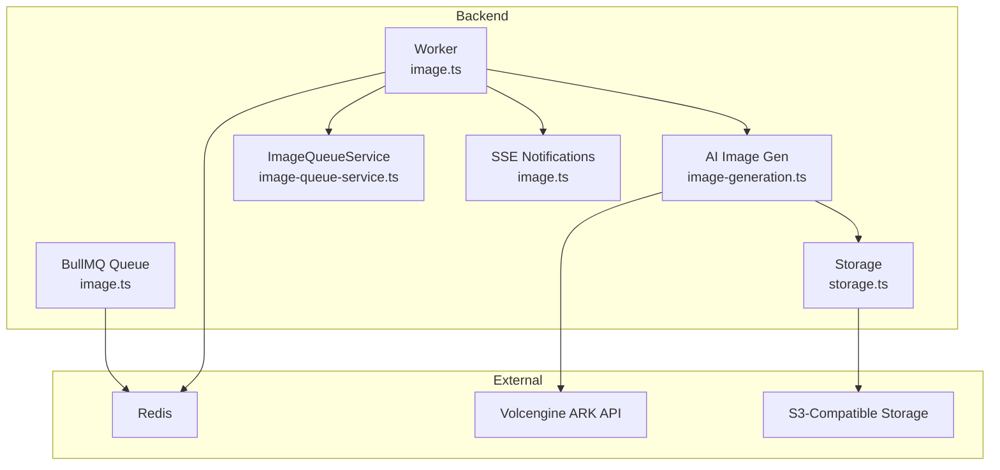
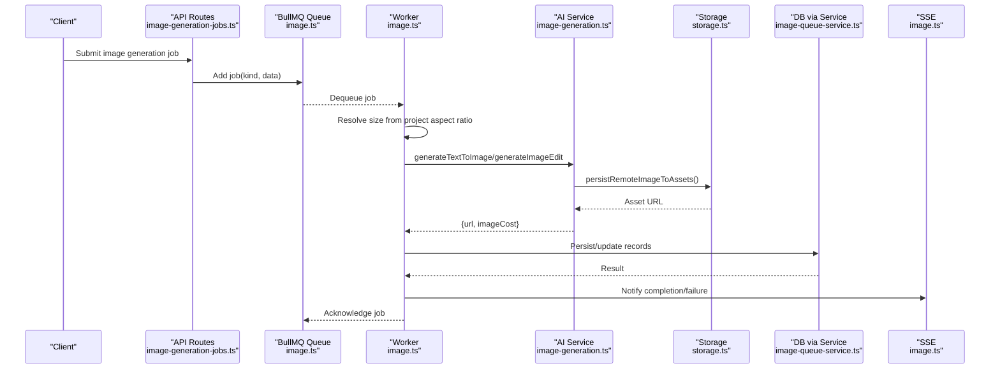
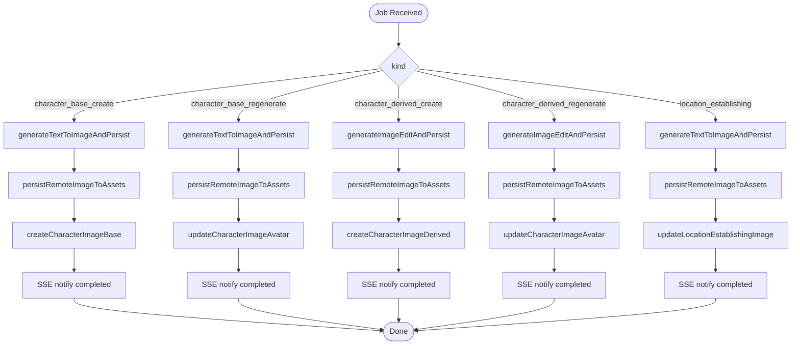
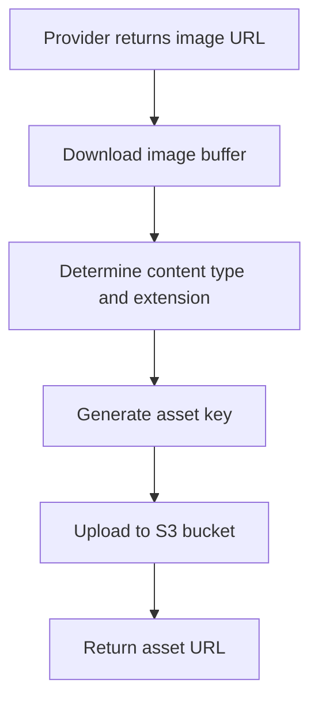
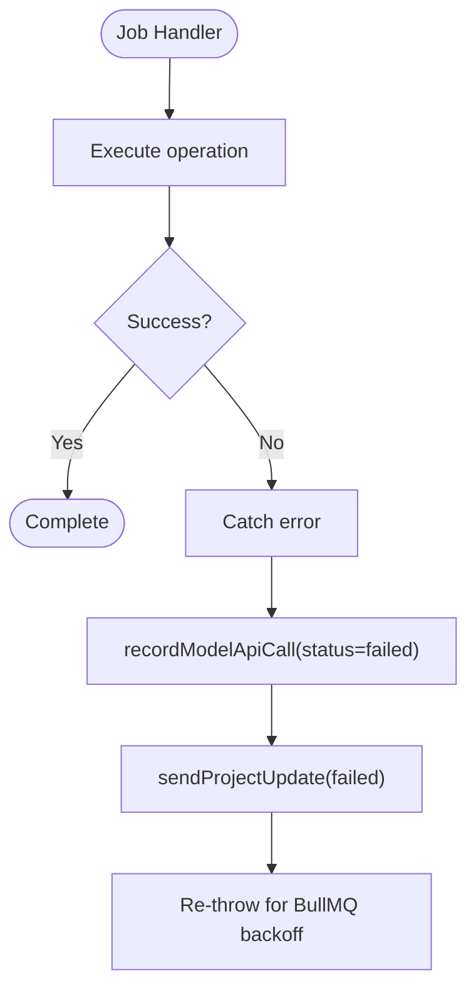
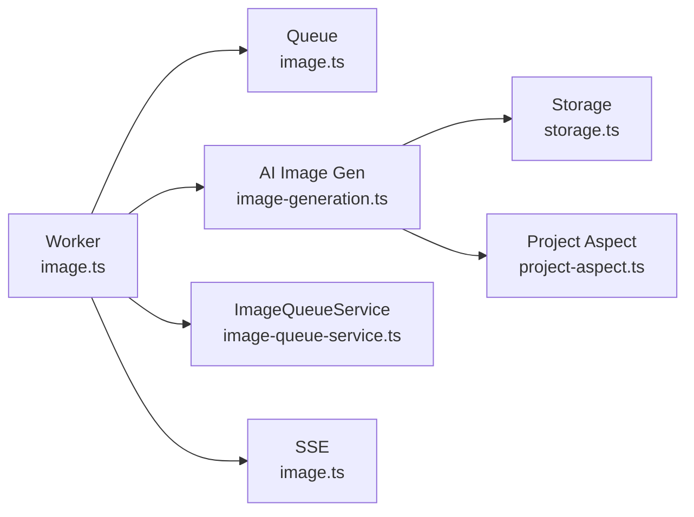

# Image Processing Queue

<cite>
**Referenced Files in This Document**
- [image.ts](file://packages/backend/src/queues/image.ts)
- [image-generation.ts](file://packages/backend/src/services/ai/image-generation.ts)
- [image-queue-service.ts](file://packages/backend/src/services/image-queue-service.ts)
- [storage.ts](file://packages/backend/src/services/storage.ts)
- [worker.ts](file://packages/backend/src/worker.ts)
- [project-aspect.ts](file://packages/backend/src/lib/project-aspect.ts)
- [image-generation-jobs.ts](file://packages/backend/src/routes/image-generation-jobs.ts)
- [image-queue-worker-logic.test.ts](file://packages/backend/tests/image-queue-worker-logic.test.ts)
- [image-queue-service.test.ts](file://packages/backend/tests/image-queue-service.test.ts)
</cite>

## Table of Contents

1. [Introduction](#introduction)
2. [Project Structure](#project-structure)
3. [Core Components](#core-components)
4. [Architecture Overview](#architecture-overview)
5. [Detailed Component Analysis](#detailed-component-analysis)
6. [Dependency Analysis](#dependency-analysis)
7. [Performance Considerations](#performance-considerations)
8. [Troubleshooting Guide](#troubleshooting-guide)
9. [Conclusion](#conclusion)
10. [Appendices](#appendices)

## Introduction

This document describes the image processing queue system responsible for generating and managing images in response to user requests. It covers the job types for different image operations, the end-to-end workflow from job submission to persistence, error handling, monitoring hooks, and operational considerations for scaling and reliability.

## Project Structure

The image processing system is implemented in the backend package and consists of:

- A BullMQ-based queue and worker for processing image generation jobs
- Services for interacting with AI image generation APIs and persisting assets
- A dedicated service layer for database writes triggered by jobs
- A storage abstraction for uploading generated images to an S3-compatible bucket
- Worker bootstrapping and graceful shutdown orchestration
- Supporting utilities for project aspect ratio normalization

**Diagram sources**

- [image.ts:19-28](file://packages/backend/src/queues/image.ts#L19-L28)
- [image.ts:38-289](file://packages/backend/src/queues/image.ts#L38-L289)
- [image-generation.ts:178-195](file://packages/backend/src/services/ai/image-generation.ts#L178-L195)
- [storage.ts:28-48](file://packages/backend/src/services/storage.ts#L28-L48)
- [image-queue-service.ts:9-51](file://packages/backend/src/services/image-queue-service.ts#L9-L51)

**Section sources**

- [image.ts:1-304](file://packages/backend/src/queues/image.ts#L1-L304)
- [image-generation.ts:1-307](file://packages/backend/src/services/ai/image-generation.ts#L1-L307)
- [image-queue-service.ts:1-52](file://packages/backend/src/services/image-queue-service.ts#L1-L52)
- [storage.ts:1-74](file://packages/backend/src/services/storage.ts#L1-L74)
- [worker.ts:1-29](file://packages/backend/src/worker.ts#L1-L29)

## Core Components

- Image Generation Queue and Worker: Defines the queue, retry/backoff policy, and the worker that executes jobs concurrently.
- AI Image Generation Service: Orchestrates calls to the Volcengine ARK API, handles response parsing, cost estimation, and asset persistence.
- ImageQueueService: Encapsulates database writes for character and location image updates and creation.
- Storage Service: Provides S3-compatible upload and URL generation for assets.
- SSE Notifications: Emits progress and completion/failure events to clients.
- Aspect Ratio Utilities: Normalizes project aspect ratios to supported sizes for image generation.

**Section sources**

- [image.ts:19-289](file://packages/backend/src/queues/image.ts#L19-L289)
- [image-generation.ts:16-94](file://packages/backend/src/services/ai/image-generation.ts#L16-L94)
- [image-queue-service.ts:9-51](file://packages/backend/src/services/image-queue-service.ts#L9-L51)
- [storage.ts:28-48](file://packages/backend/src/services/storage.ts#L28-L48)
- [project-aspect.ts:12-27](file://packages/backend/src/lib/project-aspect.ts#L12-L27)

## Architecture Overview

The system uses a queue-driven architecture:

- Jobs are enqueued with typed data describing the operation and context.
- The worker selects jobs and dispatches them to the appropriate handler based on kind.
- Handlers call AI services to generate or edit images, persist assets, and update the database.
- SSE notifications inform clients of progress and outcomes.
- Errors are recorded and surfaced to clients.

**Diagram sources**

- [image.ts:38-289](file://packages/backend/src/queues/image.ts#L38-L289)
- [image-generation.ts:289-306](file://packages/backend/src/services/ai/image-generation.ts#L289-L306)
- [storage.ts:28-48](file://packages/backend/src/services/storage.ts#L28-L48)
- [image-queue-service.ts:24-44](file://packages/backend/src/services/image-queue-service.ts#L24-L44)

## Detailed Component Analysis

### Job Types and Workflows

Supported job kinds and their processing logic:

- Character base create: Generates a new base character image using text-to-image, persists the asset, creates a base image record, and notifies the client.
- Character base regenerate: Regenerates a base character image using text-to-image, updates the avatar URL and prompt, and notifies the client.
- Character derived create: Edits a reference image to produce a derived variant (e.g., new outfit), persists the asset, creates a derived image record, and notifies the client.
- Character derived regenerate: Edits an existing character image using a reference image and edit prompt, updates the avatar URL and prompt, and notifies the client.
- Location establishing: Generates an establishing image for a location using text-to-image, updates the location’s active image, and notifies the client.

**Diagram sources**

- [image.ts:49-250](file://packages/backend/src/queues/image.ts#L49-L250)
- [image-generation.ts:289-306](file://packages/backend/src/services/ai/image-generation.ts#L289-L306)
- [image-queue-service.ts:24-44](file://packages/backend/src/services/image-queue-service.ts#L24-L44)

**Section sources**

- [image.ts:49-250](file://packages/backend/src/queues/image.ts#L49-L250)
- [image-generation.ts:241-306](file://packages/backend/src/services/ai/image-generation.ts#L241-L306)
- [image-queue-service.ts:24-44](file://packages/backend/src/services/image-queue-service.ts#L24-L44)

### Thumbnail Generation and Asset Optimization

- Asset Persistence: Generated images are downloaded from the provider’s temporary URL and uploaded to the configured S3-compatible bucket under a generated key. The returned URL is stored for later use.
- Content Type Handling: The service infers the file extension from the response content type to ensure correct persistence.
- Cost Estimation: Token usage from the provider response is parsed and converted to an estimated RMB cost for billing and logging.

**Diagram sources**

- [image-generation.ts:228-239](file://packages/backend/src/services/ai/image-generation.ts#L228-L239)
- [storage.ts:28-48](file://packages/backend/src/services/storage.ts#L28-L48)

**Section sources**

- [image-generation.ts:228-239](file://packages/backend/src/services/ai/image-generation.ts#L228-L239)
- [storage.ts:28-48](file://packages/backend/src/services/storage.ts#L28-L48)

### Batch Processing and Progressive Enhancement

- Batch Submission: Jobs are enqueued individually; there is no explicit batch API in the referenced code. Clients enqueue multiple jobs for the same project to achieve batch-like processing.
- Progress Tracking: SSE notifications are sent per job completion or failure, enabling UIs to reflect progress per item.
- Memory Management: The worker runs with a fixed concurrency; individual job handlers download images into memory buffers before uploading. There is no explicit memory pool or streaming optimization in the referenced code.

**Section sources**

- [image.ts:291-297](file://packages/backend/src/queues/image.ts#L291-L297)
- [image-generation.ts:216-225](file://packages/backend/src/services/ai/image-generation.ts#L216-L225)
- [worker.ts:14-29](file://packages/backend/src/worker.ts#L14-L29)

### Error Handling

- Provider Errors: Non-OK HTTP responses from the provider trigger a structured error with the status and response body excerpt.
- JSON Parsing Errors: Non-JSON responses raise a descriptive error indicating invalid JSON.
- Missing URLs: Absence of image URLs in the provider response triggers a specific error.
- Job-Level Failures: On exceptions, the worker records the failure in the model API logger, constructs a failure payload, notifies the client via SSE, and re-throws the error so BullMQ can apply retry/backoff.

**Diagram sources**

- [image-generation.ts:178-195](file://packages/backend/src/services/ai/image-generation.ts#L178-L195)
- [image-generation.ts:197-207](file://packages/backend/src/services/ai/image-generation.ts#L197-L207)
- [image.ts:251-283](file://packages/backend/src/queues/image.ts#L251-L283)

**Section sources**

- [image-generation.ts:48-53](file://packages/backend/src/services/ai/image-generation.ts#L48-L53)
- [image-generation.ts:178-195](file://packages/backend/src/services/ai/image-generation.ts#L178-L195)
- [image-generation.ts:197-207](file://packages/backend/src/services/ai/image-generation.ts#L197-L207)
- [image.ts:251-283](file://packages/backend/src/queues/image.ts#L251-L283)

### Monitoring and Metrics

- Built-in Logging: The worker logs completion and failure events with job IDs and messages.
- SSE Notifications: Clients receive real-time updates for job status, enabling UI-level monitoring.
- Model API Logging: Each job records provider, model, prompt, and cost details for observability.

**Section sources**

- [image.ts:291-297](file://packages/backend/src/queues/image.ts#L291-L297)
- [image.ts:30-36](file://packages/backend/src/queues/image.ts#L30-L36)
- [image.ts:71-84](file://packages/backend/src/queues/image.ts#L71-L84)

### Scaling Considerations

- Concurrency: The worker is configured with a fixed concurrency level suitable for GPU/CPU-bound image generation workloads.
- Backoff and Retries: Jobs are retried with exponential backoff to handle transient provider errors.
- Worker Separation: Dedicated workers are started for video, import, and image queues, isolating load and simplifying scaling.

**Section sources**

- [image.ts:285-288](file://packages/backend/src/queues/image.ts#L285-L288)
- [image.ts:21-27](file://packages/backend/src/queues/image.ts#L21-L27)
- [worker.ts:5-12](file://packages/backend/src/worker.ts#L5-L12)

## Dependency Analysis

The following diagram shows key dependencies among components involved in image processing:

**Diagram sources**

- [image.ts:38-289](file://packages/backend/src/queues/image.ts#L38-L289)
- [image-generation.ts:16-94](file://packages/backend/src/services/ai/image-generation.ts#L16-L94)
- [image-queue-service.ts:9-51](file://packages/backend/src/services/image-queue-service.ts#L9-L51)
- [storage.ts:28-48](file://packages/backend/src/services/storage.ts#L28-L48)
- [project-aspect.ts:12-27](file://packages/backend/src/lib/project-aspect.ts#L12-L27)

**Section sources**

- [image.ts:38-289](file://packages/backend/src/queues/image.ts#L38-L289)
- [image-generation.ts:16-94](file://packages/backend/src/services/ai/image-generation.ts#L16-L94)
- [image-queue-service.ts:9-51](file://packages/backend/src/services/image-queue-service.ts#L9-L51)
- [storage.ts:28-48](file://packages/backend/src/services/storage.ts#L28-L48)
- [project-aspect.ts:12-27](file://packages/backend/src/lib/project-aspect.ts#L12-L27)

## Performance Considerations

- Concurrency Tuning: Adjust worker concurrency based on available compute resources and provider rate limits.
- Retry Strategy: Exponential backoff reduces thundering herds on transient failures.
- Memory Footprint: Downloading entire image buffers before upload increases memory usage; consider streaming uploads if supported by the storage SDK.
- Provider Limits: Respect provider quotas and implement client-side throttling if needed.

[No sources needed since this section provides general guidance]

## Troubleshooting Guide

Common issues and remedies:

- Provider Authentication Failure: Ensure the provider API key is set; otherwise, the service throws a specific error.
- Non-JSON Responses: Verify provider response format; the service expects JSON and raises an error for malformed responses.
- Missing Image URLs: Confirm the provider returned a valid URL in the response data array.
- Job Failures: Inspect SSE notifications and model API logs for error messages and cost details.

**Section sources**

- [image-generation.ts:96-104](file://packages/backend/src/services/ai/image-generation.ts#L96-L104)
- [image-generation.ts:178-195](file://packages/backend/src/services/ai/image-generation.ts#L178-L195)
- [image-generation.ts:197-207](file://packages/backend/src/services/ai/image-generation.ts#L197-L207)
- [image.ts:295-297](file://packages/backend/src/queues/image.ts#L295-L297)

## Conclusion

The image processing queue system provides a robust, observable pipeline for generating and managing images. It supports multiple job kinds, persistent asset storage, SSE-based client notifications, and structured error handling with retries. For high-volume scenarios, tune concurrency, monitor provider quotas, and consider optimizing memory usage for large image downloads.

## Appendices

### API and Route Context

- The routes module for image generation jobs defines the HTTP surface for submitting jobs and retrieving status. While the specific route file is referenced, the detailed endpoint definitions are not included in the current context snapshot.

**Section sources**

- [image-generation-jobs.ts](file://packages/backend/src/routes/image-generation-jobs.ts)

### Test Coverage Highlights

- Worker Logic Tests: Validate successful job processing, failure propagation, null cost handling, missing aspect ratio fallback, and API call recording.
- Service Layer Tests: Validate delegation to repositories for project aspect ratio, ordering, and CRUD operations for character and location images.

**Section sources**

- [image-queue-worker-logic.test.ts:98-332](file://packages/backend/tests/image-queue-worker-logic.test.ts#L98-L332)
- [image-queue-service.test.ts:26-188](file://packages/backend/tests/image-queue-service.test.ts#L26-L188)
