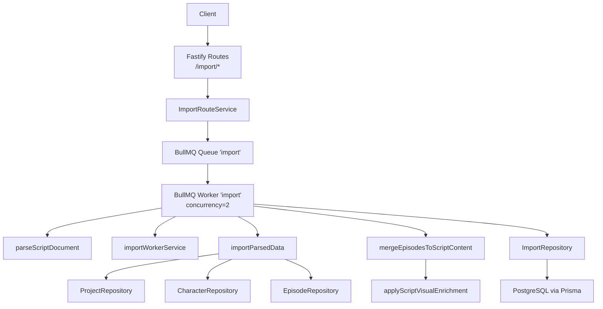
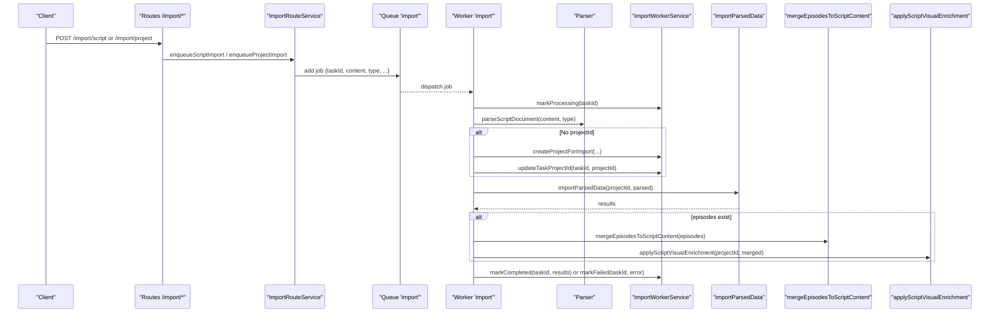
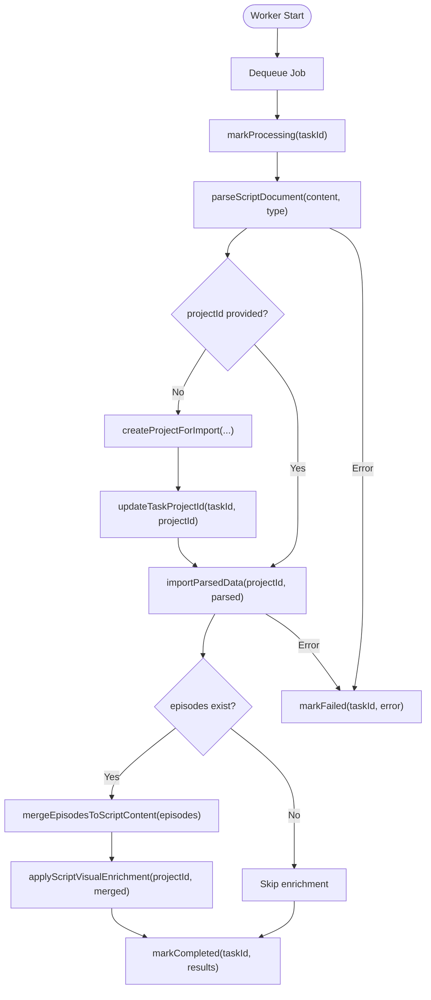
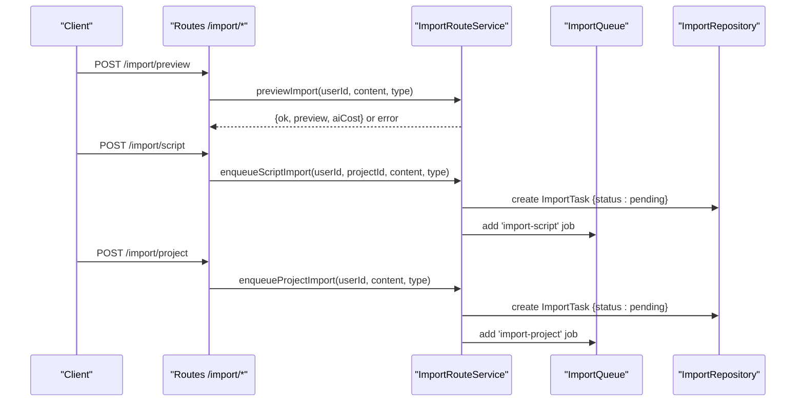
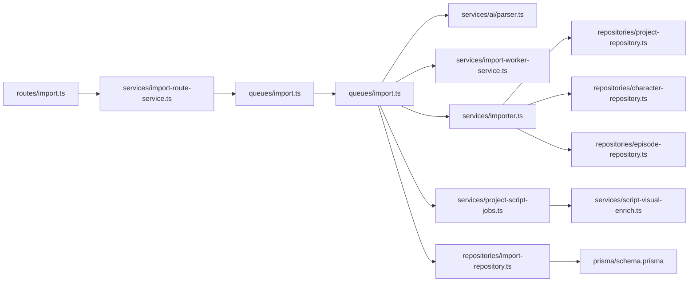

# Import Data Queue

<cite>
**Referenced Files in This Document**
- [import.ts](file://packages/backend/src/queues/import.ts)
- [import-worker-service.ts](file://packages/backend/src/services/import-worker-service.ts)
- [importer.ts](file://packages/backend/src/services/importer.ts)
- [import.ts](file://packages/backend/src/routes/import.ts)
- [import-route-service.ts](file://packages/backend/src/services/import-route-service.ts)
- [import-repository.ts](file://packages/backend/src/repositories/import-repository.ts)
- [parser.ts](file://packages/backend/src/services/ai/parser.ts)
- [parsed-script-types.ts](file://packages/backend/src/services/ai/parsed-script-types.ts)
- [project-script-jobs.ts](file://packages/backend/src/services/project-script-jobs.ts)
- [script-visual-enrich.ts](file://packages/backend/src/services/script-visual-enrich.ts)
- [schema.prisma](file://packages/backend/prisma/schema.prisma)
- [worker.ts](file://packages/backend/src/worker.ts)
- [import-queue-worker-logic.test.ts](file://packages/backend/tests/import-queue-worker-logic.test.ts)
</cite>

## Table of Contents

1. [Introduction](#introduction)
2. [Project Structure](#project-structure)
3. [Core Components](#core-components)
4. [Architecture Overview](#architecture-overview)
5. [Detailed Component Analysis](#detailed-component-analysis)
6. [Dependency Analysis](#dependency-analysis)
7. [Performance Considerations](#performance-considerations)
8. [Troubleshooting Guide](#troubleshooting-guide)
9. [Conclusion](#conclusion)

## Introduction

This document explains the data import queue system for bulk operations and data migration. It covers job types for importing projects and scenes via scripts, validation and transformation pipelines, conflict resolution strategies, batch sizing, progress tracking, notifications, error handling, rollback mechanisms, audit logging, integrity checks, and performance considerations for large-scale imports and concurrent processing.

## Project Structure

The import system spans routing, queueing, worker processing, parsing, transformation, persistence, and optional post-processing:

- Routes expose endpoints to preview and enqueue imports.
- Queue and Worker orchestrate asynchronous processing.
- Parser validates and normalizes input (Markdown or JSON).
- Importer transforms parsed data into domain entities (projects, episodes, scenes, characters).
- Repositories persist tasks and manage entity storage.
- Optional visual enrichment enhances imported content after episodes exist.

**Diagram sources**

- [import.ts:30-95](file://packages/backend/src/queues/import.ts#L30-L95)
- [import.ts:6-118](file://packages/backend/src/routes/import.ts#L6-L118)
- [import-route-service.ts:23-127](file://packages/backend/src/services/import-route-service.ts#L23-L127)
- [importer.ts:67-159](file://packages/backend/src/services/importer.ts#L67-L159)
- [parser.ts:90-133](file://packages/backend/src/services/ai/parser.ts#L90-L133)
- [project-script-jobs.ts:107-137](file://packages/backend/src/services/project-script-jobs.ts#L107-L137)
- [script-visual-enrich.ts:1-200](file://packages/backend/src/services/script-visual-enrich.ts#L1-L200)
- [import-repository.ts:4-34](file://packages/backend/src/repositories/import-repository.ts#L4-L34)
- [schema.prisma:298-312](file://packages/backend/prisma/schema.prisma#L298-L312)

**Section sources**

- [import.ts:1-114](file://packages/backend/src/queues/import.ts#L1-L114)
- [import.ts:1-119](file://packages/backend/src/routes/import.ts#L1-L119)
- [import-route-service.ts:1-127](file://packages/backend/src/services/import-route-service.ts#L1-L127)
- [importer.ts:1-160](file://packages/backend/src/services/importer.ts#L1-L160)
- [parser.ts:1-232](file://packages/backend/src/services/ai/parser.ts#L1-L232)
- [project-script-jobs.ts:1-200](file://packages/backend/src/services/project-script-jobs.ts#L1-L200)
- [script-visual-enrich.ts:1-200](file://packages/backend/src/services/script-visual-enrich.ts#L1-L200)
- [import-repository.ts:1-34](file://packages/backend/src/repositories/import-repository.ts#L1-L34)
- [schema.prisma:298-312](file://packages/backend/prisma/schema.prisma#L298-L312)

## Core Components

- Import Queue and Worker: Asynchronous processing of import jobs with retry/backoff and concurrency control.
- Import Route Service: Enqueues jobs and manages task lifecycle; supports preview and listing.
- Import Worker Service: Updates task status and project linkage during import.
- Parser and Normalizer: Validates and normalizes input (Markdown or JSON) into a canonical structure.
- Importer: Transforms parsed data into domain entities with conflict-aware updates.
- Repositories: Persist tasks and manage entities (projects, episodes, scenes, characters).
- Visual Enrichment: Applies optional enrichment when episodes exist.

Key job types:

- import-script: Enqueue to import into an existing project.
- import-project: Enqueue to create a new project and import.

**Section sources**

- [import.ts:21-95](file://packages/backend/src/queues/import.ts#L21-L95)
- [import-route-service.ts:70-111](file://packages/backend/src/services/import-route-service.ts#L70-L111)
- [import-worker-service.ts:5-35](file://packages/backend/src/services/import-worker-service.ts#L5-L35)
- [parser.ts:90-133](file://packages/backend/src/services/ai/parser.ts#L90-L133)
- [importer.ts:67-159](file://packages/backend/src/services/importer.ts#L67-L159)
- [import-repository.ts:4-34](file://packages/backend/src/repositories/import-repository.ts#L4-L34)
- [project-script-jobs.ts:107-137](file://packages/backend/src/services/project-script-jobs.ts#L107-L137)
- [script-visual-enrich.ts:1-200](file://packages/backend/src/services/script-visual-enrich.ts#L1-L200)

## Architecture Overview

End-to-end flow for importing a script into an existing project:

1. Client posts to the import endpoint with content and type.
2. Route service enqueues a job into the import queue.
3. Worker processes the job:
   - Marks task processing.
   - Parses and normalizes content.
   - Creates project if none provided.
   - Imports parsed data into domain entities.
   - Optionally applies visual enrichment if episodes exist.
   - Marks task completed with results or failed with error.

**Diagram sources**

- [import.ts:32-86](file://packages/backend/src/routes/import.ts#L32-L86)
- [import-route-service.ts:70-111](file://packages/backend/src/services/import-route-service.ts#L70-L111)
- [import.ts:42-95](file://packages/backend/src/queues/import.ts#L42-L95)
- [parser.ts:90-133](file://packages/backend/src/services/ai/parser.ts#L90-L133)
- [import-worker-service.ts:5-35](file://packages/backend/src/services/import-worker-service.ts#L5-L35)
- [importer.ts:67-159](file://packages/backend/src/services/importer.ts#L67-L159)
- [project-script-jobs.ts:107-137](file://packages/backend/src/services/project-script-jobs.ts#L107-L137)
- [script-visual-enrich.ts:1-200](file://packages/backend/src/services/script-visual-enrich.ts#L1-L200)

## Detailed Component Analysis

### Import Queue and Worker

- Queue configuration:
  - Name: "import"
  - Default attempts: 2
  - Backoff: exponential with fixed delay
- Worker:
  - Concurrency: 2
  - Processes jobs by extracting taskId, projectId, userId, content, type
  - Lifecycle: markProcessing -> parse -> import -> optional visual enrichment -> markCompleted or markFailed
- Graceful shutdown closes worker, queue, and Redis connection.

**Diagram sources**

- [import.ts:42-95](file://packages/backend/src/queues/import.ts#L42-L95)
- [import-worker-service.ts:5-35](file://packages/backend/src/services/import-worker-service.ts#L5-L35)
- [parser.ts:90-133](file://packages/backend/src/services/ai/parser.ts#L90-L133)
- [importer.ts:67-159](file://packages/backend/src/services/importer.ts#L67-L159)
- [project-script-jobs.ts:107-137](file://packages/backend/src/services/project-script-jobs.ts#L107-L137)
- [script-visual-enrich.ts:1-200](file://packages/backend/src/services/script-visual-enrich.ts#L1-L200)

**Section sources**

- [import.ts:21-114](file://packages/backend/src/queues/import.ts#L21-L114)
- [worker.ts:1-30](file://packages/backend/src/worker.ts#L1-L30)

### Import Route Service and Routes

- Endpoints:
  - POST /import/preview: Preview parsed content without saving.
  - POST /import/script: Enqueue import into an existing project.
  - POST /import/project: Enqueue import to create a new project.
  - GET /import/task/:id: Get task status.
  - GET /import/tasks: List user tasks with pagination.
- Enqueue logic:
  - Creates ImportTask record with status pending.
  - Adds job to queue with taskId and content metadata.

**Diagram sources**

- [import.ts:6-118](file://packages/backend/src/routes/import.ts#L6-L118)
- [import-route-service.ts:23-127](file://packages/backend/src/services/import-route-service.ts#L23-L127)
- [import-repository.ts:4-34](file://packages/backend/src/repositories/import-repository.ts#L4-L34)

**Section sources**

- [import.ts:1-119](file://packages/backend/src/routes/import.ts#L1-L119)
- [import-route-service.ts:1-127](file://packages/backend/src/services/import-route-service.ts#L1-L127)
- [import-repository.ts:1-34](file://packages/backend/src/repositories/import-repository.ts#L1-L34)

### Parser and Data Normalization

- Accepts content as markdown or json.
- JSON: parses and normalizes directly.
- Markdown: calls AI to produce structured JSON, then normalizes.
- Normalization ensures:
  - Characters have at least one base image slot.
  - Images sorted so base comes first.
  - Aliases and descriptions trimmed and normalized.
- Builds canonical ParsedScript with episodes and scenes.

Validation and transformation highlights:

- Ensures episodes are sorted by episode number.
- Derives prompts from scene descriptions when not present.
- Handles flexible input formats (characters as array of strings or objects).

**Section sources**

- [parser.ts:90-232](file://packages/backend/src/services/ai/parser.ts#L90-L232)
- [parsed-script-types.ts:26-64](file://packages/backend/src/services/ai/parsed-script-types.ts#L26-L64)

### Importer: Data Transformation and Conflict Resolution

- Reads project aspect ratio and normalizes scene aspect ratios.
- Creates characters with normalized images (ensuring base exists).
- For episodes:
  - If existing by episode number: update title/script, delete existing scenes, recreate scenes and shots.
  - Else: create new episode and scenes/shots.
- Returns ImportResults with counts of created/updated entities.

Conflict resolution:

- Episode deduplication by episode number per project.
- Full replacement semantics for scenes when updating an existing episode.

**Section sources**

- [importer.ts:67-159](file://packages/backend/src/services/importer.ts#L67-L159)

### Visual Enrichment Post-Import

- If episodes exist, merges episode scripts into a single ScriptContent and applies visual enrichment.
- Enhances character image prompts and location image prompts using AI assistance.

**Section sources**

- [import.ts:74-78](file://packages/backend/src/queues/import.ts#L74-L78)
- [project-script-jobs.ts:107-137](file://packages/backend/src/services/project-script-jobs.ts#L107-L137)
- [script-visual-enrich.ts:1-200](file://packages/backend/src/services/script-visual-enrich.ts#L1-L200)

### Task Persistence and Audit Trail

- ImportTask schema stores:
  - userId, projectId (optional), content, type, status, result, errorMsg.
  - Indexed by userId for efficient listing.
- ImportRepository provides CRUD and paginated listing.

Audit logging:

- Parser records AI cost and operation context for billing/monitoring.
- Worker marks task status transitions (pending -> processing -> completed/failed).

**Section sources**

- [schema.prisma:298-312](file://packages/backend/prisma/schema.prisma#L298-L312)
- [import-repository.ts:4-34](file://packages/backend/src/repositories/import-repository.ts#L4-L34)
- [parser.ts:90-133](file://packages/backend/src/services/ai/parser.ts#L90-L133)
- [import-worker-service.ts:5-35](file://packages/backend/src/services/import-worker-service.ts#L5-L35)

## Dependency Analysis

High-level dependencies among core components:

**Diagram sources**

- [import.ts:1-119](file://packages/backend/src/routes/import.ts#L1-L119)
- [import-route-service.ts:1-127](file://packages/backend/src/services/import-route-service.ts#L1-L127)
- [import.ts:1-114](file://packages/backend/src/queues/import.ts#L1-L114)
- [parser.ts:1-232](file://packages/backend/src/services/ai/parser.ts#L1-L232)
- [import-worker-service.ts:1-36](file://packages/backend/src/services/import-worker-service.ts#L1-L36)
- [importer.ts:1-160](file://packages/backend/src/services/importer.ts#L1-L160)
- [project-script-jobs.ts:1-200](file://packages/backend/src/services/project-script-jobs.ts#L1-L200)
- [script-visual-enrich.ts:1-200](file://packages/backend/src/services/script-visual-enrich.ts#L1-L200)
- [import-repository.ts:1-34](file://packages/backend/src/repositories/import-repository.ts#L1-L34)
- [schema.prisma:298-312](file://packages/backend/prisma/schema.prisma#L298-L312)

**Section sources**

- [import.ts:1-114](file://packages/backend/src/queues/import.ts#L1-L114)
- [import.ts:1-119](file://packages/backend/src/routes/import.ts#L1-L119)
- [import-route-service.ts:1-127](file://packages/backend/src/services/import-route-service.ts#L1-L127)
- [importer.ts:1-160](file://packages/backend/src/services/importer.ts#L1-L160)
- [parser.ts:1-232](file://packages/backend/src/services/ai/parser.ts#L1-L232)
- [project-script-jobs.ts:1-200](file://packages/backend/src/services/project-script-jobs.ts#L1-L200)
- [script-visual-enrich.ts:1-200](file://packages/backend/src/services/script-visual-enrich.ts#L1-L200)
- [import-repository.ts:1-34](file://packages/backend/src/repositories/import-repository.ts#L1-L34)
- [schema.prisma:298-312](file://packages/backend/prisma/schema.prisma#L298-L312)

## Performance Considerations

- Concurrency:
  - Import worker concurrency is set to 2. Adjust based on CPU and database capacity.
- Batch size:
  - Current implementation processes one job at a time; batching is not implemented at the queue level.
  - To increase throughput, consider splitting large documents into smaller chunks or parallelizing at the route level (e.g., multiple jobs per import).
- Backpressure and retries:
  - Two attempts with exponential backoff reduce transient failure impact.
- Database writes:
  - Episode update path deletes and recreates scenes; for very large episodes, this can be expensive. Consider soft-delete and incremental updates if needed.
- AI parsing:
  - Cost estimation and rate-limiting are handled by the parser; ensure adequate provision of AI credits and avoid burst spikes.
- Redis:
  - Lazy-initialized connection; ensure proper connection pooling and keep-alive settings.

[No sources needed since this section provides general guidance]

## Troubleshooting Guide

Common issues and handling:

- Malformed content:
  - JSON parse errors return explicit errors; ensure content matches expected schema.
- Constraint violations:
  - Unique constraints on project-character and episode-scene numbers are enforced by the database; importer handles duplicates by update semantics.
- Partial failures:
  - Worker marks task failed and stores error message; task remains visible for inspection.
- Rollback:
  - No explicit rollback mechanism exists; importer replaces scenes on update. For stricter atomicity, wrap imports in database transactions and implement compensating actions.
- Progress tracking:
  - Tasks expose status and result; integrate with SSE or polling to notify users.
- Audit and integrity:
  - ImportTask captures status, error messages, and results; combine with parser cost logs for auditability.

**Section sources**

- [import.ts:83-89](file://packages/backend/src/queues/import.ts#L83-L89)
- [import-worker-service.ts:29-34](file://packages/backend/src/services/import-worker-service.ts#L29-L34)
- [importer.ts:96-125](file://packages/backend/src/services/importer.ts#L96-L125)
- [parser.ts:96-103](file://packages/backend/src/services/ai/parser.ts#L96-L103)
- [import-repository.ts:11-13](file://packages/backend/src/repositories/import-repository.ts#L11-L13)

## Conclusion

The import queue system provides a robust foundation for bulk data ingestion of scripts into projects. It separates concerns across routing, queueing, parsing, transformation, persistence, and optional enrichment. While it currently processes jobs sequentially with two concurrent workers and does not implement explicit rollback, it offers clear status tracking, error reporting, and extensibility for future enhancements such as batching, transactional writes, and richer progress notifications.
