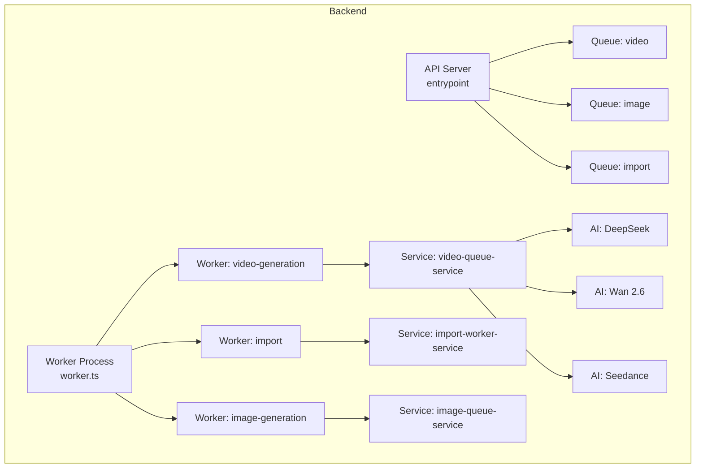
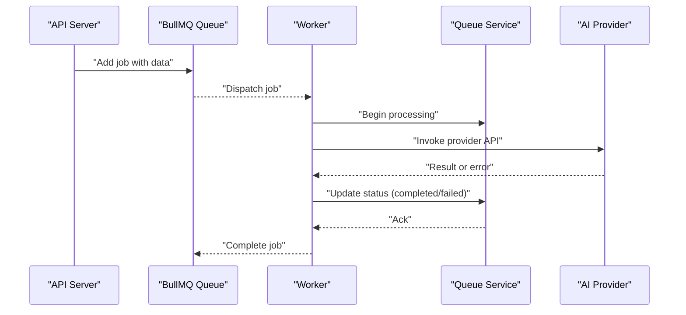
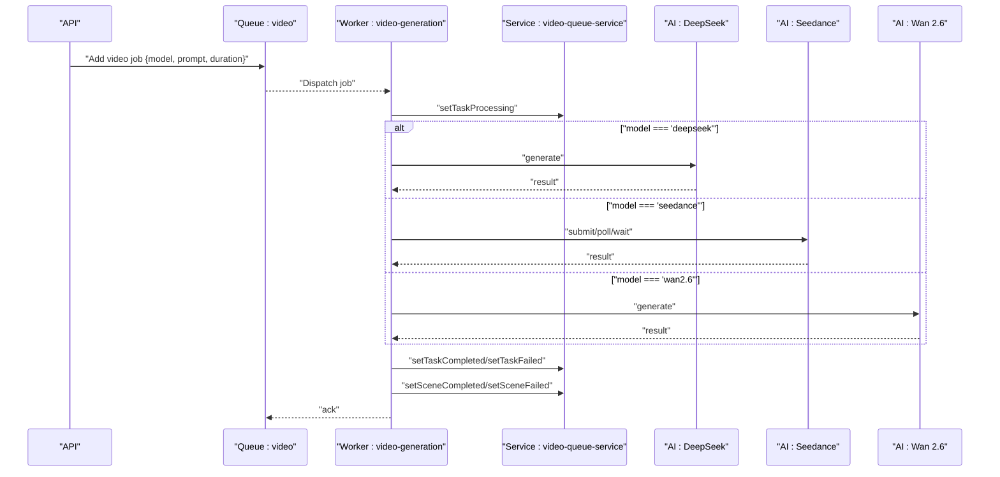
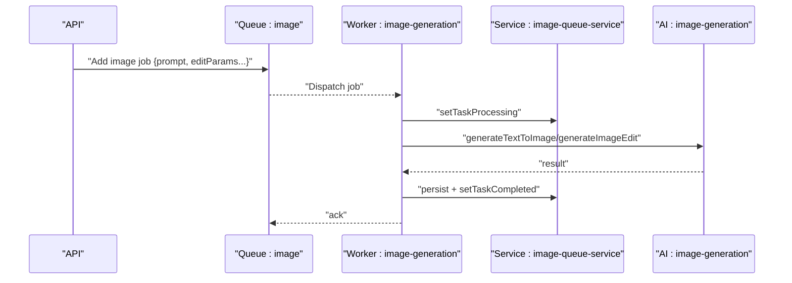
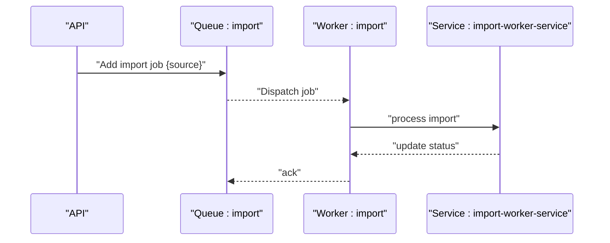
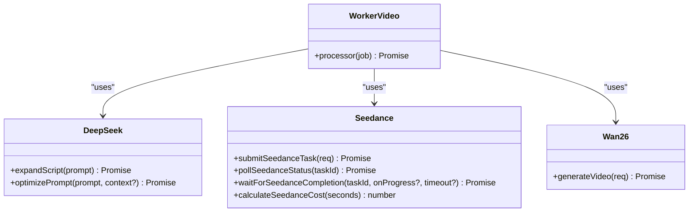
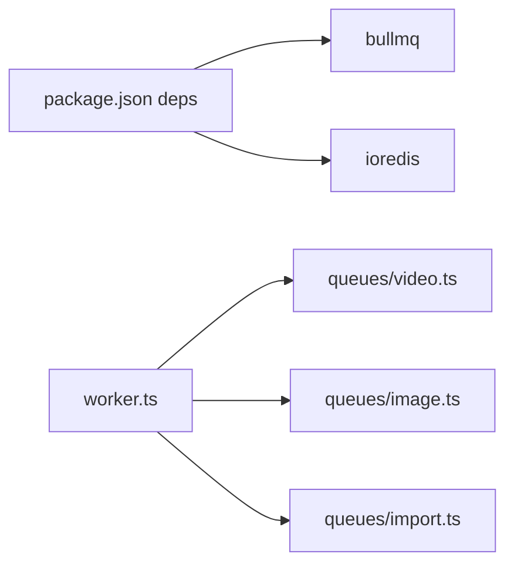
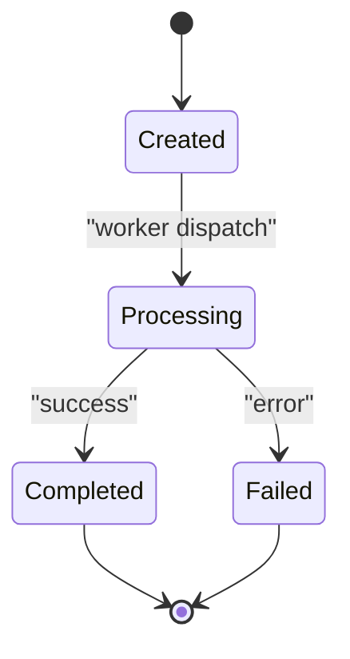

# Task Queue and Workers

<cite>
**Referenced Files in This Document**
- [package.json](file://packages/backend/package.json)
- [worker.ts](file://packages/backend/src/worker.ts)
- [video.ts](file://packages/backend/src/queues/video.ts)
- [image.ts](file://packages/backend/src/queues/image.ts)
- [import.ts](file://packages/backend/src/queues/import.ts)
- [video-queue-service.ts](file://packages/backend/src/services/video-queue-service.ts)
- [image-queue-service.ts](file://packages/backend/src/services/image-queue-service.ts)
- [import-worker-service.ts](file://packages/backend/src/services/import-worker-service.ts)
- [deepseek.ts](file://packages/backend/src/services/ai/deepseek.ts)
- [deepseek-client.ts](file://packages/backend/src/services/ai/deepseek-client.ts)
- [seedance.ts](file://packages/backend/src/services/ai/seedance.ts)
- [wan26.ts](file://packages/backend/src/services/ai/wan26.ts)
- [video-queue-worker-logic.test.ts](file://packages/backend/tests/video-queue-worker-logic.test.ts)
- [image-queue-worker-logic.test.ts](file://packages/backend/tests/image-queue-worker-logic.test.ts)
- [import-queue.test.ts](file://packages/backend/tests/import-queue.test.ts)
- [seedance.test.ts](file://packages/backend/tests/seedance.test.ts)
- [deepseek-call-wrapper.test.ts](file://packages/backend/tests/deepseek-call-wrapper.test.ts)
</cite>

## Table of Contents

1. [Introduction](#introduction)
2. [Project Structure](#project-structure)
3. [Core Components](#core-components)
4. [Architecture Overview](#architecture-overview)
5. [Detailed Component Analysis](#detailed-component-analysis)
6. [Dependency Analysis](#dependency-analysis)
7. [Performance Considerations](#performance-considerations)
8. [Troubleshooting Guide](#troubleshooting-guide)
9. [Conclusion](#conclusion)
10. [Appendices](#appendices)

## Introduction

This document describes the BullMQ-based task queue system and worker architecture used for asynchronous processing of video generation, image processing, and import operations. It explains queue configuration, worker registration, job processing patterns, retry and error handling strategies, task lifecycle, prioritization, concurrency limits, and resource management. It also documents AI service integrations for DeepSeek, Wan 2.6, and Seedance, along with monitoring, debugging, scaling, distributed processing, and failure recovery approaches.

## Project Structure

The backend uses BullMQ queues and workers organized per domain:

- Queues: video, image, import
- Workers: video-generation, import, image-generation
- Services: video-queue-service, image-queue-service, import-worker-service
- AI providers: DeepSeek, Seedance, Wan 2.6

**Diagram sources**

- [worker.ts:1-30](file://packages/backend/src/worker.ts#L1-L30)
- [video.ts](file://packages/backend/src/queues/video.ts)
- [image.ts](file://packages/backend/src/queues/image.ts)
- [import.ts](file://packages/backend/src/queues/import.ts)
- [video-queue-service.ts](file://packages/backend/src/services/video-queue-service.ts)
- [image-queue-service.ts](file://packages/backend/src/services/image-queue-service.ts)
- [import-worker-service.ts](file://packages/backend/src/services/import-worker-service.ts)
- [deepseek.ts](file://packages/backend/src/services/ai/deepseek.ts)
- [seedance.ts](file://packages/backend/src/services/ai/seedance.ts)
- [wan26.ts](file://packages/backend/src/services/ai/wan26.ts)

**Section sources**

- [package.json:1-51](file://packages/backend/package.json#L1-L51)
- [worker.ts:1-30](file://packages/backend/src/worker.ts#L1-L30)

## Core Components

- BullMQ and Redis: The system relies on BullMQ for queueing and ioredis for Redis connectivity.
- Queue definitions: Separate queues for video, image, and import tasks.
- Worker registration: Workers are registered in the worker entrypoint with concurrency limits.
- Job processors: Each worker defines a processor function that performs the actual work and updates task/job state via service helpers.
- AI service integrations: DeepSeek, Seedance, and Wan 2.6 are integrated for video generation and related operations.
- Service abstractions: video-queue-service, image-queue-service, and import-worker-service encapsulate state transitions and persistence.

Key implementation references:

- Worker entrypoint and concurrency logging: [worker.ts:1-30](file://packages/backend/src/worker.ts#L1-L30)
- BullMQ dependency: [package.json:33-33](file://packages/backend/package.json#L33-L33)

**Section sources**

- [worker.ts:1-30](file://packages/backend/src/worker.ts#L1-L30)
- [package.json:33-33](file://packages/backend/package.json#L33-L33)

## Architecture Overview

The system separates concerns between API-triggered job creation and background workers that process jobs. Workers are launched independently from the API server and manage concurrency per queue. AI providers are invoked from job processors to fulfill generation requests, with status updates and persistence handled by service layers.

**Diagram sources**

- [video.ts](file://packages/backend/src/queues/video.ts)
- [image.ts](file://packages/backend/src/queues/image.ts)
- [import.ts](file://packages/backend/src/queues/import.ts)
- [video-queue-service.ts](file://packages/backend/src/services/video-queue-service.ts)
- [image-queue-service.ts](file://packages/backend/src/services/image-queue-service.ts)
- [import-worker-service.ts](file://packages/backend/src/services/import-worker-service.ts)
- [deepseek.ts](file://packages/backend/src/services/ai/deepseek.ts)
- [seedance.ts](file://packages/backend/src/services/ai/seedance.ts)
- [wan26.ts](file://packages/backend/src/services/ai/wan26.ts)

## Detailed Component Analysis

### Video Generation Queue and Worker

- Queue: video
- Worker: video-generation (concurrency configured in worker entrypoint)
- Processor responsibilities:
  - Resolve AI provider (DeepSeek, Seedance, Wan 2.6) based on job data
  - Invoke provider APIs
  - Update task/job state via video-queue-service
  - Emit progress events to clients via SSE-like mechanisms
- Retry and error handling:
  - Tests demonstrate worker registration and successful processing flows for provider-specific jobs
  - Error propagation and state updates are validated in tests

**Diagram sources**

- [video.ts](file://packages/backend/src/queues/video.ts)
- [video-queue-service.ts](file://packages/backend/src/services/video-queue-service.ts)
- [deepseek.ts](file://packages/backend/src/services/ai/deepseek.ts)
- [seedance.ts](file://packages/backend/src/services/ai/seedance.ts)
- [wan26.ts](file://packages/backend/src/services/ai/wan26.ts)
- [video-queue-worker-logic.test.ts:123-152](file://packages/backend/tests/video-queue-worker-logic.test.ts#L123-L152)

**Section sources**

- [video.ts](file://packages/backend/src/queues/video.ts)
- [video-queue-service.ts](file://packages/backend/src/services/video-queue-service.ts)
- [video-queue-worker-logic.test.ts:123-152](file://packages/backend/tests/video-queue-worker-logic.test.ts#L123-L152)

### Image Processing Queue and Worker

- Queue: image
- Worker: image-generation (concurrency configured in worker entrypoint)
- Processor responsibilities:
  - Text-to-image and image-edit generation
  - Persist results and update job state
  - Log API usage and emit project updates via SSE-like mechanism
- Retry and error handling:
  - Tests validate worker registration and processor capture

**Diagram sources**

- [image.ts](file://packages/backend/src/queues/image.ts)
- [image-queue-service.ts](file://packages/backend/src/services/image-queue-service.ts)
- [image-queue-worker-logic.test.ts:85-96](file://packages/backend/tests/image-queue-worker-logic.test.ts#L85-L96)

**Section sources**

- [image.ts](file://packages/backend/src/queues/image.ts)
- [image-queue-service.ts](file://packages/backend/src/services/image-queue-service.ts)
- [image-queue-worker-logic.test.ts:85-96](file://packages/backend/tests/image-queue-worker-logic.test.ts#L85-L96)

### Import Queue and Worker

- Queue: import
- Worker: import (concurrency configured in worker entrypoint)
- Processor responsibilities:
  - Create projects and import tasks
  - Update import task status and handle failures
- Retry and error handling:
  - Tests validate worker registration and service mocks

**Diagram sources**

- [import.ts](file://packages/backend/src/queues/import.ts)
- [import-worker-service.ts](file://packages/backend/src/services/import-worker-service.ts)
- [import-queue.test.ts:1-45](file://packages/backend/tests/import-queue.test.ts#L1-L45)

**Section sources**

- [import.ts](file://packages/backend/src/queues/import.ts)
- [import-worker-service.ts](file://packages/backend/src/services/import-worker-service.ts)
- [import-queue.test.ts:1-45](file://packages/backend/tests/import-queue.test.ts#L1-L45)

### AI Service Workers: DeepSeek, Seedance, Wan 2.6

- DeepSeek integration:
  - Client initialization with environment variables
  - Wrapper for API calls with error types for auth and rate limits
  - Tests validate error handling and prompt optimization flows
- Seedance integration:
  - Task submission, polling, and completion waiting
  - Status mapping and cost calculation
  - Tests validate submission, polling, and completion scenarios
- Wan 2.6 integration:
  - Video generation via provider interface
  - Tests demonstrate successful processing for this provider

**Diagram sources**

- [deepseek.ts](file://packages/backend/src/services/ai/deepseek.ts)
- [deepseek-client.ts:58-63](file://packages/backend/src/services/ai/deepseek-client.ts#L58-L63)
- [seedance.ts:124-228](file://packages/backend/src/services/ai/seedance.ts#L124-L228)
- [wan26.ts](file://packages/backend/src/services/ai/wan26.ts)
- [video.ts](file://packages/backend/src/queues/video.ts)

**Section sources**

- [deepseek.ts](file://packages/backend/src/services/ai/deepseek.ts)
- [deepseek-client.ts:58-63](file://packages/backend/src/services/ai/deepseek-client.ts#L58-L63)
- [seedance.ts:124-228](file://packages/backend/src/services/ai/seedance.ts#L124-L228)
- [wan26.ts](file://packages/backend/src/services/ai/wan26.ts)
- [video-queue-worker-logic.test.ts:136-152](file://packages/backend/tests/video-queue-worker-logic.test.ts#L136-L152)
- [seedance.test.ts:1-173](file://packages/backend/tests/seedance.test.ts#L1-L173)
- [deepseek-call-wrapper.test.ts:1-51](file://packages/backend/tests/deepseek-call-wrapper.test.ts#L1-L51)

## Dependency Analysis

- BullMQ and ioredis are declared dependencies for queueing and Redis connectivity.
- Worker entrypoint imports queue modules and registers workers with concurrency limits.
- Queue modules depend on BullMQ Queue and Worker, and on service layers for state transitions.
- AI services depend on HTTP clients and environment variables for provider APIs.

**Diagram sources**

- [package.json:33-33](file://packages/backend/package.json#L33-L33)
- [worker.ts:5-7](file://packages/backend/src/worker.ts#L5-L7)
- [video.ts](file://packages/backend/src/queues/video.ts)
- [image.ts](file://packages/backend/src/queues/image.ts)
- [import.ts](file://packages/backend/src/queues/import.ts)

**Section sources**

- [package.json:33-33](file://packages/backend/package.json#L33-L33)
- [worker.ts:5-7](file://packages/backend/src/worker.ts#L5-L7)

## Performance Considerations

- Concurrency tuning:
  - Video generation worker concurrency is logged in the worker entrypoint
  - Image generation worker concurrency is logged in the worker entrypoint
  - Import worker concurrency is logged in the worker entrypoint
- Resource management:
  - Worker graceful shutdown ensures pending jobs are finalized before exit
- Provider throughput:
  - DeepSeek and Seedance integrations expose rate-limit and auth error types; implement retries with exponential backoff and circuit breaker patterns at the caller level
- Monitoring:
  - Use BullMQ built-in metrics and Redis INFO commands to monitor queue length, blocked keys, and memory usage
  - Track provider API latency and token usage via service logs

[No sources needed since this section provides general guidance]

## Troubleshooting Guide

- Worker startup and shutdown:
  - Verify worker entrypoint logs concurrency settings and graceful shutdown handlers
- Queue stuck jobs:
  - Inspect Redis keys for stalled jobs and reprocess using queue recovery utilities
- Provider errors:
  - DeepSeek auth and rate limit errors are explicitly modeled; surface these to callers and implement retry policies
  - Seedance submission/polling failures should be retried with capped backoff and eventual failure reporting
- Test-driven validation:
  - Video, image, and import worker logic is covered by unit tests that mock BullMQ and external services; use these as references for expected behavior during debugging

**Section sources**

- [worker.ts:14-29](file://packages/backend/src/worker.ts#L14-L29)
- [video-queue-worker-logic.test.ts:1-152](file://packages/backend/tests/video-queue-worker-logic.test.ts#L1-L152)
- [image-queue-worker-logic.test.ts:1-96](file://packages/backend/tests/image-queue-worker-logic.test.ts#L1-L96)
- [import-queue.test.ts:1-45](file://packages/backend/tests/import-queue.test.ts#L1-L45)
- [seedance.test.ts:1-173](file://packages/backend/tests/seedance.test.ts#L1-L173)
- [deepseek-call-wrapper.test.ts:1-51](file://packages/backend/tests/deepseek-call-wrapper.test.ts#L1-L51)

## Conclusion

The system leverages BullMQ for robust asynchronous processing across video, image, and import domains. Workers are decoupled from the API server, enabling independent scaling and resilience. AI providers are integrated through dedicated services with explicit error handling and observability hooks. With proper concurrency tuning, provider-side retries, and monitoring, the system supports scalable, distributed processing with strong failure recovery characteristics.

[No sources needed since this section summarizes without analyzing specific files]

## Appendices

### Task Lifecycle and State Transitions

- Creation: API adds jobs to queues with structured data
- Dispatch: BullMQ delivers jobs to workers based on availability
- Processing: Worker invokes service layer to update state and provider APIs
- Completion/Failure: Service persists outcomes and emits updates; worker acknowledges job

[No sources needed since this diagram shows conceptual workflow, not actual code structure]

### Queue Statistics and Monitoring

- BullMQ metrics: track active, delayed, completed, failed counts per queue
- Redis monitoring: queue length, blocked connections, memory usage
- Provider logs: token usage, latency, error rates

[No sources needed since this section provides general guidance]

### Scaling and Distributed Processing

- Scale workers horizontally per queue type
- Use separate queues for different priorities or SLAs
- Employ Redis clustering and BullMQ sharding for high throughput

[No sources needed since this section provides general guidance]
