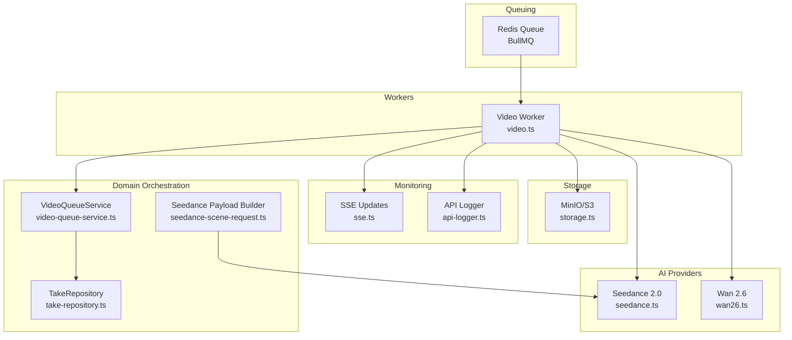
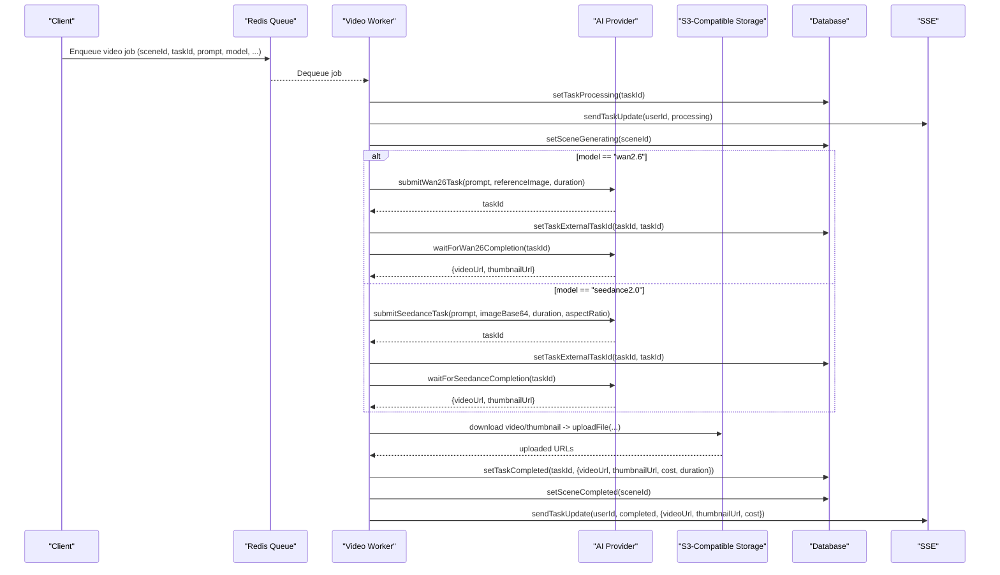
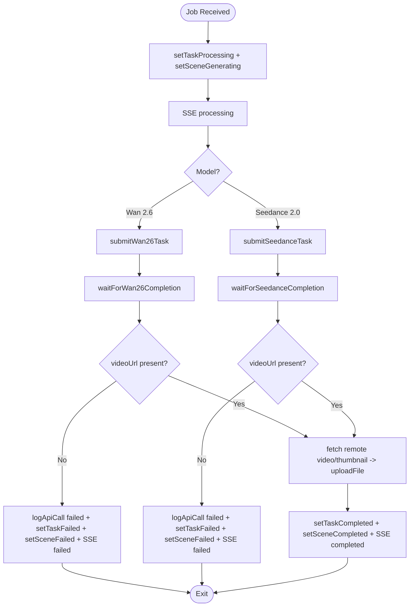
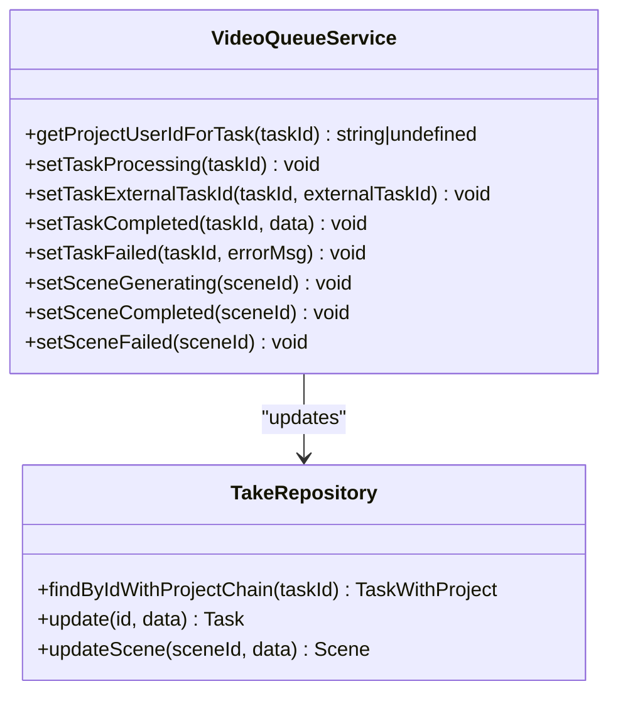
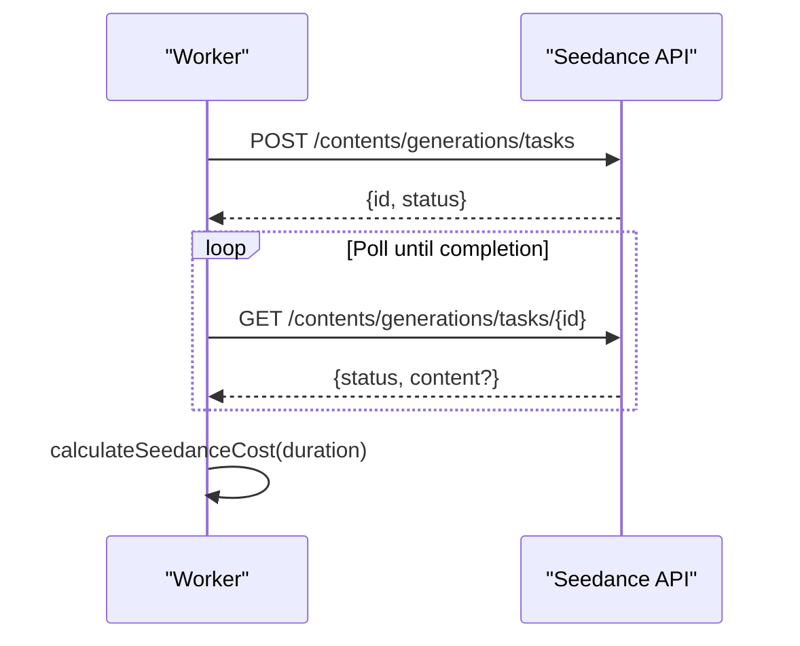
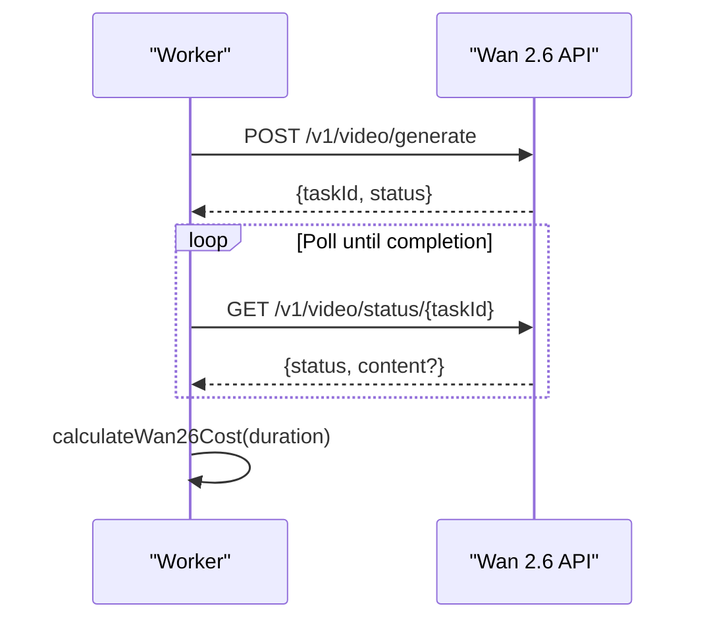
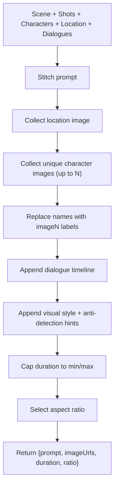
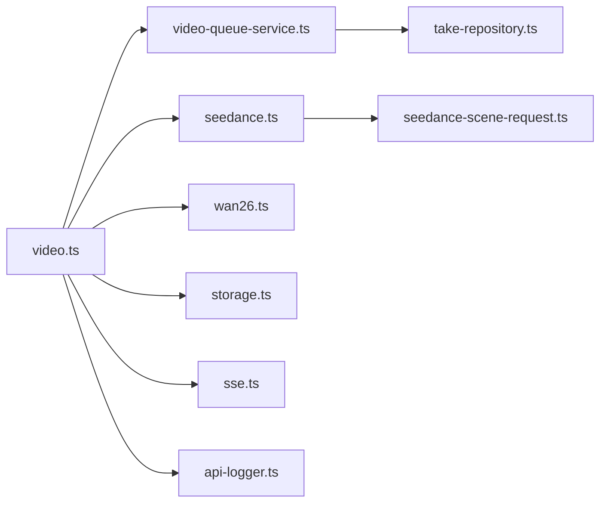

# Video Generation Queue

<cite>
**Referenced Files in This Document**
- [video.ts](file://packages/backend/src/queues/video.ts)
- [video-queue-service.ts](file://packages/backend/src/services/video-queue-service.ts)
- [seedance.ts](file://packages/backend/src/services/ai/seedance.ts)
- [wan26.ts](file://packages/backend/src/services/ai/wan26.ts)
- [seedance-scene-request.ts](file://packages/backend/src/services/seedance-scene-request.ts)
- [api-logger.ts](file://packages/backend/src/services/ai/api-logger.ts)
- [storage.ts](file://packages/backend/src/services/storage.ts)
- [sse.ts](file://packages/backend/src/plugins/sse.ts)
- [take-repository.ts](file://packages/backend/src/repositories/take-repository.ts)
- [seedance.py](file://docs/skills/scripts/seedance.py)
- [seedance2-skill-cn/scripts/seedance.py](file://docs/skills/seedance2-skill-cn/scripts/seedance.py)
</cite>

## Table of Contents

1. [Introduction](#introduction)
2. [Project Structure](#project-structure)
3. [Core Components](#core-components)
4. [Architecture Overview](#architecture-overview)
5. [Detailed Component Analysis](#detailed-component-analysis)
6. [Dependency Analysis](#dependency-analysis)
7. [Performance Considerations](#performance-considerations)
8. [Troubleshooting Guide](#troubleshooting-guide)
9. [Conclusion](#conclusion)

## Introduction

This document describes the video generation queue system responsible for orchestrating AI-driven video production. It covers the end-to-end workflow from scene planning to final output, including job creation for two AI providers (Wan 2.6 and Seedance 2.0), job prioritization, batch processing, resource allocation, lifecycle management, error handling, timeouts, partial success scenarios, monitoring, and performance optimization tailored for video workloads.

## Project Structure

The video generation pipeline is implemented in the backend package and integrates with Redis via BullMQ for queuing, AI providers for generation, MinIO/S3-compatible storage for artifacts, and Server-Sent Events (SSE) for real-time updates.

**Diagram sources**

- [video.ts:24-33](file://packages/backend/src/queues/video.ts#L24-L33)
- [video.ts:36-263](file://packages/backend/src/queues/video.ts#L36-L263)
- [seedance.ts:124-147](file://packages/backend/src/services/ai/seedance.ts#L124-L147)
- [wan26.ts:26-49](file://packages/backend/src/services/ai/wan26.ts#L26-L49)
- [storage.ts:28-48](file://packages/backend/src/services/storage.ts#L28-L48)
- [sse.ts:20-26](file://packages/backend/src/plugins/sse.ts#L20-L26)
- [api-logger.ts:81-120](file://packages/backend/src/services/ai/api-logger.ts#L81-L120)
- [video-queue-service.ts:6-61](file://packages/backend/src/services/video-queue-service.ts#L6-L61)
- [seedance-scene-request.ts:46-149](file://packages/backend/src/services/seedance-scene-request.ts#L46-L149)
- [take-repository.ts:4-72](file://packages/backend/src/repositories/take-repository.ts#L4-L72)

**Section sources**

- [video.ts:24-33](file://packages/backend/src/queues/video.ts#L24-L33)
- [video.ts:36-263](file://packages/backend/src/queues/video.ts#L36-L263)
- [video-queue-service.ts:6-61](file://packages/backend/src/services/video-queue-service.ts#L6-L61)
- [seedance-scene-request.ts:46-149](file://packages/backend/src/services/seedance-scene-request.ts#L46-L149)
- [seedance.ts:124-147](file://packages/backend/src/services/ai/seedance.ts#L124-L147)
- [wan26.ts:26-49](file://packages/backend/src/services/ai/wan26.ts#L26-L49)
- [storage.ts:28-48](file://packages/backend/src/services/storage.ts#L28-L48)
- [sse.ts:20-26](file://packages/backend/src/plugins/sse.ts#L20-L26)
- [api-logger.ts:81-120](file://packages/backend/src/services/ai/api-logger.ts#L81-L120)
- [take-repository.ts:4-72](file://packages/backend/src/repositories/take-repository.ts#L4-L72)

## Core Components

- Video queue and worker: Defines the BullMQ queue and the worker that executes jobs, handling provider selection, progress logging, artifact upload, and SSE notifications.
- VideoQueueService: Encapsulates database updates for task and scene state transitions.
- Seedance 2.0 integration: Submits tasks, polls status, calculates costs, and converts images to base64.
- Wan 2.6 integration: Submits tasks, polls status, and calculates costs.
- Payload builder: Assembles Seedance prompts and reference images from scene metadata.
- Storage: Uploads generated assets to S3-compatible storage and generates keys.
- SSE: Pushes real-time updates to clients.
- API logger: Records provider calls and outcomes for observability.
- TakeRepository: Provides database access for tasks and scenes.

**Section sources**

- [video.ts:36-263](file://packages/backend/src/queues/video.ts#L36-L263)
- [video-queue-service.ts:6-61](file://packages/backend/src/services/video-queue-service.ts#L6-L61)
- [seedance.ts:124-147](file://packages/backend/src/services/ai/seedance.ts#L124-L147)
- [wan26.ts:26-49](file://packages/backend/src/services/ai/wan26.ts#L26-L49)
- [seedance-scene-request.ts:46-149](file://packages/backend/src/services/seedance-scene-request.ts#L46-L149)
- [storage.ts:28-48](file://packages/backend/src/services/storage.ts#L28-L48)
- [sse.ts:20-26](file://packages/backend/src/plugins/sse.ts#L20-L26)
- [api-logger.ts:81-120](file://packages/backend/src/services/ai/api-logger.ts#L81-L120)
- [take-repository.ts:4-72](file://packages/backend/src/repositories/take-repository.ts#L4-L72)

## Architecture Overview

The system uses a queue-first design. Jobs are enqueued with scene/task metadata and model selection. The worker selects a provider, submits the job, waits for completion, downloads artifacts, uploads to storage, updates statuses, and notifies clients.

**Diagram sources**

- [video.ts:38-228](file://packages/backend/src/queues/video.ts#L38-L228)
- [seedance.ts:124-147](file://packages/backend/src/services/ai/seedance.ts#L124-L147)
- [seedance.ts:194-219](file://packages/backend/src/services/ai/seedance.ts#L194-L219)
- [wan26.ts:26-49](file://packages/backend/src/services/ai/wan26.ts#L26-L49)
- [wan26.ts:68-90](file://packages/backend/src/services/ai/wan26.ts#L68-L90)
- [storage.ts:28-48](file://packages/backend/src/services/storage.ts#L28-L48)
- [video-queue-service.ts:14-57](file://packages/backend/src/services/video-queue-service.ts#L14-L57)
- [sse.ts:20-26](file://packages/backend/src/plugins/sse.ts#L20-L26)

## Detailed Component Analysis

### Video Queue and Worker

- Queue configuration: Uses BullMQ with exponential backoff and retry attempts.
- Worker concurrency: Processes a fixed number of jobs concurrently.
- Job lifecycle:
  - On start: sets task and scene to processing, sends SSE.
  - Provider-specific flow: submits task, waits for completion, validates results.
  - Artifact handling: downloads remote video/thumbnail, uploads to storage, records URLs.
  - Completion: updates task and scene, sends SSE.
  - Failure: logs provider error, marks task and scene failed, sends SSE.

**Diagram sources**

- [video.ts:38-257](file://packages/backend/src/queues/video.ts#L38-L257)
- [seedance.ts:194-219](file://packages/backend/src/services/ai/seedance.ts#L194-L219)
- [wan26.ts:68-90](file://packages/backend/src/services/ai/wan26.ts#L68-L90)
- [storage.ts:28-48](file://packages/backend/src/services/storage.ts#L28-L48)
- [video-queue-service.ts:14-57](file://packages/backend/src/services/video-queue-service.ts#L14-L57)
- [api-logger.ts:103-120](file://packages/backend/src/services/ai/api-logger.ts#L103-L120)

**Section sources**

- [video.ts:24-33](file://packages/backend/src/queues/video.ts#L24-L33)
- [video.ts:36-263](file://packages/backend/src/queues/video.ts#L36-L263)
- [video.ts:265-279](file://packages/backend/src/queues/video.ts#L265-L279)

### VideoQueueService

- Responsibilities:
  - Resolve user ID for SSE notifications.
  - Update task status and external task ID.
  - Update task completion with cost and duration.
  - Update scene status for generating/completed/failed.
- Cohesion: Pure orchestration around task/scene state transitions.

**Diagram sources**

- [video-queue-service.ts:6-61](file://packages/backend/src/services/video-queue-service.ts#L6-L61)
- [take-repository.ts:4-72](file://packages/backend/src/repositories/take-repository.ts#L4-L72)

**Section sources**

- [video-queue-service.ts:6-61](file://packages/backend/src/services/video-queue-service.ts#L6-L61)
- [take-repository.ts:4-72](file://packages/backend/src/repositories/take-repository.ts#L4-L72)

### Seedance 2.0 Integration

- Request building: Adds prompt, optional reference images (URL or base64), duration, aspect ratio, and resolution.
- Authentication: Bearer token via environment variable.
- Polling: Periodic GET requests with a configurable timeout.
- Cost calculation: Linear cost per second.
- Base64 conversion: Converts image URLs to base64 for provider payload.

**Diagram sources**

- [seedance.ts:124-147](file://packages/backend/src/services/ai/seedance.ts#L124-L147)
- [seedance.ts:149-171](file://packages/backend/src/services/ai/seedance.ts#L149-L171)
- [seedance.ts:194-219](file://packages/backend/src/services/ai/seedance.ts#L194-L219)
- [seedance.ts:223-230](file://packages/backend/src/services/ai/seedance.ts#L223-L230)

**Section sources**

- [seedance.ts:124-147](file://packages/backend/src/services/ai/seedance.ts#L124-L147)
- [seedance.ts:149-171](file://packages/backend/src/services/ai/seedance.ts#L149-L171)
- [seedance.ts:194-219](file://packages/backend/src/services/ai/seedance.ts#L194-L219)
- [seedance.ts:223-230](file://packages/backend/src/services/ai/seedance.ts#L223-L230)

### Wan 2.6 Integration

- Request building: Prompt, optional reference image, duration, aspect ratio.
- Authentication: Bearer token via environment variable.
- Polling: Periodic GET requests with a configurable timeout.
- Cost calculation: Fixed rate per second.

**Diagram sources**

- [wan26.ts:26-49](file://packages/backend/src/services/ai/wan26.ts#L26-L49)
- [wan26.ts:51-66](file://packages/backend/src/services/ai/wan26.ts#L51-L66)
- [wan26.ts:68-90](file://packages/backend/src/services/ai/wan26.ts#L68-L90)
- [wan26.ts:93-96](file://packages/backend/src/services/ai/wan26.ts#L93-L96)

**Section sources**

- [wan26.ts:26-49](file://packages/backend/src/services/ai/wan26.ts#L26-L49)
- [wan26.ts:51-66](file://packages/backend/src/services/ai/wan26.ts#L51-L66)
- [wan26.ts:68-90](file://packages/backend/src/services/ai/wan26.ts#L68-L90)
- [wan26.ts:93-96](file://packages/backend/src/services/ai/wan26.ts#L93-L96)

### Seedance Payload Builder

- Builds a Seedance-friendly prompt from scene, shots, characters, locations, and dialogues.
- Selects up to a maximum number of reference images.
- Applies aspect ratio and duration constraints.
- Replaces character names with “imageN” labels for provider compatibility.

**Diagram sources**

- [seedance-scene-request.ts:46-149](file://packages/backend/src/services/seedance-scene-request.ts#L46-L149)

**Section sources**

- [seedance-scene-request.ts:46-149](file://packages/backend/src/services/seedance-scene-request.ts#L46-L149)

### Storage and File Keys

- Uploads video and thumbnails to S3-compatible storage.
- Generates deterministic keys with timestamp, randomness, and sanitized names.

**Section sources**

- [storage.ts:28-48](file://packages/backend/src/services/storage.ts#L28-L48)
- [storage.ts:66-73](file://packages/backend/src/services/storage.ts#L66-L73)

### SSE Notifications

- Maintains per-user SSE connections.
- Sends task and project updates with structured payloads.

**Section sources**

- [sse.ts:20-26](file://packages/backend/src/plugins/sse.ts#L20-L26)
- [video.ts:61-63](file://packages/backend/src/queues/video.ts#L61-L63)
- [video.ts:219-226](file://packages/backend/src/queues/video.ts#L219-L226)

### API Call Logging

- Logs provider calls with request parameters, status, cost, duration, and error messages.
- Supports updating logs with final results.

**Section sources**

- [api-logger.ts:81-120](file://packages/backend/src/services/ai/api-logger.ts#L81-L120)
- [video.ts:73-98](file://packages/backend/src/queues/video.ts#L73-L98)
- [video.ts:131-163](file://packages/backend/src/queues/video.ts#L131-L163)

## Dependency Analysis

- Queue and worker depend on Redis connectivity and BullMQ.
- Worker depends on provider integrations, storage, SSE, and API logger.
- VideoQueueService depends on TakeRepository for state updates.
- Seedance payload builder depends on scene repositories and stitching utilities.

**Diagram sources**

- [video.ts:36-263](file://packages/backend/src/queues/video.ts#L36-L263)
- [video-queue-service.ts:6-61](file://packages/backend/src/services/video-queue-service.ts#L6-L61)
- [seedance.ts:124-147](file://packages/backend/src/services/ai/seedance.ts#L124-L147)
- [wan26.ts:26-49](file://packages/backend/src/services/ai/wan26.ts#L26-L49)
- [storage.ts:28-48](file://packages/backend/src/services/storage.ts#L28-L48)
- [sse.ts:20-26](file://packages/backend/src/plugins/sse.ts#L20-L26)
- [api-logger.ts:81-120](file://packages/backend/src/services/ai/api-logger.ts#L81-L120)
- [seedance-scene-request.ts:46-149](file://packages/backend/src/services/seedance-scene-request.ts#L46-L149)
- [take-repository.ts:4-72](file://packages/backend/src/repositories/take-repository.ts#L4-L72)

**Section sources**

- [video.ts:36-263](file://packages/backend/src/queues/video.ts#L36-L263)
- [video-queue-service.ts:6-61](file://packages/backend/src/services/video-queue-service.ts#L6-L61)
- [seedance-scene-request.ts:46-149](file://packages/backend/src/services/seedance-scene-request.ts#L46-L149)
- [seedance.ts:124-147](file://packages/backend/src/services/ai/seedance.ts#L124-L147)
- [wan26.ts:26-49](file://packages/backend/src/services/ai/wan26.ts#L26-L49)
- [storage.ts:28-48](file://packages/backend/src/services/storage.ts#L28-L48)
- [sse.ts:20-26](file://packages/backend/src/plugins/sse.ts#L20-L26)
- [api-logger.ts:81-120](file://packages/backend/src/services/ai/api-logger.ts#L81-L120)
- [take-repository.ts:4-72](file://packages/backend/src/repositories/take-repository.ts#L4-L72)

## Performance Considerations

- Concurrency tuning: Worker concurrency controls parallelism; adjust based on provider quotas and infrastructure capacity.
- Backoff and retries: Exponential backoff reduces thundering herd pressure on providers.
- Polling intervals: Seedance and Wan 2.6 polling intervals balance responsiveness and API cost.
- Batch processing: Enqueue multiple scenes; rely on worker concurrency and provider throughput limits.
- Resource allocation:
  - Network bandwidth for downloading large video artifacts.
  - CPU and memory for base64 conversions and image processing.
  - Storage I/O for uploads/downloads.
- Cost control:
  - Use duration-aware cost calculations.
  - Prefer shorter durations when acceptable.
- Observability:
  - Monitor provider latency and failure rates via API logger.
  - Track queue depth and worker utilization.

[No sources needed since this section provides general guidance]

## Troubleshooting Guide

- AI provider failures:
  - Seedance: Check authentication headers, request body construction, and status mapping.
  - Wan 2.6: Verify API key and endpoint configuration.
- Timeout management:
  - Both providers enforce a maximum wait window; exceeding it raises a timeout error.
- Partial success scenarios:
  - Missing video URL from provider triggers a failure path; ensure fallbacks or re-tries if applicable.
- SSE delivery:
  - Ensure client subscriptions are established and server-side connections are healthy.
- Storage issues:
  - Validate endpoint, credentials, and bucket names; confirm upload returns expected URLs.
- Database state drift:
  - Confirm task and scene updates occur in order; avoid race conditions by keeping state updates centralized in the worker.

**Section sources**

- [seedance.ts:130-147](file://packages/backend/src/services/ai/seedance.ts#L130-L147)
- [seedance.ts:152-171](file://packages/backend/src/services/ai/seedance.ts#L152-L171)
- [seedance.ts:194-219](file://packages/backend/src/services/ai/seedance.ts#L194-L219)
- [wan26.ts:29-49](file://packages/backend/src/services/ai/wan26.ts#L29-L49)
- [wan26.ts:52-66](file://packages/backend/src/services/ai/wan26.ts#L52-L66)
- [wan26.ts:68-90](file://packages/backend/src/services/ai/wan26.ts#L68-L90)
- [video.ts:229-257](file://packages/backend/src/queues/video.ts#L229-L257)
- [storage.ts:28-48](file://packages/backend/src/services/storage.ts#L28-L48)
- [sse.ts:20-26](file://packages/backend/src/plugins/sse.ts#L20-L26)

## Conclusion

The video generation queue system provides a robust, observable, and scalable pipeline for AI-driven video production. By separating concerns across queueing, provider integrations, storage, and state management, it supports reliable job execution, real-time updates, and operational insights. Tuning concurrency, provider timeouts, and resource allocation enables efficient handling of diverse video workloads.
