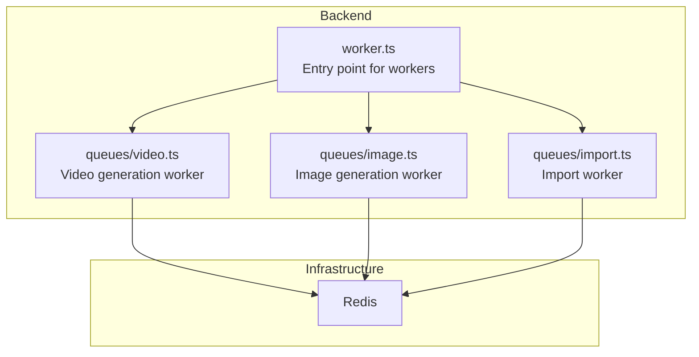
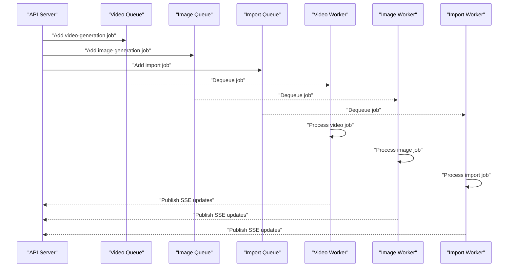
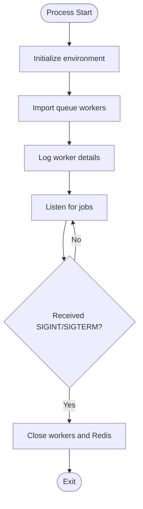
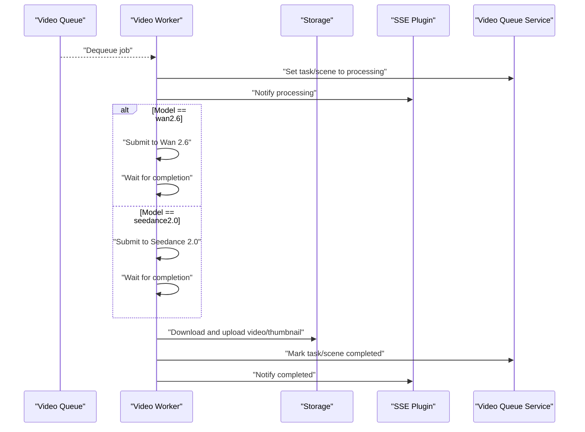
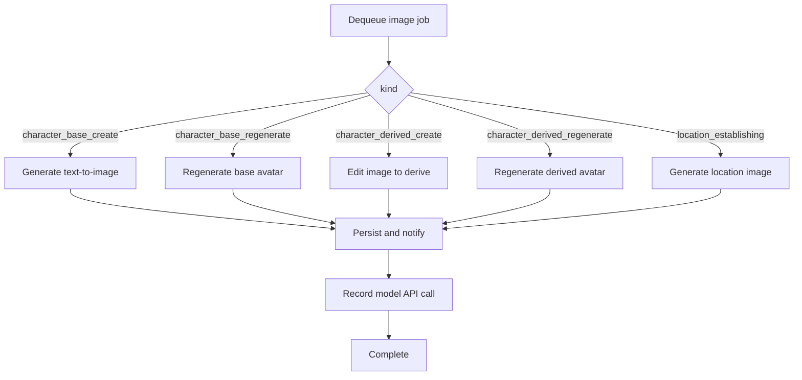
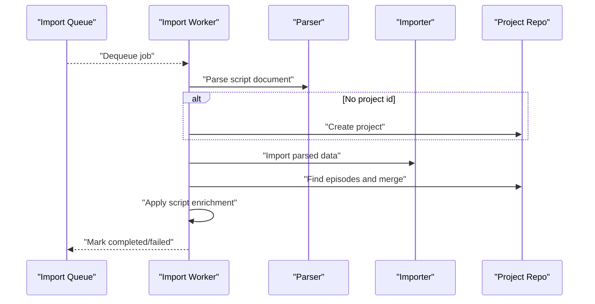
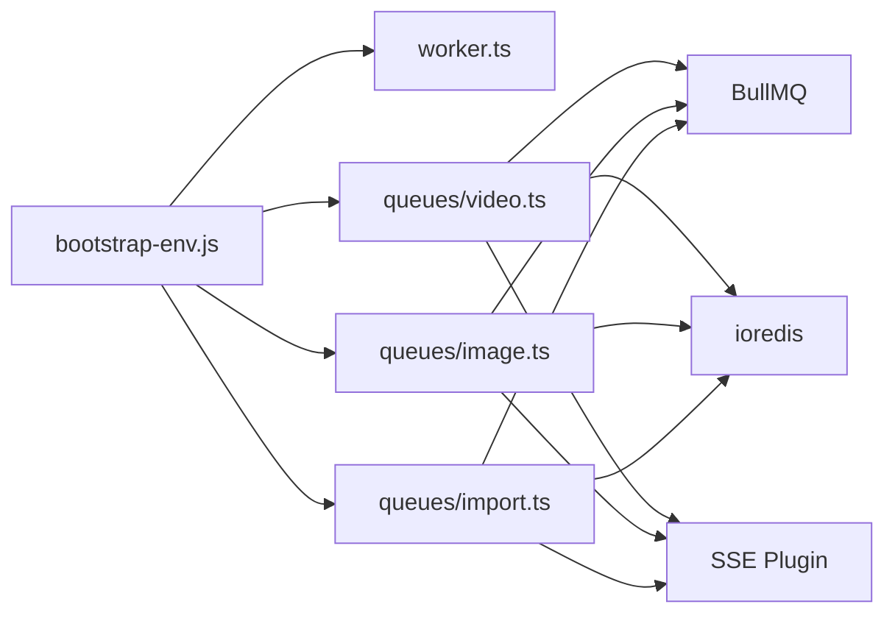

# Worker Management and Monitoring

<cite>
**Referenced Files in This Document**
- [README.md](file://README.md)
- [package.json](file://packages/backend/package.json)
- [worker.ts](file://packages/backend/src/worker.ts)
- [video.ts](file://packages/backend/src/queues/video.ts)
- [image.ts](file://packages/backend/src/queues/image.ts)
- [import.ts](file://packages/backend/src/queues/import.ts)
</cite>

## Table of Contents

1. [Introduction](#introduction)
2. [Project Structure](#project-structure)
3. [Core Components](#core-components)
4. [Architecture Overview](#architecture-overview)
5. [Detailed Component Analysis](#detailed-component-analysis)
6. [Dependency Analysis](#dependency-analysis)
7. [Performance Considerations](#performance-considerations)
8. [Troubleshooting Guide](#troubleshooting-guide)
9. [Conclusion](#conclusion)

## Introduction

This document explains the worker management and monitoring systems used by the platform’s background processing. It covers worker registration, lifecycle management, health monitoring, scaling strategies, load balancing, resource allocation, queue statistics, performance metrics, error tracking, alerting, log aggregation, debugging tools, graceful shutdown procedures, worker replacement strategies, and maintenance windows.

The system leverages BullMQ with Redis for job queues and dedicated worker processes for long-running tasks such as video generation, image generation, and import processing. Workers are launched independently from the API server and support graceful shutdown via signal handlers.

## Project Structure

The backend is organized into modular queues and services. Workers are defined per queue and configured with concurrency and retry/backoff policies. The worker entrypoint initializes all queue workers and registers shutdown handlers.

**Diagram sources**

- [worker.ts:1-30](file://packages/backend/src/worker.ts#L1-L30)
- [video.ts:1-279](file://packages/backend/src/queues/video.ts#L1-L279)
- [image.ts:1-304](file://packages/backend/src/queues/image.ts#L1-L304)
- [import.ts:1-114](file://packages/backend/src/queues/import.ts#L1-L114)

**Section sources**

- [README.md:26-42](file://README.md#L26-L42)
- [package.json:6-21](file://packages/backend/package.json#L6-L21)
- [worker.ts:1-30](file://packages/backend/src/worker.ts#L1-L30)

## Core Components

- Worker entrypoint: Initializes environment, imports queue workers, logs worker details, and registers SIGINT/SIGTERM handlers to gracefully shut down workers.
- Video generation worker: Processes video jobs with exponential backoff, tracks costs and durations, uploads assets to storage, updates task/scene statuses, and notifies via SSE.
- Image generation worker: Handles multiple job kinds (character base/derived creation/edit, location establishing), records model API calls, and notifies via SSE.
- Import worker: Parses documents, optionally creates projects, imports data, and applies script enrichment.

Key runtime characteristics:

- Concurrency: video-generation (5), import (2), image-generation (3)
- Retries and backoff: configured per queue
- Graceful shutdown: workers close connections and quit Redis on SIGINT/SIGTERM

**Section sources**

- [worker.ts:1-30](file://packages/backend/src/worker.ts#L1-L30)
- [video.ts:24-33](file://packages/backend/src/queues/video.ts#L24-L33)
- [video.ts:259-263](file://packages/backend/src/queues/video.ts#L259-L263)
- [image.ts:19-28](file://packages/backend/src/queues/image.ts#L19-L28)
- [image.ts:285-289](file://packages/backend/src/queues/image.ts#L285-L289)
- [import.ts:30-39](file://packages/backend/src/queues/import.ts#L30-L39)
- [import.ts:91-95](file://packages/backend/src/queues/import.ts#L91-L95)

## Architecture Overview

The worker architecture separates concerns across queues and workers. Each worker listens to a specific queue and executes job-specific logic. Redis serves as the broker for job persistence and distribution.

**Diagram sources**

- [video.ts:36-263](file://packages/backend/src/queues/video.ts#L36-L263)
- [image.ts:38-289](file://packages/backend/src/queues/image.ts#L38-L289)
- [import.ts:42-95](file://packages/backend/src/queues/import.ts#L42-L95)

## Detailed Component Analysis

### Worker Lifecycle and Registration

- Registration: The worker entrypoint imports each queue module and logs concurrency settings.
- Startup: Workers connect to Redis and listen for jobs.
- Shutdown: On SIGINT/SIGTERM, workers close gracefully and quit Redis connections.

**Diagram sources**

- [worker.ts:1-30](file://packages/backend/src/worker.ts#L1-L30)

**Section sources**

- [worker.ts:1-30](file://packages/backend/src/worker.ts#L1-L30)

### Video Generation Worker

- Queue: video-generation
- Concurrency: 5
- Retry/backoff: exponential with base delay
- Responsibilities:
  - Set task/scene status to processing
  - Submit to AI providers (Wan 2.6 or Seedance 2.0)
  - Wait for completion and validate results
  - Download and upload assets to storage
  - Update task/scene status and publish SSE notifications
  - Record API call logs with cost and duration
- Health events:
  - completed/failure callbacks log outcomes

**Diagram sources**

- [video.ts:36-263](file://packages/backend/src/queues/video.ts#L36-L263)

**Section sources**

- [video.ts:24-33](file://packages/backend/src/queues/video.ts#L24-L33)
- [video.ts:259-263](file://packages/backend/src/queues/video.ts#L259-L263)
- [video.ts:265-271](file://packages/backend/src/queues/video.ts#L265-L271)

### Image Generation Worker

- Queue: image-generation
- Concurrency: 3
- Retry/backoff: exponential with base delay
- Job kinds:
  - Character base create/regenerate
  - Character derived create/regenerate
  - Location establishing
- Responsibilities:
  - Determine image size from project aspect ratio
  - Generate images via AI APIs
  - Persist results and update database
  - Notify via SSE with status and cost
  - Record model API call logs

**Diagram sources**

- [image.ts:38-289](file://packages/backend/src/queues/image.ts#L38-L289)

**Section sources**

- [image.ts:19-28](file://packages/backend/src/queues/image.ts#L19-L28)
- [image.ts:285-289](file://packages/backend/src/queues/image.ts#L285-L289)
- [image.ts:291-297](file://packages/backend/src/queues/image.ts#L291-L297)

### Import Worker

- Queue: import
- Concurrency: 2
- Responsibilities:
  - Parse script content (Markdown/JSON)
  - Optionally create project if missing
  - Import parsed data into the database
  - Merge episodes and apply script enrichment
  - Mark task completed or failed

**Diagram sources**

- [import.ts:42-95](file://packages/backend/src/queues/import.ts#L42-L95)

**Section sources**

- [import.ts:30-39](file://packages/backend/src/queues/import.ts#L30-L39)
- [import.ts:91-95](file://packages/backend/src/queues/import.ts#L91-L95)
- [import.ts:97-103](file://packages/backend/src/queues/import.ts#L97-L103)

## Dependency Analysis

- BullMQ and ioredis: Used by all workers for queue operations and Redis connectivity.
- Environment initialization: Both API server and workers rely on the same environment bootstrap.
- SSE plugin: Workers publish real-time updates to clients.
- Storage service: Video worker uploads generated assets to object storage.

**Diagram sources**

- [worker.ts:1-3](file://packages/backend/src/worker.ts#L1-L3)
- [video.ts:1-3](file://packages/backend/src/queues/video.ts#L1-L3)
- [image.ts:1-3](file://packages/backend/src/queues/image.ts#L1-L3)
- [import.ts:1-3](file://packages/backend/src/queues/import.ts#L1-L3)

**Section sources**

- [package.json:22-39](file://packages/backend/package.json#L22-L39)
- [worker.ts:1-3](file://packages/backend/src/worker.ts#L1-L3)
- [video.ts:1-3](file://packages/backend/src/queues/video.ts#L1-L3)
- [image.ts:1-3](file://packages/backend/src/queues/image.ts#L1-L3)
- [import.ts:1-3](file://packages/backend/src/queues/import.ts#L1-L3)

## Performance Considerations

- Concurrency tuning:
  - Video generation: 5 concurrent workers balance throughput and resource usage.
  - Import: 2 concurrent workers handle parsing and database writes efficiently.
  - Image generation: 3 concurrent workers manage AI image operations.
- Backoff and retries:
  - Exponential backoff reduces pressure on external APIs during transient failures.
- Resource allocation:
  - Workers spawn separate processes; ensure adequate CPU/memory per worker type.
  - Consider isolating heavy workers (video) on dedicated nodes or containers.
- Queue prioritization:
  - Use separate queues per workload to avoid cross-contamination of latency-sensitive tasks.
- Monitoring hooks:
  - Use completed/failed event handlers to track job outcomes and errors.

[No sources needed since this section provides general guidance]

## Troubleshooting Guide

Common issues and resolutions:

- Worker does not start:
  - Verify environment variables and Redis connectivity.
  - Confirm queue modules are imported and initialized.
- Jobs stuck or failing:
  - Inspect queue backoff/retry behavior and external API responses.
  - Review worker logs for thrown errors and SSE notifications.
- Memory leaks:
  - Monitor worker memory usage; restart workers periodically if growth is observed.
  - Ensure buffers are released after uploads and downloads.
- Performance bottlenecks:
  - Increase concurrency cautiously; test impact on external API quotas and storage throughput.
  - Offload heavy workloads to separate workers or queues.
- Graceful shutdown:
  - Use SIGINT/SIGTERM to trigger worker closure and Redis quit.
  - Ensure long-running operations complete or are safely aborted before exit.
- Worker replacement and maintenance:
  - Replace workers by stopping old processes and starting new ones.
  - Schedule maintenance windows to drain queues before rolling updates.

**Section sources**

- [worker.ts:14-29](file://packages/backend/src/worker.ts#L14-L29)
- [video.ts:273-279](file://packages/backend/src/queues/video.ts#L273-L279)
- [image.ts:299-303](file://packages/backend/src/queues/image.ts#L299-L303)
- [import.ts:105-113](file://packages/backend/src/queues/import.ts#L105-L113)

## Conclusion

The worker system is built around dedicated BullMQ workers with Redis-backed queues, providing robust job processing for video generation, image generation, and import operations. Concurrency and retry/backoff policies are tuned per workload, while graceful shutdown ensures clean termination. Monitoring via event handlers and SSE enables visibility into job lifecycles. For production deployments, pair these configurations with infrastructure-level monitoring, alerting, and maintenance windows to sustain reliability and performance.
