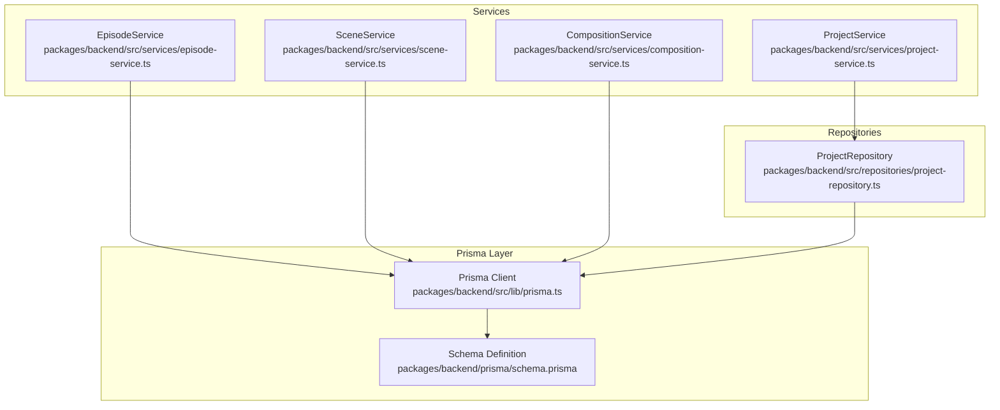
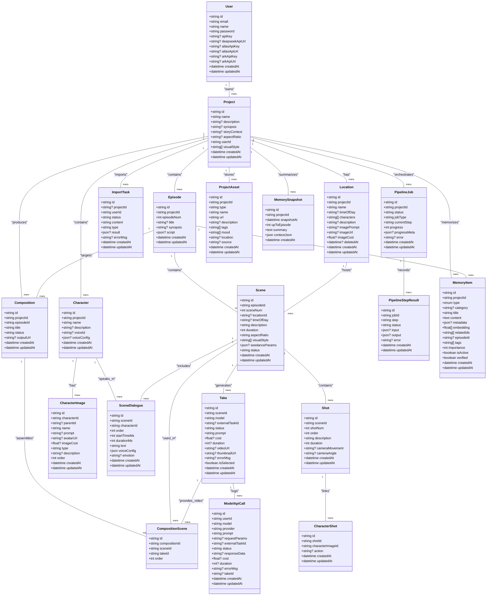
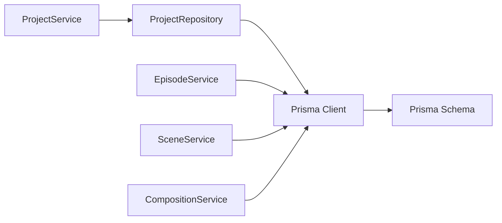
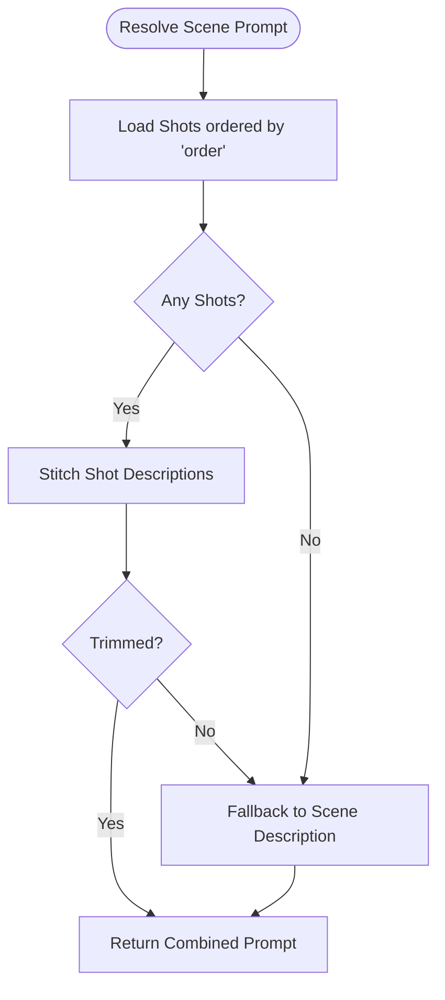
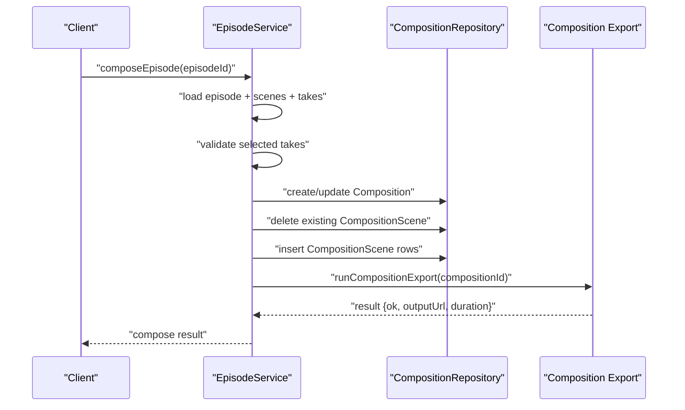

# Data Models and Database

<cite>
**Referenced Files in This Document**
- [schema.prisma](file://packages/backend/prisma/schema.prisma)
- [prisma.ts](file://packages/backend/src/lib/prisma.ts)
- [project-service.ts](file://packages/backend/src/services/project-service.ts)
- [episode-service.ts](file://packages/backend/src/services/episode-service.ts)
- [scene-service.ts](file://packages/backend/src/services/scene-service.ts)
- [composition-service.ts](file://packages/backend/src/services/composition-service.ts)
- [project-repository.ts](file://packages/backend/src/repositories/project-repository.ts)
- [DREAMER_DATA_MODEL.md](file://docs/DREAMER_DATA_MODEL.md)
</cite>

## Table of Contents

1. [Introduction](#introduction)
2. [Project Structure](#project-structure)
3. [Core Components](#core-components)
4. [Architecture Overview](#architecture-overview)
5. [Detailed Component Analysis](#detailed-component-analysis)
6. [Dependency Analysis](#dependency-analysis)
7. [Performance Considerations](#performance-considerations)
8. [Troubleshooting Guide](#troubleshooting-guide)
9. [Conclusion](#conclusion)
10. [Appendices](#appendices)

## Introduction

This document provides comprehensive data model documentation for the Prisma-based database schema used by the project. It focuses on the core entities: User, Project, Episode, Scene, Shot, Character, CharacterImage, CharacterShot, SceneDialogue, Location, Take, ModelApiCall, Composition, CompositionScene, ImportTask, PipelineJob, PipelineStepResult, ProjectAsset, MemoryItem, and MemorySnapshot. The documentation covers entity relationships, field definitions, data types, constraints, indexing strategies, and query optimization patterns. It also outlines migration strategy, data lifecycle management, and practical access patterns derived from the backend services and repositories.

## Project Structure

The data model is defined centrally in the Prisma schema and consumed by backend services and repositories. The Prisma client is instantiated once and reused across the application.

**Diagram sources**

- [prisma.ts:1-4](file://packages/backend/src/lib/prisma.ts#L1-L4)
- [schema.prisma:1-430](file://packages/backend/prisma/schema.prisma#L1-L430)
- [project-service.ts:1-281](file://packages/backend/src/services/project-service.ts#L1-L281)
- [episode-service.ts:1-624](file://packages/backend/src/services/episode-service.ts#L1-L624)
- [scene-service.ts:1-304](file://packages/backend/src/services/scene-service.ts#L1-L304)
- [composition-service.ts:1-75](file://packages/backend/src/services/composition-service.ts#L1-L75)
- [project-repository.ts:1-160](file://packages/backend/src/repositories/project-repository.ts#L1-L160)

**Section sources**

- [prisma.ts:1-4](file://packages/backend/src/lib/prisma.ts#L1-L4)
- [schema.prisma:1-430](file://packages/backend/prisma/schema.prisma#L1-L430)

## Core Components

This section documents the principal entities and their relationships, constraints, and indexes.

- User
  - Fields: id (String, @id), email (String, @unique), name (String), password (String), apiKey (String?), deepseekApiUrl (String?), atlasApiKey (String?), atlasApiUrl (String?), arkApiKey (String?), arkApiUrl (String?), createdAt (DateTime @default(now())), updatedAt (DateTime @updatedAt)
  - Relationships: projects (Project[]), apiCalls (ModelApiCall[])
  - Notes: apiKey supports optional provider-specific keys; timestamps managed automatically.

- Project
  - Fields: id (String, @id), name (String), description (String?), synopsis (String?), storyContext (String? @db.Text), aspectRatio (String?), userId (String), visualStyle (String[] @default([])), createdAt (DateTime @default(now())), updatedAt (DateTime @updatedAt)
  - Relationships: user (User), episodes (Episode[]), characters (Character[]), locations (Location[]), compositions (Composition[]), importTasks (ImportTask[]), pipelineJobs (PipelineJob[]), assets (ProjectAsset[]), memories (MemoryItem[]), memorySnapshots (MemorySnapshot[])
  - Indexes: @@index([userId])

- Episode
  - Fields: id (String, @id), projectId (String), episodeNum (Int), title (String?), synopsis (String?), script (Json?), createdAt (DateTime @default(now())), updatedAt (DateTime @updatedAt)
  - Relationships: project (Project, onDelete: Cascade), scenes (Scene[]), compositions (Composition[]), memories (MemoryItem[])
  - Constraints: @@unique([projectId, episodeNum]); @@index([projectId])

- Character
  - Fields: id (String, @id), projectId (String), name (String), description (String?), voiceId (String?), voiceConfig (Json?), createdAt (DateTime @default(now())), updatedAt (DateTime @updatedAt)
  - Relationships: project (Project, onDelete: Cascade), images (CharacterImage[]), dialogues (SceneDialogue[] @relation("CharacterDialogues"))
  - Constraints: @@unique([projectId, name]); @@index([projectId])

- CharacterImage
  - Fields: id (String, @id), characterId (String), name (String), prompt (String?), avatarUrl (String?), imageCost (Float?), parentId (String?), type (String @default("base")), description (String?), order (Int @default(0)), createdAt (DateTime @default(now())), updatedAt (DateTime @updatedAt)
  - Relationships: character (Character, onDelete: Cascade), parent/children (self-referencing), characterShots (CharacterShot[])
  - Indexes: @@index([characterId]); @@index([parentId])

- CharacterShot
  - Fields: id (String, @id), shotId (String), characterImageId (String), action (String?), createdAt (DateTime @default(now())), updatedAt (DateTime @updatedAt)
  - Relationships: shot (Shot, onDelete: Cascade), characterImage (CharacterImage)
  - Constraints: @@unique([shotId, characterImageId]); @@index([shotId]); @@index([characterImageId])

- Scene
  - Fields: id (String, @id), episodeId (String), sceneNum (Int), locationId (String?), timeOfDay (String?), description (String @default("")), duration (Int @default(0)), aspectRatio (String @default("9:16")), visualStyle (String[] @default([])), seedanceParams (Json?), status (String @default("pending")), createdAt (DateTime @default(now())), updatedAt (DateTime @updatedAt)
  - Relationships: episode (Episode, onDelete: Cascade), location (Location?), shots (Shot[]), dialogues (SceneDialogue[] @relation("SceneDialogues")), takes (Take[]), compositionUsages (CompositionScene[])
  - Constraints: @@unique([episodeId, sceneNum]); @@index([episodeId]); @@index([locationId])

- Shot
  - Fields: id (String, @id), sceneId (String), shotNum (Int), order (Int), description (String), duration (Int @default(0)), cameraMovement (String?), cameraAngle (String?), createdAt (DateTime @default(now())), updatedAt (DateTime @updatedAt)
  - Relationships: scene (Scene, onDelete: Cascade), characterShots (CharacterShot[])
  - Indexes: @@index([sceneId])

- SceneDialogue
  - Fields: id (String, @id), sceneId (String), characterId (String), order (Int), startTimeMs (Int), durationMs (Int), text (String), voiceConfig (Json), emotion (String?), createdAt (DateTime @default(now())), updatedAt (DateTime @updatedAt)
  - Relationships: scene (Scene, onDelete: Cascade, relationName: "SceneDialogues"), character (Character, relationName: "CharacterDialogues")
  - Indexes: @@index([sceneId]); @@index([characterId])

- Location
  - Fields: id (String, @id), projectId (String), name (String mapped to "location"), timeOfDay (String?), characters (String[] @default([])), description (String?), imagePrompt (String?), imageUrl (String?), imageCost (Float?), deletedAt (DateTime?), createdAt (DateTime @default(now())), updatedAt (DateTime @updatedAt)
  - Relationships: project (Project, onDelete: Cascade), scenes (Scene[])
  - Constraints: @@unique([projectId, name]); @@index([projectId]); @@index([projectId, deletedAt])

- Take
  - Fields: id (String, @id), sceneId (String), model (String), externalTaskId (String?), status (String @default("queued")), prompt (String), cost (Float?), duration (Int?), videoUrl (String?), thumbnailUrl (String?), errorMsg (String?), isSelected (Boolean @default(false)), createdAt (DateTime @default(now())), updatedAt (DateTime @updatedAt)
  - Relationships: scene (Scene, onDelete: Cascade), apiCalls (ModelApiCall[]), compositionUsages (CompositionScene[])
  - Indexes: @@index([sceneId]); @@index([externalTaskId])

- ModelApiCall
  - Fields: id (String, @id), userId (String), model (String), provider (String), prompt (String), requestParams (String?), externalTaskId (String?), status (String @default("pending")), responseData (String?), cost (Float?), duration (Int?), errorMsg (String?), takeId (String?), createdAt (DateTime @default(now())), updatedAt (DateTime @updatedAt)
  - Relationships: user (User, onDelete: Cascade), take (Take, onDelete: SetNull)
  - Indexes: @@index([userId]); @@index([externalTaskId]); @@index([model]); @@index([createdAt])

- Composition
  - Fields: id (String, @id), projectId (String), episodeId (String), title (String), status (String @default("draft")), outputUrl (String?), createdAt (DateTime @default(now())), updatedAt (DateTime @updatedAt)
  - Relationships: project (Project, onDelete: Cascade), episode (Episode, onDelete: Cascade), scenes (CompositionScene[])
  - Indexes: @@index([projectId]); @@index([episodeId])

- CompositionScene
  - Fields: id (String, @id), compositionId (String), sceneId (String), takeId (String), order (Int)
  - Relationships: composition (Composition, onDelete: Cascade), scene (Scene, onDelete: Cascade), take (Take, onDelete: Cascade)
  - Indexes: @@index([compositionId]); @@index([sceneId]); @@index([takeId])

- ImportTask
  - Fields: id (String, @id), projectId (String?), userId (String), status (String @default("pending")), content (String), type (String @default("markdown")), result (Json?), errorMsg (String?), createdAt (DateTime @default(now())), updatedAt (DateTime @updatedAt)
  - Relationships: project (Project?, onDelete: SetNull), user (User)
  - Indexes: @@index([userId])

- PipelineJob
  - Fields: id (String, @id), projectId (String), status (String @default("pending")), jobType (String @default("full-pipeline")), currentStep (String @default("script-writing")), progress (Int @default(0)), progressMeta (Json?), error (String?), createdAt (DateTime @default(now())), updatedAt (DateTime @updatedAt)
  - Relationships: project (Project, onDelete: Cascade), stepResults (PipelineStepResult[])
  - Indexes: @@index([projectId])

- PipelineStepResult
  - Fields: id (String, @id), jobId (String), step (String), status (String @default("pending")), input (Json?), output (Json?), error (String?), createdAt (DateTime @default(now())), updatedAt (DateTime @updatedAt)
  - Relationships: job (PipelineJob, onDelete: Cascade)
  - Constraints: @@unique([jobId, step]); @@index([jobId])

- ProjectAsset
  - Fields: id (String, @id), projectId (String), type (String), name (String), url (String), description (String?), tags (String[]), mood (String[]), location (String?), source (String?), createdAt (DateTime @default(now())), updatedAt (DateTime @updatedAt)
  - Relationships: project (Project, onDelete: Cascade)
  - Indexes: @@index([projectId])

- MemoryItem
  - Fields: id (String, @id), projectId (String), type (MemoryType), category (String?), title (String), content (String @db.Text), metadata (Json?), embedding (Float[] @default([])), relatedIds (String[] @default([])), episodeId (String?), tags (String[] @default([])), importance (Int @default(3)), isActive (Boolean @default(true)), verified (Boolean @default(false)), createdAt (DateTime @default(now())), updatedAt (DateTime @updatedAt)
  - Relationships: project (Project, onDelete: Cascade), episode (Episode?)
  - Indexes: @@index([projectId, type]); @@index([projectId, isActive]); @@index([projectId, importance]); @@index([episodeId])

- MemorySnapshot
  - Fields: id (String, @id), projectId (String), snapshotAt (DateTime @default(now())), upToEpisode (Int), summary (String @db.Text), contextJson (Json), createdAt (DateTime @default(now()))
  - Relationships: project (Project, onDelete: Cascade)
  - Constraints: @@unique([projectId, upToEpisode]); @@index([projectId])

Notes on design decisions:

- Soft deletion pattern is applied to Location via deletedAt, allowing historical reporting while excluding soft-deleted rows from typical listings.
- JSON fields (script, voiceConfig, metadata, contextJson) store structured content; ensure validation at service boundaries.
- Status enums are represented as String with defaults; consider domain-specific enums in future schema evolution.
- Composite unique constraints ensure referential integrity for ordered sequences (e.g., Episode per Project, Scene per Episode).

**Section sources**

- [schema.prisma:10-430](file://packages/backend/prisma/schema.prisma#L10-L430)
- [DREAMER_DATA_MODEL.md:1-28](file://docs/DREAMER_DATA_MODEL.md#L1-L28)

## Architecture Overview

The data model is accessed through a layered architecture:

- Services orchestrate business logic and coordinate repository calls.
- Repositories encapsulate Prisma queries and expose typed operations.
- Prisma client provides strongly-typed database access.

**Diagram sources**

- [schema.prisma:10-430](file://packages/backend/prisma/schema.prisma#L10-L430)

## Detailed Component Analysis

### Entity Relationships and Constraints

- Hierarchical ownership:
  - User owns Project; Project owns Episode, Character, Location, Composition, ImportTask, PipelineJob, ProjectAsset, MemoryItem, MemorySnapshot.
  - Episode owns Scene; Scene owns Shot, SceneDialogue, Take.
  - Character owns CharacterImage; Shot links to CharacterImage via CharacterShot.
  - Location relates to Scene; Composition links Scenes/Takes via CompositionScene.
- Unique ordering:
  - Episode is uniquely identified by (projectId, episodeNum); Scene by (episodeId, sceneNum).
- Soft deletion:
  - Location supports soft deletion via deletedAt; typical queries filter out deleted rows.
- JSON fields:
  - script (Episode), voiceConfig (SceneDialogue), metadata (MemoryItem), contextJson (MemorySnapshot) store structured data; ensure validation and normalization in services.

**Section sources**

- [schema.prisma:55-214](file://packages/backend/prisma/schema.prisma#L55-L214)

### Indexing Strategies

- Foreign-key indexes:
  - Project.userId, Episode.projectId, Character.projectId, CharacterImage.characterId, CharacterShot.shotId, CharacterShot.characterImageId, Scene.episodeId, Scene.locationId, Shot.sceneId, SceneDialogue.sceneId, SceneDialogue.characterId, Location.projectId, Take.sceneId, ModelApiCall.userId, ModelApiCall.externalTaskId, ModelApiCall.model, ModelApiCall.createdAt, Composition.projectId, Composition.episodeId, CompositionScene.compositionId, CompositionScene.sceneId, CompositionScene.takeId, ImportTask.userId, PipelineJob.projectId, PipelineStepResult.jobId, ProjectAsset.projectId, MemoryItem.projectId, MemoryItem.episodeId, MemorySnapshot.projectId.
- Composite unique constraints:
  - Episode(projectId, episodeNum), Scene(episodeId, sceneNum), Character(projectId, name), Location(projectId, name), MemorySnapshot(projectId, upToEpisode).
- Purpose:
  - Optimize joins, lookups, and uniqueness checks; support frequent filters and pagination.

**Section sources**

- [schema.prisma:52-53](file://packages/backend/prisma/schema.prisma#L52-L53)
- [schema.prisma:70-71](file://packages/backend/prisma/schema.prisma#L70-L71)
- [schema.prisma:88-89](file://packages/backend/prisma/schema.prisma#L88-L89)
- [schema.prisma:137-139](file://packages/backend/prisma/schema.prisma#L137-L139)
- [schema.prisma:170-173](file://packages/backend/prisma/schema.prisma#L170-L173)
- [schema.prisma:211-214](file://packages/backend/prisma/schema.prisma#L211-L214)
- [schema.prisma:236-238](file://packages/backend/prisma/schema.prisma#L236-L238)
- [schema.prisma:259-263](file://packages/backend/prisma/schema.prisma#L259-L263)
- [schema.prisma:279-281](file://packages/backend/prisma/schema.prisma#L279-L281)
- [schema.prisma:293-296](file://packages/backend/prisma/schema.prisma#L293-L296)
- [schema.prisma:311-312](file://packages/backend/prisma/schema.prisma#L311-L312)
- [schema.prisma:329-330](file://packages/backend/prisma/schema.prisma#L329-L330)
- [schema.prisma:344-346](file://packages/backend/prisma/schema.prisma#L344-L346)
- [schema.prisma:363-364](file://packages/backend/prisma/schema.prisma#L363-L364)
- [schema.prisma:408-412](file://packages/backend/prisma/schema.prisma#L408-L412)
- [schema.prisma:427-429](file://packages/backend/prisma/schema.prisma#L427-L429)

### Query Optimization Patterns

- Selective includes:
  - Services often fetch minimal data for lists and enrich later (e.g., ProjectService lists projects with limited includes; EpisodeService enriches episodes with counts and flags).
- Aggregation and grouping:
  - EpisodeService performs groupBy on Scene to compute storyboard scene counts and correlates with CharacterShot and SceneDialogue to derive character counts.
- Batch operations:
  - SceneService batches video generation requests and updates scene status in bulk via repository methods.
- Pagination-friendly queries:
  - Repositories order by createdAt desc for project lists and episode lists; leverage indexes on foreign keys for efficient filtering.

**Section sources**

- [project-service.ts:53-55](file://packages/backend/src/services/project-service.ts#L53-L55)
- [episode-service.ts:243-306](file://packages/backend/src/services/episode-service.ts#L243-L306)
- [scene-service.ts:169-237](file://packages/backend/src/services/scene-service.ts#L169-L237)

### Sample Data Structures

Representative samples for key entities (field names only):

- User: id, email, name, password, apiKey, deepseekApiUrl, atlasApiKey, atlasApiUrl, arkApiKey, arkApiUrl, createdAt, updatedAt
- Project: id, name, description, synopsis, storyContext, aspectRatio, userId, visualStyle[], createdAt, updatedAt
- Episode: id, projectId, episodeNum, title, synopsis, script, createdAt, updatedAt
- Scene: id, episodeId, sceneNum, locationId, timeOfDay, description, duration, aspectRatio, visualStyle[], seedanceParams, status, createdAt, updatedAt
- Shot: id, sceneId, shotNum, order, description, duration, cameraMovement, cameraAngle, createdAt, updatedAt
- Character: id, projectId, name, description, voiceId, voiceConfig, createdAt, updatedAt
- CharacterImage: id, characterId, name, prompt, avatarUrl, imageCost, parentId, type, description, order, createdAt, updatedAt
- CharacterShot: id, shotId, characterImageId, action, createdAt, updatedAt
- SceneDialogue: id, sceneId, characterId, order, startTimeMs, durationMs, text, voiceConfig, emotion, createdAt, updatedAt
- Location: id, projectId, name, timeOfDay, characters[], description, imagePrompt, imageUrl, imageCost, deletedAt, createdAt, updatedAt
- Take: id, sceneId, model, externalTaskId, status, prompt, cost, duration, videoUrl, thumbnailUrl, errorMsg, isSelected, createdAt, updatedAt
- ModelApiCall: id, userId, model, provider, prompt, requestParams, externalTaskId, status, responseData, cost, duration, errorMsg, takeId, createdAt, updatedAt
- Composition: id, projectId, episodeId, title, status, outputUrl, createdAt, updatedAt
- CompositionScene: id, compositionId, sceneId, takeId, order
- ImportTask: id, projectId, userId, status, content, type, result, errorMsg, createdAt, updatedAt
- PipelineJob: id, projectId, status, jobType, currentStep, progress, progressMeta, error, createdAt, updatedAt
- PipelineStepResult: id, jobId, step, status, input, output, error, createdAt, updatedAt
- ProjectAsset: id, projectId, type, name, url, description, tags[], mood[], location, source, createdAt, updatedAt
- MemoryItem: id, projectId, type, category, title, content, metadata, embedding[], relatedIds[], episodeId, tags[], importance, isActive, verified, createdAt, updatedAt
- MemorySnapshot: id, projectId, snapshotAt, upToEpisode, summary, contextJson, createdAt

**Section sources**

- [schema.prisma:10-430](file://packages/backend/prisma/schema.prisma#L10-L430)

### Common Access Patterns

- Project-centric operations:
  - List projects by user; create/update project; fetch detailed project with episodes, characters, locations, compositions.
- Episode-centric operations:
  - List episodes by project; get episode detail with scenes and project visual style; apply script content to create scenes/shots/dialogues; compose episode into a Composition.
- Scene-centric operations:
  - Resolve generation prompt from Shot entries; enqueue video generation; batch enqueue; select a Take as selected; optimize prompt.
- Composition-centric operations:
  - List compositions by project; update timeline; export composition.

**Section sources**

- [project-service.ts:53-67](file://packages/backend/src/services/project-service.ts#L53-L67)
- [episode-service.ts:316-334](file://packages/backend/src/services/episode-service.ts#L316-L334)
- [episode-service.ts:366-444](file://packages/backend/src/services/episode-service.ts#L366-L444)
- [scene-service.ts:18-32](file://packages/backend/src/services/scene-service.ts#L18-L32)
- [scene-service.ts:100-167](file://packages/backend/src/services/scene-service.ts#L100-L167)
- [scene-service.ts:169-237](file://packages/backend/src/services/scene-service.ts#L169-L237)
- [composition-service.ts:10-12](file://packages/backend/src/services/composition-service.ts#L10-L12)
- [composition-service.ts:49-67](file://packages/backend/src/services/composition-service.ts#L49-L67)

### Migration Strategy and Data Lifecycle Management

- Migrations:
  - The repository includes a set of incremental migrations under packages/backend/prisma/migrations/. Each migration file corresponds to a schema change or data enrichment.
  - Typical migration categories observed:
    - Initial baseline schema creation.
    - Adding prompt fields to CharacterImage and Location.
    - Introducing Memory-related tables and indexes.
    - Adding cost fields for images and project default aspect ratio adjustments.
    - Soft deletion support for Location.
- Lock file:
  - migration_lock.toml prevents concurrent migration runs.
- Squash and cleanup:
  - squash-drop-old-migration-rows.sql indicates post-migration cleanup steps to maintain migration history integrity.
- Recommended practices:
  - Always run migrations in staging before production.
  - Back up database before major migrations.
  - Use transactions for multi-table changes within a single migration.
  - Keep migration names descriptive and grouped by functional change.

**Section sources**

- [schema.prisma:1-8](file://packages/backend/prisma/schema.prisma#L1-L8)
- [schema.prisma:429-430](file://packages/backend/prisma/schema.prisma#L429-L430)

### Data Security Considerations and Access Control

- Authentication and authorization:
  - Services enforce ownership checks (e.g., ProjectService verifies user ownership before operations).
- Data exposure:
  - Repositories limit included fields for list views; sensitive fields (password, API keys) are not exposed in public responses.
- Provider credentials:
  - User-level provider API keys are stored per-user; handle securely and avoid logging.
- Audit trail:
  - ModelApiCall records provider usage, costs, and errors for traceability.

**Section sources**

- [project-service.ts:74-77](file://packages/backend/src/services/project-service.ts#L74-L77)
- [project-service.ts:203-227](file://packages/backend/src/services/project-service.ts#L203-L227)
- [schema.prisma:240-263](file://packages/backend/prisma/schema.prisma#L240-L263)

### Backup Procedures

- Recommended approach:
  - Use database-native backups (e.g., logical dumps or continuous archiving) for PostgreSQL.
  - Automate periodic snapshots and retain recent recovery points.
  - Validate restore procedures regularly.
- Prisma considerations:
  - Treat Prisma migrations as part of the schema versioning; ensure backups capture both schema and data.

[No sources needed since this section provides general guidance]

## Dependency Analysis

This section maps service-to-repository-to-schema dependencies and highlights coupling.

**Diagram sources**

- [project-service.ts:1-281](file://packages/backend/src/services/project-service.ts#L1-L281)
- [project-repository.ts:1-160](file://packages/backend/src/repositories/project-repository.ts#L1-L160)
- [episode-service.ts:1-624](file://packages/backend/src/services/episode-service.ts#L1-L624)
- [scene-service.ts:1-304](file://packages/backend/src/services/scene-service.ts#L1-L304)
- [composition-service.ts:1-75](file://packages/backend/src/services/composition-service.ts#L1-L75)
- [prisma.ts:1-4](file://packages/backend/src/lib/prisma.ts#L1-L4)
- [schema.prisma:1-430](file://packages/backend/prisma/schema.prisma#L1-L430)

**Section sources**

- [project-service.ts:1-281](file://packages/backend/src/services/project-service.ts#L1-L281)
- [project-repository.ts:1-160](file://packages/backend/src/repositories/project-repository.ts#L1-L160)
- [episode-service.ts:1-624](file://packages/backend/src/services/episode-service.ts#L1-L624)
- [scene-service.ts:1-304](file://packages/backend/src/services/scene-service.ts#L1-L304)
- [composition-service.ts:1-75](file://packages/backend/src/services/composition-service.ts#L1-L75)
- [prisma.ts:1-4](file://packages/backend/src/lib/prisma.ts#L1-L4)
- [schema.prisma:1-430](file://packages/backend/prisma/schema.prisma#L1-L430)

## Performance Considerations

- Index utilization:
  - Ensure queries filter on indexed columns (e.g., userId, projectId, episodeId, sceneId) to leverage @@index directives.
- Minimize N+1:
  - Use includes judiciously; enrich data in batch where possible (e.g., EpisodeService’s aggregation-based enrichment).
- JSON field scanning:
  - Avoid selective scans on JSON fields; prefer normalized relations or separate tables if frequent filtering is required.
- Batch operations:
  - Use batch APIs for updates and inserts (e.g., batch enqueue video generation).
- Cost-aware operations:
  - Track and log costs via ModelApiCall to prevent runaway expenses.

[No sources needed since this section provides general guidance]

## Troubleshooting Guide

- Common issues and resolutions:
  - Ownership errors: Ensure user ID matches project ownership before mutating data (ProjectService enforces this).
  - Missing prompt: SceneService requires a non-empty prompt; either pass a body prompt or ensure Shot entries exist.
  - Rate limits and auth failures: SceneService and EpisodeService surface specific error codes for AI provider issues.
  - Unique constraint violations: Verify composite unique constraints (e.g., Episode per Project, Scene per Episode) before insert/upsert.
  - Soft-deleted rows: Location queries should filter by deletedAt for normal listings; review deletedAt usage if items appear missing.
- Monitoring:
  - Track ModelApiCall status and error messages for provider-side failures.
  - Monitor PipelineJob progress and error fields for pipeline bottlenecks.

**Section sources**

- [project-service.ts:74-77](file://packages/backend/src/services/project-service.ts#L74-L77)
- [scene-service.ts:142-144](file://packages/backend/src/services/scene-service.ts#L142-L144)
- [episode-service.ts:511-534](file://packages/backend/src/services/episode-service.ts#L511-L534)
- [episode-service.ts:595-618](file://packages/backend/src/services/episode-service.ts#L595-L618)

## Conclusion

The data model centers around Projects and Episodes with Scenes as the primary unit for video generation. Shots, Characters, Locations, Takes, and Compositions form a cohesive graph enabling fine-grained control and assembly of video content. Indexes and constraints ensure referential integrity and efficient querying. Services and repositories implement access control and optimization patterns suited to large-scale video production workflows.

[No sources needed since this section summarizes without analyzing specific files]

## Appendices

### Appendix A: Prompt Assembly Flow

This flow illustrates how Shot entries are stitched into a single prompt for video generation.

**Diagram sources**

- [scene-service.ts:18-32](file://packages/backend/src/services/scene-service.ts#L18-L32)

### Appendix B: Episode Composition Export Workflow

This sequence shows how a Composition is assembled from Scene/Take pairs and exported.

**Diagram sources**

- [episode-service.ts:366-444](file://packages/backend/src/services/episode-service.ts#L366-L444)
- [composition-service.ts:69-71](file://packages/backend/src/services/composition-service.ts#L69-L71)
