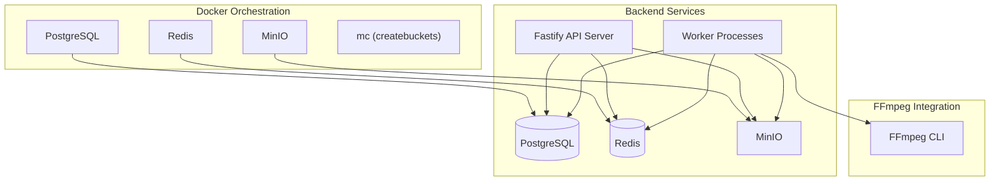
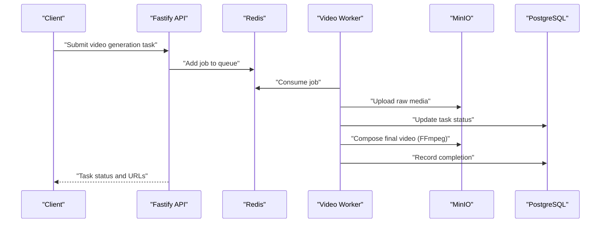
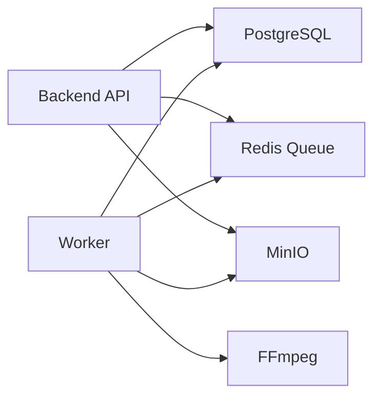

# Deployment and Operations

<cite>
**Referenced Files in This Document**
- [docker-compose.yml](file://docker/docker-compose.yml)
- [README.md](file://README.md)
- [DEVELOPMENT.md](file://docs/DEVELOPMENT.md)
- [package.json](file://package.json)
- [packages/backend/package.json](file://packages/backend/package.json)
- [packages/backend/src/worker.ts](file://packages/backend/src/worker.ts)
- [packages/backend/src/queues/video.ts](file://packages/backend/src/queues/video.ts)
- [packages/backend/src/services/ffmpeg.ts](file://packages/backend/src/services/ffmpeg.ts)
- [packages/backend/src/services/storage.ts](file://packages/backend/src/services/storage.ts)
- [.gitignore](file://.gitignore)
- [AGENTS.md](file://AGENTS.md)
</cite>

## Table of Contents

1. [Introduction](#introduction)
2. [Project Structure](#project-structure)
3. [Core Components](#core-components)
4. [Architecture Overview](#architecture-overview)
5. [Detailed Component Analysis](#detailed-component-analysis)
6. [Dependency Analysis](#dependency-analysis)
7. [Performance Considerations](#performance-considerations)
8. [Troubleshooting Guide](#troubleshooting-guide)
9. [Conclusion](#conclusion)
10. [Appendices](#appendices)

## Introduction

This document provides comprehensive deployment and operations guidance for the Dreamer platform. It covers Docker orchestration, infrastructure requirements for PostgreSQL, Redis, MinIO, and FFmpeg integration, production deployment strategies, environment configuration management, monitoring setup, backup and recovery procedures, performance optimization, capacity planning, security hardening, and disaster recovery tailored for an AI-intensive video production workload.

## Project Structure

The repository is a monorepo with a clear separation between frontend, backend, shared types, and Docker orchestration. The Docker Compose stack provisions the foundational services (PostgreSQL, Redis, MinIO) and initializes buckets via a one-time bootstrap job. The backend exposes APIs and runs workers for asynchronous tasks (video generation, imports, images). FFmpeg is integrated for video composition and effects.

**Diagram sources**

- [docker-compose.yml:1-71](file://docker/docker-compose.yml#L1-L71)
- [packages/backend/src/queues/video.ts:1-271](file://packages/backend/src/queues/video.ts#L1-L271)
- [packages/backend/src/services/ffmpeg.ts:1-300](file://packages/backend/src/services/ffmpeg.ts#L1-L300)
- [packages/backend/src/services/storage.ts:1-65](file://packages/backend/src/services/storage.ts#L1-L65)

**Section sources**

- [README.md:26-42](file://README.md#L26-L42)
- [docker-compose.yml:3-71](file://docker/docker-compose.yml#L3-L71)
- [DEVELOPMENT.md:42-53](file://docs/DEVELOPMENT.md#L42-L53)

## Core Components

- PostgreSQL (primary database for application data)
- Redis (task queue and caching)
- MinIO (object storage compatible with AWS S3)
- FFmpeg (video composition and effects)
- Backend API and Workers (Fastify + BullMQ)

Operational highlights:

- Health checks are defined for PostgreSQL, Redis, and MinIO to support reliable startup sequencing and monitoring.
- A dedicated MinIO client job creates required buckets and sets permissions.
- Workers run independently from the API server and handle video generation, imports, and image jobs.

**Section sources**

- [docker-compose.yml:4-70](file://docker/docker-compose.yml#L4-L70)
- [packages/backend/src/worker.ts:1-29](file://packages/backend/src/worker.ts#L1-L29)
- [packages/backend/src/queues/video.ts:27-256](file://packages/backend/src/queues/video.ts#L27-L256)

## Architecture Overview

The system follows a microservice-like Docker Compose layout with explicit health checks and a bootstrap step. The backend API communicates with PostgreSQL and Redis, while MinIO stores generated assets. Workers consume Redis queues to execute long-running tasks and use FFmpeg for video composition.

**Diagram sources**

- [packages/backend/src/queues/video.ts:15-256](file://packages/backend/src/queues/video.ts#L15-L256)
- [packages/backend/src/services/ffmpeg.ts:206-299](file://packages/backend/src/services/ffmpeg.ts#L206-L299)
- [packages/backend/src/services/storage.ts:23-47](file://packages/backend/src/services/storage.ts#L23-L47)

## Detailed Component Analysis

### Docker Orchestration Setup

- Services: postgres, redis, minio, createbuckets
- Health checks:
  - PostgreSQL: readiness check using pg_isready
  - Redis: ping check
  - MinIO: live endpoint check
- Volume mounts for persistent data
- Port mappings for local development
- Bootstrap job ensures buckets exist and permissions are set

Scaling considerations:

- Stateless API and Worker containers can be scaled horizontally behind a load balancer.
- Redis and PostgreSQL are single-instance in the provided stack; consider clustering or managed services for production.

**Section sources**

- [docker-compose.yml:4-70](file://docker/docker-compose.yml#L4-L70)

### Infrastructure Requirements

#### PostgreSQL

- Version: 16-alpine
- Persistence: mounted volume
- Health check: pg_isready
- Recommended production: managed Postgres with replication, backups, and read replicas

#### Redis

- Version: 7-alpine
- Persistence: mounted volume
- Health check: redis-cli ping
- Recommended production: clustered Redis with AOF/RDB persistence and failover

#### MinIO

- Version: latest
- Endpoint: API 9000, Console 9001
- Buckets: dreamer-videos, dreamer-assets
- Permissions: anonymous downloads configured for videos and assets
- Recommended production: TLS termination, IAM policies, lifecycle rules, cross-region replication

#### FFmpeg Integration

- Executed via child process spawning
- Uses environment variable for binary path
- Performs concatenation, trimming, audio mixing, subtitle burning, and scaling

**Section sources**

- [docker-compose.yml:34-50](file://docker/docker-compose.yml#L34-L50)
- [packages/backend/src/services/ffmpeg.ts:7-300](file://packages/backend/src/services/ffmpeg.ts#L7-L300)

### Production Deployment Strategies

- Containerization: Use the existing Docker Compose as a base; replace alpine images with slim variants for production stability.
- Secrets Management: Store sensitive environment variables outside the repository (.env is gitignored). Use a secrets manager or Kubernetes Secrets.
- Networking: Place services behind a reverse proxy/load balancer; enable HTTPS/TLS.
- Database migrations: Use the documented migration commands to keep schema aligned across environments.
- Worker scaling: Run multiple worker instances; tune concurrency per workload type.

**Section sources**

- [.gitignore:9-14](file://.gitignore#L9-L14)
- [AGENTS.md:383-402](file://AGENTS.md#L383-L402)

### Environment Configuration Management

- Backend reads environment variables for database, Redis, S3, JWT, and AI provider keys.
- Bootstrap order: ensure infrastructure is healthy before starting the API and workers.
- Example variables include DATABASE*URL, REDIS_URL, S3*\* endpoints, JWT_SECRET, and provider API keys.

**Section sources**

- [DEVELOPMENT.md:225-265](file://docs/DEVELOPMENT.md#L225-L265)
- [packages/backend/package.json:6-21](file://packages/backend/package.json#L6-L21)

### Monitoring Setup

- Health checks embedded in Compose provide basic liveness/readiness signals.
- Recommended additions:
  - Prometheus metrics for API latency and queue depth
  - Application logs aggregated to a SIEM or log collector
  - Redis and PostgreSQL monitoring dashboards
  - S3/Media access logging and quota alerts

[No sources needed since this section provides general guidance]

### Backup and Recovery Procedures

#### Database (PostgreSQL)

- Use managed backups or logical dumps for point-in-time recovery.
- Validate restore procedures regularly; test on staging first.

#### Object Storage (MinIO)

- Enable versioning and lifecycle policies.
- Cross-region replication for durability.
- Regular snapshot testing of bucket contents.

#### Workers and Caches

- Back up Redis snapshots if running standalone.
- Recreate queues and reprocess failed jobs if needed.

**Section sources**

- [docker-compose.yml:13-14](file://docker/docker-compose.yml#L13-L14)
- [docker-compose.yml:26-27](file://docker/docker-compose.yml#L26-L27)
- [docker-compose.yml:44-45](file://docker/docker-compose.yml#L44-L45)

### Performance Optimization Techniques

- Queue concurrency tuning:
  - Video generation worker concurrency tuned to GPU/CPU capacity.
  - Import worker concurrency for batch ingestion.
- Storage:
  - Use SSD-backed volumes for MinIO and database data directories.
  - Enable compression and efficient encoding profiles.
- FFmpeg:
  - Prefer hardware acceleration if available.
  - Tune segment durations and resolutions to balance quality and throughput.
- Caching:
  - Cache static assets and frequently accessed metadata in Redis.

**Section sources**

- [packages/backend/src/worker.ts:10-12](file://packages/backend/src/worker.ts#L10-L12)
- [packages/backend/src/queues/video.ts:252-256](file://packages/backend/src/queues/video.ts#L252-L256)

### Capacity Planning Guidelines

- Throughput targets:
  - Estimate concurrent video generation tasks based on CPU/GPU resources.
  - Factor in queue depth and worker concurrency.
- Storage sizing:
  - Account for raw media growth, transcoded outputs, and retention policies.
- Network bandwidth:
  - Consider upstream/downstream transfer rates for AI provider integrations and asset delivery.

[No sources needed since this section provides general guidance]

### Security Hardening Measures

- Secrets:
  - Never commit .env files; use a secrets manager.
- Access controls:
  - Restrict MinIO console access; enforce IAM policies.
  - Limit Redis and PostgreSQL network exposure.
- Transport security:
  - Enforce TLS for API, database, and object storage endpoints.
- Least privilege:
  - Use separate service accounts and bucket policies.

**Section sources**

- [.gitignore:9-14](file://.gitignore#L9-L14)
- [docker-compose.yml:38-40](file://docker/docker-compose.yml#L38-L40)

### Disaster Recovery Procedures

- Recovery steps:
  - Restore PostgreSQL from the latest backup.
  - Rehydrate MinIO from replicated buckets.
  - Recreate Redis from last known good snapshot.
  - Restart API and workers; reprocess failed jobs.
- Testing:
  - Conduct regular DR drills and document outcomes.

[No sources needed since this section provides general guidance]

## Dependency Analysis

The backend API depends on PostgreSQL for persistence, Redis for queuing, and MinIO for object storage. Workers depend on Redis and MinIO, and use FFmpeg for video composition.

**Diagram sources**

- [packages/backend/src/queues/video.ts:11-256](file://packages/backend/src/queues/video.ts#L11-L256)
- [packages/backend/src/services/storage.ts:4-12](file://packages/backend/src/services/storage.ts#L4-L12)
- [packages/backend/src/services/ffmpeg.ts:7-8](file://packages/backend/src/services/ffmpeg.ts#L7-L8)

**Section sources**

- [packages/backend/src/queues/video.ts:11-256](file://packages/backend/src/queues/video.ts#L11-L256)
- [packages/backend/src/services/storage.ts:4-12](file://packages/backend/src/services/storage.ts#L4-L12)
- [packages/backend/src/services/ffmpeg.ts:7-8](file://packages/backend/src/services/ffmpeg.ts#L7-L8)

## Performance Considerations

- Concurrency:
  - Video worker concurrency is set to process multiple jobs simultaneously; adjust based on compute headroom.
- I/O:
  - Ensure storage I/O is not bottlenecked; use fast disks and consider caching strategies.
- Memory:
  - Increase Node.js heap limits for heavy workloads; tests demonstrate higher memory usage in CI.

**Section sources**

- [packages/backend/src/worker.ts:10-12](file://packages/backend/src/worker.ts#L10-L12)
- [packages/backend/package.json:19](file://packages/backend/package.json#L19)

## Troubleshooting Guide

Common operational issues and remedies:

- Database connectivity:
  - Verify health check passes; confirm credentials and network reachability.
- Redis connectivity:
  - Confirm ping succeeds; check for memory pressure or slow queries.
- MinIO health:
  - Ensure live endpoint responds; validate bucket creation and permissions.
- Worker failures:
  - Inspect worker logs; verify queue consumption and retry/backoff behavior.
- FFmpeg errors:
  - Confirm binary path and availability; check disk space and permissions.

**Section sources**

- [docker-compose.yml:15-19](file://docker/docker-compose.yml#L15-L19)
- [docker-compose.yml:28-32](file://docker/docker-compose.yml#L28-L32)
- [docker-compose.yml:46-50](file://docker/docker-compose.yml#L46-L50)
- [packages/backend/src/queues/video.ts:258-264](file://packages/backend/src/queues/video.ts#L258-L264)
- [packages/backend/src/services/ffmpeg.ts:47-67](file://packages/backend/src/services/ffmpeg.ts#L47-L67)

## Conclusion

The Dreamer platform’s Docker Compose stack provides a solid foundation for development and staging. For production, augment the stack with managed services, hardened networking, robust monitoring, and automated backup/recovery. Carefully tune worker concurrency, storage I/O, and FFmpeg pipelines to meet workload demands while maintaining reliability and security.

## Appendices

### Environment Variables Reference

- Database: DATABASE_URL
- Cache/Queue: REDIS_URL
- Object Storage: S3_ENDPOINT, S3_ACCESS_KEY, S3_SECRET_KEY, S3_BUCKET_VIDEOS, S3_BUCKET_ASSETS, S3_REGION
- Authentication: JWT_SECRET, JWT_EXPIRES_IN, JWT_REFRESH_EXPIRES_IN
- AI Providers: DEEPSEEK_API_KEY, ATLAS_API_KEY, ARK_API_KEY plus base URLs
- CORS: CORS_ORIGIN
- FFmpeg: FFMPEG_PATH

**Section sources**

- [DEVELOPMENT.md:225-265](file://docs/DEVELOPMENT.md#L225-L265)

### Scripts and Commands

- Start infrastructure: pnpm docker:up
- Stop infrastructure: pnpm docker:down
- Initialize database: pnpm db:push
- Start API: pnpm start
- Start workers: pnpm dev:worker
- Build artifacts: pnpm build

**Section sources**

- [package.json:9-19](file://package.json#L9-L19)
- [README.md:68-87](file://README.md#L68-L87)
