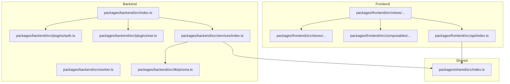
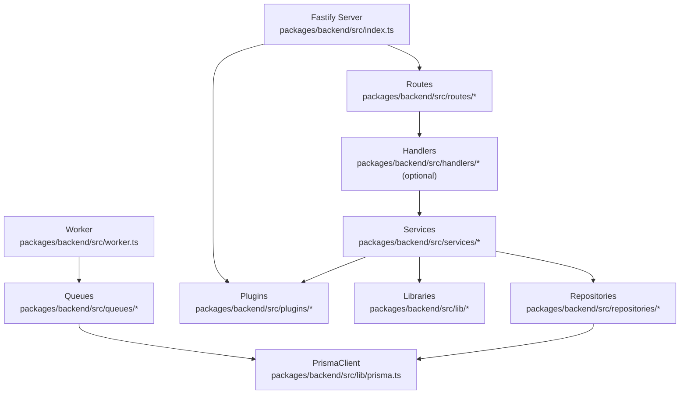
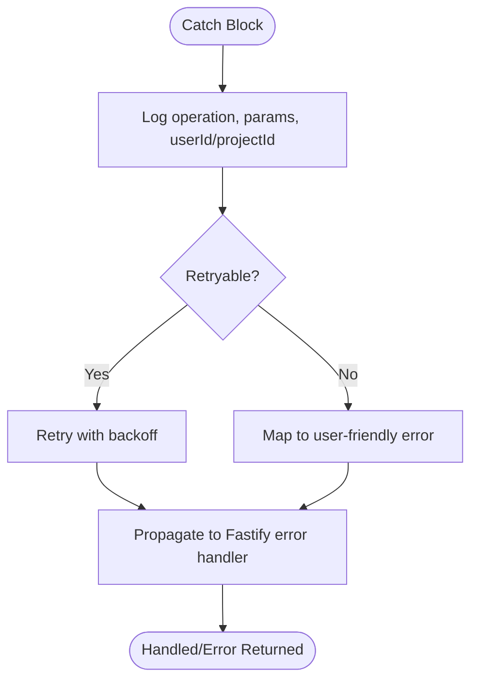
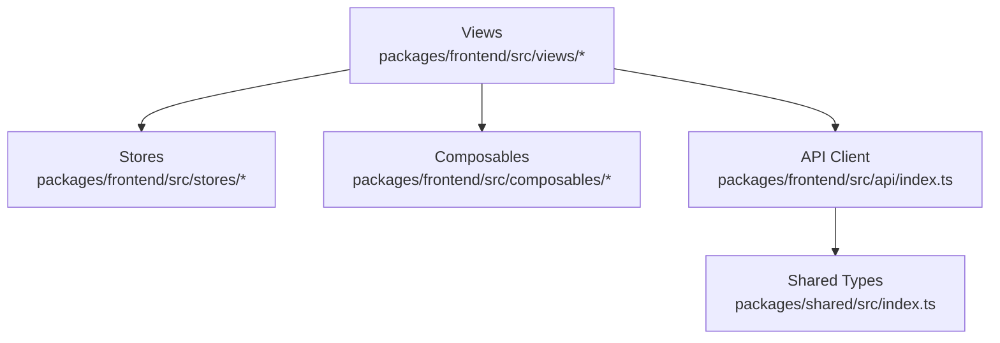
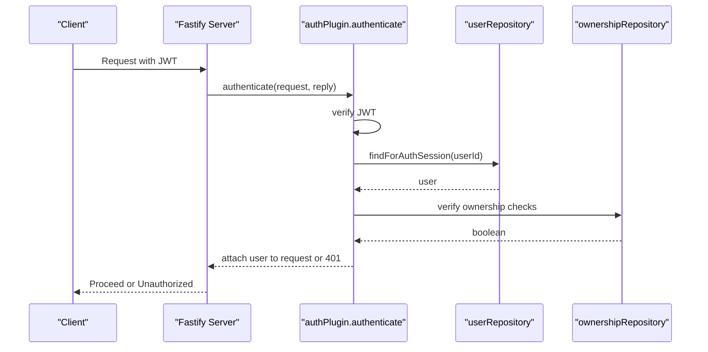
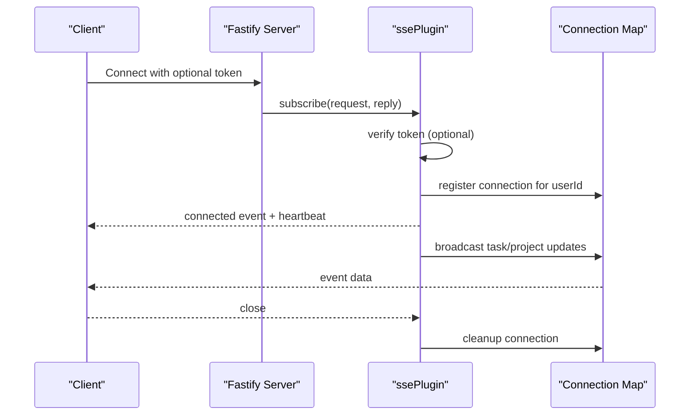
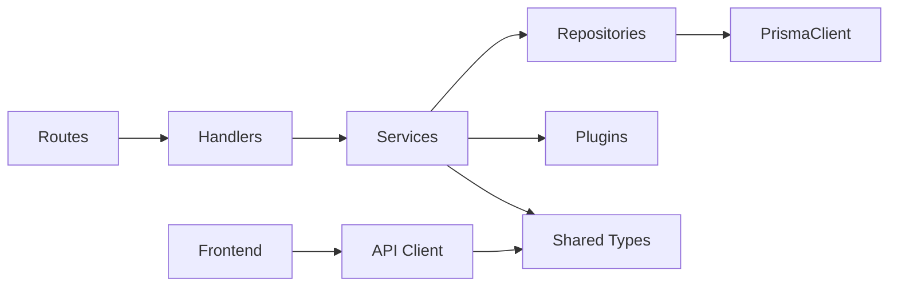

# Coding Standards

<cite>
**Referenced Files in This Document**
- [CODING_STANDARDS.md](file://docs/CODING_STANDARDS.md)
- [DEVELOPMENT.md](file://docs/DEVELOPMENT.md)
- [TESTING_GUIDE.md](file://docs/TESTING_GUIDE.md)
- [packages/backend/src/index.ts](file://packages/backend/src/index.ts)
- [packages/backend/src/bootstrap-env.ts](file://packages/backend/src/bootstrap-env.ts)
- [packages/backend/src/worker.ts](file://packages/backend/src/worker.ts)
- [packages/backend/src/lib/prisma.ts](file://packages/backend/src/lib/prisma.ts)
- [packages/backend/src/plugins/auth.ts](file://packages/backend/src/plugins/auth.ts)
- [packages/backend/src/plugins/sse.ts](file://packages/backend/src/plugins/sse.ts)
- [packages/backend/src/services/index.ts](file://packages/backend/src/services/index.ts)
- [packages/shared/src/index.ts](file://packages/shared/src/index.ts)
</cite>

## Table of Contents

1. [Introduction](#introduction)
2. [Project Structure](#project-structure)
3. [Core Components](#core-components)
4. [Architecture Overview](#architecture-overview)
5. [Detailed Component Analysis](#detailed-component-analysis)
6. [Dependency Analysis](#dependency-analysis)
7. [Performance Considerations](#performance-considerations)
8. [Troubleshooting Guide](#troubleshooting-guide)
9. [Conclusion](#conclusion)
10. [Appendices](#appendices)

## Introduction

This document defines the TypeScript coding standards for the Dreamer monorepo, focusing on backend architecture, naming conventions, function design, error handling, logging, type safety, dependency injection, testing, and frontend development practices. It complements the project’s development plan and aligns with established backend patterns (Fastify + Prisma) and frontend stack (Vue 3 + TypeScript + Pinia).

## Project Structure

The repository follows a monorepo layout with three primary packages:

- packages/backend: Node.js/Fastify API server, routes, handlers, services, repositories, plugins, queues, and worker processes.
- packages/frontend: Vue 3 SPA with views, stores (Pinia), composables, and API clients.
- packages/shared: Shared TypeScript types consumed by both backend and frontend.

**Diagram sources**

- [packages/backend/src/index.ts:1-131](file://packages/backend/src/index.ts#L1-L131)
- [packages/backend/src/worker.ts:1-30](file://packages/backend/src/worker.ts#L1-L30)
- [packages/backend/src/plugins/auth.ts:1-98](file://packages/backend/src/plugins/auth.ts#L1-L98)
- [packages/backend/src/plugins/sse.ts:1-108](file://packages/backend/src/plugins/sse.ts#L1-L108)
- [packages/backend/src/services/index.ts:1-14](file://packages/backend/src/services/index.ts#L1-L14)
- [packages/backend/src/lib/prisma.ts:1-4](file://packages/backend/src/lib/prisma.ts#L1-L4)
- [packages/shared/src/index.ts](file://packages/shared/src/index.ts)

**Section sources**

- [DEVELOPMENT.md:42-53](file://docs/DEVELOPMENT.md#L42-L53)
- [DEVELOPMENT.md:17-41](file://docs/DEVELOPMENT.md#L17-L41)

## Core Components

- Environment bootstrap: Centralized environment loading executed before any business module reads environment variables.
- HTTP server: Fastify-based API server with Swagger/OpenAPI documentation, CORS, JWT, multipart uploads, SSE, and route registration.
- Plugins: Authentication and SSE plugins decorate Fastify with reusable logic.
- Services: Business orchestration, AI integrations, pipeline orchestration, and media processing.
- Repositories: Thin Prisma wrappers for data access.
- Worker: Separate process for asynchronous jobs (video generation, import, image generation).
- Frontend: Views, stores, composables, and API client consuming shared types.

**Section sources**

- [packages/backend/src/bootstrap-env.ts:1-12](file://packages/backend/src/bootstrap-env.ts#L1-L12)
- [packages/backend/src/index.ts:1-131](file://packages/backend/src/index.ts#L1-L131)
- [packages/backend/src/plugins/auth.ts:1-98](file://packages/backend/src/plugins/auth.ts#L1-L98)
- [packages/backend/src/plugins/sse.ts:1-108](file://packages/backend/src/plugins/sse.ts#L1-L108)
- [packages/backend/src/services/index.ts:1-14](file://packages/backend/src/services/index.ts#L1-L14)
- [packages/backend/src/lib/prisma.ts:1-4](file://packages/backend/src/lib/prisma.ts#L1-L4)
- [packages/backend/src/worker.ts:1-30](file://packages/backend/src/worker.ts#L1-L30)
- [DEVELOPMENT.md:17-41](file://docs/DEVELOPMENT.md#L17-L41)

## Architecture Overview

The system enforces a layered architecture:

- Routes: Define endpoints, HTTP methods, and pre-handlers; keep thin.
- Handlers (optional): Parse requests, call services, map replies.
- Services: Business orchestration, external API calls, and transaction boundaries.
- Repositories: Data access only; no cross-aggregate business logic.
- Libraries: Pure functions and utilities.
- Plugins: Cross-cutting concerns (auth, SSE).
- Worker: Asynchronous job processing.

**Diagram sources**

- [packages/backend/src/index.ts:1-131](file://packages/backend/src/index.ts#L1-L131)
- [packages/backend/src/plugins/auth.ts:1-98](file://packages/backend/src/plugins/auth.ts#L1-L98)
- [packages/backend/src/plugins/sse.ts:1-108](file://packages/backend/src/plugins/sse.ts#L1-L108)
- [packages/backend/src/lib/prisma.ts:1-4](file://packages/backend/src/lib/prisma.ts#L1-L4)
- [packages/backend/src/worker.ts:1-30](file://packages/backend/src/worker.ts#L1-L30)

**Section sources**

- [CODING_STANDARDS.md:44-86](file://docs/CODING_STANDARDS.md#L44-L86)

## Detailed Component Analysis

### Naming Conventions

- General rules emphasize completeness, domain terminology, booleans with is/has/should, plural nouns for arrays, UPPER_SNAKE for constants, and preferring language-level privacy.
- Function naming favors verb+noun patterns: get/fetch/find/generate/generatePrompt/call/create/update/delete/handle/validate/build.
- Types/classes: Service, Client, Repository, Controller/Handler, Input/Response/Dto.
- Files: kebab-case recommended; dot-separated variants acceptable if consistent within a directory.
- Database fields: camelCase, booleans with is*, timestamps with *At, foreign keys with \*Id.

**Section sources**

- [CODING_STANDARDS.md:88-137](file://docs/CODING_STANDARDS.md#L88-L137)

### Function Design Principles

- Single responsibility with a soft upper bound around 50 lines; split complex branches earlier.
- Limit positional arguments; use object parameters when exceeding three.
- UI retains orchestration (validation → API calls → state updates); move detailed logic into composable/api modules.

**Section sources**

- [CODING_STANDARDS.md:149-154](file://docs/CODING_STANDARDS.md#L149-L154)

### Error Handling Strategies

- Do not swallow errors; log context (operation, parameters, userId/projectId) and either handle or propagate.
- Prefer Fastify’s centralized error handling for consistent mapping.
- Define domain-specific error classes (e.g., AIGenerationError) to distinguish retryable vs non-retryable failures.

**Diagram sources**

- [CODING_STANDARDS.md:157-182](file://docs/CODING_STANDARDS.md#L157-L182)

**Section sources**

- [CODING_STANDARDS.md:157-182](file://docs/CODING_STANDARDS.md#L157-L182)

### Logging Requirements

- Prefer fastify/request logging with Pino; use child loggers with reqId/userId when needed.
- Avoid printing sensitive data (passwords, tokens).
- Standardize model API call logs with fields aligned to ModelApiCall.

**Section sources**

- [CODING_STANDARDS.md:222-248](file://docs/CODING_STANDARDS.md#L222-L248)

### Type Safety Practices

- Avoid any unless absolutely necessary; annotate unknown JSON with unknown + guards or schema validation.
- Place cross-boundary types in packages/shared; align Fastify JSON Schema with TypeScript types.

**Section sources**

- [CODING_STANDARDS.md:140-146](file://docs/CODING_STANDARDS.md#L140-L146)

### Async/Await Best Practices

- Prefer async/await; avoid deep promise chaining.
- Use Promise.all for independent IO; use Promise.allSettled when failures must be handled individually.

**Section sources**

- [CODING_STANDARDS.md:185-189](file://docs/CODING_STANDARDS.md#L185-L189)

### Environment Variables and Bootstrap

- Load environment early (first import) to prevent undefined values in static imports.
- Validate required environment variables at startup.

**Section sources**

- [packages/backend/src/bootstrap-env.ts:1-12](file://packages/backend/src/bootstrap-env.ts#L1-L12)
- [CODING_STANDARDS.md:207-219](file://docs/CODING_STANDARDS.md#L207-L219)

### API Response Format

- New APIs or major refactors should adopt a consistent envelope with success/data/message and constant-based error codes.
- REST requires correct HTTP status codes; avoid masking errors behind 200 with success=false.

**Section sources**

- [CODING_STANDARDS.md:251-260](file://docs/CODING_STANDARDS.md#L251-L260)

### Dependency Injection and Testing

- Assemble repositories/services in a container (index.ts/container.ts) and inject via fastify.decorate or module closures.
- Test with Vitest; mock injected dependencies; avoid global mocks of @prisma/client unless necessary.
- Favor pure function tests, repository mocking, and module mocking patterns.

**Section sources**

- [CODING_STANDARDS.md:263-269](file://docs/CODING_STANDARDS.md#L263-L269)
- [TESTING_GUIDE.md:1-307](file://docs/TESTING_GUIDE.md#L1-L307)

### Frontend Development Standards

- Structure: views/, stores/, composables/, api/.
- Naming: consistent with backend; avoid unexplained any.
- Shared types: prefer packages/shared.

**Diagram sources**

- [DEVELOPMENT.md:21-27](file://docs/DEVELOPMENT.md#L21-L27)
- [DEVELOPMENT.md:271-276](file://docs/DEVELOPMENT.md#L271-L276)
- [packages/shared/src/index.ts](file://packages/shared/src/index.ts)

**Section sources**

- [DEVELOPMENT.md:21-27](file://docs/DEVELOPMENT.md#L21-L27)
- [DEVELOPMENT.md:271-276](file://docs/DEVELOPMENT.md#L271-L276)

### Authentication and Ownership Helpers

- Authentication plugin verifies JWT and enriches request with user session.
- Ownership verification helpers ensure resource access control across projects, episodes, scenes, characters, compositions, tasks, locations, images, shots, and character shots.

**Diagram sources**

- [packages/backend/src/plugins/auth.ts:12-35](file://packages/backend/src/plugins/auth.ts#L12-L35)

**Section sources**

- [packages/backend/src/plugins/auth.ts:1-98](file://packages/backend/src/plugins/auth.ts#L1-L98)

### SSE Plugin and Real-time Updates

- SSE plugin manages per-user connection pools, heartbeats, and broadcasting of task/project updates.

**Diagram sources**

- [packages/backend/src/plugins/sse.ts:45-107](file://packages/backend/src/plugins/sse.ts#L45-L107)

**Section sources**

- [packages/backend/src/plugins/sse.ts:1-108](file://packages/backend/src/plugins/sse.ts#L1-L108)

### Services Index and AI Layering

- services/index.ts aggregates exports from AI services and core services, enabling new code to import from ai/ submodules directly.

**Section sources**

- [packages/backend/src/services/index.ts:1-14](file://packages/backend/src/services/index.ts#L1-L14)

### Prisma Client Access

- prisma.ts centralizes PrismaClient instantiation for repositories.

**Section sources**

- [packages/backend/src/lib/prisma.ts:1-4](file://packages/backend/src/lib/prisma.ts#L1-L4)

### Backend Entry Points

- index.ts registers plugins, routes, health checks, and Swagger UI; starts the server.
- worker.ts initializes queue workers and handles graceful shutdown.

**Section sources**

- [packages/backend/src/index.ts:1-131](file://packages/backend/src/index.ts#L1-L131)
- [packages/backend/src/worker.ts:1-30](file://packages/backend/src/worker.ts#L1-L30)

## Dependency Analysis

- Routes depend on handlers (optional) and services.
- Services depend on repositories and external clients; avoid reverse dependencies.
- Repositories depend on PrismaClient.
- Plugins decorate Fastify and are consumed by routes/services.
- Frontend consumes shared types and API client.

**Diagram sources**

- [packages/backend/src/index.ts:1-131](file://packages/backend/src/index.ts#L1-L131)
- [packages/backend/src/plugins/auth.ts:1-98](file://packages/backend/src/plugins/auth.ts#L1-L98)
- [packages/backend/src/plugins/sse.ts:1-108](file://packages/backend/src/plugins/sse.ts#L1-L108)
- [packages/backend/src/lib/prisma.ts:1-4](file://packages/backend/src/lib/prisma.ts#L1-L4)
- [packages/shared/src/index.ts](file://packages/shared/src/index.ts)

**Section sources**

- [CODING_STANDARDS.md:84-85](file://docs/CODING_STANDARDS.md#L84-L85)

## Performance Considerations

- Use Promise.all for independent IO; consider Promise.allSettled when partial failures must be handled.
- Prisma optimization: select specific fields, batch operations, transactions for multi-table writes, avoid N+1 queries.
- Keep routes thin; offload heavy logic to services and repositories.

**Section sources**

- [CODING_STANDARDS.md:185-189](file://docs/CODING_STANDARDS.md#L185-L189)
- [CODING_STANDARDS.md:318-325](file://docs/CODING_STANDARDS.md#L318-L325)

## Troubleshooting Guide

- Environment bootstrapping: ensure bootstrap-env executes before any module reads environment variables.
- Logging: verify Pino usage and avoid sensitive data in logs.
- Ownership checks: confirm auth plugin and ownership helpers are applied consistently.
- SSE: validate token extraction, connection pooling, and heartbeat intervals.
- Prisma: confirm select/include precision and batch operations.

**Section sources**

- [packages/backend/src/bootstrap-env.ts:1-12](file://packages/backend/src/bootstrap-env.ts#L1-L12)
- [packages/backend/src/plugins/auth.ts:1-98](file://packages/backend/src/plugins/auth.ts#L1-L98)
- [packages/backend/src/plugins/sse.ts:1-108](file://packages/backend/src/plugins/sse.ts#L1-L108)
- [CODING_STANDARDS.md:222-248](file://docs/CODING_STANDARDS.md#L222-L248)
- [CODING_STANDARDS.md:318-325](file://docs/CODING_STANDARDS.md#L318-L325)

## Conclusion

These standards enforce a clean, testable, and observable architecture across backend and frontend. By adhering to layered design, strong naming conventions, robust error handling, and disciplined testing, the team can maintain high-quality, scalable code that is easy to reason about and evolve.

## Appendices

- Code Review Checklist: Naming, single responsibility, type safety, error handling, magic values, comments, logging, async patterns, observability, and environment validation.
- Git Commit Convention: Conventional commits for changelog and semantic versioning.

**Section sources**

- [CODING_STANDARDS.md:286-316](file://docs/CODING_STANDARDS.md#L286-L316)
