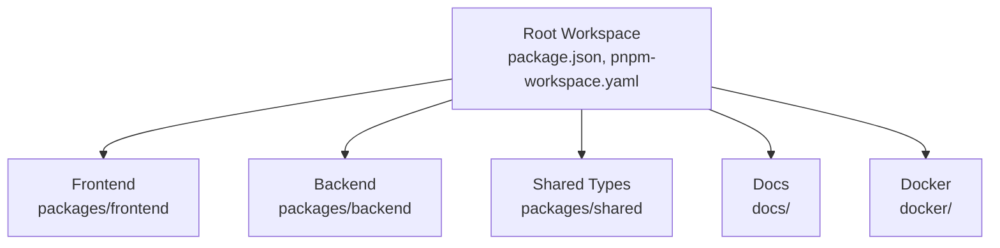
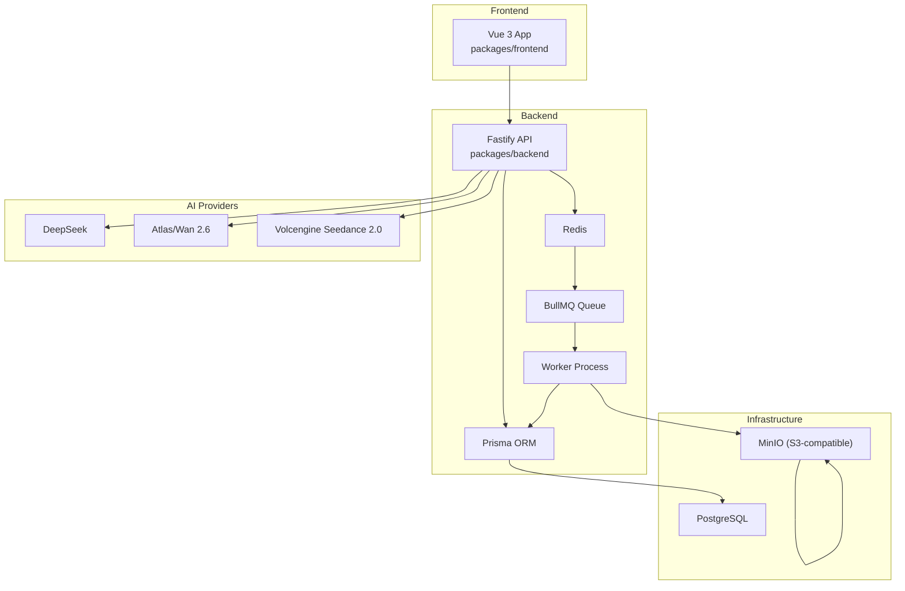
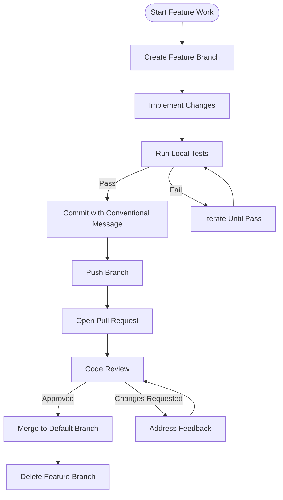
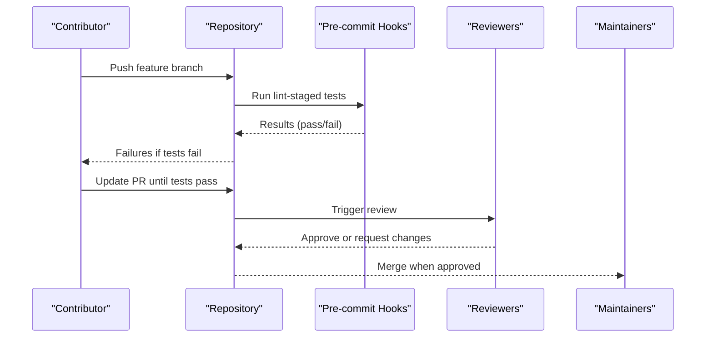
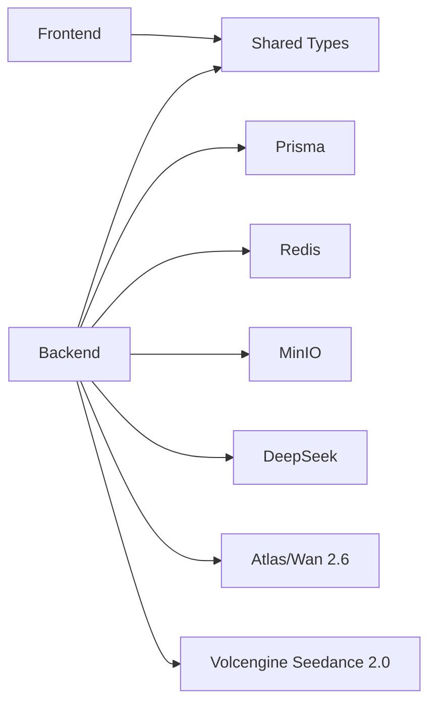

# Contribution Guidelines

<cite>
**Referenced Files in This Document**
- [README.md](file://README.md)
- [package.json](file://package.json)
- [pnpm-workspace.yaml](file://pnpm-workspace.yaml)
- [docker/docker-compose.yml](file://docker/docker-compose.yml)
- [docs/DEVELOPMENT.md](file://docs/DEVELOPMENT.md)
- [docs/CODING_STANDARDS.md](file://docs/CODING_STANDARDS.md)
- [docs/TESTING_GUIDE.md](file://docs/TESTING_GUIDE.md)
- [AGENTS.md](file://AGENTS.md)
- [docs/plans/AI短剧工作台开发计划_20260409.md](file://docs/plans/AI短剧工作台开发计划_20260409.md)
- [docs/DEEPSEEK_MIGRATION_GUIDE.md](file://docs/DEEPSEEK_MIGRATION_GUIDE.md)
- [.husky/](file://.husky/)
</cite>

## Table of Contents

1. [Introduction](#introduction)
2. [Project Structure](#project-structure)
3. [Core Components](#core-components)
4. [Architecture Overview](#architecture-overview)
5. [Detailed Component Analysis](#detailed-component-analysis)
6. [Dependency Analysis](#dependency-analysis)
7. [Performance Considerations](#performance-considerations)
8. [Troubleshooting Guide](#troubleshooting-guide)
9. [Conclusion](#conclusion)
10. [Appendices](#appendices)

## Introduction

This document defines the contribution guidelines for the Dreamer AI short-form video production platform. It consolidates community participation, code contribution processes, code review expectations, pull request requirements, issue reporting and feature requests, onboarding and mentorship, community standards, recognition, governance, and decision-making practices. The guidance is grounded in the repository’s development documentation, coding standards, testing practices, and operational rules.

## Project Structure

Dreamer is a monorepo organized under workspaces. The repository includes:

- Frontend application under packages/frontend
- Backend service under packages/backend
- Shared TypeScript types under packages/shared
- Docker Compose configuration for local infrastructure
- Extensive developer documentation under docs/

**Diagram sources**

- [package.json:1-43](file://package.json#L1-L43)
- [pnpm-workspace.yaml:1-3](file://pnpm-workspace.yaml#L1-L3)

**Section sources**

- [README.md:26-42](file://README.md#L26-L42)
- [package.json:6-8](file://package.json#L6-L8)
- [pnpm-workspace.yaml:1-3](file://pnpm-workspace.yaml#L1-L3)

## Core Components

- Coding Standards: Defines naming, structure, error handling, logging, API response shapes, dependency injection, and testing patterns.
- Development Plan: Outlines the full-stack development roadmap, API surface, and infrastructure.
- Testing Guide: Establishes testing patterns, coverage goals, and tooling.
- Agents Rules: Enforces environment loading, model call observability, database safety, task center rules, module design, and CI/CD hooks.
- Infrastructure: Docker Compose for PostgreSQL, Redis, and MinIO.

**Section sources**

- [docs/CODING_STANDARDS.md:1-338](file://docs/CODING_STANDARDS.md#L1-L338)
- [docs/DEVELOPMENT.md:1-426](file://docs/DEVELOPMENT.md#L1-L426)
- [docs/TESTING_GUIDE.md:1-307](file://docs/TESTING_GUIDE.md#L1-L307)
- [AGENTS.md:1-419](file://AGENTS.md#L1-L419)
- [docker/docker-compose.yml:1-71](file://docker/docker-compose.yml#L1-L71)

## Architecture Overview

The platform integrates Vue 3 + Fastify with Prisma, Redis/BullMQ, MinIO, and AI providers. The backend exposes REST APIs, while workers handle asynchronous tasks. The frontend consumes these APIs and orchestrates the end-to-end workflow from script to final composition.

**Diagram sources**

- [docs/DEVELOPMENT.md:17-41](file://docs/DEVELOPMENT.md#L17-L41)
- [docs/DEVELOPMENT.md:361-383](file://docs/DEVELOPMENT.md#L361-L383)
- [docker/docker-compose.yml:3-51](file://docker/docker-compose.yml#L3-L51)

## Detailed Component Analysis

### Community Participation and Onboarding

- New contributors should review the development plan and quick-start to understand the project scope and environment.
- Local setup requires Node.js, pnpm, Docker, and FFmpeg. The repository provides scripts to start backend, frontend, and worker independently.
- Environment variables must be configured before running services.

**Section sources**

- [README.md:44-95](file://README.md#L44-L95)
- [docs/DEVELOPMENT.md:269-313](file://docs/DEVELOPMENT.md#L269-L313)
- [docker/docker-compose.yml:1-71](file://docker/docker-compose.yml#L1-L71)

### Code Contribution Processes

- Branching and PR lifecycle:
  - Create feature branches from the default branch.
  - Ensure tests pass locally before opening a PR.
  - PRs must include tests and documentation updates where applicable.
- Commit hygiene:
  - Use conventional commits to improve changelog readability.
  - Do not bypass pre-commit hooks; avoid --no-verify.
- Pre-commit hooks:
  - Husky and lint-staged enforce related test runs for backend and frontend changes.

**Diagram sources**

- [docs/CODING_STANDARDS.md:302-315](file://docs/CODING_STANDARDS.md#L302-L315)
- [docs/TESTING_GUIDE.md:108-124](file://docs/TESTING_GUIDE.md#L108-L124)
- [package.json:20-37](file://package.json#L20-L37)

**Section sources**

- [docs/CODING_STANDARDS.md:302-315](file://docs/CODING_STANDARDS.md#L302-L315)
- [docs/TESTING_GUIDE.md:108-124](file://docs/TESTING_GUIDE.md#L108-L124)
- [package.json:20-37](file://package.json#L20-L37)

### Code Review Process and Approval Workflows

- Review checklist focuses on naming, single responsibility, type safety, error handling, magic values, comments, logging, async patterns, and observability.
- Model call logging and context must be present for all external AI API calls.
- Environment loading must be performed before any business imports to avoid runtime configuration issues.

**Diagram sources**

- [docs/CODING_STANDARDS.md:286-299](file://docs/CODING_STANDARDS.md#L286-L299)
- [AGENTS.md:42-46](file://AGENTS.md#L42-L46)
- [AGENTS.md:119-124](file://AGENTS.md#L119-L124)

**Section sources**

- [docs/CODING_STANDARDS.md:286-299](file://docs/CODING_STANDARDS.md#L286-L299)
- [AGENTS.md:42-46](file://AGENTS.md#L42-L46)
- [AGENTS.md:119-124](file://AGENTS.md#L119-L124)

### Pull Request Requirements

- Tests must pass for backend and frontend changes.
- Coverage targets are defined in the testing guide.
- PRs must include:
  - Updated tests
  - Documentation updates
  - Conventional commit messages
- Avoid bypassing hooks; do not use --no-verify.

**Section sources**

- [docs/TESTING_GUIDE.md:194-212](file://docs/TESTING_GUIDE.md#L194-L212)
- [docs/TESTING_GUIDE.md:230-237](file://docs/TESTING_GUIDE.md#L230-L237)
- [docs/CODING_STANDARDS.md:302-315](file://docs/CODING_STANDARDS.md#L302-L315)

### Issue Reporting, Bug Tracking, and Feature Requests

- Use GitHub Issues to report bugs and propose features.
- Provide clear reproduction steps, expected vs. actual behavior, environment details, and logs.
- For model call issues, include model call logs and context identifiers (userId/op/projectId).
- For database schema changes, follow migration guidance and avoid destructive operations.

**Section sources**

- [AGENTS.md:42-46](file://AGENTS.md#L42-L46)
- [AGENTS.md:70-77](file://AGENTS.md#L70-L77)

### Onboarding, Mentorship, and Knowledge Transfer

- New contributors should:
  - Review the development plan and coding standards.
  - Start with small, focused tasks aligned with the roadmap.
  - Engage with maintainers for guidance on module boundaries and design patterns.
- Knowledge transfer practices:
  - Follow module design principles: single responsibility, abstraction, and testability.
  - Use shared types and consistent naming conventions.

**Section sources**

- [docs/DEVELOPMENT.md:102-134](file://docs/DEVELOPMENT.md#L102-L134)
- [docs/CODING_STANDARDS.md:44-84](file://docs/CODING_STANDARDS.md#L44-L84)
- [docs/DEVELOPMENT.md:192-208](file://docs/DEVELOPMENT.md#L192-L208)

### Community Standards, Communication, and Collaboration

- Respectful and inclusive communication is expected in all interactions.
- Use clear, actionable language in discussions and reviews.
- Prefer asynchronous communication for non-urgent matters; schedule synchronous sessions when needed.

[No sources needed since this section provides general guidance]

### Recognition, Acknowledgments, and Long-Term Contributor Pathways

- Contributors are acknowledged in release notes and contributor lists.
- Long-term contributors may be invited to become maintainers with increased responsibilities for code quality, triage, and roadmap alignment.

[No sources needed since this section provides general guidance]

### Governance Model, Decision-Making, and Conflict Resolution

- Decisions follow a consensus-driven approach with maintainers having final authority on technical direction.
- Major changes require documentation updates and approval from reviewers.
- Conflicts are resolved through discussion and mediation by maintainers.

[No sources needed since this section provides general guidance]

## Dependency Analysis

The project relies on a clear separation of concerns across frontend, backend, and shared modules, with strict environment and testing rules enforced by tooling.

**Diagram sources**

- [docs/DEVELOPMENT.md:17-41](file://docs/DEVELOPMENT.md#L17-L41)
- [docs/DEVELOPMENT.md:361-383](file://docs/DEVELOPMENT.md#L361-L383)

**Section sources**

- [docs/DEVELOPMENT.md:17-41](file://docs/DEVELOPMENT.md#L17-L41)
- [docs/DEVELOPMENT.md:361-383](file://docs/DEVELOPMENT.md#L361-L383)

## Performance Considerations

- Favor batch operations and parallelization where possible to reduce latency.
- Use caching and efficient queries to minimize database load.
- Monitor model call costs and optimize prompts to reduce token usage.

[No sources needed since this section provides general guidance]

## Troubleshooting Guide

Common issues and resolutions:

- Environment loading order: Ensure bootstrap-env is imported before any business modules.
- Database resets: Avoid destructive resets; use incremental schema updates.
- Port conflicts: Kill processes occupying ports before restarting services.
- Test failures: Verify pre-commit hooks and related test runs.

**Section sources**

- [AGENTS.md:5-17](file://AGENTS.md#L5-L17)
- [AGENTS.md:70-77](file://AGENTS.md#L70-L77)
- [AGENTS.md:406-419](file://AGENTS.md#L406-L419)
- [docs/TESTING_GUIDE.md:108-124](file://docs/TESTING_GUIDE.md#L108-L124)

## Conclusion

These contribution guidelines consolidate the repository’s established practices for development, testing, and collaboration. By following the documented processes, contributors can efficiently deliver high-quality changes while maintaining system stability and clarity.

[No sources needed since this section summarizes without analyzing specific files]

## Appendices

### Appendix A: Quick Reference

- Local setup: Install dependencies, configure environment variables, start Docker services, initialize database, and launch dev servers.
- Testing: Run backend and frontend tests; ensure coverage meets targets.
- PR requirements: Pass tests, include documentation updates, use conventional commits, and avoid bypassing hooks.

**Section sources**

- [README.md:44-95](file://README.md#L44-L95)
- [docs/TESTING_GUIDE.md:14-28](file://docs/TESTING_GUIDE.md#L14-L28)
- [docs/CODING_STANDARDS.md:302-315](file://docs/CODING_STANDARDS.md#L302-L315)
