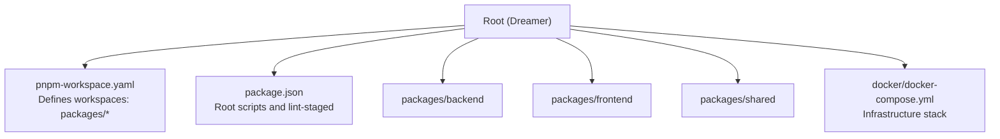
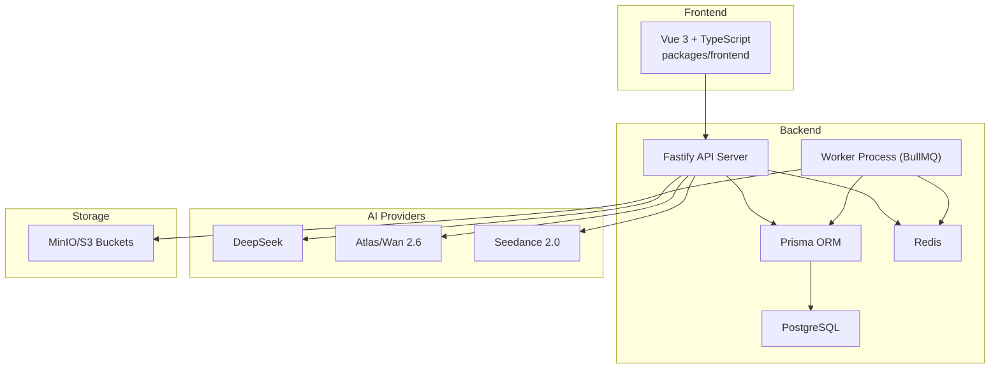
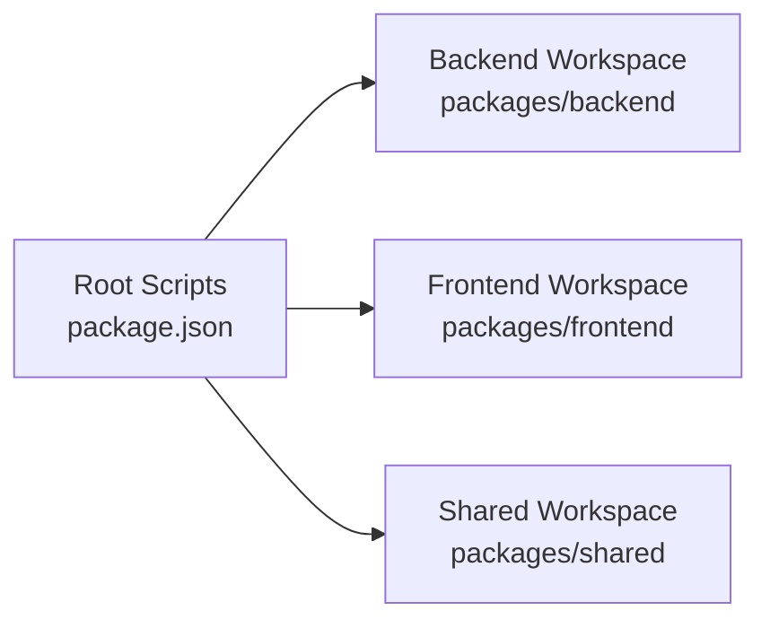

# Development Guidelines

<cite>
**Referenced Files in This Document**
- [CODING_STANDARDS.md](file://docs/CODING_STANDARDS.md)
- [DEVELOPMENT.md](file://docs/DEVELOPMENT.md)
- [TESTING_GUIDE.md](file://docs/TESTING_GUIDE.md)
- [AGENTS.md](file://AGENTS.md)
- [package.json](file://package.json)
- [pnpm-workspace.yaml](file://pnpm-workspace.yaml)
- [knip.json](file://knip.json)
- [docker-compose.yml](file://docker/docker-compose.yml)
</cite>

## Table of Contents

1. [Introduction](#introduction)
2. [Project Structure](#project-structure)
3. [Core Components](#core-components)
4. [Architecture Overview](#architecture-overview)
5. [Detailed Component Analysis](#detailed-component-analysis)
6. [Dependency Analysis](#dependency-analysis)
7. [Performance Considerations](#performance-considerations)
8. [Troubleshooting Guide](#troubleshooting-guide)
9. [Conclusion](#conclusion)
10. [Appendices](#appendices)

## Introduction

This document consolidates development guidelines for the Dreamer monorepo, focusing on TypeScript coding standards, naming conventions, code organization, testing strategies, development workflow, quality gates via Husky and lint-staged, and debugging techniques. It complements the existing authoritative documents and ensures consistent practices across the backend, frontend, and shared packages.

## Project Structure

The repository is a monorepo managed by pnpm workspaces. The backend, frontend, and shared packages are organized under packages/, with development tooling and orchestration configured at the root.

**Diagram sources**

- [pnpm-workspace.yaml:1-3](file://pnpm-workspace.yaml#L1-L3)
- [package.json:6-22](file://package.json#L6-L22)
- [docker-compose.yml:1-71](file://docker/docker-compose.yml#L1-L71)

**Section sources**

- [pnpm-workspace.yaml:1-3](file://pnpm-workspace.yaml#L1-L3)
- [package.json:6-22](file://package.json#L6-L22)
- [docker-compose.yml:1-71](file://docker/docker-compose.yml#L1-L71)

## Core Components

- TypeScript coding standards and naming conventions: See [docs/CODING_STANDARDS.md](file://docs/CODING_STANDARDS.md).
- Backend architecture and module layout: See [docs/DEVELOPMENT.md](file://docs/DEVELOPMENT.md).
- Testing strategies and Vitest patterns: See [docs/TESTING_GUIDE.md](file://docs/TESTING_GUIDE.md).
- Environment variable loading and model observability: See [AGENTS.md](file://AGENTS.md).
- Quality gates via Husky and lint-staged: See [package.json](file://package.json) and [knip.json](file://knip.json).

Key cross-cutting topics:

- Environment bootstrapping and ESM pitfalls: [AGENTS.md](file://AGENTS.md)
- Model API call logging and auditability: [AGENTS.md](file://AGENTS.md)
- Backend module structure and responsibilities: [docs/DEVELOPMENT.md](file://docs/DEVELOPMENT.md)
- Frontend state and polling conventions: [docs/CODING_STANDARDS.md](file://docs/CODING_STANDARDS.md)
- Prisma usage and migration guidance: [AGENTS.md](file://AGENTS.md)

**Section sources**

- [docs/CODING_STANDARDS.md:30-338](file://docs/CODING_STANDARDS.md#L30-L338)
- [docs/DEVELOPMENT.md:17-426](file://docs/DEVELOPMENT.md#L17-L426)
- [TESTING_GUIDE.md:1-307](file://docs/TESTING_GUIDE.md#L1-L307)
- [AGENTS.md:1-419](file://AGENTS.md#L1-L419)

## Architecture Overview

The system follows a Fastify-based backend, Vue 3 + TypeScript frontend, shared types, and infrastructure orchestrated via Docker Compose. The backend uses Prisma for persistence, Redis/BullMQ for async tasks, and integrates AI providers (DeepSeek, Atlas/Wan 2.6, Seedance).

**Diagram sources**

- [docs/DEVELOPMENT.md:28-41](file://docs/DEVELOPMENT.md#L28-L41)
- [docker/docker-compose.yml:3-51](file://docker/docker-compose.yml#L3-L51)

**Section sources**

- [docs/DEVELOPMENT.md:28-41](file://docs/DEVELOPMENT.md#L28-L41)
- [docker/docker-compose.yml:3-51](file://docker/docker-compose.yml#L3-L51)

## Detailed Component Analysis

### TypeScript Coding Standards and Naming Conventions

- Goals: modular, single-responsibility, testable, self-documenting code.
- Layered structure: routes → handlers (optional) → services → repositories → Prisma.
- Naming:
  - Functions: verb + noun (get/fetch/find/generate/generatePrompt/call/create/update/delete/handle/validate/build).
  - Types: Service/Client/Repository/Controller/Handler/Input/Response/Dto.
  - Files: kebab-case preferred; avoid renaming historical files unnecessarily.
  - Database fields: camelCase; booleans with is*, timestamps with *At; foreign keys with \*Id.
- Types:
  - Avoid any; prefer unknown + guards or Zod.
  - Cross-boundary types in packages/shared; backend internal DTOs near modules or under src/types.
  - Align Fastify JSON schema with TypeScript types.
- Functions:
  - Single responsibility; ~50-line soft limit; consolidate >3 params into an object.
- Error handling:
  - No swallowing; log with context (operation, parameters, userId/projectId); distinguish retryable vs non-retryable errors.
- Async:
  - Prefer async/await; use Promise.all for independent IO; Promise.allSettled when handling failures separately.
- Logging:
  - Use fastify/request log (Pino); child loggers with reqId/userId; avoid printing secrets; follow model API terminal conventions.
- API response:
  - New APIs or major refactors: envelope { success, data, message }; existing APIs: keep current shape; still use correct HTTP status codes.
- DI and testing:
  - Assemble dependencies in index.ts/container.ts; inject via decorate or closures; test with Vitest; mock injected dependencies.
- Frontend:
  - views/stores/composables/api; share types from packages/shared; unify AI task states as idle/loading/success/error; centralize polling logic.

**Section sources**

- [docs/CODING_STANDARDS.md:30-338](file://docs/CODING_STANDARDS.md#L30-L338)

### Backend Module Layout and Responsibilities

- routes: route registration and auth; thin business logic.
- handlers (optional): request parsing, invoking services, unified error mapping.
- services: core business; may call repositories and external services.
- services/ai: centralized AI model calls, prompts, and model-api-call logging.
- repositories: Prisma wrappers; no cross-aggregate business rules.
- lib: pure functions, no side effects.
- Data flow: routes → services → repositories → Prisma; avoid reverse dependencies.

**Section sources**

- [docs/CODING_STANDARDS.md:44-85](file://docs/CODING_STANDARDS.md#L44-L85)

### Testing Strategies

- Coverage goal: >90%.
- Framework: Vitest; backend tests under packages/backend/tests/.
- Patterns:
  - Pure functions: fastest ROI; no mocking.
  - Private methods: access via type casting for comprehensive coverage.
  - Repository mocking: isolate service logic.
  - Module mocking with vi.mock: prevent DB/API/expensive calls.
  - Console suppression: clean test output for intentional noisy logs.
- Best practices:
  - Test pure functions first; descriptive names; mock boundaries; test edge cases; keep tests fast; clear mocks; avoid testing implementation details; avoid --no-verify; avoid mocking everything; fix TS errors properly.
- File organization: <module>.test.ts or <module>-<feature>.test.ts.
- Coverage targets:
  - Pure utilities: 95%+
  - Service methods: 85%+
  - Route handlers: 80%+
  - Complex integrations: 70%+

**Section sources**

- [TESTING_GUIDE.md:1-307](file://docs/TESTING_GUIDE.md#L1-L307)

### Development Workflow and Branching

- Commit conventions: Conventional Commits (feat/fix/refactor/docs/style/test/chore).
- Pre-commit validation:
  - Husky runs lint-staged.
  - lint-staged executes Vitest related tests for changed backend/frontend files.
  - Submission requires passing pre-commit checks; do not use --no-verify.
- Local development:
  - Root scripts orchestrate backend, worker, and frontend.
  - Docker Compose provisions Postgres, Redis, MinIO.
  - Prisma migrations: use db:migrate:deploy; avoid --force-reset; treat migrations as the single source of truth.
- Task center and job types:
  - Must display video/import/pipeline/image jobs; keep AGENTS.md synchronized with backend/frontend lists.

**Section sources**

- [package.json:9-22](file://package.json#L9-L22)
- [package.json:30-37](file://package.json#L30-L37)
- [AGENTS.md:142-171](file://AGENTS.md#L142-L171)
- [AGENTS.md:172-191](file://AGENTS.md#L172-L191)
- [AGENTS.md:385-404](file://AGENTS.md#L385-L404)

### Quality Assurance and Tooling

- Husky preparation: prepare script initializes hooks.
- lint-staged:
  - Backend: run vitest related tests on staged ts/js files.
  - Frontend: run frontend tests on staged ts/vue files.
- Knip:
  - Unused export detection; treatConfigHintsAsErrors disabled to reduce noise.

**Section sources**

- [package.json:22](file://package.json#L22)
- [package.json:30-37](file://package.json#L30-L37)
- [knip.json:1-6](file://knip.json#L1-L6)

### Debugging Techniques

- Environment bootstrapping:
  - ESM requires importing bootstrap-env first in index.ts and worker.ts; otherwise dotenv loads too late and env vars are undefined.
- Model API observability:
  - Record model calls and include ModelCallLogContext (userId/op/projectId) for auditability.
- Database:
  - Use db:migrate:deploy to align schema; avoid destructive resets; migrations live under packages/backend/prisma/migrations/.
- Port conflicts:
  - Resolve port 4000 (API) if busy.

**Section sources**

- [AGENTS.md:5-41](file://AGENTS.md#L5-L41)
- [AGENTS.md:42-46](file://AGENTS.md#L42-L46)
- [AGENTS.md:385-404](file://AGENTS.md#L385-L404)
- [AGENTS.md:414-419](file://AGENTS.md#L414-L419)

## Dependency Analysis

The monorepo’s dependency surface centers around pnpm workspaces and root scripts orchestrating backend, frontend, and shared builds. Backend tests and frontend tests are executed independently but coordinated at the root level.

**Diagram sources**

- [package.json:6-22](file://package.json#L6-L22)
- [pnpm-workspace.yaml:1-3](file://pnpm-workspace.yaml#L1-L3)

**Section sources**

- [package.json:6-22](file://package.json#L6-L22)
- [pnpm-workspace.yaml:1-3](file://pnpm-workspace.yaml#L1-L3)

## Performance Considerations

- Favor Promise.all for independent IO; use Promise.allSettled when failures must be handled individually.
- Prisma best practices:
  - Use select to limit fields; prefer batch operations (createMany/updateMany/deleteMany).
  - Use transactions for multi-table writes.
  - Avoid N+1 queries; replace loops with Promise.all or batch queries.
  - Omit sensitive fields in selects; map to DTOs to prevent accidental leakage.
- Logging:
  - Use structured logs with Pino; include minimal context for model calls to enable cost analysis and troubleshooting.

**Section sources**

- [docs/CODING_STANDARDS.md:185-189](file://docs/CODING_STANDARDS.md#L185-L189)
- [docs/CODING_STANDARDS.md:318-325](file://docs/CODING_STANDARDS.md#L318-L325)
- [docs/CODING_STANDARDS.md:222-248](file://docs/CODING_STANDARDS.md#L222-L248)

## Troubleshooting Guide

- Environment variables not loaded:
  - Ensure bootstrap-env is imported as the first statement in index.ts and worker.ts; otherwise dotenv loads after imports and env is undefined.
- DATABASE_URL not found:
  - Verify the import order and .env presence; confirm DATABASE_URL is set.
- Port conflicts (EADDRINUSE):
  - Kill process occupying port 4000 (API server).
- Prisma migrations:
  - Use db:migrate:deploy; avoid --force-reset; keep migrations under version control.
- Model API observability:
  - Ensure recordModelApiCall is invoked and ModelCallLogContext is passed; verify logs include op, model, and cost metrics.

**Section sources**

- [AGENTS.md:5-41](file://AGENTS.md#L5-L41)
- [AGENTS.md:406-419](file://AGENTS.md#L406-L419)
- [AGENTS.md:385-404](file://AGENTS.md#L385-L404)
- [AGENTS.md:42-46](file://AGENTS.md#L42-L46)

## Conclusion

These guidelines formalize the project’s TypeScript standards, testing practices, and development workflow. By adhering to layered architecture, naming conventions, DI/testing patterns, and pre-commit quality gates, contributors can maintain a robust, observable, and scalable monorepo. Refer to the cited documents for authoritative updates and exceptions.

## Appendices

### Appendix A: API Routes Overview

- Authentication, Projects, Episodes, Characters, Scenes, Tasks, Compositions, Stats, ImportTasks are documented with HTTP methods and paths.

**Section sources**

- [docs/DEVELOPMENT.md:137-222](file://docs/DEVELOPMENT.md#L137-L222)

### Appendix B: Environment Variables Reference

- Database, Redis, S3/MiNIO, JWT, AI provider keys, CORS origin, FFmpeg path.

**Section sources**

- [docs/DEVELOPMENT.md:225-265](file://docs/DEVELOPMENT.md#L225-L265)
