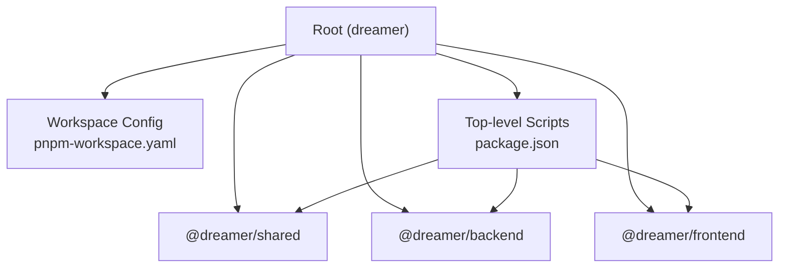
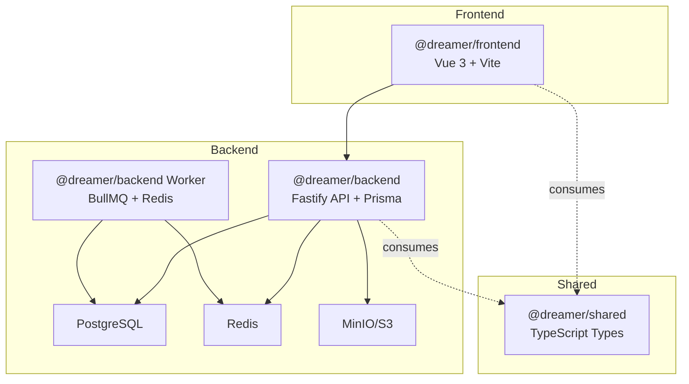
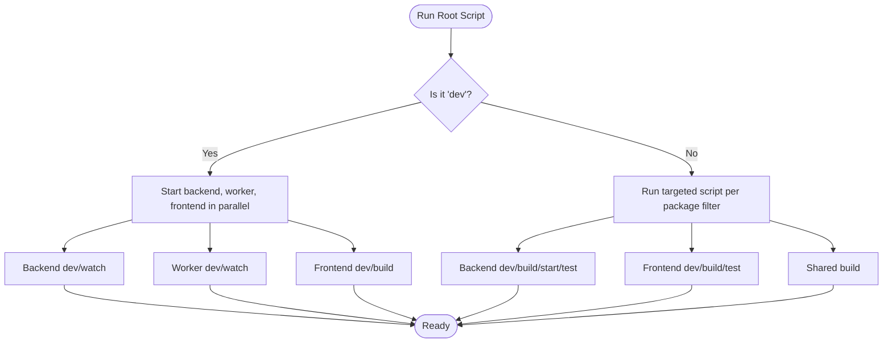
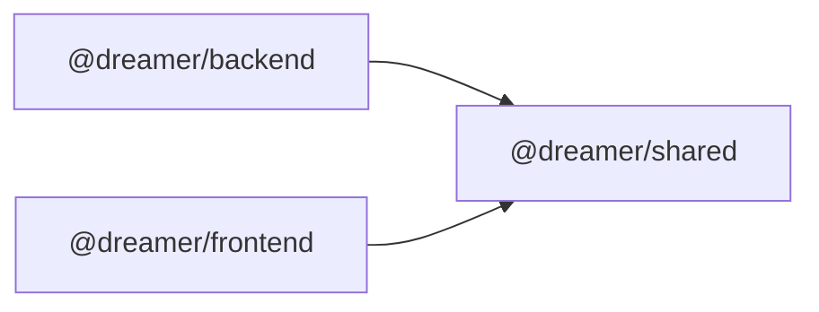

# Development Workflow

<cite>
**Referenced Files in This Document**
- [package.json](file://package.json)
- [pnpm-workspace.yaml](file://pnpm-workspace.yaml)
- [knip.json](file://knip.json)
- [README.md](file://README.md)
- [docs/DEVELOPMENT.md](file://docs/DEVELOPMENT.md)
- [docker/docker-compose.yml](file://docker/docker-compose.yml)
- [packages/backend/package.json](file://packages/backend/package.json)
- [packages/frontend/package.json](file://packages/frontend/package.json)
- [packages/shared/package.json](file://packages/shared/package.json)
</cite>

## Table of Contents

1. [Introduction](#introduction)
2. [Project Structure](#project-structure)
3. [Core Components](#core-components)
4. [Architecture Overview](#architecture-overview)
5. [Detailed Component Analysis](#detailed-component-analysis)
6. [Dependency Analysis](#dependency-analysis)
7. [Performance Considerations](#performance-considerations)
8. [Troubleshooting Guide](#troubleshooting-guide)
9. [Conclusion](#conclusion)
10. [Appendices](#appendices)

## Introduction

This document describes the complete development lifecycle for the monorepo, including monorepo setup with PNPM workspaces, dependency management, build processes, Git workflow, Husky hooks, CI/CD considerations, local environment setup, debugging, troubleshooting, and release management practices. It consolidates the repository’s configuration and documentation to guide contributors through reliable, repeatable workflows.

## Project Structure

The repository is a PNPM-managed monorepo organized under packages/, with three primary workspaces:

- packages/backend: Node.js/Fastify API server, Prisma ORM, BullMQ worker, and tests
- packages/frontend: Vue 3/Vite frontend application
- packages/shared: Shared TypeScript types and utilities published via exports

PNPM workspace configuration and top-level scripts orchestrate development, building, database operations, Docker orchestration, and testing across packages.

**Diagram sources**

- [pnpm-workspace.yaml:1-3](file://pnpm-workspace.yaml#L1-L3)
- [package.json:6-23](file://package.json#L6-L23)
- [packages/shared/package.json:1-26](file://packages/shared/package.json#L1-L26)
- [packages/backend/package.json:1-51](file://packages/backend/package.json#L1-L51)
- [packages/frontend/package.json:1-41](file://packages/frontend/package.json#L1-L41)

**Section sources**

- [pnpm-workspace.yaml:1-3](file://pnpm-workspace.yaml#L1-L3)
- [package.json:6-23](file://package.json#L6-L23)
- [README.md:26-42](file://README.md#L26-L42)
- [docs/DEVELOPMENT.md:42-53](file://docs/DEVELOPMENT.md#L42-L53)

## Core Components

- Monorepo orchestration via PNPM workspaces and root scripts
- Backend service with Fastify, Prisma, BullMQ, and Vitest-based tests
- Frontend application built with Vite and Vue 3
- Shared package exporting TypeScript types consumed by backend and frontend
- Docker Compose stack for PostgreSQL, Redis, and MinIO
- Pre-commit quality gates via Husky and lint-staged

Key capabilities:

- Parallel development across backend, frontend, and shared packages
- Database schema generation and migrations
- Worker-based asynchronous video generation tasks
- Local environment bootstrapping with Docker and environment variables
- Automated pre-commit checks for related tests

**Section sources**

- [package.json:9-23](file://package.json#L9-L23)
- [packages/backend/package.json:6-21](file://packages/backend/package.json#L6-L21)
- [packages/frontend/package.json:6-13](file://packages/frontend/package.json#L6-L13)
- [packages/shared/package.json:8-17](file://packages/shared/package.json#L8-L17)
- [docker/docker-compose.yml:1-71](file://docker/docker-compose.yml#L1-L71)
- [README.md:44-95](file://README.md#L44-L95)

## Architecture Overview

The development architecture integrates a frontend SPA, a backend API server, a shared type library, and supporting infrastructure orchestrated by Docker. The backend exposes REST APIs, manages tasks via BullMQ/Redis, persists data with Prisma/PostgreSQL, and stores media assets in MinIO.

**Diagram sources**

- [docs/DEVELOPMENT.md:361-384](file://docs/DEVELOPMENT.md#L361-L384)
- [docker/docker-compose.yml:3-51](file://docker/docker-compose.yml#L3-L51)
- [packages/backend/package.json:22-38](file://packages/backend/package.json#L22-L38)
- [packages/frontend/package.json:14-29](file://packages/frontend/package.json#L14-L29)
- [packages/shared/package.json:8-17](file://packages/shared/package.json#L8-L17)

## Detailed Component Analysis

### Monorepo Setup and Build Processes

- Workspace definition: packages/\*/ is included via pnpm-workspace.yaml
- Root scripts:
  - dev: starts backend, worker, and frontend in parallel
  - dev:backend/dev:frontend/dev:worker: targeted development
  - build: orchestrates building shared, backend, and frontend
  - db:generate/db:push: Prisma-related database operations
  - docker:up/docker:down: Docker Compose lifecycle
  - start: runs the production backend
  - test: executes backend Vitest and frontend tests
  - prepare: installs Husky hooks
  - knip: runs unused dependency detection

Build and startup flow:

- Backend generates Prisma client, compiles TypeScript, and starts either the API server or worker
- Frontend compiles with vue-tsc and vite build
- Shared package compiles TypeScript exports for consumption

**Diagram sources**

- [package.json:10-23](file://package.json#L10-L23)
- [packages/backend/package.json:7-11](file://packages/backend/package.json#L7-L11)
- [packages/frontend/package.json:7-12](file://packages/frontend/package.json#L7-L12)
- [packages/shared/package.json:18-21](file://packages/shared/package.json#L18-L21)

**Section sources**

- [pnpm-workspace.yaml:1-3](file://pnpm-workspace.yaml#L1-L3)
- [package.json:9-23](file://package.json#L9-L23)
- [packages/backend/package.json:6-21](file://packages/backend/package.json#L6-L21)
- [packages/frontend/package.json:6-13](file://packages/frontend/package.json#L6-L13)
- [packages/shared/package.json:18-21](file://packages/shared/package.json#L18-L21)

### Database and Prisma Operations

- Backend package defines Prisma commands:
  - db:generate: regenerate Prisma client
  - db:push: push schema to database
  - db:migrate: create/edit migrations
  - db:migrate:deploy: deploy migrations in environments
  - db:migrate:squash-drift-rows: helper to clean migration rows
  - postinstall: generate Prisma client after install
- Root scripts expose db:generate and db:push for convenience

Operational guidance:

- Use db:push during local development to sync schema quickly
- Use db:migrate for structured schema evolution
- Use db:migrate:deploy for production-like environments

**Section sources**

- [packages/backend/package.json:12-18](file://packages/backend/package.json#L12-L18)
- [package.json:15-16](file://package.json#L15-L16)

### Docker Infrastructure

Docker Compose provisions:

- PostgreSQL 16 with health checks and persistent volumes
- Redis 7 with health checks and persistence
- MinIO with console and automatic bucket creation for videos and assets

Lifecycle:

- docker:up brings up all services
- docker:down tears them down
- Services expose predictable ports for local development

**Section sources**

- [docker/docker-compose.yml:1-71](file://docker/docker-compose.yml#L1-L71)
- [README.md:68-95](file://README.md#L68-L95)

### Testing and Coverage

- Backend: Vitest-based unit/integration tests
- Frontend: Vitest-based tests
- Coverage: backend supports coverage via dedicated script
- Root test script runs backend tests first, then frontend tests

Pre-commit integration:

- lint-staged configured to run related tests for staged files in backend and frontend

**Section sources**

- [packages/backend/package.json:19-20](file://packages/backend/package.json#L19-L20)
- [packages/frontend/package.json:11](file://packages/frontend/package.json#L11)
- [package.json:30-37](file://package.json#L30-L37)

### Git Workflow and Branching

Recommended branching model:

- main: protected, stable releases
- develop: integration branch for features
- feature/<issue>: feature branches prefixed with feature/
- hotfix/<issue>: hotfixes prefixed with hotfix/
- release/<semver>: release preparation branches

Commit message convention:

- feat(scope): introduce new capability
- fix(scope): address bug
- refactor(scope): internal changes without behavior change
- docs(scope): documentation updates
- chore(scope): maintenance tasks
- test(scope): testing improvements
- perf(scope): performance enhancements

Pull Request procedure:

- Open PR against develop or main depending on release cycle
- Ensure all checks pass (tests, lint-staged)
- Request review from maintainers
- Merge via squash or rebase to keep history linear

[No sources needed since this section provides general guidance]

### Husky Hooks and Pre-commit Validation

- prepare script installs Husky hooks automatically
- lint-staged runs package-specific tests on staged files:
  - Backend: related tests for TS/JS under packages/backend/\*\*
  - Frontend: related tests for TS/Vue under packages/frontend/\*\*
- Knip unused dependency detection configured via knip.json

Quality gates:

- Pre-commit validates staged changes by running related tests
- Unused dependencies flagged by knip to keep lockfiles minimal

**Section sources**

- [package.json:22](file://package.json#L22)
- [package.json:30-37](file://package.json#L30-L37)
- [knip.json:1-6](file://knip.json#L1-L6)

### CI/CD Pipeline Guidance

Conceptual pipeline stages:

- Install dependencies using PNPM
- Run lint-staged on changed files
- Execute backend and frontend tests
- Build shared, backend, and frontend artifacts
- Optional: run knip to detect unused dependencies
- Optional: run database migrations in staging/production steps

Artifacts and deployment:

- Backend: build TypeScript, start via Node with environment bootstrap
- Frontend: build static assets for hosting
- Shared: compile exports for distribution

[No sources needed since this section provides general guidance]

### Local Development Environment Setup

Prerequisites:

- Node.js >= 18
- pnpm >= 8
- Docker (for infrastructure)
- FFmpeg (for video synthesis)

Setup steps:

- Install dependencies at root
- Copy and configure .env with required keys
- Bring up infrastructure with docker:up
- Initialize database with db:push
- Start services:
  - pnpm dev for full stack
  - pnpm dev:backend for API only
  - pnpm dev:worker for background tasks
  - pnpm dev:frontend for UI only

Access:

- Frontend: http://localhost:3000
- Backend API: http://localhost:4000
- API documentation: http://localhost:4000/docs
- MinIO console: http://localhost:9001

**Section sources**

- [README.md:46-95](file://README.md#L46-L95)
- [docs/DEVELOPMENT.md:269-314](file://docs/DEVELOPMENT.md#L269-L314)

### Debugging Techniques

- Backend:
  - Use tsx watch for development reloads
  - Enable Prisma Studio for local inspection
  - Inspect Redis queues and job progress
- Frontend:
  - Use Vite dev server with type checking
  - Run tests in watch mode for rapid feedback
- Shared:
  - Compile types and verify exports

**Section sources**

- [packages/backend/package.json:7-16](file://packages/backend/package.json#L7-L16)
- [packages/frontend/package.json:7-12](file://packages/frontend/package.json#L7-L12)
- [packages/shared/package.json:18-21](file://packages/shared/package.json#L18-L21)

### Release Management and Versioning

Versioning strategy:

- Semantic versioning (MAJOR.MINOR.PATCH)
- Maintain version in root and packages consistently
- Tag releases on main after QA approval

Backward compatibility:

- Avoid breaking changes in shared types when possible
- Provide migration steps for Prisma schema changes
- Keep API routes stable; deprecate with clear notices

Release checklist:

- Update version in root and packages
- Verify builds for shared, backend, and frontend
- Run full test suite
- Confirm database migrations are ready
- Publish artifacts and update deployment manifests

[No sources needed since this section provides general guidance]

## Dependency Analysis

The monorepo enforces workspace-local dependencies and external libraries:

- Backend depends on shared, Fastify ecosystem, Prisma client, BullMQ, Redis, AWS SDK, Zod, and Vitest
- Frontend depends on shared, Vue 3 ecosystem, Naive UI, Pinia, Vue Router, Tiptap, and Vitest
- Shared exports TypeScript types for cross-consumption

**Diagram sources**

- [packages/backend/package.json:22-38](file://packages/backend/package.json#L22-L38)
- [packages/frontend/package.json:14-29](file://packages/frontend/package.json#L14-L29)
- [packages/shared/package.json:8-17](file://packages/shared/package.json#L8-L17)

**Section sources**

- [packages/backend/package.json:22-49](file://packages/backend/package.json#L22-L49)
- [packages/frontend/package.json:14-39](file://packages/frontend/package.json#L14-L39)
- [packages/shared/package.json:8-17](file://packages/shared/package.json#L8-L17)

## Performance Considerations

- Use pnpm workspace hoisting to minimize duplication and speed up installs
- Prefer incremental builds and watch modes during development
- Limit concurrent Vitest workers to avoid memory pressure
- Use Docker Compose volumes for persistent caches and databases
- Monitor Redis memory and queue backlogs in development

[No sources needed since this section provides general guidance]

## Troubleshooting Guide

Common issues and resolutions:

- Port conflicts:
  - Adjust ports in Docker Compose or stop conflicting services
- Database drift:
  - Use db:migrate to create and apply migrations; db:push for quick local resets
- Missing environment variables:
  - Copy .env.example to .env and fill required keys
- Husky hooks not firing:
  - Ensure prepare installed hooks and Node permissions allow execution
- Knip warnings:
  - Remove unused dependencies and rerun knip to confirm cleanup

**Section sources**

- [docker/docker-compose.yml:11-19](file://docker/docker-compose.yml#L11-L19)
- [README.md:61-66](file://README.md#L61-L66)
- [package.json:22](file://package.json#L22)
- [knip.json:1-6](file://knip.json#L1-L6)

## Conclusion

This development workflow leverages PNPM workspaces, Docker infrastructure, Husky pre-commit checks, and structured testing to deliver a robust, scalable monorepo. By following the documented scripts, branching model, and quality gates, contributors can reliably develop, test, and ship features while maintaining backward compatibility and operational stability.

## Appendices

- API surface and routes are documented in the development guide
- Environment variables and secrets are configured via .env
- Task center and worker architecture are described for async processing

**Section sources**

- [docs/DEVELOPMENT.md:137-222](file://docs/DEVELOPMENT.md#L137-L222)
- [docs/DEVELOPMENT.md:225-265](file://docs/DEVELOPMENT.md#L225-L265)
- [docs/DEVELOPMENT.md:347-384](file://docs/DEVELOPMENT.md#L347-L384)
