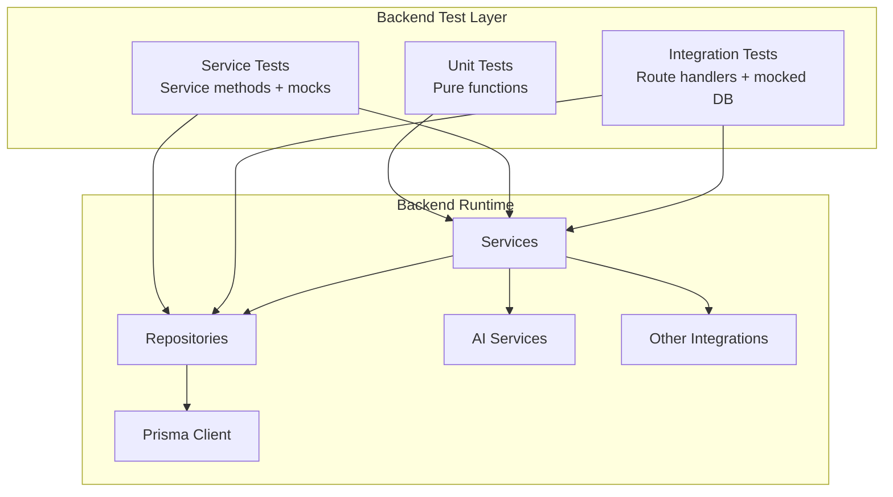
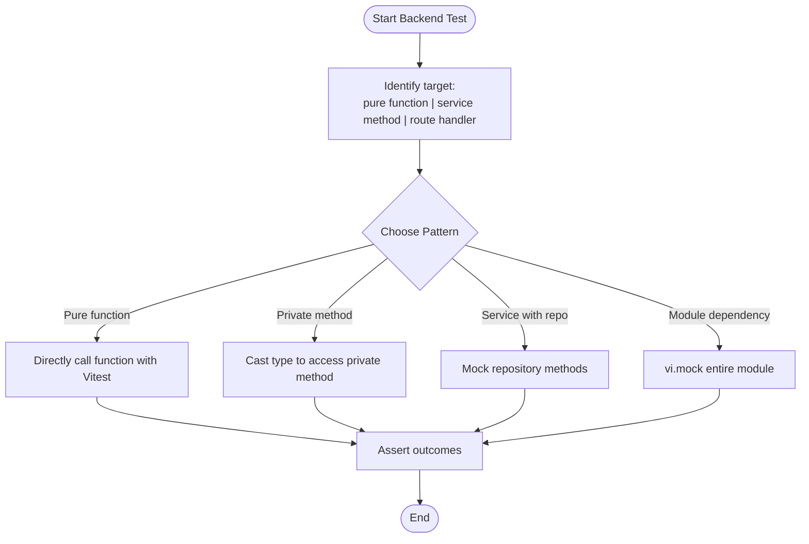
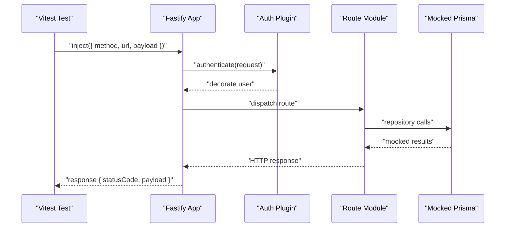
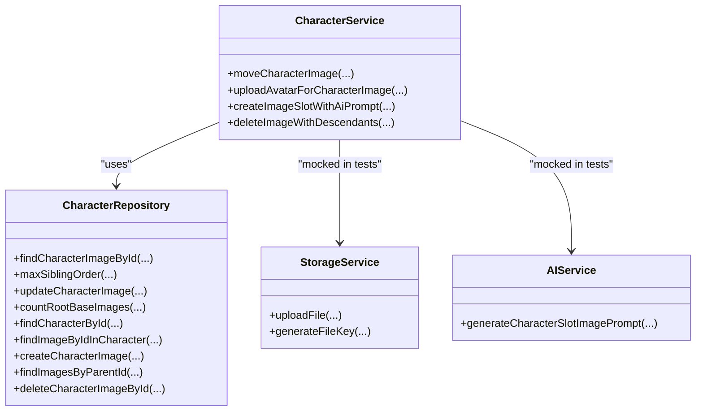
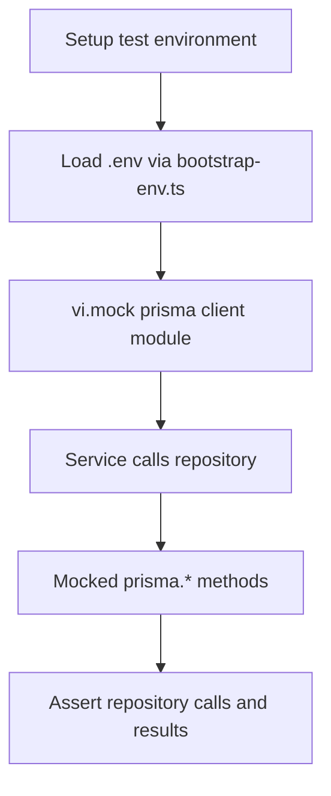
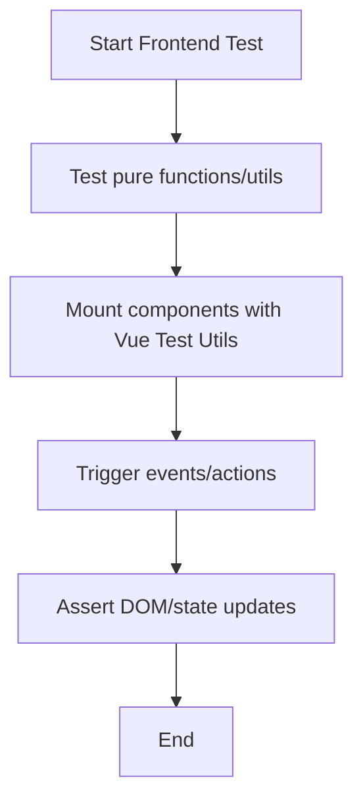
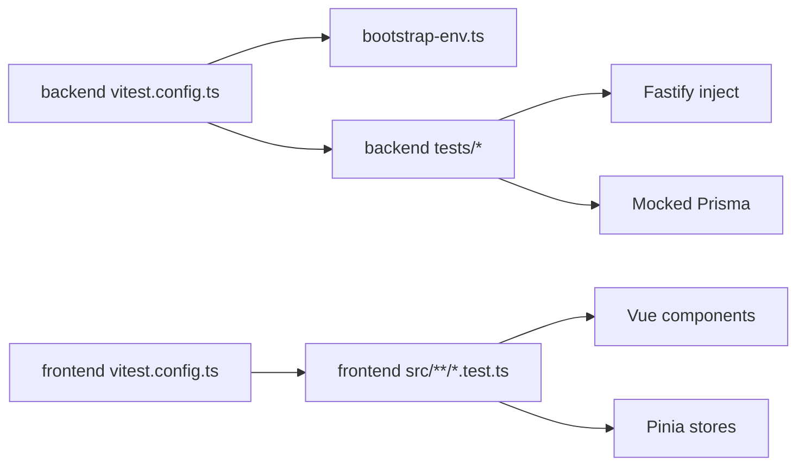

# Testing Strategy

<cite>
**Referenced Files in This Document**
- [TESTING_GUIDE.md](file://docs/TESTING_GUIDE.md)
- [vitest.config.ts](file://packages/backend/vitest.config.ts)
- [vitest.config.ts](file://packages/frontend/vitest.config.ts)
- [package.json](file://packages/backend/package.json)
- [package.json](file://packages/frontend/package.json)
- [bootstrap-env.ts](file://packages/backend/src/bootstrap-env.ts)
- [episodes.test.ts](file://packages/backend/tests/episodes.test.ts)
- [character-service.test.ts](file://packages/backend/tests/character-service.test.ts)
- [pending-image-jobs.test.ts](file://packages/frontend/src/lib/pending-image-jobs.test.ts)
- [expect-http.ts](file://packages/backend/tests/helpers/expect-http.ts)
</cite>

## Table of Contents

1. [Introduction](#introduction)
2. [Project Structure](#project-structure)
3. [Core Components](#core-components)
4. [Architecture Overview](#architecture-overview)
5. [Detailed Component Analysis](#detailed-component-analysis)
6. [Dependency Analysis](#dependency-analysis)
7. [Performance Considerations](#performance-considerations)
8. [Troubleshooting Guide](#troubleshooting-guide)
9. [Conclusion](#conclusion)
10. [Appendices](#appendices)

## Introduction

This document defines a comprehensive testing strategy for the project, covering unit, integration, and API testing approaches. It documents the Vitest setup, test organization patterns, mocking strategies, and environment configuration. It also outlines backend testing (route, service, and database testing with Prisma), frontend testing with Vue Test Utils and Pinia stores, test data management, continuous integration expectations, coverage targets, debugging techniques, and performance/load testing guidance.

## Project Structure

The repository follows a monorepo layout with separate packages for backend, frontend, and shared code. Testing is organized per package with dedicated Vitest configurations and test suites.

```mermaid
graph TB
subgraph "Backend Package"
B_pkg["packages/backend/package.json"]
B_vitest["packages/backend/vitest.config.ts"]
B_tests["packages/backend/tests/"]
B_env["packages/backend/src/bootstrap-env.ts"]
end
subgraph "Frontend Package"
F_pkg["packages/frontend/package.json"]
F_vitest["packages/frontend/vitest.config.ts"]
F_src["packages/frontend/src/"]
end
subgraph "Docs"
Docs["docs/TESTING_GUIDE.md"]
end
Docs --> B_tests
B_pkg --> B_vitest
B_vitest --> B_env
F_pkg --> F_vitest
F_vitest --> F_src
```

**Diagram sources**

- [package.json:1-51](file://packages/backend/package.json#L1-L51)
- [vitest.config.ts:1-16](file://packages/backend/vitest.config.ts#L1-L16)
- [bootstrap-env.ts:1-12](file://packages/backend/src/bootstrap-env.ts#L1-L12)
- [package.json:1-41](file://packages/frontend/package.json#L1-L41)
- [vitest.config.ts:1-19](file://packages/frontend/vitest.config.ts#L1-L19)
- [TESTING_GUIDE.md:1-307](file://docs/TESTING_GUIDE.md#L1-L307)

**Section sources**

- [TESTING_GUIDE.md:1-307](file://docs/TESTING_GUIDE.md#L1-L307)
- [vitest.config.ts:1-16](file://packages/backend/vitest.config.ts#L1-L16)
- [vitest.config.ts:1-19](file://packages/frontend/vitest.config.ts#L1-L19)
- [package.json:1-51](file://packages/backend/package.json#L1-L51)
- [package.json:1-41](file://packages/frontend/package.json#L1-L41)

## Core Components

- Vitest configuration and environment bootstrap:
  - Backend Vitest runs in Node environment, loads global setup to initialize environment variables before any test module executes.
  - Frontend Vitest runs in Node environment with Vue plugin and path aliasing configured.
- Backend test organization:
  - Tests live under packages/backend/tests and are grouped by feature or module.
  - Helpers provide reusable assertions for HTTP responses.
- Backend coverage:
  - Coverage is enabled via v8 provider and emitted in text, json, html formats.
- Frontend test organization:
  - Tests under src/\*_/_.test.ts are included; passWithNoTests avoids blocking pre-commit hooks when no adjacent tests exist.

**Section sources**

- [vitest.config.ts:1-16](file://packages/backend/vitest.config.ts#L1-L16)
- [bootstrap-env.ts:1-12](file://packages/backend/src/bootstrap-env.ts#L1-L12)
- [vitest.config.ts:1-19](file://packages/frontend/vitest.config.ts#L1-L19)
- [TESTING_GUIDE.md:14-28](file://docs/TESTING_GUIDE.md#L14-L28)
- [TESTING_GUIDE.md:215-227](file://docs/TESTING_GUIDE.md#L215-L227)

## Architecture Overview

The testing architecture separates concerns across unit, integration, and API layers. Backend tests mock external dependencies (repositories, AI services, storage, and database) to isolate service logic and route behavior. Frontend tests validate pure logic and component interactions without relying on a browser.



[No sources needed since this diagram shows conceptual workflow, not actual code structure]

## Detailed Component Analysis

### Backend Testing Strategy

- Pure functions:
  - Test exported pure functions directly without mocking.
  - Example pattern: [pipeline orchestrator pure functions test](file://packages/backend/tests/pipeline-orchestrator-pure-functions.test.ts).
- Private method testing:
  - Access private methods via type casting to test complex logic.
  - Example pattern: [episode service apply script test](file://packages/backend/tests/episode-service-apply-script.test.ts).
- Repository mocking:
  - Isolate service logic by mocking repository methods.
  - Example pattern: [character service tests](file://packages/backend/tests/character-service.test.ts).
- Module mocking:
  - Use vi.mock to mock entire modules (e.g., AI APIs, storage) before imports.
  - Example pattern: [character service module mocks](file://packages/backend/tests/character-service.test.ts).
- Console suppression:
  - Suppress noisy console output in tests to keep logs clean.
  - Example pattern: [console suppression helper](file://packages/backend/tests/helpers/expect-http.ts).



**Diagram sources**

- [TESTING_GUIDE.md:30-191](file://docs/TESTING_GUIDE.md#L30-L191)
- [character-service.test.ts:1-228](file://packages/backend/tests/character-service.test.ts#L1-L228)

**Section sources**

- [TESTING_GUIDE.md:30-191](file://docs/TESTING_GUIDE.md#L30-L191)
- [character-service.test.ts:1-228](file://packages/backend/tests/character-service.test.ts#L1-L228)

### API Testing with Fastify and Route Handlers

- Route handler tests use Fastify’s inject API to send HTTP requests against registered route modules.
- Comprehensive mocking of repositories, ownership checks, and external services ensures deterministic behavior.
- Example: [episode routes test suite](file://packages/backend/tests/episodes.test.ts).



**Diagram sources**

- [episodes.test.ts:164-181](file://packages/backend/tests/episodes.test.ts#L164-L181)
- [episodes.test.ts:187-248](file://packages/backend/tests/episodes.test.ts#L187-L248)

**Section sources**

- [episodes.test.ts:1-710](file://packages/backend/tests/episodes.test.ts#L1-L710)

### Service Testing Patterns

- Service tests validate business logic with minimal external coupling by mocking collaborators.
- Examples:
  - Character service tests demonstrate mocking storage, AI prompts, and repository methods.
  - Reference: [character-service.test.ts:1-228](file://packages/backend/tests/character-service.test.ts#L1-L228).



**Diagram sources**

- [character-service.test.ts:17-30](file://packages/backend/tests/character-service.test.ts#L17-L30)
- [character-service.test.ts:128-142](file://packages/backend/tests/character-service.test.ts#L128-L142)
- [character-service.test.ts:200-206](file://packages/backend/tests/character-service.test.ts#L200-L206)

**Section sources**

- [character-service.test.ts:1-228](file://packages/backend/tests/character-service.test.ts#L1-L228)

### Database Testing with Prisma

- Tests mock the Prisma client module to avoid real database connections during unit and integration tests.
- Example: [episode routes test suite](file://packages/backend/tests/episodes.test.ts) mocks prisma.\* methods and verifies repository interactions.
- Environment bootstrap ensures .env variables are loaded before any module executes, preventing missing configuration in tests.



**Diagram sources**

- [bootstrap-env.ts:1-12](file://packages/backend/src/bootstrap-env.ts#L1-L12)
- [episodes.test.ts:112-158](file://packages/backend/tests/episodes.test.ts#L112-L158)

**Section sources**

- [episodes.test.ts:112-158](file://packages/backend/tests/episodes.test.ts#L112-L158)
- [bootstrap-env.ts:1-12](file://packages/backend/src/bootstrap-env.ts#L1-L12)

### Frontend Testing with Vue and Pinia

- Pure logic testing:
  - Utilities and helpers are tested directly with Vitest.
  - Example: [pending-image-jobs.test.ts](file://packages/frontend/src/lib/pending-image-jobs.test.ts).
- Component testing:
  - Recommended to use Vue Test Utils for mounting and interacting with Vue components.
  - Configure Vue plugin and aliases in Vitest for accurate component rendering.
  - Reference: [frontend vitest config](file://packages/frontend/vitest.config.ts).
- State management testing:
  - Pinia stores can be imported directly and tested by instantiating store instances and asserting state transitions and actions.



**Diagram sources**

- [pending-image-jobs.test.ts:1-149](file://packages/frontend/src/lib/pending-image-jobs.test.ts#L1-L149)
- [vitest.config.ts:1-19](file://packages/frontend/vitest.config.ts#L1-L19)

**Section sources**

- [pending-image-jobs.test.ts:1-149](file://packages/frontend/src/lib/pending-image-jobs.test.ts#L1-L149)
- [vitest.config.ts:1-19](file://packages/frontend/vitest.config.ts#L1-L19)

### Test Data Management and Fixtures

- Use vi.hoisted to define and reuse mocks before module loading for route tests.
- Example: [episodes.test.ts hoisted mocks:4-61](file://packages/backend/tests/episodes.test.ts#L4-L61).
- Centralized HTTP assertion helpers reduce duplication and improve consistency.
- Example: [expect-http helper](file://packages/backend/tests/helpers/expect-http.ts).

**Section sources**

- [episodes.test.ts:4-61](file://packages/backend/tests/episodes.test.ts#L4-L61)
- [expect-http.ts:1-9](file://packages/backend/tests/helpers/expect-http.ts#L1-L9)

### Continuous Integration and Coverage

- Coverage goals:
  - Pure utilities: 95%+
  - Service methods: 85%+
  - Route handlers: 80%+
  - Complex integrations: 70%+
- Coverage reporting:
  - Enabled via v8 provider with text, json, html reporters.
- CI expectations:
  - Commit hooks and CI should enforce passing tests and coverage thresholds.

**Section sources**

- [TESTING_GUIDE.md:230-238](file://docs/TESTING_GUIDE.md#L230-L238)
- [vitest.config.ts:10-13](file://packages/backend/vitest.config.ts#L10-L13)

## Dependency Analysis

- Backend test dependencies:
  - Vitest configuration depends on Node environment and setup files.
  - Tests depend on Fastify for HTTP routing tests and on mocked Prisma client for database interactions.
- Frontend test dependencies:
  - Vitest configuration depends on Vue plugin and path aliasing.
  - Tests depend on Vue components and Pinia stores.



**Diagram sources**

- [vitest.config.ts:1-16](file://packages/backend/vitest.config.ts#L1-L16)
- [bootstrap-env.ts:1-12](file://packages/backend/src/bootstrap-env.ts#L1-L12)
- [vitest.config.ts:1-19](file://packages/frontend/vitest.config.ts#L1-L19)

**Section sources**

- [vitest.config.ts:1-16](file://packages/backend/vitest.config.ts#L1-L16)
- [vitest.config.ts:1-19](file://packages/frontend/vitest.config.ts#L1-L19)

## Performance Considerations

- Keep tests fast by avoiding real network/database calls; rely on mocks and in-memory structures.
- Prefer pure function tests for maximum speed and isolation.
- Use targeted mocking to minimize overhead and focus on behavior verification.
- For performance profiling, instrument specific functions and measure execution time in isolated benchmarks.

[No sources needed since this section provides general guidance]

## Troubleshooting Guide

- Common pitfalls and fixes:
  - Floating point comparisons: use toBeCloseTo for approximate equality.
  - Missing type assertions: cast to any when necessary for private method access.
  - Forgetting to clear mocks: use vi.clearAllMocks in beforeEach.
  - Testing private methods incorrectly: use type casting instead of subclassing.
- Debugging failing tests:
  - Add targeted console logging in specific tests.
  - Use verbose coverage reports and isolate failing suites.
  - Validate environment variables are loaded via bootstrap-env before module execution.

**Section sources**

- [TESTING_GUIDE.md:241-283](file://docs/TESTING_GUIDE.md#L241-L283)
- [bootstrap-env.ts:1-12](file://packages/backend/src/bootstrap-env.ts#L1-L12)

## Conclusion

This testing strategy leverages Vitest to deliver fast, maintainable, and comprehensive coverage across unit, integration, and API layers. By mocking at boundaries, organizing tests by feature, and enforcing coverage targets, the project maintains reliability and scalability. The backend relies on module and repository mocking with Prisma, while the frontend validates pure logic and component interactions. CI should enforce test passes and coverage thresholds, and performance/load testing should be introduced progressively to complement existing unit and integration tests.

[No sources needed since this section summarizes without analyzing specific files]

## Appendices

### Appendix A: Backend Test Commands

- Run all tests: pnpm test
- Run with coverage: pnpm test:coverage
- Run specific test file: vitest run tests/<module>.test.ts
- Watch mode: pnpm test:watch

**Section sources**

- [package.json:19-20](file://packages/backend/package.json#L19-L20)

### Appendix B: Frontend Test Commands

- Run all tests: pnpm test
- Watch mode: pnpm test:watch

**Section sources**

- [package.json:11-12](file://packages/frontend/package.json#L11-L12)

### Appendix C: Coverage Targets

- Pure utilities: 95%+
- Service methods: 85%+
- Route handlers: 80%+
- Complex integrations: 70%+

**Section sources**

- [TESTING_GUIDE.md:230-238](file://docs/TESTING_GUIDE.md#L230-L238)
