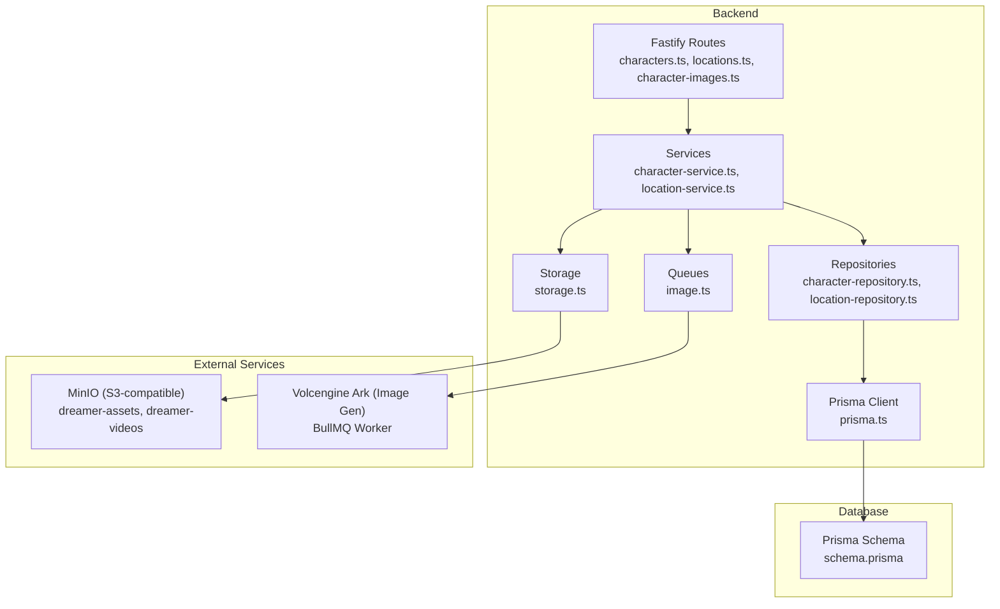
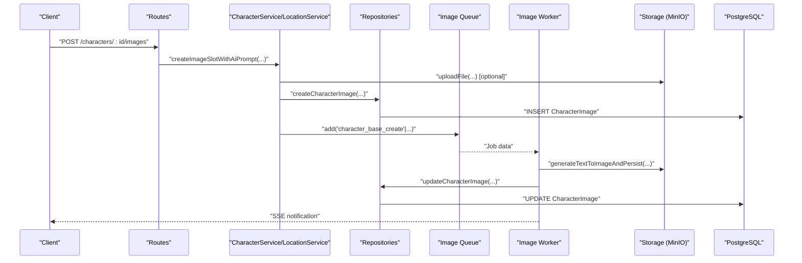
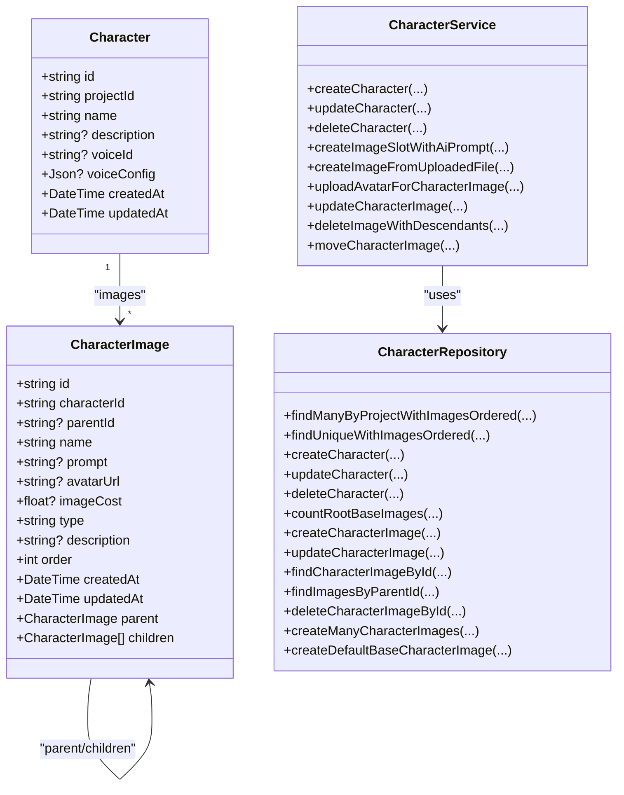
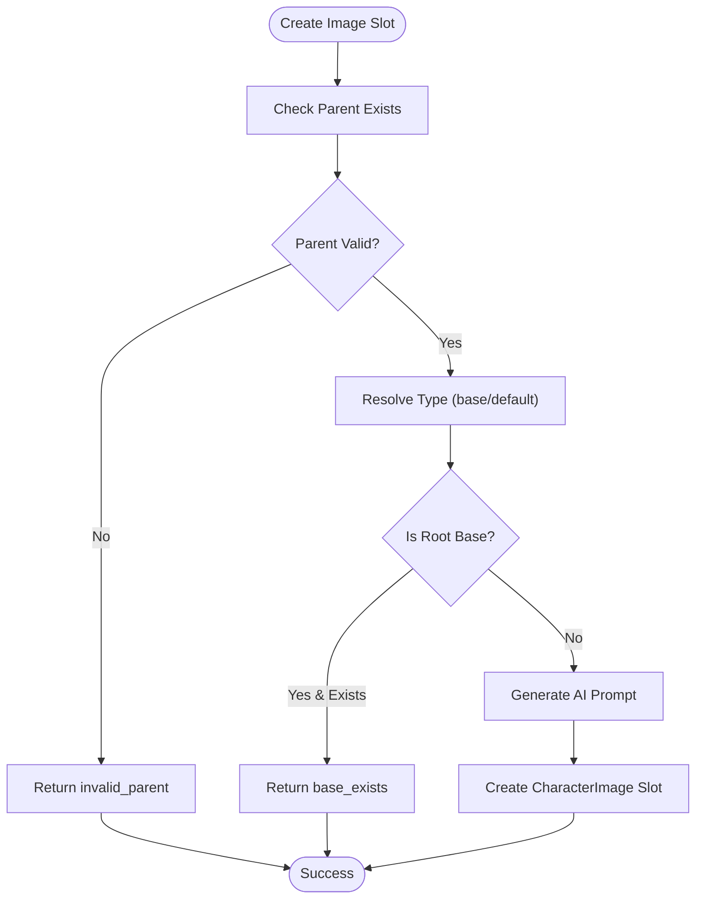
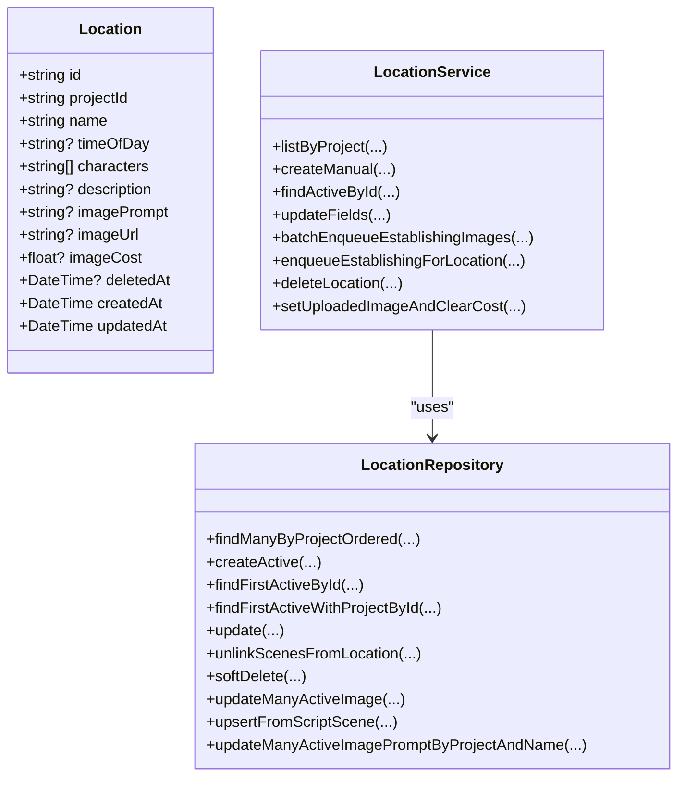
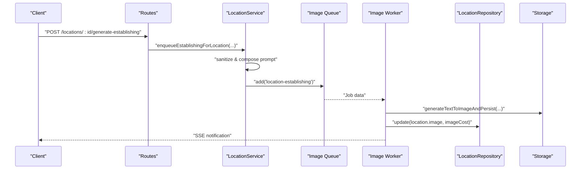
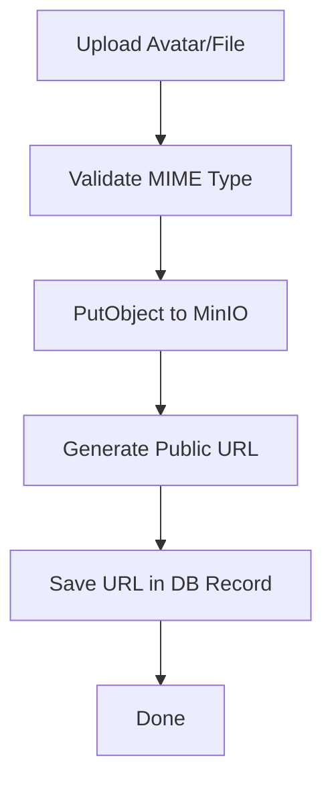
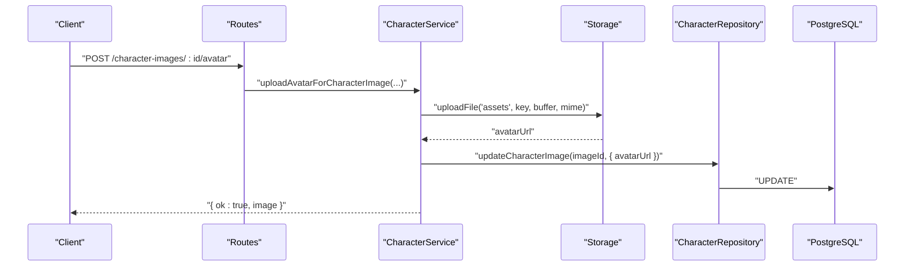
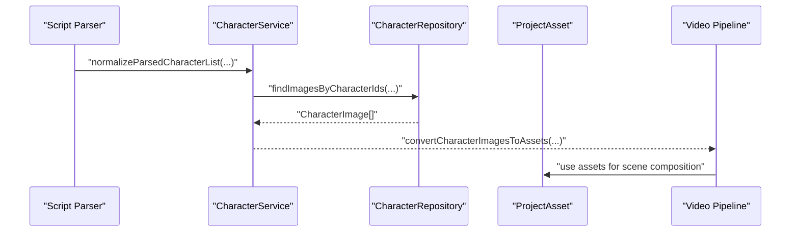
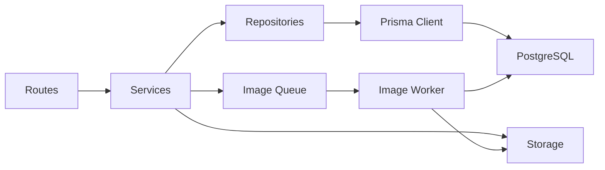

# Asset Management

<cite>
**Referenced Files in This Document**
- [README.md](file://README.md)
- [schema.prisma](file://packages/backend/prisma/schema.prisma)
- [character-service.ts](file://packages/backend/src/services/character-service.ts)
- [character-repository.ts](file://packages/backend/src/repositories/character-repository.ts)
- [location-service.ts](file://packages/backend/src/services/location-service.ts)
- [location-repository.ts](file://packages/backend/src/repositories/location-repository.ts)
- [storage.ts](file://packages/backend/src/services/storage.ts)
- [image.ts](file://packages/backend/src/queues/image.ts)
- [prisma.ts](file://packages/backend/src/lib/prisma.ts)
- [character-images.ts](file://packages/backend/src/routes/character-images.ts)
- [locations.ts](file://packages/backend/src/routes/locations.ts)
- [characters.ts](file://packages/backend/src/routes/characters.ts)
- [scene-asset.test.ts](file://packages/backend/tests/scene-asset.test.ts)
</cite>

## Table of Contents

1. [Introduction](#introduction)
2. [Project Structure](#project-structure)
3. [Core Components](#core-components)
4. [Architecture Overview](#architecture-overview)
5. [Detailed Component Analysis](#detailed-component-analysis)
6. [Dependency Analysis](#dependency-analysis)
7. [Performance Considerations](#performance-considerations)
8. [Troubleshooting Guide](#troubleshooting-guide)
9. [Conclusion](#conclusion)
10. [Appendices](#appendices)

## Introduction

This document describes the asset management system for characters, locations, and visual assets within the platform. It covers:

- Character library management: creation, profile management, and hierarchical image relationships
- Location management: setting creation, establishment image generation, and organization
- Visual asset storage, retrieval, and versioning via object storage
- Asset upload workflows, metadata management, and categorization
- Asset library interface, search and filtering capabilities, and bulk operations
- Permissions, sharing mechanisms, and integration with video generation pipelines

The system integrates AI-driven image generation, asynchronous job processing, and a relational database to support scalable production of short-form video content.

## Project Structure

The asset management system spans backend services, repositories, queues, and database models. The backend is built with Fastify, Prisma, BullMQ, and MinIO.



**Diagram sources**

- [character-images.ts](file://packages/backend/src/routes/character-images.ts)
- [locations.ts](file://packages/backend/src/routes/locations.ts)
- [characters.ts](file://packages/backend/src/routes/characters.ts)
- [character-service.ts](file://packages/backend/src/services/character-service.ts)
- [location-service.ts](file://packages/backend/src/services/location-service.ts)
- [character-repository.ts](file://packages/backend/src/repositories/character-repository.ts)
- [location-repository.ts](file://packages/backend/src/repositories/location-repository.ts)
- [image.ts](file://packages/backend/src/queues/image.ts)
- [storage.ts](file://packages/backend/src/services/storage.ts)
- [prisma.ts](file://packages/backend/src/lib/prisma.ts)
- [schema.prisma](file://packages/backend/prisma/schema.prisma)

**Section sources**

- [README.md:1-123](file://README.md#L1-L123)
- [schema.prisma:1-430](file://packages/backend/prisma/schema.prisma#L1-L430)

## Core Components

- Character Service: orchestrates character lifecycle and image slot creation, including AI-generated prompts and uploaded avatars.
- Location Service: manages locations and enqueues establishment image jobs.
- Storage Service: uploads files to MinIO-compatible object storage and generates URLs.
- Image Queue: worker that executes image generation jobs and persists results.
- Repositories: encapsulate database operations for characters, locations, and related entities.
- Prisma Schema: defines models for characters, locations, character images, project assets, and supporting relations.

Key responsibilities:

- Character library: create/update/delete characters; manage image slots (base and derived); enforce hierarchy rules; upload avatars; bulk operations.
- Locations: create/update/delete locations; generate establishment images; batch enqueue jobs.
- Assets: store avatars and generated images; track metadata (URLs, prompts, costs); categorize via tags/mood; integrate with video pipeline.

**Section sources**

- [character-service.ts:1-268](file://packages/backend/src/services/character-service.ts#L1-L268)
- [location-service.ts:1-186](file://packages/backend/src/services/location-service.ts#L1-L186)
- [storage.ts:1-65](file://packages/backend/src/services/storage.ts#L1-L65)
- [image.ts:1-302](file://packages/backend/src/queues/image.ts#L1-L302)
- [character-repository.ts:1-194](file://packages/backend/src/repositories/character-repository.ts#L1-L194)
- [location-repository.ts:1-117](file://packages/backend/src/repositories/location-repository.ts#L1-L117)
- [schema.prisma:74-214](file://packages/backend/prisma/schema.prisma#L74-L214)

## Architecture Overview

The asset management architecture connects route handlers to services, repositories, queues, and storage. AI image generation jobs are queued and executed asynchronously, updating database records and emitting SSE notifications.



**Diagram sources**

- [character-images.ts](file://packages/backend/src/routes/character-images.ts)
- [character-service.ts:64-137](file://packages/backend/src/services/character-service.ts#L64-L137)
- [character-repository.ts:75-86](file://packages/backend/src/repositories/character-repository.ts#L75-L86)
- [image.ts:42-287](file://packages/backend/src/queues/image.ts#L42-L287)
- [storage.ts:23-47](file://packages/backend/src/services/storage.ts#L23-L47)
- [schema.prisma:92-113](file://packages/backend/prisma/schema.prisma#L92-L113)

## Detailed Component Analysis

### Character Library Management

Character management centers around the Character model and the CharacterImage hierarchy. Services handle creation, updates, image slot management, and avatar uploads. Repositories encapsulate queries and transactions.



Key workflows:

- Create image slot with AI prompt: validates parent, ensures single base slot per character (root level), generates prompt via AI, and creates the slot.
- Upload avatar: validates MIME type, uploads to object storage, and updates the image record.
- Move image: prevents cycles by checking ancestors; reorders siblings.
- Delete image: cascades deletion of descendants; prevents removal of base image.



**Diagram sources**

- [character-service.ts:64-137](file://packages/backend/src/services/character-service.ts#L64-L137)
- [character-repository.ts:55-73](file://packages/backend/src/repositories/character-repository.ts#L55-L73)

**Section sources**

- [character-service.ts:1-268](file://packages/backend/src/services/character-service.ts#L1-L268)
- [character-repository.ts:1-194](file://packages/backend/src/repositories/character-repository.ts#L1-L194)
- [schema.prisma:74-113](file://packages/backend/prisma/schema.prisma#L74-L113)

### Location Management

Locations are managed via the Location model and LocationService. Services support manual creation, updates, establishment image generation, and batch operations.



Establishment image workflow:

- Validates prompt and sanitizes for API consumption.
- Builds a composed prompt for establishing shots.
- Enqueues a job to generate the image via the worker.
- Updates the location with the resulting URL and clears cost.



**Diagram sources**

- [location-service.ts:129-168](file://packages/backend/src/services/location-service.ts#L129-L168)
- [image.ts:200-247](file://packages/backend/src/queues/image.ts#L200-L247)
- [location-repository.ts:57-80](file://packages/backend/src/repositories/location-repository.ts#L57-L80)

**Section sources**

- [location-service.ts:1-186](file://packages/backend/src/services/location-service.ts#L1-L186)
- [location-repository.ts:1-117](file://packages/backend/src/repositories/location-repository.ts#L1-L117)
- [schema.prisma:194-214](file://packages/backend/prisma/schema.prisma#L194-L214)

### Visual Asset Storage, Retrieval, and Versioning

Visual assets are stored in MinIO-compatible object storage. The storage service provides upload, URL generation, and deletion utilities. Keys are generated with timestamps and random prefixes to avoid collisions.



**Diagram sources**

- [storage.ts:23-64](file://packages/backend/src/services/storage.ts#L23-L64)

Versioning and metadata:

- Character images and locations store URLs and optional prompts/costs.
- Costs are tracked per successful job completion to estimate API usage.
- Keys include timestamps and randomness to support multiple versions per asset.

**Section sources**

- [storage.ts:1-65](file://packages/backend/src/services/storage.ts#L1-L65)
- [schema.prisma:92-113](file://packages/backend/prisma/schema.prisma#L92-L113)
- [schema.prisma:194-214](file://packages/backend/prisma/schema.prisma#L194-L214)

### Asset Upload Workflows, Metadata, and Categorization

- Character avatars: validated MIME types, uploaded to object storage, and linked to CharacterImage records.
- Location establishment images: generated via AI, saved to storage, and associated with Location records.
- Metadata: name, description, type, prompt, order, and imageCost are persisted.
- Categorization: tags and mood arrays are available on ProjectAsset for broader asset library categorization.



**Diagram sources**

- [character-images.ts](file://packages/backend/src/routes/character-images.ts)
- [character-service.ts:177-198](file://packages/backend/src/services/character-service.ts#L177-L198)
- [storage.ts:23-47](file://packages/backend/src/services/storage.ts#L23-L47)
- [character-repository.ts:79-86](file://packages/backend/src/repositories/character-repository.ts#L79-L86)

**Section sources**

- [character-service.ts:176-198](file://packages/backend/src/services/character-service.ts#L176-L198)
- [storage.ts:1-65](file://packages/backend/src/services/storage.ts#L1-L65)
- [schema.prisma:348-364](file://packages/backend/prisma/schema.prisma#L348-L364)

### Asset Library Interface, Search, Filtering, and Bulk Operations

- Asset library: ProjectAsset model supports type, name, URL, description, tags, mood, location, and source.
- Search and filtering: clients can query by tags, mood, type, and name; repository methods enable efficient lookups.
- Bulk operations: repositories support batch updates and deletions for characters and images.

Example capabilities grounded in repository APIs:

- Batch update character descriptions by name within a project.
- Batch delete multiple characters by IDs.
- Batch create many character images.
- Upsert placeholders for characters and locations during script ingestion.

**Section sources**

- [schema.prisma:348-364](file://packages/backend/prisma/schema.prisma#L348-L364)
- [character-repository.ts:122-159](file://packages/backend/src/repositories/character-repository.ts#L122-L159)
- [location-repository.ts:82-113](file://packages/backend/src/repositories/location-repository.ts#L82-L113)

### Permissions, Sharing, and Integration with Video Generation Pipelines

- Permissions and sharing: project-scoped ownership is enforced by foreign keys on Character, Location, and ProjectAsset. Access control is applied at route/service boundaries.
- Integration with video pipeline: generated assets feed downstream steps (e.g., matching assets to scenes). Tests demonstrate mapping character images to assets for scene composition.



**Diagram sources**

- [character-service.ts:126-146](file://packages/backend/src/services/character-service.ts#L126-L146)
- [scene-asset.test.ts:201-224](file://packages/backend/tests/scene-asset.test.ts#L201-L224)

**Section sources**

- [schema.prisma:28-53](file://packages/backend/prisma/schema.prisma#L28-L53)
- [character-service.ts:126-146](file://packages/backend/src/services/character-service.ts#L126-L146)
- [scene-asset.test.ts:171-224](file://packages/backend/tests/scene-asset.test.ts#L171-L224)

## Dependency Analysis

The system exhibits layered cohesion:

- Routes depend on Services
- Services depend on Repositories and Queues/Storage
- Repositories depend on Prisma Client
- Prisma Client depends on PostgreSQL
- Image Queue Worker depends on Volcengine Ark and emits SSE updates



**Diagram sources**

- [character-images.ts](file://packages/backend/src/routes/character-images.ts)
- [characters.ts](file://packages/backend/src/routes/characters.ts)
- [locations.ts](file://packages/backend/src/routes/locations.ts)
- [character-service.ts](file://packages/backend/src/services/character-service.ts)
- [location-service.ts](file://packages/backend/src/services/location-service.ts)
- [character-repository.ts](file://packages/backend/src/repositories/character-repository.ts)
- [location-repository.ts](file://packages/backend/src/repositories/location-repository.ts)
- [image.ts](file://packages/backend/src/queues/image.ts)
- [storage.ts](file://packages/backend/src/services/storage.ts)
- [prisma.ts](file://packages/backend/src/lib/prisma.ts)
- [schema.prisma:1-430](file://packages/backend/prisma/schema.prisma#L1-L430)

**Section sources**

- [character-service.ts:1-268](file://packages/backend/src/services/character-service.ts#L1-L268)
- [location-service.ts:1-186](file://packages/backend/src/services/location-service.ts#L1-L186)
- [image.ts:1-302](file://packages/backend/src/queues/image.ts#L1-L302)
- [prisma.ts:1-4](file://packages/backend/src/lib/prisma.ts#L1-L4)
- [schema.prisma:1-430](file://packages/backend/prisma/schema.prisma#L1-L430)

## Performance Considerations

- Asynchronous image generation: offloads heavy work to workers, preventing blocking API responses.
- Concurrency control: worker concurrency is bounded; exponential backoff mitigates transient failures.
- Database batching: bulk operations reduce round-trips for character and image management.
- Cost tracking: imageCost enables budget monitoring and cost-aware scheduling.

[No sources needed since this section provides general guidance]

## Troubleshooting Guide

Common issues and resolutions:

- Character image slot creation fails due to invalid parent or existing base slot. Verify parent existence and ensure only one root base slot per character.
- Avatar upload rejected due to unsupported MIME type. Supported types include JPEG, PNG, and WebP.
- Location establishment image job fails due to missing prompt. Ensure imagePrompt is present and sanitized.
- Job failure notifications: worker emits SSE events with error details; inspect logs for failed job IDs.

**Section sources**

- [character-service.ts:183-186](file://packages/backend/src/services/character-service.ts#L183-L186)
- [location-service.ts:142-154](file://packages/backend/src/services/location-service.ts#L142-L154)
- [image.ts:249-281](file://packages/backend/src/queues/image.ts#L249-L281)

## Conclusion

The asset management system provides a robust foundation for character and location visual assets, integrating AI-driven generation, asynchronous job processing, and object storage. It supports hierarchical character images, establishment shots for locations, and a categorized asset library suitable for video pipeline integration. The layered architecture promotes maintainability and scalability.

[No sources needed since this section summarizes without analyzing specific files]

## Appendices

### Data Model Overview

```mermaid
erDiagram
USER {
string id PK
string email UK
string name
string password
string apiKey
}
PROJECT {
string id PK
string name
string userId FK
}
CHARACTER {
string id PK
string projectId FK
string name
string description
}
CHARACTER_IMAGE {
string id PK
string characterId FK
string? parentId FK
string name
string? prompt
string? avatarUrl
float? imageCost
string type
string? description
int order
}
LOCATION {
string id PK
string projectId FK
string name
string? timeOfDay
string[] characters
string? description
string? imagePrompt
string? imageUrl
float? imageCost
datetime? deletedAt
}
PROJECT_ASSET {
string id PK
string projectId FK
string type
string name
string url
string[] tags
string[] mood
}
USER ||--o{ PROJECT : "owns"
PROJECT ||--o{ CHARACTER : "contains"
CHARACTER ||--o{ CHARACTER_IMAGE : "has"
CHARACTER_IMAGE ||--o{ CHARACTER_IMAGE : "hierarchy"
PROJECT ||--o{ LOCATION : "contains"
PROJECT ||--o{ PROJECT_ASSET : "contains"
```

**Diagram sources**

- [schema.prisma:10-430](file://packages/backend/prisma/schema.prisma#L10-L430)
