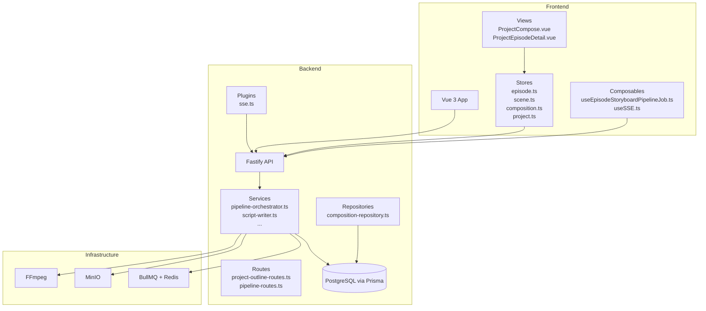
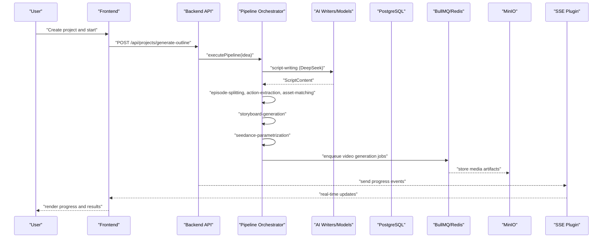
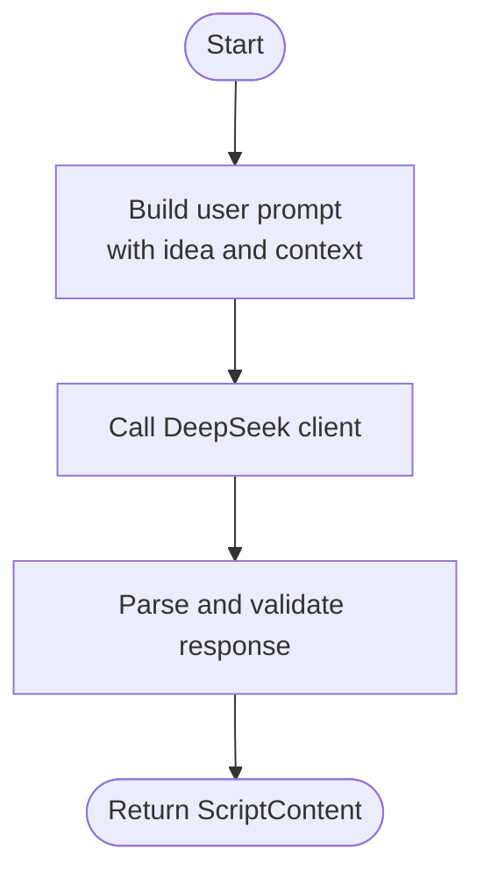
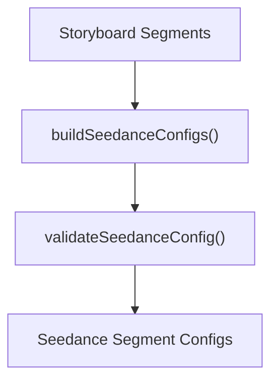
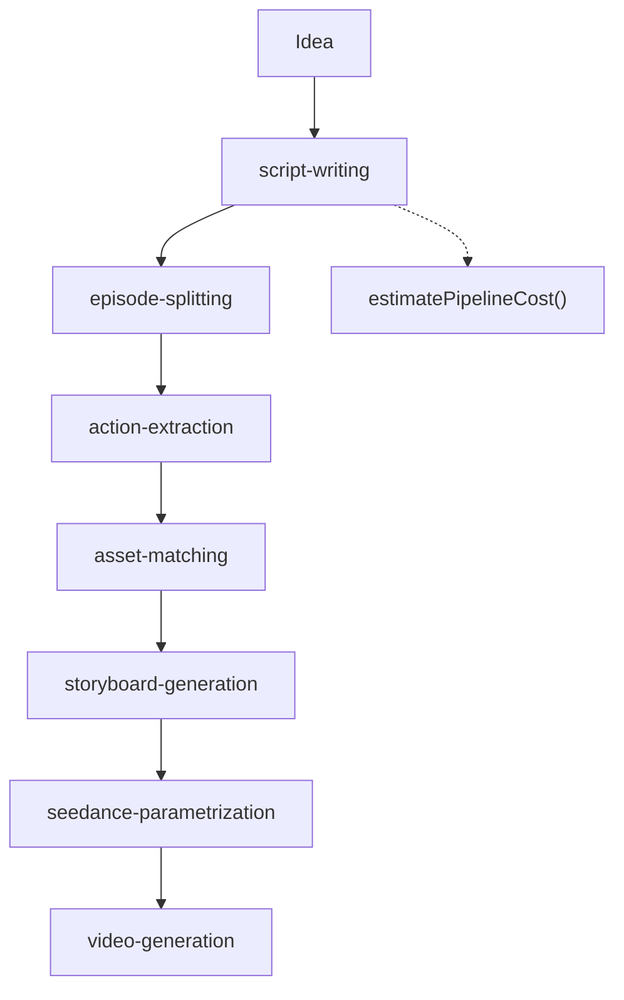
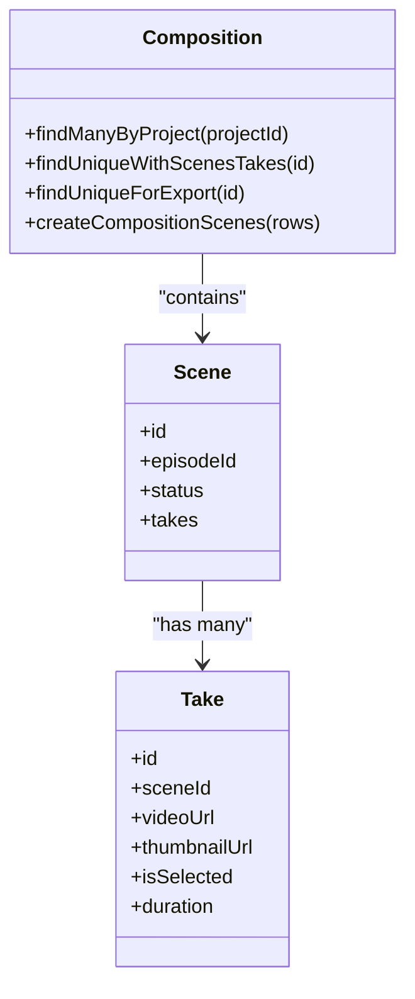
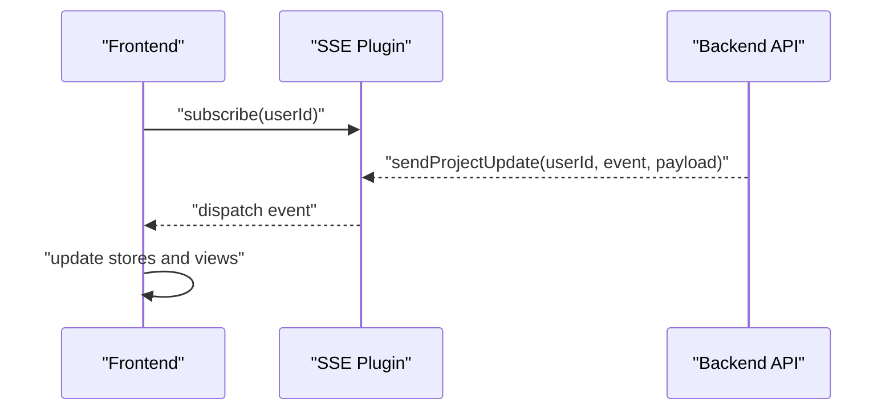
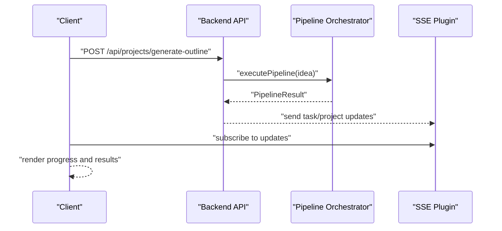
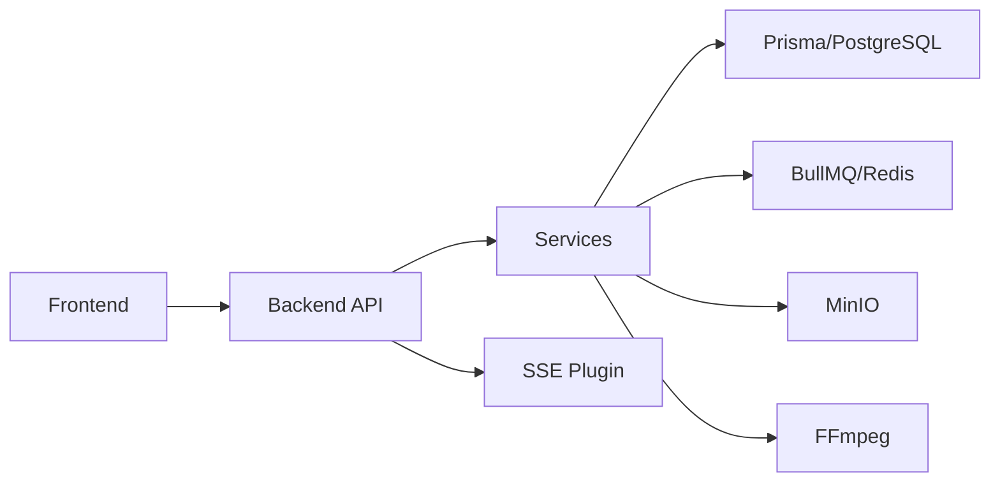

# Feature Implementation

<cite>
**Referenced Files in This Document**
- [README.md](file://README.md)
- [package.json](file://package.json)
- [packages/backend/src/services/pipeline-orchestrator.ts](file://packages/backend/src/services/pipeline-orchestrator.ts)
- [packages/backend/src/services/script-writer.ts](file://packages/backend/src/services/script-writer.ts)
- [packages/backend/src/services/episode-service.ts](file://packages/backend/src/services/episode-service.ts)
- [packages/backend/src/services/action-extractor.ts](file://packages/backend/src/services/action-extractor.ts)
- [packages/backend/src/services/scene-asset.ts](file://packages/backend/src/services/scene-asset.ts)
- [packages/backend/src/services/storyboard-generator.ts](file://packages/backend/src/services/storyboard-generator.ts)
- [packages/backend/src/services/seedance-optimizer.ts](file://packages/backend/src/services/seedance-optimizer.ts)
- [packages/backend/src/services/seedance-scene-request.ts](file://packages/backend/src/services/seedance-scene-request.ts)
- [packages/backend/src/repositories/composition-repository.ts](file://packages/backend/src/repositories/composition-repository.ts)
- [packages/backend/src/plugins/sse.ts](file://packages/backend/src/plugins/sse.ts)
- [packages/backend/src/routes/project-outline-routes.ts](file://packages/backend/src/routes/project-outline-routes.ts)
- [packages/backend/src/routes/pipeline-routes.ts](file://packages/backend/src/routes/pipeline-routes.ts)
- [packages/backend/tests/pipeline-orchestrator.test.ts](file://packages/backend/tests/pipeline-orchestrator.test.ts)
- [packages/backend/tests/pipeline-orchestrator-pure-functions.test.ts](file://packages/backend/tests/pipeline-orchestrator-pure-functions.test.ts)
- [packages/backend/tests/seedance-scene-request.test.ts](file://packages/backend/tests/seedance-scene-request.test.ts)
- [packages/backend/tests/sse-integration.test.ts](file://packages/backend/tests/sse-integration.test.ts)
- [packages/backend/tests/sse-plugin.test.ts](file://packages/backend/tests/sse-plugin.test.ts)
- [packages/backend/prisma/migrations/20260416120001_character_image_prompt_location_image_prompt/migration.sql](file://packages/backend/prisma/migrations/20260416120001_character_image_prompt_location_image_prompt/migration.sql)
- [packages/backend/prisma/migrations/20260420120000_add_image_cost/migration.sql](file://packages/backend/prisma/migrations/20260420120000_add_image_cost/migration.sql)
- [packages/frontend/src/views/ProjectCompose.vue](file://packages/frontend/src/views/ProjectCompose.vue)
- [packages/frontend/src/views/ProjectEpisodeDetail.vue](file://packages/frontend/src/views/ProjectEpisodeDetail.vue)
- [packages/frontend/src/composables/useEpisodeStoryboardPipelineJob.ts](file://packages/frontend/src/composables/useEpisodeStoryboardPipelineJob.ts)
- [packages/frontend/src/composables/useSSE.ts](file://packages/frontend/src/composables/useSSE.ts)
- [packages/frontend/src/stores/episode.ts](file://packages/frontend/src/stores/episode.ts)
- [packages/frontend/src/stores/scene.ts](file://packages/frontend/src/stores/scene.ts)
- [packages/frontend/src/stores/composition.ts](file://packages/frontend/src/stores/composition.ts)
- [packages/frontend/src/stores/project.ts](file://packages/frontend/src/stores/project.ts)
- [packages/frontend/src/lib/project-sse-bridge.ts](file://packages/frontend/src/lib/project-sse-bridge.ts)
- [docs/plans/Pipeline重构计划_20260411.md](file://docs/plans/Pipeline重构计划_20260411.md)
</cite>

## Table of Contents

1. [Introduction](#introduction)
2. [Project Structure](#project-structure)
3. [Core Components](#core-components)
4. [Architecture Overview](#architecture-overview)
5. [Detailed Component Analysis](#detailed-component-analysis)
6. [Dependency Analysis](#dependency-analysis)
7. [Performance Considerations](#performance-considerations)
8. [Troubleshooting Guide](#troubleshooting-guide)
9. [Conclusion](#conclusion)
10. [Appendices](#appendices)

## Introduction

This document explains the complete feature implementation for the AI short drama production platform, from project creation to video export. It covers:

- Project management and collaboration
- Script writing with AI assistance
- Asset management for characters and locations
- Multi-stage video generation pipeline orchestration
- Scene and take management, composition and editing
- Real-time collaboration via server-sent events (SSE)
- Practical API usage, component integration, and user workflow patterns
- Progress tracking and quality control mechanisms

The platform integrates Vue 3 + Fastify, with AI models (DeepSeek, Wan 2.6, Seedance 2.0), Prisma/PostgreSQL, BullMQ/Redis, MinIO, and FFmpeg.

## Project Structure

The repository is a monorepo with three primary packages:

- Backend: Fastify service with routes, services, queues, and plugins
- Frontend: Vue 3 application with views, stores, and composables
- Shared: TypeScript types consumed by both frontend and backend

**Diagram sources**

- [packages/backend/src/services/pipeline-orchestrator.ts:1-399](file://packages/backend/src/services/pipeline-orchestrator.ts#L1-L399)
- [packages/backend/src/routes/project-outline-routes.ts](file://packages/backend/src/routes/project-outline-routes.ts)
- [packages/backend/src/routes/pipeline-routes.ts](file://packages/backend/src/routes/pipeline-routes.ts)
- [packages/backend/src/plugins/sse.ts](file://packages/backend/src/plugins/sse.ts)
- [packages/backend/src/repositories/composition-repository.ts:1-82](file://packages/backend/src/repositories/composition-repository.ts#L1-L82)
- [packages/frontend/src/views/ProjectCompose.vue:1-120](file://packages/frontend/src/views/ProjectCompose.vue#L1-L120)
- [packages/frontend/src/views/ProjectEpisodeDetail.vue:1-220](file://packages/frontend/src/views/ProjectEpisodeDetail.vue#L1-L220)

**Section sources**

- [README.md:26-42](file://README.md#L26-L42)
- [package.json:6-23](file://package.json#L6-L23)

## Core Components

- Pipeline orchestrator: coordinates the seven-step AI-driven production pipeline
- Script writer: generates structured scripts from ideas using DeepSeek
- Episode service: splits scripts into episodes and builds voice configs
- Action extractor: extracts character actions/emotions per scene
- Scene asset service: matches scenes to assets and converts character images to assets
- Storyboard generator: produces storyboard segments with enriched prompts
- Seedance optimizer: transforms storyboard segments into Seedance API configurations
- Composition repository: manages edited compositions and exportable timelines
- SSE plugin: enables real-time progress updates for jobs and projects
- Frontend stores and views: manage scenes, takes, compositions, and rendering

**Section sources**

- [packages/backend/src/services/pipeline-orchestrator.ts:69-399](file://packages/backend/src/services/pipeline-orchestrator.ts#L69-L399)
- [packages/backend/src/services/script-writer.ts:1-43](file://packages/backend/src/services/script-writer.ts#L1-L43)
- [packages/backend/src/services/episode-service.ts:18-68](file://packages/backend/src/services/episode-service.ts#L18-L68)
- [packages/backend/src/services/action-extractor.ts](file://packages/backend/src/services/action-extractor.ts)
- [packages/backend/src/services/scene-asset.ts](file://packages/backend/src/services/scene-asset.ts)
- [packages/backend/src/services/storyboard-generator.ts](file://packages/backend/src/services/storyboard-generator.ts)
- [packages/backend/src/services/seedance-optimizer.ts](file://packages/backend/src/services/seedance-optimizer.ts)
- [packages/backend/src/repositories/composition-repository.ts:1-82](file://packages/backend/src/repositories/composition-repository.ts#L1-L82)
- [packages/backend/src/plugins/sse.ts](file://packages/backend/src/plugins/sse.ts)
- [packages/frontend/src/views/ProjectCompose.vue:28-62](file://packages/frontend/src/views/ProjectCompose.vue#L28-L62)
- [packages/frontend/src/views/ProjectEpisodeDetail.vue:172-208](file://packages/frontend/src/views/ProjectEpisodeDetail.vue#L172-L208)

## Architecture Overview

The system follows an API-driven workflow:

- Users create projects and collaborate via team-aware APIs
- Scripts are generated with AI assistance
- Assets (characters, locations) are managed and matched to scenes
- A multi-stage pipeline produces storyboard segments and Seedance configurations
- Workers execute video generation; compositions assemble takes into finished videos
- SSE streams progress to clients for real-time collaboration

**Diagram sources**

- [packages/backend/src/services/pipeline-orchestrator.ts:80-225](file://packages/backend/src/services/pipeline-orchestrator.ts#L80-L225)
- [packages/backend/src/routes/project-outline-routes.ts](file://packages/backend/src/routes/project-outline-routes.ts)
- [packages/backend/src/routes/pipeline-routes.ts](file://packages/backend/src/routes/pipeline-routes.ts)
- [packages/backend/src/plugins/sse.ts](file://packages/backend/src/plugins/sse.ts)
- [docs/plans/Pipeline重构计划\_20260411.md:357-377](file://docs/plans/Pipeline重构计划_20260411.md#L357-L377)

## Detailed Component Analysis

### Project Management and Collaboration

- Project lifecycle: create, update, delete with ownership checks
- Team collaboration: routes and services enforce ownership and visibility
- Settings: project-level defaults (e.g., aspect ratio) influence downstream generation

Key implementation points:

- Ownership and deletion checks in project service
- Project-level aspect ratio defaults affecting video generation
- SSE plugin enabling real-time notifications for project updates

**Section sources**

- [packages/backend/src/services/project-service.ts:266-278](file://packages/backend/src/services/project-service.ts#L266-L278)
- [packages/backend/src/services/project-aspect.ts](file://packages/backend/src/services/project-aspect.ts)
- [packages/backend/src/plugins/sse.ts](file://packages/backend/src/plugins/sse.ts)

### Script Writing with AI Assistance

- Generates structured scripts from user ideas using DeepSeek
- Parses and validates AI responses into ScriptContent
- Supports optional character and project context injection

**Diagram sources**

- [packages/backend/src/services/script-writer.ts:31-43](file://packages/backend/src/services/script-writer.ts#L31-L43)

**Section sources**

- [packages/backend/src/services/script-writer.ts:1-43](file://packages/backend/src/services/script-writer.ts#L1-L43)
- [packages/backend/tests/script-writer.test.ts:36-84](file://packages/backend/tests/script-writer.test.ts#L36-L84)

### Episode Splitting and Voice Configuration

- Splits scripts into episodes with configurable target durations
- Builds default voice configuration for TTS

**Section sources**

- [packages/backend/src/services/episode-service.ts:18-68](file://packages/backend/src/services/episode-service.ts#L18-L68)

### Action Extraction and Asset Matching

- Extracts actions/emotions from scenes for richer visual planning
- Matches scenes to assets and converts character images to project assets

**Section sources**

- [packages/backend/src/services/action-extractor.ts](file://packages/backend/src/services/action-extractor.ts)
- [packages/backend/src/services/scene-asset.ts](file://packages/backend/src/services/scene-asset.ts)

### Storyboard Generation and Seedance Parameterization

- Generates storyboard segments enriched with prompts and assets
- Converts storyboard segments into Seedance API configurations with validation

**Diagram sources**

- [packages/backend/src/services/storyboard-generator.ts](file://packages/backend/src/services/storyboard-generator.ts)
- [packages/backend/src/services/seedance-optimizer.ts](file://packages/backend/src/services/seedance-optimizer.ts)
- [packages/backend/src/services/seedance-scene-request.ts](file://packages/backend/src/services/seedance-scene-request.ts)

**Section sources**

- [packages/backend/src/services/storyboard-generator.ts](file://packages/backend/src/services/storyboard-generator.ts)
- [packages/backend/src/services/seedance-optimizer.ts](file://packages/backend/src/services/seedance-optimizer.ts)
- [packages/backend/tests/seedance-scene-request.test.ts:376-565](file://packages/backend/tests/seedance-scene-request.test.ts#L376-L565)

### Video Generation Pipeline Orchestration

- Executes the full seven-step pipeline with step-level control and cost estimation
- Supports running subsets of steps and step-specific execution for resumability

**Diagram sources**

- [packages/backend/src/services/pipeline-orchestrator.ts:80-225](file://packages/backend/src/services/pipeline-orchestrator.ts#L80-L225)
- [packages/backend/src/services/pipeline-orchestrator.ts:377-399](file://packages/backend/src/services/pipeline-orchestrator.ts#L377-L399)

**Section sources**

- [packages/backend/src/services/pipeline-orchestrator.ts:69-399](file://packages/backend/src/services/pipeline-orchestrator.ts#L69-L399)
- [packages/backend/tests/pipeline-orchestrator.test.ts:48-97](file://packages/backend/tests/pipeline-orchestrator.test.ts#L48-L97)
- [packages/backend/tests/pipeline-orchestrator-pure-functions.test.ts:72-114](file://packages/backend/tests/pipeline-orchestrator-pure-functions.test.ts#L72-L114)

### Scene and Take Management, Composition and Editing

- Scenes and takes are managed per episode; takes carry video URLs and thumbnails
- Composition aggregates scenes and takes into an ordered timeline for export
- Export retrieves scenes ordered by take selection and availability

**Diagram sources**

- [packages/backend/src/repositories/composition-repository.ts:1-82](file://packages/backend/src/repositories/composition-repository.ts#L1-L82)

**Section sources**

- [packages/backend/src/repositories/composition-repository.ts:1-82](file://packages/backend/src/repositories/composition-repository.ts#L1-L82)
- [packages/frontend/src/views/ProjectCompose.vue:28-62](file://packages/frontend/src/views/ProjectCompose.vue#L28-L62)
- [packages/frontend/src/views/ProjectEpisodeDetail.vue:172-208](file://packages/frontend/src/views/ProjectEpisodeDetail.vue#L172-L208)

### Real-Time Collaboration with SSE

- SSE plugin exposes sendToUser, sendTaskUpdate, and sendProjectUpdate
- Frontend composable listens to events and updates UI state
- Integration tests verify serialization and delivery semantics

**Diagram sources**

- [packages/backend/src/plugins/sse.ts](file://packages/backend/src/plugins/sse.ts)
- [packages/frontend/src/composables/useSSE.ts](file://packages/frontend/src/composables/useSSE.ts)
- [packages/frontend/src/lib/project-sse-bridge.ts](file://packages/frontend/src/lib/project-sse-bridge.ts)
- [packages/backend/tests/sse-integration.test.ts:55-83](file://packages/backend/tests/sse-integration.test.ts#L55-L83)
- [packages/backend/tests/sse-plugin.test.ts:39-107](file://packages/backend/tests/sse-plugin.test.ts#L39-L107)

**Section sources**

- [packages/backend/src/plugins/sse.ts](file://packages/backend/src/plugins/sse.ts)
- [packages/frontend/src/composables/useSSE.ts](file://packages/frontend/src/composables/useSSE.ts)
- [packages/frontend/src/lib/project-sse-bridge.ts](file://packages/frontend/src/lib/project-sse-bridge.ts)
- [packages/backend/tests/sse-integration.test.ts:55-83](file://packages/backend/tests/sse-integration.test.ts#L55-L83)
- [packages/backend/tests/sse-plugin.test.ts:39-107](file://packages/backend/tests/sse-plugin.test.ts#L39-L107)

### Asset Management for Characters and Locations

- Character images and location images support prompts and cost tracking
- Migrations add prompt and imageCost fields to CharacterImage and Location tables

**Section sources**

- [packages/backend/prisma/migrations/20260416120001_character_image_prompt_location_image_prompt/migration.sql:1-5](file://packages/backend/prisma/migrations/20260416120001_character_image_prompt_location_image_prompt/migration.sql#L1-L5)
- [packages/backend/prisma/migrations/20260420120000_add_image_cost/migration.sql:1-5](file://packages/backend/prisma/migrations/20260420120000_add_image_cost/migration.sql#L1-L5)

### API Usage Examples and Workflow Patterns

- Generate outline and start pipeline job
- Subscribe to progress via SSE
- Compose and export finished videos

**Diagram sources**

- [docs/plans/Pipeline重构计划\_20260411.md:357-377](file://docs/plans/Pipeline重构计划_20260411.md#L357-L377)
- [packages/backend/src/services/pipeline-orchestrator.ts:80-225](file://packages/backend/src/services/pipeline-orchestrator.ts#L80-L225)
- [packages/backend/src/plugins/sse.ts](file://packages/backend/src/plugins/sse.ts)

**Section sources**

- [docs/plans/Pipeline重构计划\_20260411.md:357-377](file://docs/plans/Pipeline重构计划_20260411.md#L357-L377)
- [packages/backend/src/routes/project-outline-routes.ts](file://packages/backend/src/routes/project-outline-routes.ts)
- [packages/backend/src/routes/pipeline-routes.ts](file://packages/backend/src/routes/pipeline-routes.ts)

## Dependency Analysis

- Backend services depend on shared types and Prisma models
- Frontend depends on backend routes and SSE plugin
- Infrastructure dependencies: Redis for queues, MinIO for storage, FFmpeg for media

**Diagram sources**

- [packages/backend/src/services/pipeline-orchestrator.ts:1-50](file://packages/backend/src/services/pipeline-orchestrator.ts#L1-L50)
- [packages/backend/src/plugins/sse.ts](file://packages/backend/src/plugins/sse.ts)
- [README.md:13-25](file://README.md#L13-L25)

**Section sources**

- [README.md:13-25](file://README.md#L13-L25)
- [package.json:6-23](file://package.json#L6-L23)

## Performance Considerations

- Pipeline cost estimation helps users budget for generation
- Step-level execution and validation reduce rework and improve reliability
- SSE minimizes polling overhead and improves perceived responsiveness
- Image and location cost fields enable cost tracking and optimization

**Section sources**

- [packages/backend/src/services/pipeline-orchestrator.ts:377-399](file://packages/backend/src/services/pipeline-orchestrator.ts#L377-L399)
- [packages/backend/tests/pipeline-orchestrator-pure-functions.test.ts:88-114](file://packages/backend/tests/pipeline-orchestrator-pure-functions.test.ts#L88-L114)
- [packages/backend/prisma/migrations/20260420120000_add_image_cost/migration.sql:1-5](file://packages/backend/prisma/migrations/20260420120000_add_image_cost/migration.sql#L1-L5)

## Troubleshooting Guide

- Pipeline failures: check step descriptions and error messages returned by orchestrator
- Missing data dependencies: ensure prerequisite steps (e.g., storyboard) are present before downstream steps
- SSE connectivity: verify plugin registration and payload serialization
- Seedance configuration validation: review warnings and adjust segment parameters

**Section sources**

- [packages/backend/src/services/pipeline-orchestrator.ts:227-261](file://packages/backend/src/services/pipeline-orchestrator.ts#L227-L261)
- [packages/backend/src/services/pipeline-orchestrator.ts:329-340](file://packages/backend/src/services/pipeline-orchestrator.ts#L329-L340)
- [packages/backend/tests/sse-integration.test.ts:55-83](file://packages/backend/tests/sse-integration.test.ts#L55-L83)
- [packages/backend/tests/sse-plugin.test.ts:39-107](file://packages/backend/tests/sse-plugin.test.ts#L39-L107)
- [packages/backend/tests/seedance-scene-request.test.ts:426-565](file://packages/backend/tests/seedance-scene-request.test.ts#L426-L565)

## Conclusion

The platform provides a robust, API-driven workflow from project creation to video export. The seven-stage pipeline, real-time collaboration via SSE, and modular services enable scalable production while maintaining quality control and user control.

## Appendices

### API Surface for Pipeline and Outline

- Generate outline endpoint and pipeline job management are documented in the development plans.

**Section sources**

- [docs/plans/Pipeline重构计划\_20260411.md:357-377](file://docs/plans/Pipeline重构计划_20260411.md#L357-L377)
