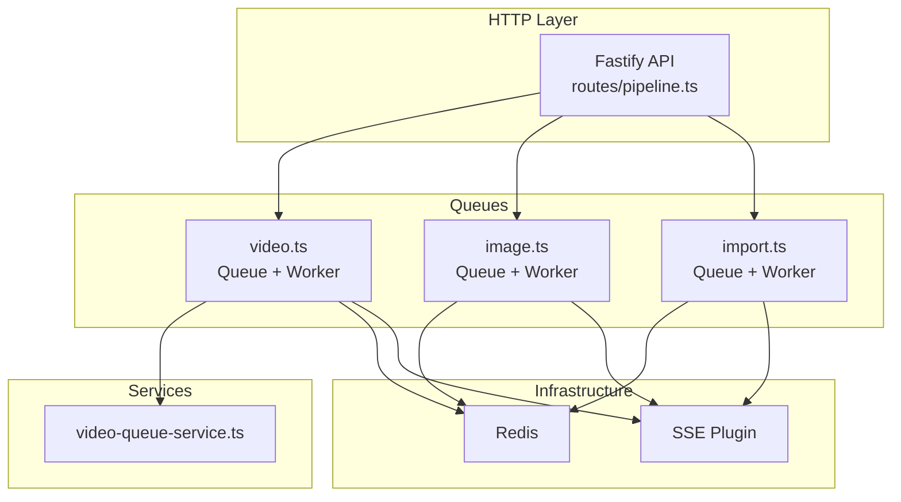
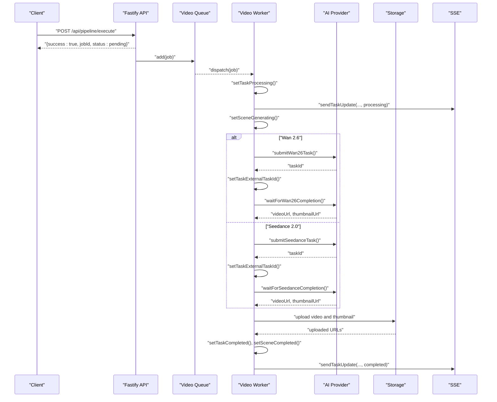
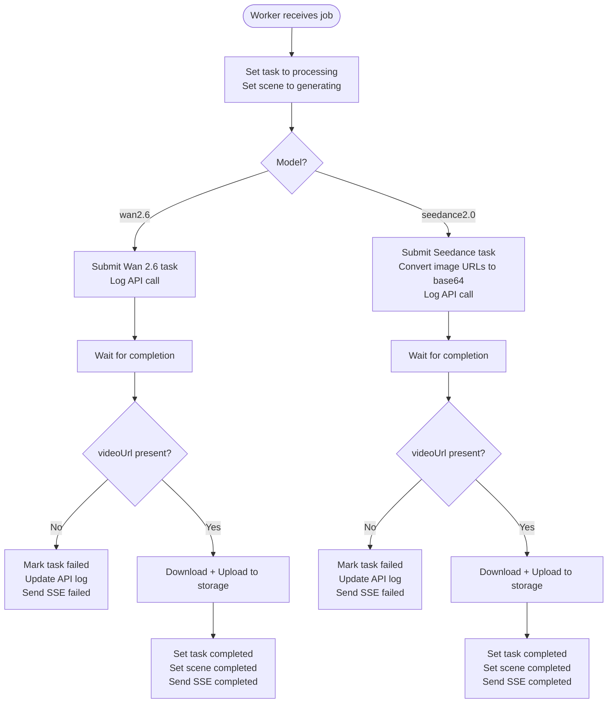
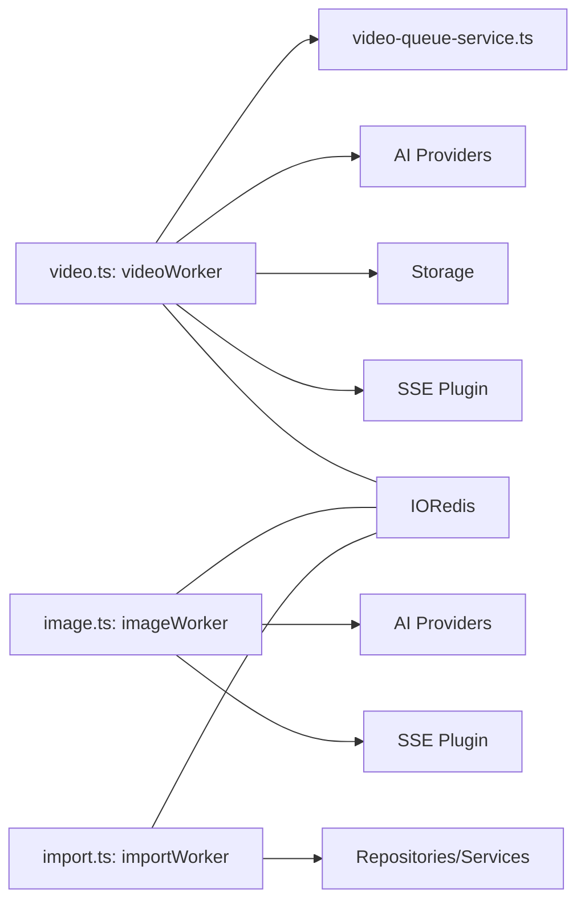

# Pipeline Orchestration

<cite>
**Referenced Files in This Document**
- [video.ts](file://packages/backend/src/queues/video.ts)
- [image.ts](file://packages/backend/src/queues/image.ts)
- [import.ts](file://packages/backend/src/queues/import.ts)
- [video-queue-service.ts](file://packages/backend/src/services/video-queue-service.ts)
- [worker.ts](file://packages/backend/src/worker.ts)
- [index.ts](file://packages/backend/src/index.ts)
- [pipeline.ts](file://packages/backend/src/routes/pipeline.ts)
- [video-queue-worker-logic.test.ts](file://packages/backend/tests/video-queue-worker-logic.test.ts)
- [video-queue-worker.test.ts](file://packages/backend/tests/video-queue-worker.test.ts)
- [pipeline-orchestrator.test.ts](file://packages/backend/tests/pipeline-orchestrator.test.ts)
</cite>

## Table of Contents

1. [Introduction](#introduction)
2. [Project Structure](#project-structure)
3. [Core Components](#core-components)
4. [Architecture Overview](#architecture-overview)
5. [Detailed Component Analysis](#detailed-component-analysis)
6. [Dependency Analysis](#dependency-analysis)
7. [Performance Considerations](#performance-considerations)
8. [Troubleshooting Guide](#troubleshooting-guide)
9. [Conclusion](#conclusion)
10. [Appendices](#appendices)

## Introduction

This document describes the pipeline orchestration system responsible for coordinating video generation tasks. It explains how jobs are queued and processed asynchronously via BullMQ, how workers coordinate with external AI services, and how progress and outcomes are tracked. It also covers configuration, scaling, monitoring, error handling, retries, timeouts, and recovery strategies.

## Project Structure

The pipeline orchestration spans several modules:

- Queues: define BullMQ queues and workers for video, image, and import jobs
- Services: encapsulate business logic for queue-specific operations and persistence
- Routes: expose HTTP endpoints to create, monitor, and manage pipeline jobs
- Tests: validate queue worker behavior and orchestrator logic

**Diagram sources**

- [index.ts:108](file://packages/backend/src/index.ts#L108)
- [pipeline.ts:28](file://packages/backend/src/routes/pipeline.ts#L28)
- [video.ts:15](file://packages/backend/src/queues/video.ts#L15)
- [image.ts:19](file://packages/backend/src/queues/image.ts#L19)
- [import.ts:30](file://packages/backend/src/queues/import.ts#L30)
- [video-queue-service.ts:6](file://packages/backend/src/services/video-queue-service.ts#L6)

**Section sources**

- [index.ts:108](file://packages/backend/src/index.ts#L108)
- [pipeline.ts:28](file://packages/backend/src/routes/pipeline.ts#L28)
- [video.ts:15](file://packages/backend/src/queues/video.ts#L15)
- [image.ts:19](file://packages/backend/src/queues/image.ts#L19)
- [import.ts:30](file://packages/backend/src/queues/import.ts#L30)

## Core Components

- Video Generation Queue and Worker
  - Queue: named "video-generation" with default retry policy and exponential backoff
  - Worker: processes jobs with concurrency 5, integrates with AI providers, uploads assets, and emits SSE updates
- Image Generation Queue and Worker
  - Queue: named "image-generation" with default retry policy and exponential backoff
  - Worker: handles multiple kinds of image generation jobs, records API usage, and notifies via SSE
- Import Queue and Worker
  - Queue: named "import" with default retry policy and exponential backoff
  - Worker: parses and imports content into the project, optionally creating a project, and applies downstream enrichment
- Video Queue Service
  - Encapsulates Take/Scene state transitions and persistence updates for video jobs
- Worker Bootstrap
  - Starts separate worker processes for video, import, and image queues with graceful shutdown hooks

**Section sources**

- [video.ts:15](file://packages/backend/src/queues/video.ts#L15)
- [video.ts:27](file://packages/backend/src/queues/video.ts#L27)
- [image.ts:19](file://packages/backend/src/queues/image.ts#L19)
- [image.ts:42](file://packages/backend/src/queues/image.ts#L42)
- [import.ts:30](file://packages/backend/src/queues/import.ts#L30)
- [import.ts:42](file://packages/backend/src/queues/import.ts#L42)
- [video-queue-service.ts:6](file://packages/backend/src/services/video-queue-service.ts#L6)
- [worker.ts:5](file://packages/backend/src/worker.ts#L5)

## Architecture Overview

The system separates concerns:

- HTTP API creates jobs and returns immediately (asynchronous pattern)
- Workers consume jobs from Redis-backed queues
- Workers call AI providers, persist results, and emit SSE events
- Optional pipeline orchestration coordinates multiple steps via route handlers

**Diagram sources**

- [pipeline.ts:28](file://packages/backend/src/routes/pipeline.ts#L28)
- [video.ts:27](file://packages/backend/src/queues/video.ts#L27)
- [video.ts:48](file://packages/backend/src/queues/video.ts#L48)
- [video.ts:58](file://packages/backend/src/queues/video.ts#L58)
- [video.ts:112](file://packages/backend/src/queues/video.ts#L112)
- [video.ts:173](file://packages/backend/src/queues/video.ts#L173)
- [video.ts:200](file://packages/backend/src/queues/video.ts#L200)

## Detailed Component Analysis

### Video Generation Queue and Worker

Responsibilities:

- Accept jobs with scene/task identifiers, prompts, model selection, optional reference images, durations, and aspect ratios
- Transition task and scene states, log API calls, and track costs
- Call AI providers (Wan 2.6 or Seedance 2.0), wait for completion, download artifacts, upload to storage, and publish results
- Emit SSE notifications for progress and completion/failure
- Retry with exponential backoff up to configured attempts

Processing logic highlights:

- Task and scene state transitions occur before and after AI calls
- External task IDs are recorded to correlate with upstream AI services
- Costs are calculated per provider and stored with the task
- Uploaded media URLs replace temporary provider URLs
- SSE updates are sent to the project owner’s client stream

**Diagram sources**

- [video.ts:48](file://packages/backend/src/queues/video.ts#L48)
- [video.ts:58](file://packages/backend/src/queues/video.ts#L58)
- [video.ts:112](file://packages/backend/src/queues/video.ts#L112)
- [video.ts:173](file://packages/backend/src/queues/video.ts#L173)
- [video.ts:200](file://packages/backend/src/queues/video.ts#L200)

**Section sources**

- [video.ts:15](file://packages/backend/src/queues/video.ts#L15)
- [video.ts:27](file://packages/backend/src/queues/video.ts#L27)
- [video.ts:48](file://packages/backend/src/queues/video.ts#L48)
- [video.ts:58](file://packages/backend/src/queues/video.ts#L58)
- [video.ts:112](file://packages/backend/src/queues/video.ts#L112)
- [video.ts:173](file://packages/backend/src/queues/video.ts#L173)
- [video.ts:200](file://packages/backend/src/queues/video.ts#L200)
- [video.ts:222](file://packages/backend/src/queues/video.ts#L222)
- [video.ts:234](file://packages/backend/src/queues/video.ts#L234)
- [video.ts:242](file://packages/backend/src/queues/video.ts#L242)

### Image Generation Queue and Worker

Responsibilities:

- Handle multiple job kinds: character base create/regenerate, derived create/regenerate, and location establishing images
- Determine image size from project aspect ratio
- Generate images via AI, persist metadata, and notify via SSE
- Record model API calls with cost and request parameters

Processing logic highlights:

- Uses a switch over job kind to route to appropriate generation logic
- Notifies clients on completion or failure with structured payloads
- Records API call logs with status and cost

**Section sources**

- [image.ts:42](file://packages/backend/src/queues/image.ts#L42)
- [image.ts:52](file://packages/backend/src/queues/image.ts#L52)
- [image.ts:100](file://packages/backend/src/queues/image.ts#L100)
- [image.ts:249](file://packages/backend/src/queues/image.ts#L249)

### Import Queue and Worker

Responsibilities:

- Parse incoming content (Markdown/JSON) into structured script data
- Optionally create a project if none provided
- Import parsed data into the database and apply downstream enrichment
- Mark task status as processing/completed/failed

**Section sources**

- [import.ts:42](file://packages/backend/src/queues/import.ts#L42)
- [import.ts:48](file://packages/backend/src/queues/import.ts#L48)
- [import.ts:58](file://packages/backend/src/queues/import.ts#L58)
- [import.ts:71](file://packages/backend/src/queues/import.ts#L71)

### Video Queue Service

Responsibilities:

- Resolve project user ID for SSE notifications
- Update task and scene statuses
- Persist task metadata (URLs, cost, duration)

**Section sources**

- [video-queue-service.ts:6](file://packages/backend/src/services/video-queue-service.ts#L6)
- [video-queue-service.ts:14](file://packages/backend/src/services/video-queue-service.ts#L14)
- [video-queue-service.ts:22](file://packages/backend/src/services/video-queue-service.ts#L22)
- [video-queue-service.ts:47](file://packages/backend/src/services/video-queue-service.ts#L47)

### Worker Bootstrap

Responsibilities:

- Start dedicated workers for video, import, and image queues
- Handle graceful shutdown signals to close workers and Redis connections

**Section sources**

- [worker.ts:5](file://packages/backend/src/worker.ts#L5)
- [worker.ts:15](file://packages/backend/src/worker.ts#L15)

## Dependency Analysis

- Queue-to-Worker coupling
  - Each queue exports a Worker instance; workers depend on services and infrastructure
- Service-layer cohesion
  - VideoQueueService encapsulates Take/Scene updates, reducing duplication across workers
- External integrations
  - AI providers (Wan 2.6, Seedance 2.0), storage (MinIO-compatible), and SSE plugin
- Infrastructure
  - Redis connection reused across queues; graceful shutdown ensures clean termination

**Diagram sources**

- [video.ts:4](file://packages/backend/src/queues/video.ts#L4)
- [image.ts:13](file://packages/backend/src/queues/image.ts#L13)
- [import.ts:6](file://packages/backend/src/queues/import.ts#L6)

**Section sources**

- [video.ts:4](file://packages/backend/src/queues/video.ts#L4)
- [image.ts:13](file://packages/backend/src/queues/image.ts#L13)
- [import.ts:6](file://packages/backend/src/queues/import.ts#L6)

## Performance Considerations

- Concurrency tuning
  - Video worker concurrency is set to 5; adjust based on AI provider rate limits and available resources
  - Image worker concurrency is set to 3; import worker concurrency is set to 2
- Backoff strategy
  - Exponential backoff reduces load spikes during transient failures
- Retry attempts
  - Video: 3 attempts; Image: 2 attempts; Import: 2 attempts
- Resource management
  - Limit request timeouts for long-running operations; offload heavy work to workers
  - Consider batching AI requests where supported by providers
- Monitoring
  - Track queue length, job latency, and failure rates; alert on sustained backoffs

[No sources needed since this section provides general guidance]

## Troubleshooting Guide

Common issues and remedies:

- Jobs stuck in processing
  - Verify worker is running and Redis connectivity is healthy
  - Check for unhandled exceptions in worker logs
- Missing SSE updates
  - Confirm project user ID resolution and SSE plugin registration
- AI provider failures
  - Inspect API logs and external task IDs; ensure provider credentials and quotas are valid
- Storage upload errors
  - Validate storage configuration and bucket permissions
- Graceful shutdown
  - Ensure SIGINT/SIGTERM handlers are invoked to close workers and Redis connections

**Section sources**

- [video.ts:267](file://packages/backend/src/queues/video.ts#L267)
- [worker.ts:15](file://packages/backend/src/worker.ts#L15)

## Conclusion

The pipeline orchestration system cleanly separates HTTP request handling from background processing. BullMQ queues and dedicated workers enable scalable, resilient asynchronous workflows. With explicit state transitions, API logging, storage uploads, and SSE notifications, the system provides robust progress tracking and recovery. Tuning concurrency, backoff, and retry policies allows balancing throughput and reliability.

[No sources needed since this section summarizes without analyzing specific files]

## Appendices

### Pipeline Execution and Status Reporting

- Create a pipeline job via the HTTP API; receive a job identifier immediately
- Poll the job status endpoint to track progress
- Subscribe to SSE for real-time updates

**Section sources**

- [pipeline.ts:28](file://packages/backend/src/routes/pipeline.ts#L28)
- [pipeline.ts:58](file://packages/backend/src/routes/pipeline.ts#L58)

### Retry Mechanisms, Timeouts, and Recovery

- Retries and backoff
  - Video: up to 3 attempts with exponential backoff
  - Image: up to 2 attempts with exponential backoff
  - Import: up to 2 attempts with exponential backoff
- Timeouts
  - Configure request timeouts at the HTTP layer; avoid blocking long operations in request handlers
- Recovery
  - On failure, update task/scene status and emit SSE failure; external task IDs help correlate with provider logs

**Section sources**

- [video.ts:17](file://packages/backend/src/queues/video.ts#L17)
- [image.ts:21](file://packages/backend/src/queues/image.ts#L21)
- [import.ts:32](file://packages/backend/src/queues/import.ts#L32)
- [index.ts:39](file://packages/backend/src/index.ts#L39)

### Worker Coordination and Scaling

- Run workers as separate processes from the API server
- Scale horizontally by running multiple instances of each worker type
- Use distinct queues for different job types to isolate load and priorities

**Section sources**

- [worker.ts:5](file://packages/backend/src/worker.ts#L5)
- [index.ts:130](file://packages/backend/src/index.ts#L130)

### Example Workflows Verified by Tests

- Video queue worker logic validates successful processing for both AI providers
- Orchestrator tests validate step execution and cost estimation

**Section sources**

- [video-queue-worker-logic.test.ts:136](file://packages/backend/tests/video-queue-worker-logic.test.ts#L136)
- [pipeline-orchestrator.test.ts:100](file://packages/backend/tests/pipeline-orchestrator.test.ts#L100)
