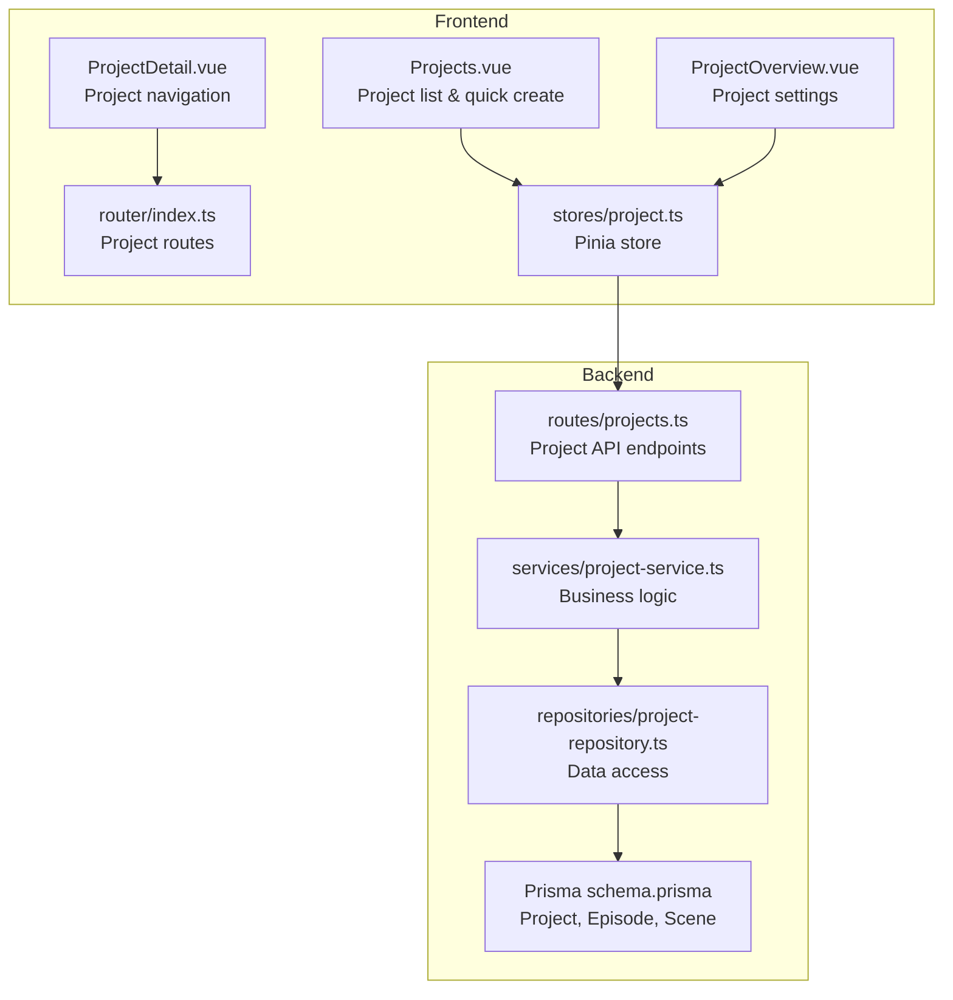
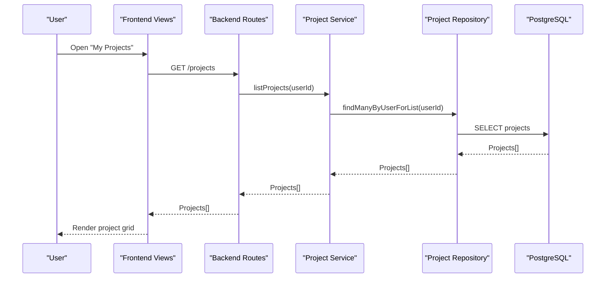
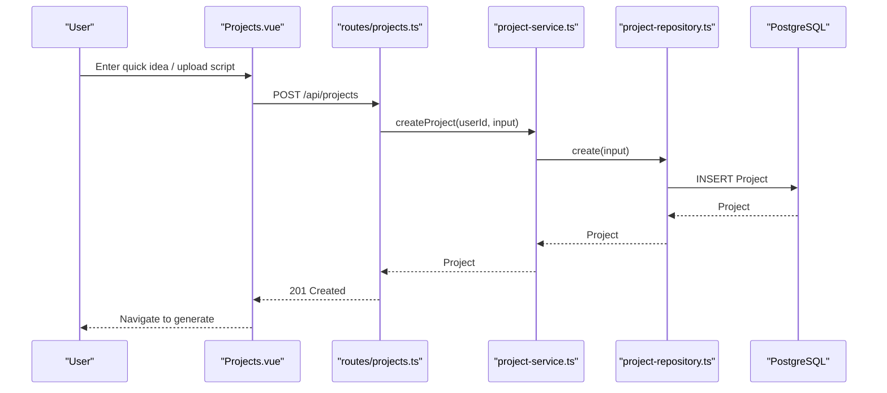
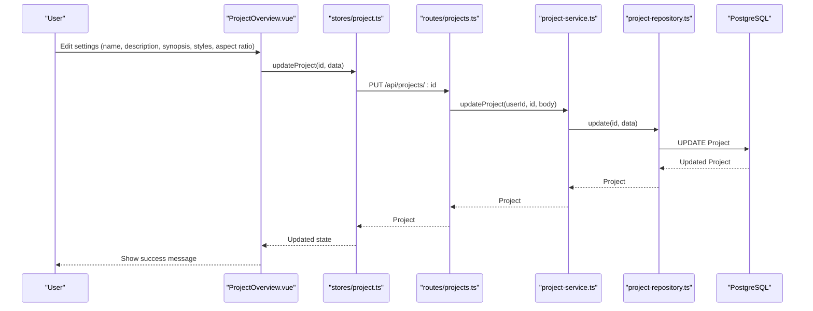
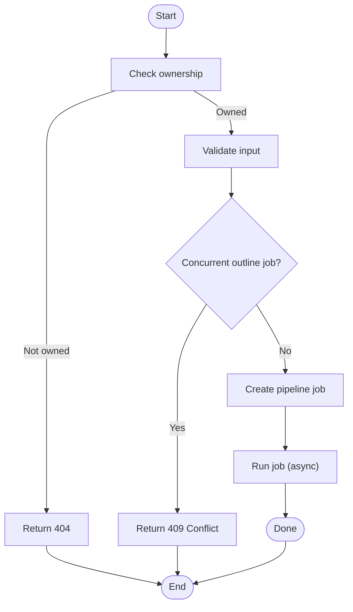
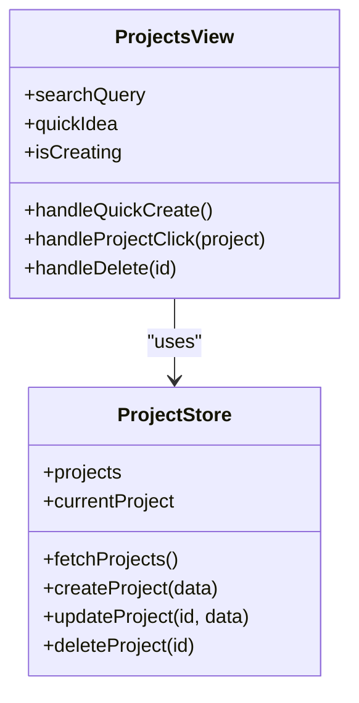
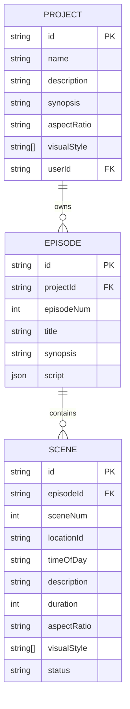
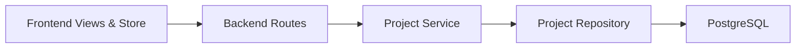

# Project Management

<cite>
**Referenced Files in This Document**
- [README.md](file://README.md)
- [schema.prisma](file://packages/backend/prisma/schema.prisma)
- [project-service.ts](file://packages/backend/src/services/project-service.ts)
- [project-repository.ts](file://packages/backend/src/repositories/project-repository.ts)
- [projects.ts](file://packages/backend/src/routes/projects.ts)
- [project.ts](file://packages/frontend/src/stores/project.ts)
- [Projects.vue](file://packages/frontend/src/views/Projects.vue)
- [ProjectOverview.vue](file://packages/frontend/src/views/ProjectOverview.vue)
- [ProjectDetail.vue](file://packages/frontend/src/views/ProjectDetail.vue)
- [index.ts](file://packages/frontend/src/router/index.ts)
</cite>

## Table of Contents

1. [Introduction](#introduction)
2. [Project Structure](#project-structure)
3. [Core Components](#core-components)
4. [Architecture Overview](#architecture-overview)
5. [Detailed Component Analysis](#detailed-component-analysis)
6. [Dependency Analysis](#dependency-analysis)
7. [Performance Considerations](#performance-considerations)
8. [Troubleshooting Guide](#troubleshooting-guide)
9. [Conclusion](#conclusion)
10. [Appendices](#appendices)

## Introduction

This document explains the project management system of the AI short drama production platform. It covers how projects are created, configured, and managed; how teams collaborate via role-based access control; how project settings and preferences are maintained; and how the project lifecycle is handled from creation to deletion. It also documents the project dashboard, templates, and organizational features, and clarifies the relationships between projects and episodes/scenes. Practical examples illustrate typical workflows such as setting up a project, managing team members, and sharing projects.

## Project Structure

The project management system spans the backend (Fastify + Prisma) and the frontend (Vue 3 + Pinia). The backend defines the data model and exposes REST endpoints for project operations. The frontend provides the user interface and state management for project lists, details, and settings.

**Diagram sources**

- [Projects.vue:1-435](file://packages/frontend/src/views/Projects.vue#L1-L435)
- [ProjectOverview.vue:1-88](file://packages/frontend/src/views/ProjectOverview.vue#L1-L88)
- [ProjectDetail.vue:54-94](file://packages/frontend/src/views/ProjectDetail.vue#L54-L94)
- [index.ts:69-122](file://packages/frontend/src/router/index.ts#L69-L122)
- [project.ts:1-51](file://packages/frontend/src/stores/project.ts#L1-L51)
- [projects.ts:1-229](file://packages/backend/src/routes/projects.ts#L1-L229)
- [project-service.ts:1-281](file://packages/backend/src/services/project-service.ts#L1-L281)
- [project-repository.ts:1-160](file://packages/backend/src/repositories/project-repository.ts#L1-L160)
- [schema.prisma:28-72](file://packages/backend/prisma/schema.prisma#L28-L72)

**Section sources**

- [README.md:26-42](file://README.md#L26-L42)
- [schema.prisma:28-72](file://packages/backend/prisma/schema.prisma#L28-L72)
- [projects.ts:1-229](file://packages/backend/src/routes/projects.ts#L1-L229)
- [project-service.ts:1-281](file://packages/backend/src/services/project-service.ts#L1-L281)
- [project-repository.ts:1-160](file://packages/backend/src/repositories/project-repository.ts#L1-L160)
- [project.ts:1-51](file://packages/frontend/src/stores/project.ts#L1-L51)
- [Projects.vue:1-435](file://packages/frontend/src/views/Projects.vue#L1-L435)
- [ProjectOverview.vue:1-88](file://packages/frontend/src/views/ProjectOverview.vue#L1-L88)
- [ProjectDetail.vue:54-94](file://packages/frontend/src/views/ProjectDetail.vue#L54-L94)
- [index.ts:69-122](file://packages/frontend/src/router/index.ts#L69-L122)

## Core Components

- Backend API: Defines endpoints for listing, creating, updating, parsing, generating episodes, and deleting projects.
- Business service: Implements validation, ownership checks, and orchestration of pipeline jobs.
- Repository: Encapsulates Prisma queries for project-related data access.
- Frontend store: Manages project list and current project state.
- Frontend views: Provide the project dashboard, settings, and navigation.

Key responsibilities:

- Ownership enforcement: All project operations require the authenticated user to own the project.
- Project settings: Name, description, synopsis, visual style tags, and default aspect ratio.
- Lifecycle: Create, generate first episode, batch generate remaining episodes, parse script, and delete.
- Dashboard: Grid view of projects with quick-create and search.

**Section sources**

- [projects.ts:1-229](file://packages/backend/src/routes/projects.ts#L1-L229)
- [project-service.ts:50-281](file://packages/backend/src/services/project-service.ts#L50-L281)
- [project-repository.ts:5-160](file://packages/backend/src/repositories/project-repository.ts#L5-L160)
- [project.ts:1-51](file://packages/frontend/src/stores/project.ts#L1-L51)
- [Projects.vue:1-435](file://packages/frontend/src/views/Projects.vue#L1-L435)
- [ProjectOverview.vue:1-88](file://packages/frontend/src/views/ProjectOverview.vue#L1-L88)

## Architecture Overview

The system follows a layered architecture:

- Presentation layer: Vue 3 views and router.
- Application layer: Fastify routes delegate to project service.
- Domain layer: Project service enforces business rules and coordinates pipeline jobs.
- Data access layer: Repository encapsulates Prisma operations.
- Data model: Prisma schema defines Project, Episode, Scene, and related entities.

**Diagram sources**

- [projects.ts:5-13](file://packages/backend/src/routes/projects.ts#L5-L13)
- [project-service.ts:53-55](file://packages/backend/src/services/project-service.ts#L53-L55)
- [project-repository.ts:8-16](file://packages/backend/src/repositories/project-repository.ts#L8-L16)
- [Projects.vue:30-32](file://packages/frontend/src/views/Projects.vue#L30-L32)

**Section sources**

- [projects.ts:1-229](file://packages/backend/src/routes/projects.ts#L1-L229)
- [project-service.ts:1-281](file://packages/backend/src/services/project-service.ts#L1-L281)
- [project-repository.ts:1-160](file://packages/backend/src/repositories/project-repository.ts#L1-L160)
- [Projects.vue:1-435](file://packages/frontend/src/views/Projects.vue#L1-L435)

## Detailed Component Analysis

### Project Creation Workflow

End-to-end flow for creating a project and generating the first episode:

1. User enters a brief idea or uploads a script in the project list view.
2. Frontend calls the backend to create a project.
3. The backend validates and creates the project under the authenticated user’s ownership.
4. The frontend navigates to the generation page to produce the first episode.

Practical example:

- User types “A detective in a cyberpunk city” and clicks “Generate Outline”.
- The system creates a project named after the idea and navigates to the generation page.

**Diagram sources**

- [Projects.vue:77-97](file://packages/frontend/src/views/Projects.vue#L77-L97)
- [projects.ts:15-33](file://packages/backend/src/routes/projects.ts#L15-L33)
- [project-service.ts:57-67](file://packages/backend/src/services/project-service.ts#L57-L67)
- [project-repository.ts:18-20](file://packages/backend/src/repositories/project-repository.ts#L18-L20)

**Section sources**

- [Projects.vue:1-435](file://packages/frontend/src/views/Projects.vue#L1-L435)
- [projects.ts:15-33](file://packages/backend/src/routes/projects.ts#L15-L33)
- [project-service.ts:57-67](file://packages/backend/src/services/project-service.ts#L57-L67)
- [project-repository.ts:18-20](file://packages/backend/src/repositories/project-repository.ts#L18-L20)

### Project Settings and Preferences

Project settings include:

- Basic info: name, description
- Synopsis
- Visual style tags (e.g., realistic, cinematic, anime, vintage)
- Default aspect ratio (e.g., 9:16, 16:9, 1:1, 4:3, 3:4, 21:9)

The frontend binds form fields to the current project and saves updates via the store to the backend endpoint.

Practical example:

- Set visual style to “cinematic” and “anime” and default aspect ratio to “16:9”.

**Diagram sources**

- [ProjectOverview.vue:69-86](file://packages/frontend/src/views/ProjectOverview.vue#L69-L86)
- [project.ts:27-34](file://packages/frontend/src/stores/project.ts#L27-L34)
- [projects.ts:182-211](file://packages/backend/src/routes/projects.ts#L182-L211)
- [project-service.ts:233-268](file://packages/backend/src/services/project-service.ts#L233-L268)
- [project-repository.ts:65-70](file://packages/backend/src/repositories/project-repository.ts#L65-L70)

**Section sources**

- [ProjectOverview.vue:1-88](file://packages/frontend/src/views/ProjectOverview.vue#L1-L88)
- [project.ts:1-51](file://packages/frontend/src/stores/project.ts#L1-L51)
- [projects.ts:182-211](file://packages/backend/src/routes/projects.ts#L182-L211)
- [project-service.ts:233-268](file://packages/backend/src/services/project-service.ts#L233-L268)
- [project-repository.ts:65-70](file://packages/backend/src/repositories/project-repository.ts#L65-L70)

### Project Lifecycle Management

Lifecycle stages:

- Create: POST /api/projects
- Generate first episode: POST /api/projects/:id/episodes/generate-first
- Generate remaining episodes: POST /api/projects/:id/episodes/generate-remaining
- Parse script: POST /api/projects/:id/parse
- Retrieve active outline job: GET /api/projects/:id/outline-active-job
- Update: PUT /api/projects/:id
- Delete: DELETE /api/projects/:id

Ownership and concurrency:

- All operations check ownership before proceeding.
- Concurrent outline jobs are prevented to avoid conflicts.

Practical example:

- After generating the first episode, batch-generate 10 more episodes with a target of 10.
- Monitor the active outline job to prevent overlapping operations.

**Diagram sources**

- [project-service.ts:69-114](file://packages/backend/src/services/project-service.ts#L69-L114)
- [project-service.ts:116-157](file://packages/backend/src/services/project-service.ts#L116-L157)
- [project-service.ts:159-201](file://packages/backend/src/services/project-service.ts#L159-L201)
- [project-service.ts:203-227](file://packages/backend/src/services/project-service.ts#L203-L227)

**Section sources**

- [projects.ts:35-136](file://packages/backend/src/routes/projects.ts#L35-L136)
- [project-service.ts:69-227](file://packages/backend/src/services/project-service.ts#L69-L227)

### Project Dashboard Interface

The dashboard presents:

- Project grid with cards showing name, description, creation date, and status badge.
- Quick-create area for ideas or uploaded scripts.
- Navigation to tasks, stats, model calls, and settings.
- Search/filtering by name or description.
- Dropdown actions (e.g., delete) with confirmation.

**Diagram sources**

- [Projects.vue:1-435](file://packages/frontend/src/views/Projects.vue#L1-L435)
- [project.ts:1-51](file://packages/frontend/src/stores/project.ts#L1-L51)

**Section sources**

- [Projects.vue:1-435](file://packages/frontend/src/views/Projects.vue#L1-L435)
- [project.ts:1-51](file://packages/frontend/src/stores/project.ts#L1-L51)

### Project Templates and Organizational Features

- Templates: Not explicitly defined in the current codebase. Teams can reuse projects by copying settings (name, description, synopsis, visual styles, aspect ratio) and regenerating episodes.
- Organization: Projects are owned by a single user. There is no built-in team membership or role-based access control at the project level in the current implementation.

Note: If team collaboration is required, consider extending the data model with a project membership table and adding role fields (e.g., owner, editor, viewer).

**Section sources**

- [schema.prisma:28-53](file://packages/backend/prisma/schema.prisma#L28-L53)
- [project-service.ts:74-76](file://packages/backend/src/services/project-service.ts#L74-L76)

### Relationship Between Projects, Episodes, and Scenes

Projects own episodes; episodes own scenes. This hierarchical structure supports the production workflow from project-level settings to individual scene details.

**Diagram sources**

- [schema.prisma:28-140](file://packages/backend/prisma/schema.prisma#L28-L140)

**Section sources**

- [schema.prisma:28-140](file://packages/backend/prisma/schema.prisma#L28-L140)

### Team Collaboration, Permissions, and Ownership Transfer

Current state:

- Ownership: Projects are owned by a single user; all operations require ownership verification.
- Access control: No explicit roles (owner/editor/viewer) or invitations are implemented.
- Ownership transfer: Not present in the current codebase.

Recommendations:

- Add a project membership table linking users to projects with role attributes.
- Implement invitation emails and acceptance flows.
- Enforce role-based permissions for editing episodes, scenes, and compositions.
- Provide ownership transfer workflows with confirmation dialogs.

[No sources needed since this section provides recommendations without analyzing specific files]

### Practical Examples

#### Example 1: Setting Up a New Project

- Open the project list view.
- Paste a short idea or drag-and-drop a script file.
- Click “Generate Outline” to create the project and navigate to the generation page.

Outcome: A new project appears in the dashboard with a generated first episode.

**Section sources**

- [Projects.vue:77-97](file://packages/frontend/src/views/Projects.vue#L77-L97)

#### Example 2: Managing Team Members (Conceptual)

- Extend the data model to include a ProjectMember entity with role.
- Add endpoints for inviting users, accepting invitations, and updating roles.
- Enforce role checks before allowing edits to episodes or scenes.

[No sources needed since this section provides conceptual guidance]

#### Example 3: Sharing a Project (Conceptual)

- Generate a shareable link with read-only or edit permissions.
- Use role-based access to restrict editing to editors and viewers.

[No sources needed since this section provides conceptual guidance]

## Dependency Analysis

The frontend depends on the backend APIs for all project operations. The backend enforces ownership and delegates to the service layer, which coordinates with the repository and database.

**Diagram sources**

- [project.ts:1-51](file://packages/frontend/src/stores/project.ts#L1-L51)
- [projects.ts:1-229](file://packages/backend/src/routes/projects.ts#L1-L229)
- [project-service.ts:1-281](file://packages/backend/src/services/project-service.ts#L1-L281)
- [project-repository.ts:1-160](file://packages/backend/src/repositories/project-repository.ts#L1-L160)
- [schema.prisma:28-72](file://packages/backend/prisma/schema.prisma#L28-L72)

**Section sources**

- [project.ts:1-51](file://packages/frontend/src/stores/project.ts#L1-L51)
- [projects.ts:1-229](file://packages/backend/src/routes/projects.ts#L1-L229)
- [project-service.ts:1-281](file://packages/backend/src/services/project-service.ts#L1-L281)
- [project-repository.ts:1-160](file://packages/backend/src/repositories/project-repository.ts#L1-L160)
- [schema.prisma:28-72](file://packages/backend/prisma/schema.prisma#L28-L72)

## Performance Considerations

- Asynchronous jobs: Episode generation and script parsing run asynchronously to avoid blocking the UI.
- Pagination and filtering: Use server-side filtering and pagination for large project lists.
- Caching: Cache frequently accessed project details to reduce database load.
- Batch operations: Prefer batch endpoints for generating multiple episodes to minimize round trips.

[No sources needed since this section provides general guidance]

## Troubleshooting Guide

Common issues and resolutions:

- Project not found: Ensure the user owns the project ID; backend returns 404 for non-owned projects.
- Concurrent operation errors: If a script generation or parse job is already running, the backend returns 409; wait for completion or cancel the job.
- Invalid input: The backend validates visualStyle and aspectRatio; ensure arrays and strings are provided correctly.
- Deleting a project: Confirm the operation; deletion is permanent.

**Section sources**

- [project-service.ts:74-90](file://packages/backend/src/services/project-service.ts#L74-L90)
- [project-service.ts:136-142](file://packages/backend/src/services/project-service.ts#L136-L142)
- [project-service.ts:180-186](file://packages/backend/src/services/project-service.ts#L180-L186)
- [project-service.ts:240-243](file://packages/backend/src/services/project-service.ts#L240-L243)

## Conclusion

The project management system provides a robust foundation for creating, configuring, and managing AI short drama projects. It includes a dashboard, settings, lifecycle operations, and clear ownership controls. To support team collaboration, extend the system with project memberships, roles, invitations, and ownership transfer mechanisms.

[No sources needed since this section summarizes without analyzing specific files]

## Appendices

### API Reference: Project Endpoints

- GET /api/projects
  - Description: List projects for the authenticated user.
  - Authentication: Required.
- POST /api/projects
  - Description: Create a new project.
  - Body: name, description, aspectRatio (optional).
  - Returns: 201 Created with project data.
- POST /api/projects/:id/episodes/generate-first
  - Description: Generate the first episode for the project.
  - Body: description (optional).
  - Returns: Episode and synopsis on success.
- POST /api/projects/:id/episodes/generate-remaining
  - Description: Start a batch job to generate remaining episodes.
  - Body: targetEpisodes (default defined in service).
  - Returns: Job ID and status.
- POST /api/projects/:id/parse
  - Description: Start a script parse job to extract entities and slots.
  - Body: targetEpisodes (optional).
  - Returns: Job ID and status.
- GET /api/projects/:id/outline-active-job
  - Description: Check if an outline job is currently running.
  - Returns: Job info or null.
- GET /api/projects/:id
  - Description: Retrieve full project details (episodes, characters, locations, compositions).
- PUT /api/projects/:id
  - Description: Update project settings (name, description, synopsis, visualStyle, aspectRatio).
- PATCH /api/projects/:id
  - Description: Partial update of project settings.
- DELETE /api/projects/:id
  - Description: Delete the project if owned by the user.
  - Returns: 204 No Content on success.

**Section sources**

- [projects.ts:1-229](file://packages/backend/src/routes/projects.ts#L1-L229)
- [project-service.ts:69-227](file://packages/backend/src/services/project-service.ts#L69-L227)
