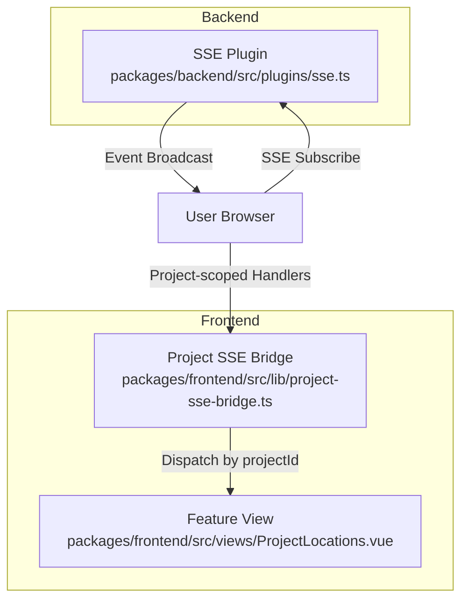
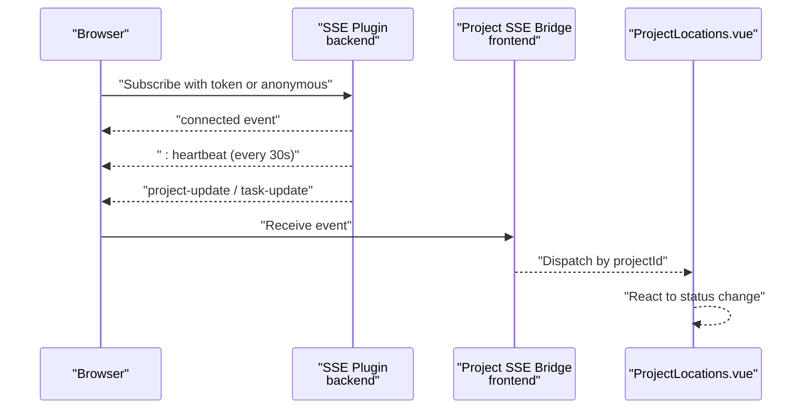
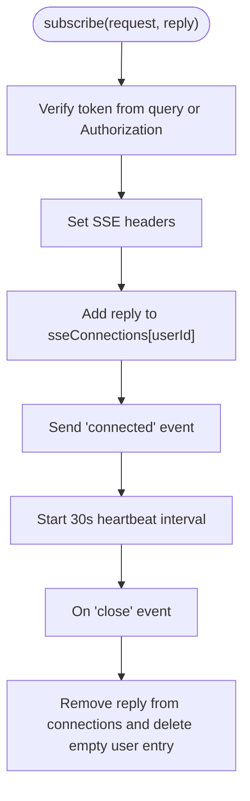
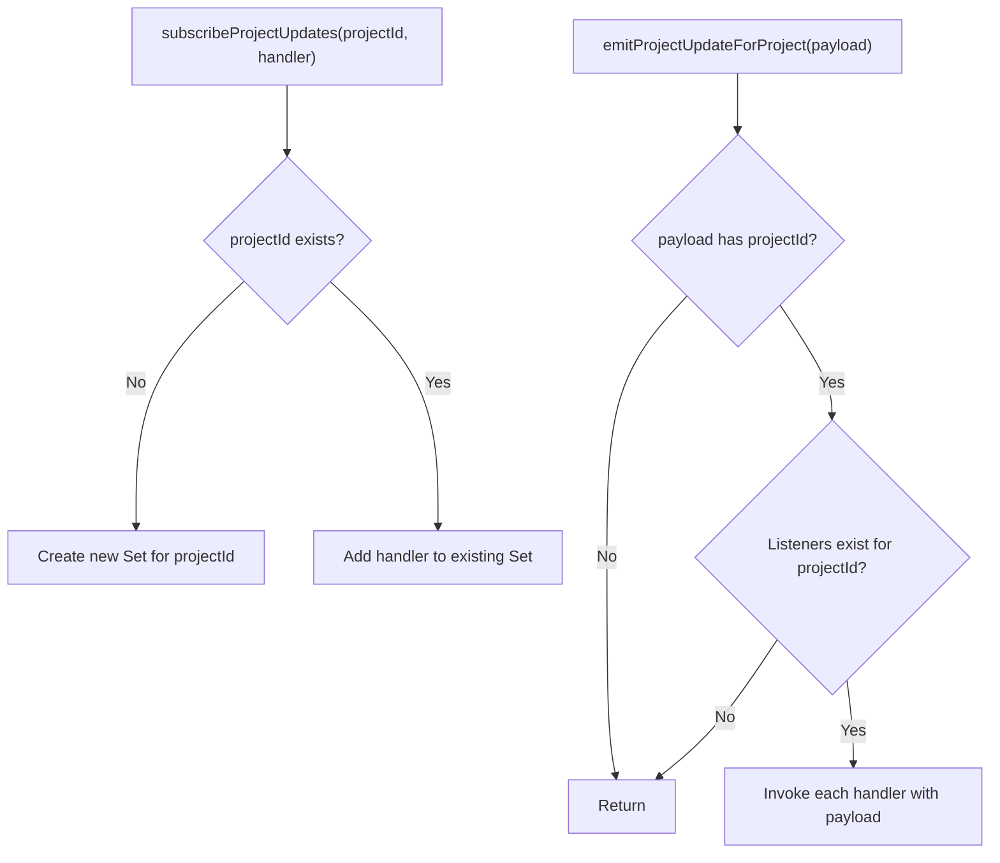
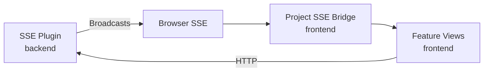

# Real-time Collaboration

<cite>
**Referenced Files in This Document**
- [packages/backend/src/plugins/sse.ts](file://packages/backend/src/plugins/sse.ts)
- [packages/backend/tests/sse-plugin.test.ts](file://packages/backend/tests/sse-plugin.test.ts)
- [packages/backend/tests/sse-integration.test.ts](file://packages/backend/tests/sse-integration.test.ts)
- [packages/frontend/src/lib/project-sse-bridge.ts](file://packages/frontend/src/lib/project-sse-bridge.ts)
- [packages/frontend/src/views/ProjectLocations.vue](file://packages/frontend/src/views/ProjectLocations.vue)
- [packages/frontend/package.json](file://packages/frontend/package.json)
</cite>

## Table of Contents

1. [Introduction](#introduction)
2. [Project Structure](#project-structure)
3. [Core Components](#core-components)
4. [Architecture Overview](#architecture-overview)
5. [Detailed Component Analysis](#detailed-component-analysis)
6. [Dependency Analysis](#dependency-analysis)
7. [Performance Considerations](#performance-considerations)
8. [Troubleshooting Guide](#troubleshooting-guide)
9. [Conclusion](#conclusion)

## Introduction

This document explains the real-time collaboration system centered around Server-Sent Events (SSE) for live updates, concurrent editing support, and conflict resolution mechanisms. It covers the server-side SSE implementation, client-side synchronization via a project-specific SSE bridge, presence indicators, collaborative editing features, event broadcasting, and offline handling. It also addresses performance, scalability, and debugging tools for real-time features.

## Project Structure

The real-time collaboration system spans the backend and frontend:

- Backend: Fastify plugin implementing SSE, with user-to-connection mapping and heartbeat management.
- Frontend: A project-scoped SSE bridge that decouples global SSE subscriptions from feature-specific components, enabling targeted updates for roles, locations, and other domain areas.

**Diagram sources**

- [packages/backend/src/plugins/sse.ts:1-108](file://packages/backend/src/plugins/sse.ts#L1-L108)
- [packages/frontend/src/lib/project-sse-bridge.ts:1-48](file://packages/frontend/src/lib/project-sse-bridge.ts#L1-L48)
- [packages/frontend/src/views/ProjectLocations.vue:153-201](file://packages/frontend/src/views/ProjectLocations.vue#L153-L201)

**Section sources**

- [packages/backend/src/plugins/sse.ts:1-108](file://packages/backend/src/plugins/sse.ts#L1-L108)
- [packages/frontend/src/lib/project-sse-bridge.ts:1-48](file://packages/frontend/src/lib/project-sse-bridge.ts#L1-L48)
- [packages/frontend/src/views/ProjectLocations.vue:153-201](file://packages/frontend/src/views/ProjectLocations.vue#L153-L201)

## Core Components

- Backend SSE Plugin
  - Maintains per-user SSE connections and broadcasts events to subscribed clients.
  - Provides convenience functions to send task and project updates.
  - Supports JWT-based user identification and anonymous fallback.
  - Emits periodic heartbeats and cleans up connections on close.

- Frontend Project SSE Bridge
  - Decouples global SSE subscriptions from feature-specific handlers.
  - Subscribes to project-scoped updates and dispatches them to registered listeners.
  - Ensures safe invocation of handlers and cleanup on unsubscribe.

- Feature View Integration
  - Subscribes to project updates and reacts to image generation completion or failure.
  - Hydrates pending jobs from queue state and refreshes data accordingly.

**Section sources**

- [packages/backend/src/plugins/sse.ts:1-108](file://packages/backend/src/plugins/sse.ts#L1-L108)
- [packages/frontend/src/lib/project-sse-bridge.ts:1-48](file://packages/frontend/src/lib/project-sse-bridge.ts#L1-L48)
- [packages/frontend/src/views/ProjectLocations.vue:153-201](file://packages/frontend/src/views/ProjectLocations.vue#L153-L201)

## Architecture Overview

The system uses Server-Sent Events for unidirectional server-to-client streaming. The backend maintains a map of user IDs to active SSE replies and writes formatted messages to each connection. The frontend listens globally, then filters and routes events to feature-specific handlers using a project-scoped bridge.

**Diagram sources**

- [packages/backend/src/plugins/sse.ts:45-107](file://packages/backend/src/plugins/sse.ts#L45-L107)
- [packages/frontend/src/lib/project-sse-bridge.ts:19-47](file://packages/frontend/src/lib/project-sse-bridge.ts#L19-L47)
- [packages/frontend/src/views/ProjectLocations.vue:153-201](file://packages/frontend/src/views/ProjectLocations.vue#L153-L201)

## Detailed Component Analysis

### Backend SSE Plugin

- Responsibilities
  - Accept SSE subscriptions with optional JWT token or query parameter.
  - Set appropriate SSE headers and stream initial connection and heartbeat messages.
  - Maintain a per-user connection registry and broadcast events to all connections for that user.
  - Clean up connections on close and remove empty user entries.

- Event Broadcasting
  - Formats events as “event: …” and “data: …” lines followed by a blank line separator.
  - Sends “connected” on initial connect and “heartbeats” periodically.
  - Exposes convenience functions to send task and project updates.

- Token and Presence
  - Attempts to verify a JWT from Authorization header or subscribe query parameter.
  - Falls back to anonymous identity if token verification fails.
  - Presence is implicit via active connections per user ID.

- Offline Handling
  - Heartbeats help detect broken connections; cleanup removes stale entries.
  - Clients should reconnect to restore subscription.

**Diagram sources**

- [packages/backend/src/plugins/sse.ts:45-107](file://packages/backend/src/plugins/sse.ts#L45-L107)

**Section sources**

- [packages/backend/src/plugins/sse.ts:1-108](file://packages/backend/src/plugins/sse.ts#L1-L108)
- [packages/backend/tests/sse-plugin.test.ts:87-117](file://packages/backend/tests/sse-plugin.test.ts#L87-L117)
- [packages/backend/tests/sse-integration.test.ts:55-83](file://packages/backend/tests/sse-integration.test.ts#L55-L83)

### Frontend Project SSE Bridge

- Responsibilities
  - Maintain a map of projectId to a set of handlers.
  - Provide subscribeProjectUpdates to register and unregister handlers.
  - Emit project updates to all handlers for a given project ID.
  - Safely invoke handlers and log errors without breaking the pipeline.

- Integration Pattern
  - Feature views subscribe to project updates and react to specific event types (e.g., image generation completion or failure).
  - Pending job hydration ensures continuity across browser refreshes.

**Diagram sources**

- [packages/frontend/src/lib/project-sse-bridge.ts:19-47](file://packages/frontend/src/lib/project-sse-bridge.ts#L19-L47)

**Section sources**

- [packages/frontend/src/lib/project-sse-bridge.ts:1-48](file://packages/frontend/src/lib/project-sse-bridge.ts#L1-L48)
- [packages/frontend/src/views/ProjectLocations.vue:153-201](file://packages/frontend/src/views/ProjectLocations.vue#L153-L201)

### Socket-based Communication System

- Current Implementation
  - The repository implements Server-Sent Events (SSE) for real-time updates.
  - No WebSocket-based communication is present in the analyzed files.

- Recommendations
  - For bidirectional collaboration (e.g., live cursor presence or immediate conflict-free edits), consider adding WebSocket endpoints alongside SSE.
  - Maintain SSE for server-to-client notifications and WebSockets for client-to-server collaborative actions.

[No sources needed since this section provides general guidance]

### Concurrent Editing Support and Conflict Resolution

- Current Implementation
  - The repository does not include collaborative editing libraries (e.g., ProseMirror collab) in the analyzed files.
  - Real-time updates are event-driven via SSE and project-scoped handlers.

- Recommendations
  - For rich-text collaborative editing, integrate a library such as ProseMirror collab with operational transforms or conflict-free replicated datatypes (CRDTs).
  - Implement optimistic updates on the client with server-side reconciliation and rollback mechanisms.

**Section sources**

- [packages/frontend/package.json:14-28](file://packages/frontend/package.json#L14-L28)

### Examples of Real-time Notifications, Live Commenting, and Shared Workspace

- Real-time Notifications
  - Task updates: The backend exposes a function to send task updates to a user’s SSE connections.
  - Project updates: The backend exposes a function to send project-scoped updates to a user’s SSE connections.

- Live Commenting
  - Not implemented in the analyzed files. To enable, extend SSE to carry comment events and render them in the UI.

- Shared Workspace
  - Not implemented in the analyzed files. To enable, broadcast workspace state changes (e.g., selected asset, camera angle) via SSE and synchronize clients.

**Section sources**

- [packages/backend/src/plugins/sse.ts:20-34](file://packages/backend/src/plugins/sse.ts#L20-L34)
- [packages/backend/tests/sse-plugin.test.ts:45-76](file://packages/backend/tests/sse-plugin.test.ts#L45-L76)

### Client-side Synchronization and Offline Handling

- Synchronization
  - The project SSE bridge subscribes to project updates and dispatches them to feature-specific handlers.
  - Feature views react to status changes (e.g., image generation completion) and refresh data accordingly.

- Offline Handling
  - Heartbeats signal liveness; clients should reconnect on close.
  - Pending job hydration restores “in-flight” state after refresh.

**Section sources**

- [packages/frontend/src/lib/project-sse-bridge.ts:1-48](file://packages/frontend/src/lib/project-sse-bridge.ts#L1-L48)
- [packages/frontend/src/views/ProjectLocations.vue:153-201](file://packages/frontend/src/views/ProjectLocations.vue#L153-L201)

## Dependency Analysis

- Backend depends on Fastify for HTTP handling and JWT verification.
- Frontend depends on Axios for HTTP requests and Vue for reactive UI updates.
- The project SSE bridge is decoupled from global SSE subscriptions, reducing cross-feature coupling.

**Diagram sources**

- [packages/backend/src/plugins/sse.ts:1-108](file://packages/backend/src/plugins/sse.ts#L1-L108)
- [packages/frontend/src/lib/project-sse-bridge.ts:1-48](file://packages/frontend/src/lib/project-sse-bridge.ts#L1-L48)
- [packages/frontend/src/views/ProjectLocations.vue:153-201](file://packages/frontend/src/views/ProjectLocations.vue#L153-L201)

**Section sources**

- [packages/backend/src/plugins/sse.ts:1-108](file://packages/backend/src/plugins/sse.ts#L1-L108)
- [packages/frontend/src/lib/project-sse-bridge.ts:1-48](file://packages/frontend/src/lib/project-sse-bridge.ts#L1-L48)
- [packages/frontend/src/views/ProjectLocations.vue:153-201](file://packages/frontend/src/views/ProjectLocations.vue#L153-L201)

## Performance Considerations

- SSE Scalability
  - Each user connection holds an open HTTP stream; monitor memory usage and connection limits.
  - Use heartbeats to detect and prune stale connections promptly.

- Broadcasting Efficiency
  - Keep event payloads minimal; avoid large JSON blobs.
  - Batch frequent updates when possible.

- Frontend Responsiveness
  - Debounce UI reactions to rapid updates.
  - Use keyed lists and efficient diffing to minimize re-renders.

- Network Resilience
  - Implement exponential backoff for reconnection attempts.
  - Gracefully degrade UI when SSE is unavailable.

[No sources needed since this section provides general guidance]

## Troubleshooting Guide

- SSE Subscription Issues
  - Verify token presence and validity in Authorization header or subscribe query parameter.
  - Confirm SSE headers are set and initial “connected” event is received.

- Heartbeat and Disconnection
  - If heartbeats stop, the connection likely closed; trigger reconnection.
  - Ensure cleanup logic removes stale entries from the connection registry.

- Frontend Dispatch Failures
  - Handlers are invoked inside try/catch; errors are logged but do not break the pipeline.
  - Verify projectId presence in emitted payloads and proper subscription registration.

- Testing Coverage
  - Backend tests validate message formatting, plugin decoration, and sending functions.
  - Integration tests confirm SSE subscription lifecycle and message delivery.

**Section sources**

- [packages/backend/src/plugins/sse.ts:45-107](file://packages/backend/src/plugins/sse.ts#L45-L107)
- [packages/backend/tests/sse-plugin.test.ts:87-117](file://packages/backend/tests/sse-plugin.test.ts#L87-L117)
- [packages/backend/tests/sse-integration.test.ts:85-133](file://packages/backend/tests/sse-integration.test.ts#L85-L133)
- [packages/frontend/src/lib/project-sse-bridge.ts:40-46](file://packages/frontend/src/lib/project-sse-bridge.ts#L40-L46)

## Conclusion

The current real-time collaboration system leverages Server-Sent Events for reliable, low-overhead server-to-client updates. The backend maintains per-user SSE connections with heartbeat and cleanup, while the frontend uses a project-scoped bridge to route updates to feature-specific handlers. While the system supports live notifications and basic presence indicators, advanced collaborative editing and bidirectional communication are not implemented in the analyzed files. Extending the system with WebSocket endpoints and collaborative editing libraries would enable richer shared workspace experiences.
