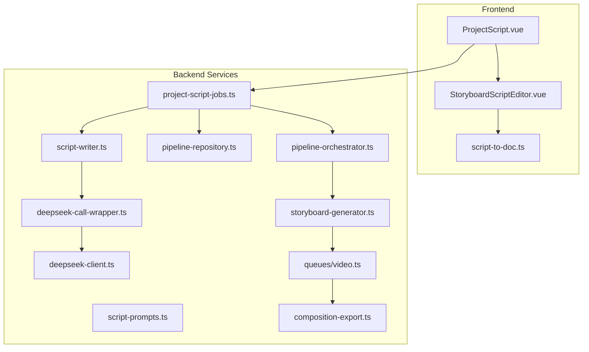
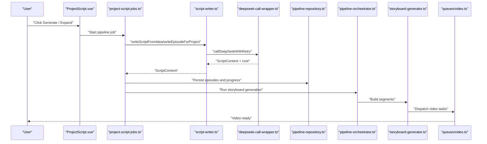
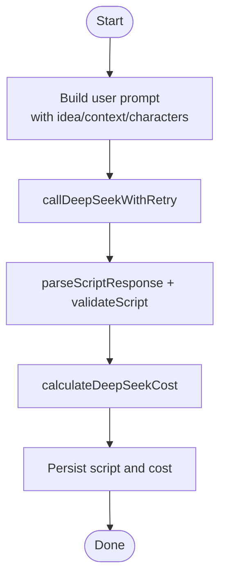
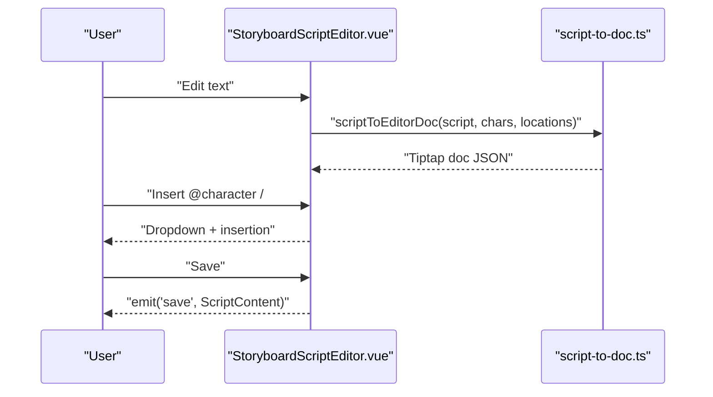
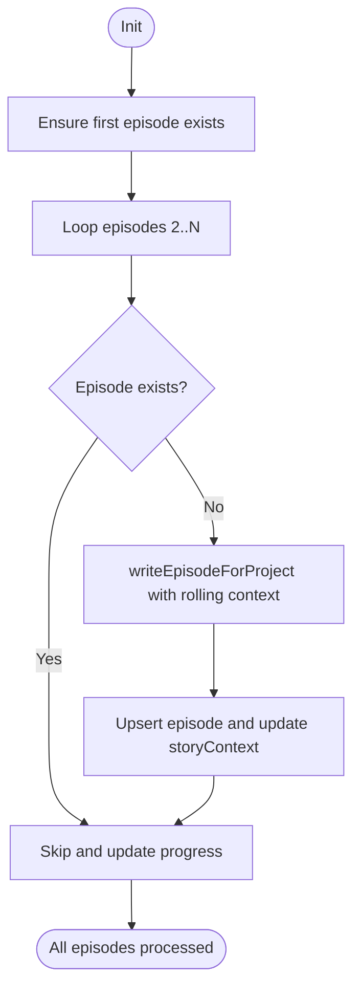
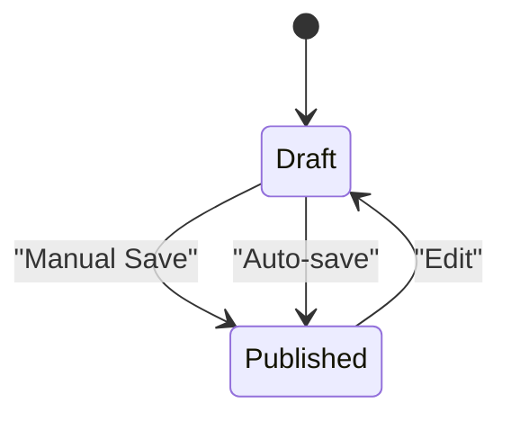
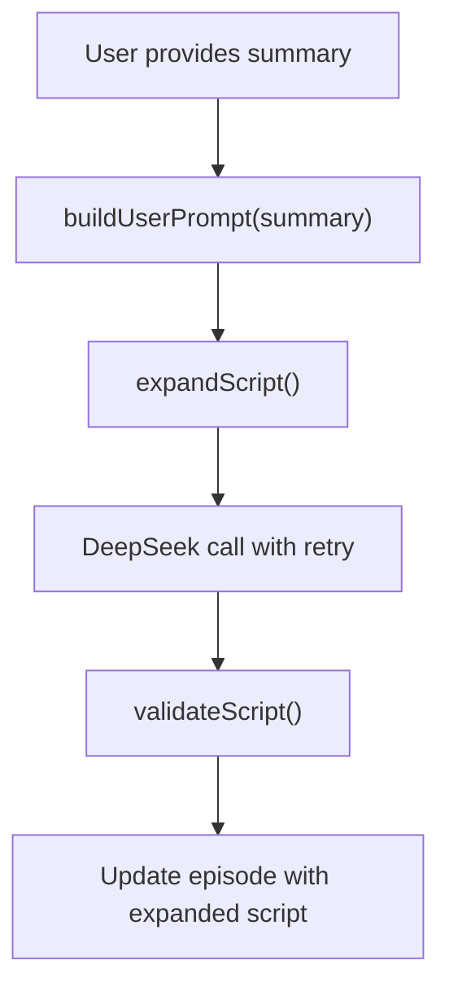
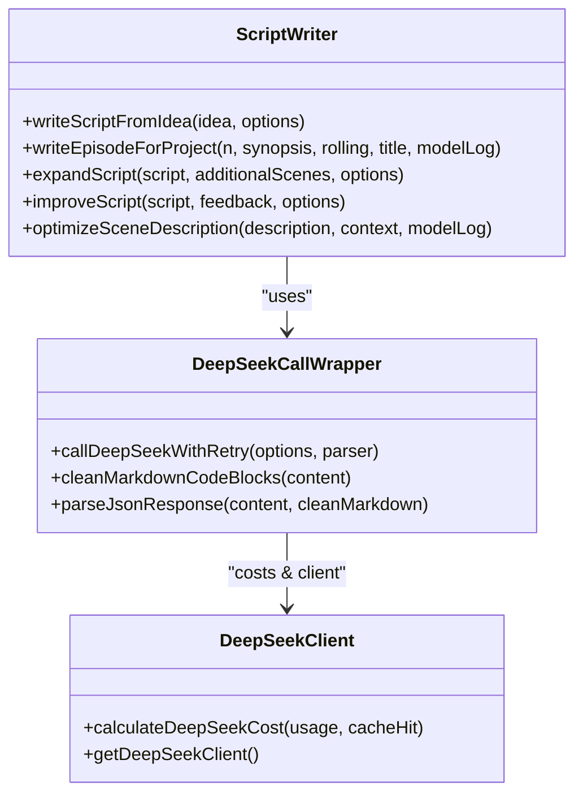
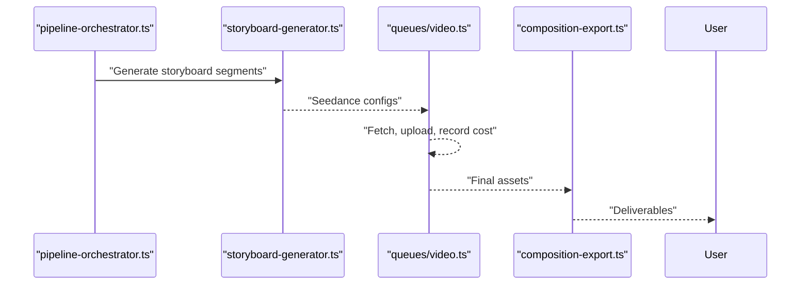
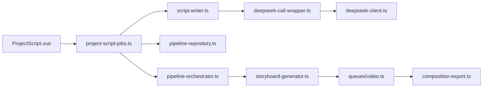

# Script Writing and Management

<cite>
**Referenced Files in This Document**
- [README.md](file://README.md)
- [script-writer.ts](file://packages/backend/src/services/script-writer.ts)
- [script-prompts.ts](file://packages/backend/src/services/prompts/script-prompts.ts)
- [deepseek-call-wrapper.ts](file://packages/backend/src/services/ai/deepseek-call-wrapper.ts)
- [deepseek-client.ts](file://packages/backend/src/services/ai/deepseek-client.ts)
- [project-script-jobs.ts](file://packages/backend/src/services/project-script-jobs.ts)
- [pipeline-repository.ts](file://packages/backend/src/repositories/pipeline-repository.ts)
- [StoryboardScriptEditor.vue](file://packages/frontend/src/components/storyboard/StoryboardScriptEditor.vue)
- [script-to-doc.ts](file://packages/frontend/src/lib/storyboard-editor/script-to-doc.ts)
- [ProjectScript.vue](file://packages/frontend/src/views/ProjectScript.vue)
- [pipeline-orchestrator.ts](file://packages/backend/src/services/pipeline-orchestrator.ts)
- [storyboard-generator.ts](file://packages/backend/src/services/storyboard-generator.ts)
- [video.ts](file://packages/backend/src/queues/video.ts)
- [composition-export.ts](file://packages/backend/src/services/composition-export.ts)
</cite>

## Table of Contents

1. [Introduction](#introduction)
2. [Project Structure](#project-structure)
3. [Core Components](#core-components)
4. [Architecture Overview](#architecture-overview)
5. [Detailed Component Analysis](#detailed-component-analysis)
6. [Dependency Analysis](#dependency-analysis)
7. [Performance Considerations](#performance-considerations)
8. [Troubleshooting Guide](#troubleshooting-guide)
9. [Conclusion](#conclusion)
10. [Appendices](#appendices)

## Introduction

This document describes the script writing and management system of the platform. It covers AI-powered script generation via DeepSeek, the rich text editor integration with Tiptap, script organization and versioning, approval workflows, collaborative editing features, cost calculation, quality assessment, and integration with video generation workflows. The system supports single-episode creation, batch generation across multiple episodes, script expansion, import from external documents, and seamless handoff into the video production pipeline.

## Project Structure

The script system spans backend services, AI integration, and frontend editor components:

- Backend AI and orchestration: script generation, retry and cost calculation, pipeline jobs, and video generation queue
- Frontend editor: Tiptap-based script editor with mentions and locations, episode selection, and auto-save
- Pipeline integration: end-to-end orchestration from script to video

**Diagram sources**

- [ProjectScript.vue:1-772](file://packages/frontend/src/views/ProjectScript.vue#L1-L772)
- [StoryboardScriptEditor.vue:81-422](file://packages/frontend/src/components/storyboard/StoryboardScriptEditor.vue#L81-L422)
- [script-to-doc.ts:92-114](file://packages/frontend/src/lib/storyboard-editor/script-to-doc.ts#L92-L114)
- [script-writer.ts:1-386](file://packages/backend/src/services/script-writer.ts#L1-L386)
- [script-prompts.ts:1-114](file://packages/backend/src/services/prompts/script-prompts.ts#L1-L114)
- [deepseek-call-wrapper.ts:1-177](file://packages/backend/src/services/ai/deepseek-call-wrapper.ts#L1-L177)
- [deepseek-client.ts:1-64](file://packages/backend/src/services/ai/deepseek-client.ts#L1-L64)
- [project-script-jobs.ts:1-526](file://packages/backend/src/services/project-script-jobs.ts#L1-L526)
- [pipeline-repository.ts:91-130](file://packages/backend/src/repositories/pipeline-repository.ts#L91-L130)
- [pipeline-orchestrator.ts:162-372](file://packages/backend/src/services/pipeline-orchestrator.ts#L162-L372)
- [storyboard-generator.ts:48-105](file://packages/backend/src/services/storyboard-generator.ts#L48-L105)
- [video.ts:159-198](file://packages/backend/src/queues/video.ts#L159-L198)
- [composition-export.ts](file://packages/backend/src/services/composition-export.ts)

**Section sources**

- [README.md:1-123](file://README.md#L1-L123)

## Core Components

- AI script writer service: generates, improves, expands, and optimizes scripts using DeepSeek with robust retry, parsing, validation, and cost accounting
- Prompt templates: strict JSON schema and creative guidelines for script structure and AI-friendly descriptions
- Frontend script editor: Tiptap-based editor with mentions, locations, auto-save, and episode-centric editing
- Pipeline jobs: orchestrate first episode generation, batch episode generation, and post-processing (entity parsing, visual enrichment)
- Video pipeline: transforms scripts into storyboard segments, parametrize Seedance, and generate videos with cost tracking and storage

**Section sources**

- [script-writer.ts:1-386](file://packages/backend/src/services/script-writer.ts#L1-L386)
- [script-prompts.ts:1-114](file://packages/backend/src/services/prompts/script-prompts.ts#L1-L114)
- [StoryboardScriptEditor.vue:81-422](file://packages/frontend/src/components/storyboard/StoryboardScriptEditor.vue#L81-L422)
- [ProjectScript.vue:1-772](file://packages/frontend/src/views/ProjectScript.vue#L1-L772)
- [project-script-jobs.ts:1-526](file://packages/backend/src/services/project-script-jobs.ts#L1-L526)
- [pipeline-orchestrator.ts:162-372](file://packages/backend/src/services/pipeline-orchestrator.ts#L162-L372)

## Architecture Overview

End-to-end flow from idea to video:

1. User initiates script generation or expansion in the frontend
2. Backend orchestrates pipeline jobs to generate or batch-generate episodes
3. Scripts are validated and converted to internal format
4. Entities (characters, locations) are extracted and enriched visually
5. Storyboard segments are generated and passed to Seedance parametrization
6. Video generation queue produces media and uploads to storage
7. Export and composition services finalize deliverables

**Diagram sources**

- [ProjectScript.vue:1-772](file://packages/frontend/src/views/ProjectScript.vue#L1-L772)
- [project-script-jobs.ts:164-409](file://packages/backend/src/services/project-script-jobs.ts#L164-L409)
- [script-writer.ts:31-103](file://packages/backend/src/services/script-writer.ts#L31-L103)
- [deepseek-call-wrapper.ts:56-145](file://packages/backend/src/services/ai/deepseek-call-wrapper.ts#L56-L145)
- [pipeline-repository.ts:91-130](file://packages/backend/src/repositories/pipeline-repository.ts#L91-L130)
- [pipeline-orchestrator.ts:162-372](file://packages/backend/src/services/pipeline-orchestrator.ts#L162-L372)
- [storyboard-generator.ts:48-105](file://packages/backend/src/services/storyboard-generator.ts#L48-L105)
- [video.ts:159-198](file://packages/backend/src/queues/video.ts#L159-L198)

## Detailed Component Analysis

### AI Script Generation and Editing

- Idea-to-script generation: builds user prompt from idea, optional characters, and project context; invokes DeepSeek with retry and parses structured JSON
- Episode continuation: writes subsequent episodes using rolling context and series metadata
- Script expansion: adds new scenes while preserving style, tone, and continuity
- Improvement mode: applies user feedback to refine existing scripts
- Scene optimization: enhances scene descriptions for AI video generation
- Cost and logging: tracks token usage and calculates RMB cost per call; logs model interactions

**Diagram sources**

- [script-writer.ts:31-103](file://packages/backend/src/services/script-writer.ts#L31-L103)
- [deepseek-call-wrapper.ts:56-145](file://packages/backend/src/services/ai/deepseek-call-wrapper.ts#L56-L145)
- [deepseek-client.ts:31-56](file://packages/backend/src/services/ai/deepseek-client.ts#L31-L56)

**Section sources**

- [script-writer.ts:1-386](file://packages/backend/src/services/script-writer.ts#L1-L386)
- [script-prompts.ts:1-114](file://packages/backend/src/services/prompts/script-prompts.ts#L1-L114)
- [deepseek-call-wrapper.ts:1-177](file://packages/backend/src/services/ai/deepseek-call-wrapper.ts#L1-L177)
- [deepseek-client.ts:1-64](file://packages/backend/src/services/ai/deepseek-client.ts#L1-L64)

### Rich Text Editor Integration (Tiptap)

- Editor setup: initializes Tiptap with StarterKit, placeholder, custom mention and location extensions
- Mentions and locations: custom dropdown and keyboard navigation for inserting character and location nodes
- Document conversion: converts ScriptContent to Tiptap JSON and vice versa, preserving mentions and locations
- Auto-save and editing modes: emits save events and updates episode content; supports read-only and editing states

**Diagram sources**

- [StoryboardScriptEditor.vue:81-422](file://packages/frontend/src/components/storyboard/StoryboardScriptEditor.vue#L81-L422)
- [script-to-doc.ts:92-114](file://packages/frontend/src/lib/storyboard-editor/script-to-doc.ts#L92-L114)

**Section sources**

- [StoryboardScriptEditor.vue:81-422](file://packages/frontend/src/components/storyboard/StoryboardScriptEditor.vue#L81-L422)
- [script-to-doc.ts:92-114](file://packages/frontend/src/lib/storyboard-editor/script-to-doc.ts#L92-L114)

### Script Organization and Versioning

- Episode-centric storage: each episode holds its own script JSON; merging across episodes supported for downstream processing
- First episode generation and batch jobs: ensures first episode exists, then fills missing episodes with rolling context and memory-aware writing
- Progress tracking: pipeline jobs track status, current step, and progress metadata; prevents concurrent outline jobs
- Entity extraction and enrichment: merges episodes into a unified script for entity parsing and visual enrichment

**Diagram sources**

- [project-script-jobs.ts:415-466](file://packages/backend/src/services/project-script-jobs.ts#L415-L466)
- [pipeline-repository.ts:91-130](file://packages/backend/src/repositories/pipeline-repository.ts#L91-L130)

**Section sources**

- [project-script-jobs.ts:1-526](file://packages/backend/src/services/project-script-jobs.ts#L1-L526)
- [pipeline-repository.ts:91-130](file://packages/backend/src/repositories/pipeline-repository.ts#L91-L130)

### Approval Workflows and Collaboration

- Draft to published lifecycle: episodes are marked as draft until saved; status badges reflect completeness
- Auto-save and manual save: frequent autosave with user feedback; explicit save button for deterministic persistence
- Collaborative editing: mentions and locations are first-class nodes in the editor; multiple users can edit concurrently with awareness of character and location references

**Diagram sources**

- [ProjectScript.vue:28-110](file://packages/frontend/src/views/ProjectScript.vue#L28-L110)

**Section sources**

- [ProjectScript.vue:1-772](file://packages/frontend/src/views/ProjectScript.vue#L1-L772)

### Script Expansion, Templates, and Review Processes

- Expansion prompts: instruct AI to add scenes while maintaining style, characters, and narrative logic
- Template usage: strict JSON schema enforced by prompts and parsers; metadata fields guide genre, tone, and structure
- Review process: after generation, users can expand or improve scripts; improvements preserve structure and refine content

**Diagram sources**

- [script-writer.ts:108-152](file://packages/backend/src/services/script-writer.ts#L108-L152)
- [script-prompts.ts:1-114](file://packages/backend/src/services/prompts/script-prompts.ts#L1-L114)

**Section sources**

- [script-writer.ts:108-199](file://packages/backend/src/services/script-writer.ts#L108-L199)
- [script-prompts.ts:1-114](file://packages/backend/src/services/prompts/script-prompts.ts#L1-L114)

### Integration with AI Services, Cost Calculation, and Quality Assessment

- DeepSeek integration: OpenAI-compatible client with configurable base URL and API key; retry logic for auth and rate limit errors
- Cost calculation: computes RMB cost from input/output token usage; distinguishes cache hit pricing
- Quality assessment: validates script structure and scene completeness; scene optimization improves AI video generation fidelity

**Diagram sources**

- [deepseek-call-wrapper.ts:1-177](file://packages/backend/src/services/ai/deepseek-call-wrapper.ts#L1-L177)
- [deepseek-client.ts:1-64](file://packages/backend/src/services/ai/deepseek-client.ts#L1-L64)
- [script-writer.ts:1-386](file://packages/backend/src/services/script-writer.ts#L1-L386)

**Section sources**

- [deepseek-call-wrapper.ts:1-177](file://packages/backend/src/services/ai/deepseek-call-wrapper.ts#L1-L177)
- [deepseek-client.ts:1-64](file://packages/backend/src/services/ai/deepseek-client.ts#L1-L64)
- [script-writer.ts:280-381](file://packages/backend/src/services/script-writer.ts#L280-L381)

### Script Export Formats and Video Generation Integration

- Storyboard generation: converts scenes into segments with character info, visual style, camera movement, effects, and voice segments
- Seedance parametrization: builds configurations for Seedance API with validation and defaults
- Video generation: dispatches tasks, downloads results, uploads to MinIO, and records costs
- Composition export: prepares final compositions and exports for delivery

**Diagram sources**

- [pipeline-orchestrator.ts:162-372](file://packages/backend/src/services/pipeline-orchestrator.ts#L162-L372)
- [storyboard-generator.ts:48-105](file://packages/backend/src/services/storyboard-generator.ts#L48-L105)
- [video.ts:159-198](file://packages/backend/src/queues/video.ts#L159-L198)
- [composition-export.ts](file://packages/backend/src/services/composition-export.ts)

**Section sources**

- [pipeline-orchestrator.ts:162-372](file://packages/backend/src/services/pipeline-orchestrator.ts#L162-L372)
- [storyboard-generator.ts:48-105](file://packages/backend/src/services/storyboard-generator.ts#L48-L105)
- [video.ts:159-198](file://packages/backend/src/queues/video.ts#L159-L198)
- [composition-export.ts](file://packages/backend/src/services/composition-export.ts)

## Dependency Analysis

- Frontend depends on backend for pipeline orchestration and script persistence
- Backend services depend on AI wrappers and clients for DeepSeek, and on repositories for job state
- Video pipeline depends on Seedance/Wan APIs and MinIO for storage

**Diagram sources**

- [ProjectScript.vue:1-772](file://packages/frontend/src/views/ProjectScript.vue#L1-L772)
- [project-script-jobs.ts:1-526](file://packages/backend/src/services/project-script-jobs.ts#L1-L526)
- [script-writer.ts:1-386](file://packages/backend/src/services/script-writer.ts#L1-L386)
- [deepseek-call-wrapper.ts:1-177](file://packages/backend/src/services/ai/deepseek-call-wrapper.ts#L1-L177)
- [deepseek-client.ts:1-64](file://packages/backend/src/services/ai/deepseek-client.ts#L1-L64)
- [pipeline-repository.ts:91-130](file://packages/backend/src/repositories/pipeline-repository.ts#L91-L130)
- [pipeline-orchestrator.ts:162-372](file://packages/backend/src/services/pipeline-orchestrator.ts#L162-L372)
- [storyboard-generator.ts:48-105](file://packages/backend/src/services/storyboard-generator.ts#L48-L105)
- [video.ts:159-198](file://packages/backend/src/queues/video.ts#L159-L198)
- [composition-export.ts](file://packages/backend/src/services/composition-export.ts)

**Section sources**

- [project-script-jobs.ts:1-526](file://packages/backend/src/services/project-script-jobs.ts#L1-L526)
- [pipeline-repository.ts:91-130](file://packages/backend/src/repositories/pipeline-repository.ts#L91-L130)

## Performance Considerations

- Token usage and cost: monitor input/output token counts to estimate cost; cache-hit pricing reduces input cost
- Retry strategy: exponential backoff for rate limits; immediate failure for auth errors
- Memory context window: sliding window of rolling context to keep prompts bounded
- Concurrency control: prevent overlapping outline jobs per project; ensure mutual exclusion for script-batch
- Batch efficiency: embed batch progress into parse-script job to reduce UI churn

[No sources needed since this section provides general guidance]

## Troubleshooting Guide

- Authentication failures: check API key and base URL; errors are surfaced as specific exceptions
- Rate limiting: the wrapper retries with delays; reduce burst frequency or increase backoff
- Parsing errors: ensure AI returns valid JSON; the parser extracts JSON blocks and validates structure
- Pipeline stuck jobs: verify active outline jobs and avoid concurrent runs; inspect progress metadata
- Video generation issues: confirm Seedance/Wan credentials and MinIO connectivity; review uploaded URLs

**Section sources**

- [deepseek-call-wrapper.ts:103-145](file://packages/backend/src/services/ai/deepseek-call-wrapper.ts#L103-L145)
- [deepseek-client.ts:17-29](file://packages/backend/src/services/ai/deepseek-client.ts#L17-L29)
- [script-writer.ts:280-304](file://packages/backend/src/services/script-writer.ts#L280-L304)
- [project-script-jobs.ts:26-39](file://packages/backend/src/services/project-script-jobs.ts#L26-L39)
- [pipeline-repository.ts:120-130](file://packages/backend/src/repositories/pipeline-repository.ts#L120-L130)

## Conclusion

The script writing and management system integrates AI-driven generation with a flexible editor, robust orchestration, and a seamless path to video production. It emphasizes structured JSON scripts, strong validation, cost transparency, and extensibility for collaboration and review.

[No sources needed since this section summarizes without analyzing specific files]

## Appendices

### Example Workflows

- From idea to first episode: user submits idea; backend generates first episode and persists it; memory context is built for subsequent episodes
- Batch generation: ensure first episode exists; iterate episodes 2..N; write each using rolling context; persist and update story context
- Script expansion: provide a summary; AI adds scenes while preserving continuity; update episode
- Import from document: paste or upload markdown/json; backend parses and creates/updates episodes

**Section sources**

- [project-script-jobs.ts:164-409](file://packages/backend/src/services/project-script-jobs.ts#L164-L409)
- [ProjectScript.vue:90-130](file://packages/frontend/src/views/ProjectScript.vue#L90-L130)
