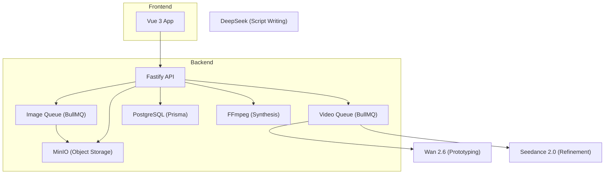
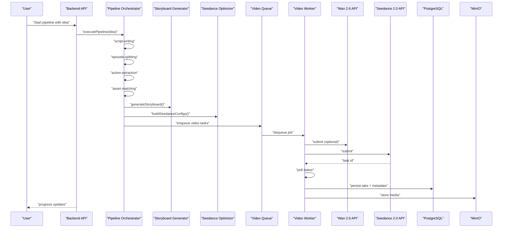
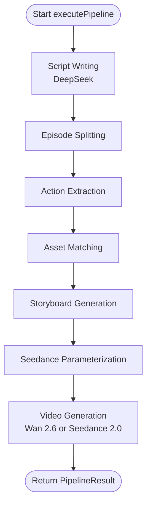
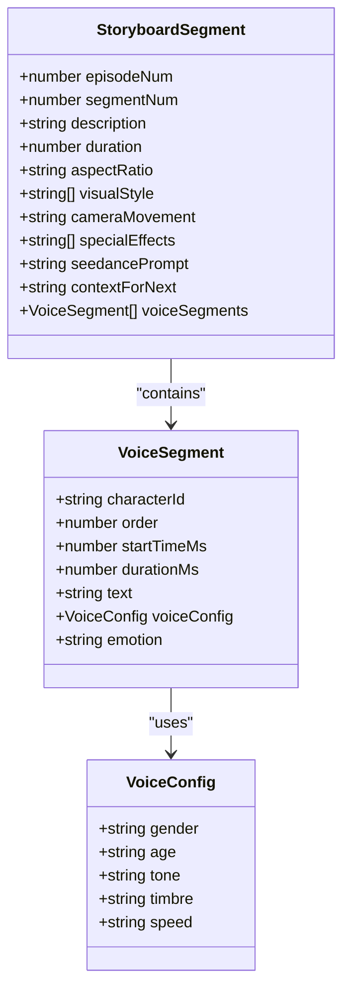
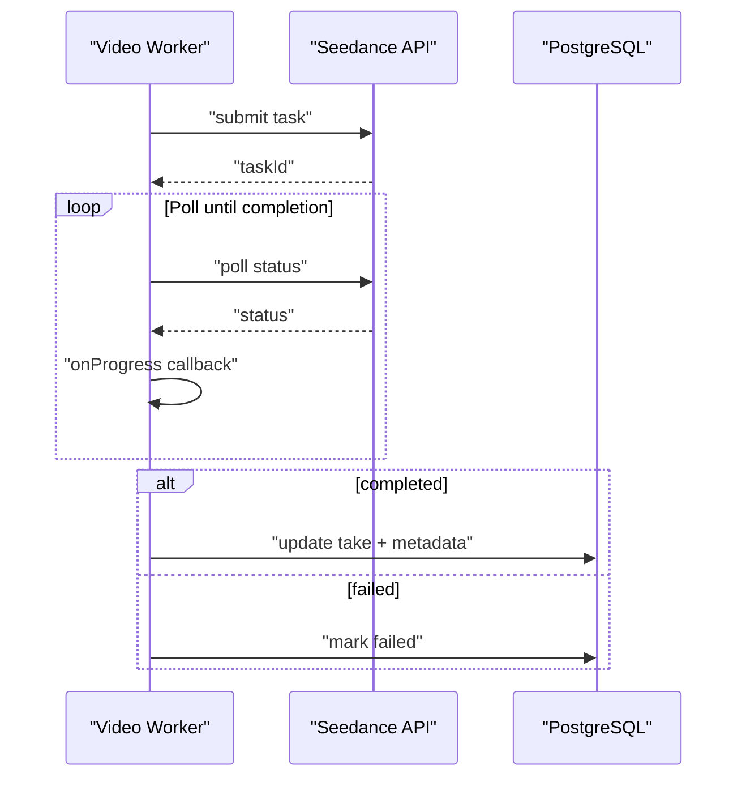
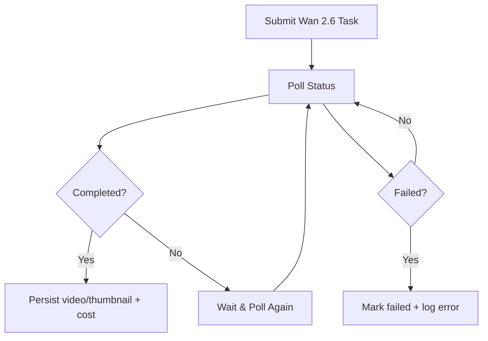
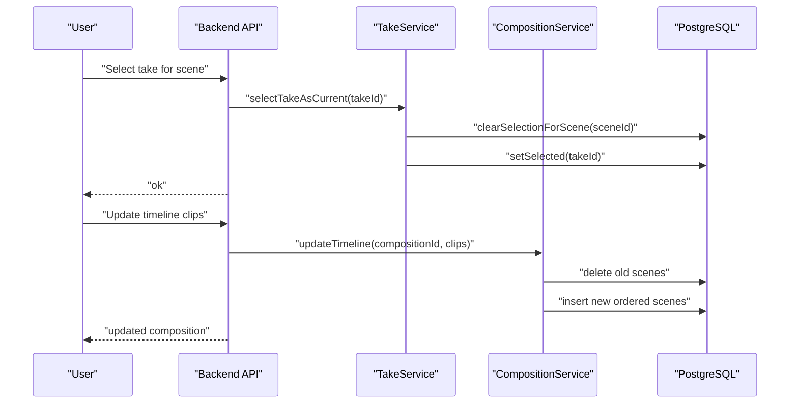
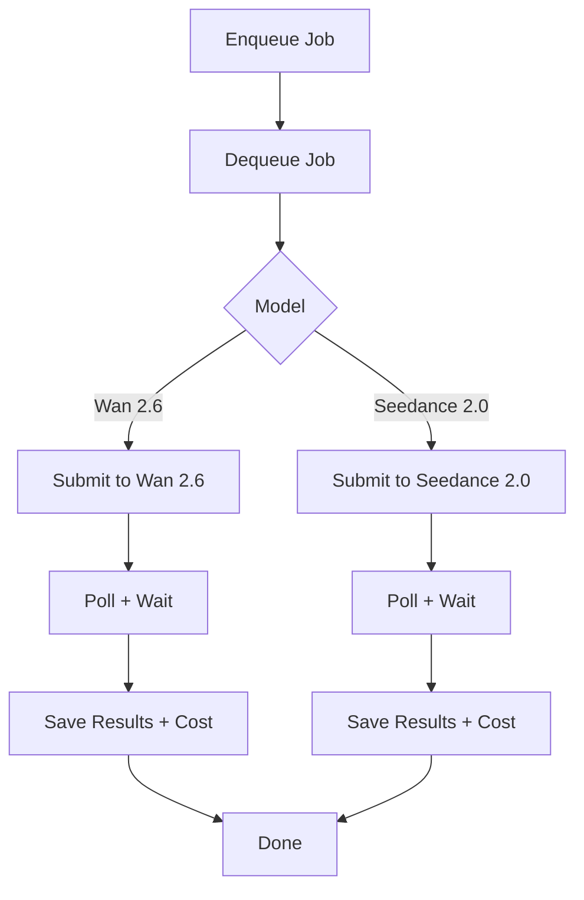
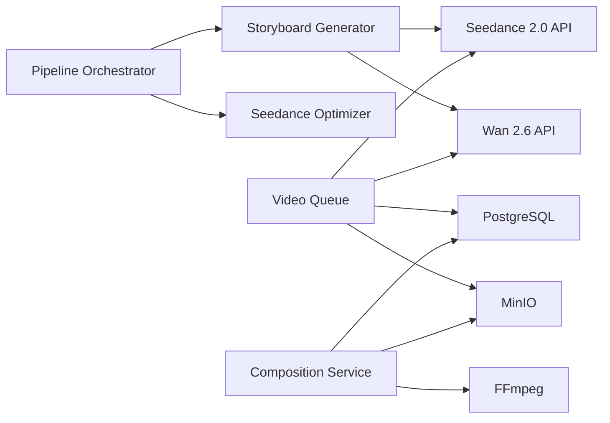
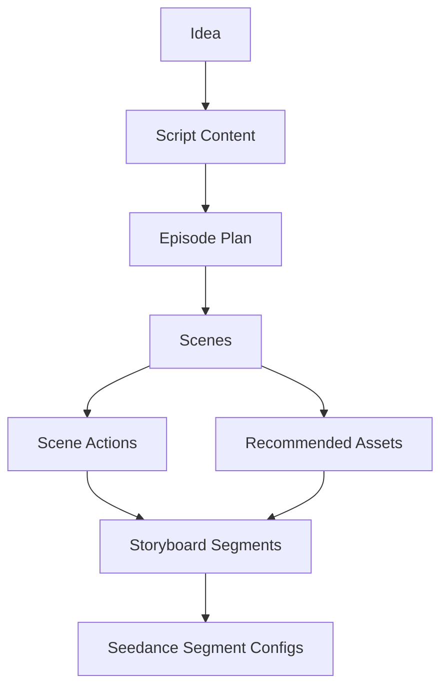

# Video Generation Pipeline

<cite>
**Referenced Files in This Document**
- [README.md](file://README.md)
- [packages/backend/src/services/pipeline-orchestrator.ts](file://packages/backend/src/services/pipeline-orchestrator.ts)
- [packages/backend/src/services/storyboard-generator.ts](file://packages/backend/src/services/storyboard-generator.ts)
- [packages/backend/src/services/ai/seedance.ts](file://packages/backend/src/services/ai/seedance.ts)
- [packages/backend/src/services/ai/wan26.ts](file://packages/backend/src/services/ai/wan26.ts)
- [packages/backend/src/queues/video.ts](file://packages/backend/src/queues/video.ts)
- [packages/backend/src/services/take-service.ts](file://packages/backend/src/services/take-service.ts)
- [packages/backend/src/services/composition-service.ts](file://packages/backend/src/services/composition-service.ts)
- [packages/backend/tests/video-queue-worker-logic.test.ts](file://packages/backend/tests/video-queue-worker-logic.test.ts)
- [packages/backend/tests/wan26.test.ts](file://packages/backend/tests/wan26.test.ts)
- [packages/backend/tests/seedance-scene-request.test.ts](file://packages/backend/tests/seedance-scene-request.test.ts)
- [docs/skills/seedance2-skill-cn/README.md](file://docs/skills/seedance2-skill-cn/README.md)
- [docs/plans/Pipeline重构计划_20260411.md](file://docs/plans/Pipeline重构计划_20260411.md)
</cite>

## Table of Contents

1. [Introduction](#introduction)
2. [Project Structure](#project-structure)
3. [Core Components](#core-components)
4. [Architecture Overview](#architecture-overview)
5. [Detailed Component Analysis](#detailed-component-analysis)
6. [Dependency Analysis](#dependency-analysis)
7. [Performance Considerations](#performance-considerations)
8. [Troubleshooting Guide](#troubleshooting-guide)
9. [Conclusion](#conclusion)
10. [Appendices](#appendices)

## Introduction

This document describes the multi-stage video generation pipeline that transforms a concise creative idea into a finished short-form video. It covers:

- Scene planning and organization
- Take generation and quality assessment
- Composition editing and final output assembly
- Integration with AI services (Wan 2.6 for prototyping and Seedance 2.0 for refinement)
- Take selection, quality comparison, and timeline editing
- Worker queue system, background processing, and real-time status updates

The platform is built with Vue 3 + Fastify, uses BullMQ + Redis for background jobs, MinIO for object storage, and FFmpeg for video synthesis.

## Project Structure

The repository is a monorepo with three main packages:

- frontend: Vue 3 application
- backend: Fastify server with routes, services, queues, and plugins
- shared: Shared types used across backend and frontend

Key technologies and integrations:

- AI models: DeepSeek (script writing), Wan 2.6 (low-cost prototyping), Seedance 2.0 (high-quality refinement)
- Infrastructure: PostgreSQL via Prisma, Redis + BullMQ for job queues, MinIO for storage, FFmpeg for synthesis
- Environment variables define API keys and service endpoints

**Diagram sources**

- [README.md:13-25](file://README.md#L13-L25)
- [README.md:104-114](file://README.md#L104-L114)

**Section sources**

- [README.md:26-42](file://README.md#L26-L42)
- [README.md:104-114](file://README.md#L104-L114)

## Core Components

- Pipeline orchestrator: coordinates the full lifecycle from idea to storyboard and parameterized video generation.
- Storyboard generator: converts scenes into structured segments with prompts, assets, and voice cues.
- AI adapters: wrappers around Wan 2.6 and Seedance 2.0 APIs, including status polling and cost calculation.
- Video queue worker: submits jobs to AI services, tracks progress, and persists results.
- Take service: manages take selection per scene.
- Composition service: builds timelines, enriches with take metadata, and exports final videos.

**Section sources**

- [packages/backend/src/services/pipeline-orchestrator.ts:80-225](file://packages/backend/src/services/pipeline-orchestrator.ts#L80-L225)
- [packages/backend/src/services/storyboard-generator.ts:29-125](file://packages/backend/src/services/storyboard-generator.ts#L29-L125)
- [packages/backend/src/services/ai/seedance.ts:171-228](file://packages/backend/src/services/ai/seedance.ts#L171-L228)
- [packages/backend/src/services/ai/wan26.ts:57-107](file://packages/backend/src/services/ai/wan26.ts#L57-L107)
- [packages/backend/src/queues/video.ts:83-114](file://packages/backend/src/queues/video.ts#L83-L114)
- [packages/backend/src/services/take-service.ts:7-16](file://packages/backend/src/services/take-service.ts#L7-L16)
- [packages/backend/src/services/composition-service.ts:49-71](file://packages/backend/src/services/composition-service.ts#L49-L71)

## Architecture Overview

The pipeline follows a staged workflow:

1. Script writing (DeepSeek)
2. Episode splitting
3. Action extraction
4. Asset matching
5. Storyboard generation
6. Seedance parameterization
7. Video generation (Wan 2.6 or Seedance 2.0)
8. Composition assembly and export

**Diagram sources**

- [packages/backend/src/services/pipeline-orchestrator.ts:80-225](file://packages/backend/src/services/pipeline-orchestrator.ts#L80-L225)
- [packages/backend/src/services/storyboard-generator.ts:29-125](file://packages/backend/src/services/storyboard-generator.ts#L29-L125)
- [packages/backend/src/queues/video.ts:83-114](file://packages/backend/src/queues/video.ts#L83-L114)
- [packages/backend/src/services/ai/seedance.ts:192-217](file://packages/backend/src/services/ai/seedance.ts#L192-L217)
- [packages/backend/src/services/ai/wan26.ts:57-107](file://packages/backend/src/services/ai/wan26.ts#L57-L107)

## Detailed Component Analysis

### Pipeline Orchestration

The orchestrator coordinates the entire workflow, exposing:

- Full pipeline execution with step-by-step results
- Single-step execution for resuming from checkpoints
- Cost estimation based on scene count and durations
- Descriptions and ordered steps for progress reporting

**Diagram sources**

- [packages/backend/src/services/pipeline-orchestrator.ts:80-225](file://packages/backend/src/services/pipeline-orchestrator.ts#L80-L225)

**Section sources**

- [packages/backend/src/services/pipeline-orchestrator.ts:49-75](file://packages/backend/src/services/pipeline-orchestrator.ts#L49-L75)
- [packages/backend/src/services/pipeline-orchestrator.ts:362-372](file://packages/backend/src/services/pipeline-orchestrator.ts#L362-L372)
- [packages/backend/src/services/pipeline-orchestrator.ts:377-399](file://packages/backend/src/services/pipeline-orchestrator.ts#L377-L399)

### Storyboard Generation

The storyboard generator produces structured segments with:

- Prompt construction for Seedance
- Character and asset references
- Voice segment timing and voice configurations
- Camera movement and visual style suggestions
- Cross-segment continuity hints

**Diagram sources**

- [packages/backend/src/services/storyboard-generator.ts:107-124](file://packages/backend/src/services/storyboard-generator.ts#L107-L124)
- [packages/backend/src/services/storyboard-generator.ts:279-333](file://packages/backend/src/services/storyboard-generator.ts#L279-L333)
- [packages/backend/src/services/storyboard-generator.ts:342-389](file://packages/backend/src/services/storyboard-generator.ts#L342-L389)

**Section sources**

- [packages/backend/src/services/storyboard-generator.ts:29-62](file://packages/backend/src/services/storyboard-generator.ts#L29-L62)
- [packages/backend/src/services/storyboard-generator.ts:394-452](file://packages/backend/src/services/storyboard-generator.ts#L394-L452)

### AI Integration: Seedance 2.0

Seedance integration includes:

- Status mapping from provider statuses to internal states
- Polling completion with progress callbacks
- Cost calculation based on duration
- Payload building from storyboard segments

**Diagram sources**

- [packages/backend/src/services/ai/seedance.ts:192-217](file://packages/backend/src/services/ai/seedance.ts#L192-L217)
- [packages/backend/src/queues/video.ts:83-114](file://packages/backend/src/queues/video.ts#L83-L114)

**Section sources**

- [packages/backend/src/services/ai/seedance.ts:171-190](file://packages/backend/src/services/ai/seedance.ts#L171-L190)
- [packages/backend/src/services/ai/seedance.ts:221-228](file://packages/backend/src/services/ai/seedance.ts#L221-L228)
- [packages/backend/tests/seedance-scene-request.test.ts:207-244](file://packages/backend/tests/seedance-scene-request.test.ts#L207-L244)
- [docs/skills/seedance2-skill-cn/README.md:83-113](file://docs/skills/seedance2-skill-cn/README.md#L83-L113)

### AI Integration: Wan 2.6

Wan 2.6 integration includes:

- Task submission and status polling
- Progress tracking and cost calculation
- Error handling for API failures

**Diagram sources**

- [packages/backend/src/services/ai/wan26.ts:57-107](file://packages/backend/src/services/ai/wan26.ts#L57-L107)
- [packages/backend/src/queues/video.ts:83-114](file://packages/backend/src/queues/video.ts#L83-L114)

**Section sources**

- [packages/backend/tests/wan26.test.ts:57-107](file://packages/backend/tests/wan26.test.ts#L57-L107)
- [packages/backend/tests/video-queue-worker-logic.test.ts:187-235](file://packages/backend/tests/video-queue-worker-logic.test.ts#L187-L235)

### Take Selection and Quality Comparison

The take service allows selecting the best take per scene, clearing prior selections, and setting a new current take. Composition service aggregates scenes and takes into a timeline, enabling:

- Timeline editing (reordering clips)
- Enriched composition details with take URLs
- Export of final composition

**Diagram sources**

- [packages/backend/src/services/take-service.ts:7-16](file://packages/backend/src/services/take-service.ts#L7-L16)
- [packages/backend/src/services/composition-service.ts:49-71](file://packages/backend/src/services/composition-service.ts#L49-L71)

**Section sources**

- [packages/backend/src/services/take-service.ts:4-16](file://packages/backend/src/services/take-service.ts#L4-L16)
- [packages/backend/src/services/composition-service.ts:14-30](file://packages/backend/src/services/composition-service.ts#L14-L30)
- [packages/backend/src/services/composition-service.ts:49-71](file://packages/backend/src/services/composition-service.ts#L49-L71)

### Worker Queue System and Background Processing

The video queue worker:

- Receives jobs with scene/task identifiers and model selection
- Submits to Wan 2.6 or Seedance 2.0
- Tracks progress and updates API call records
- Persists results and costs
- Handles failures gracefully

**Diagram sources**

- [packages/backend/src/queues/video.ts:83-114](file://packages/backend/src/queues/video.ts#L83-L114)

**Section sources**

- [packages/backend/src/queues/video.ts:83-114](file://packages/backend/src/queues/video.ts#L83-L114)
- [packages/backend/tests/video-queue-worker-logic.test.ts:187-235](file://packages/backend/tests/video-queue-worker-logic.test.ts#L187-L235)

### Real-Time Status Updates and Progress Tracking

- Worker polls AI providers at fixed intervals and invokes progress callbacks.
- API call records capture status, response data, cost, and duration.
- Frontend can subscribe to SSE or poll endpoints to receive updates.

**Section sources**

- [packages/backend/src/services/ai/seedance.ts:192-217](file://packages/backend/src/services/ai/seedance.ts#L192-L217)
- [packages/backend/src/queues/video.ts:83-114](file://packages/backend/src/queues/video.ts#L83-L114)

### Final Output Generation and Timeline Editing

- Composition service builds a timeline from ordered scenes and takes.
- Export triggers video synthesis and storage.
- Audio integration is supported via voice segments and Seedance audio options.

**Section sources**

- [packages/backend/src/services/composition-service.ts:49-71](file://packages/backend/src/services/composition-service.ts#L49-L71)
- [packages/backend/src/services/storyboard-generator.ts:279-333](file://packages/backend/src/services/storyboard-generator.ts#L279-L333)
- [docs/skills/seedance2-skill-cn/README.md:95-113](file://docs/skills/seedance2-skill-cn/README.md#L95-L113)

## Dependency Analysis

The pipeline stages depend on each other and on external AI services. The orchestrator composes services and passes data forward. The video queue worker depends on AI adapters and database/storage layers.

**Diagram sources**

- [packages/backend/src/services/pipeline-orchestrator.ts:80-225](file://packages/backend/src/services/pipeline-orchestrator.ts#L80-L225)
- [packages/backend/src/services/storyboard-generator.ts:29-125](file://packages/backend/src/services/storyboard-generator.ts#L29-L125)
- [packages/backend/src/queues/video.ts:83-114](file://packages/backend/src/queues/video.ts#L83-L114)
- [packages/backend/src/services/composition-service.ts:49-71](file://packages/backend/src/services/composition-service.ts#L49-L71)

**Section sources**

- [packages/backend/src/services/pipeline-orchestrator.ts:362-372](file://packages/backend/src/services/pipeline-orchestrator.ts#L362-L372)
- [packages/backend/src/services/storyboard-generator.ts:29-62](file://packages/backend/src/services/storyboard-generator.ts#L29-L62)

## Performance Considerations

- Cost estimation: The orchestrator estimates script and video costs to help users budget. Video cost is proportional to total duration.
- Batch processing: Queue workers process jobs asynchronously; tune concurrency and retry policies to balance throughput and provider quotas.
- Prompt optimization: Seedance prompts are constructed from scene/action/assets; keep prompts concise and focused to reduce latency.
- Storage and FFmpeg: Persist media to MinIO and leverage FFmpeg for efficient concatenation and export.

**Section sources**

- [packages/backend/src/services/pipeline-orchestrator.ts:377-399](file://packages/backend/src/services/pipeline-orchestrator.ts#L377-L399)
- [packages/backend/src/services/ai/seedance.ts:221-228](file://packages/backend/src/services/ai/seedance.ts#L221-L228)

## Troubleshooting Guide

Common issues and remedies:

- Seedance task failure: The worker throws an error when the task fails; check provider status and logs.
- Wan 2.6 API errors: Submission failures are surfaced with error messages; verify credentials and quotas.
- No video URL returned: The worker validates presence of video/thumbnail URLs and marks the task failed if missing.
- Progress stalls: Ensure polling intervals and timeouts are configured appropriately; monitor SSE or polling endpoints.

**Section sources**

- [packages/backend/src/services/ai/seedance.ts:192-217](file://packages/backend/src/services/ai/seedance.ts#L192-L217)
- [packages/backend/src/queues/video.ts:83-114](file://packages/backend/src/queues/video.ts#L83-L114)
- [packages/backend/tests/wan26.test.ts:57-107](file://packages/backend/tests/wan26.test.ts#L57-L107)
- [packages/backend/tests/video-queue-worker-logic.test.ts:220-235](file://packages/backend/tests/video-queue-worker-logic.test.ts#L220-L235)

## Conclusion

The pipeline integrates AI-driven scripting, storyboard generation, and two-tier video generation (Wan 2.6 for quick iteration and Seedance 2.0 for refined output) with robust orchestration, queueing, and composition tools. It supports take selection, timeline editing, and final export, with clear progress tracking and error handling.

## Appendices

### Pipeline Data Flow (from planning to storyboard)

**Diagram sources**

- [docs/plans/Pipeline重构计划\_20260411.md:87-140](file://docs/plans/Pipeline重构计划_20260411.md#L87-L140)
