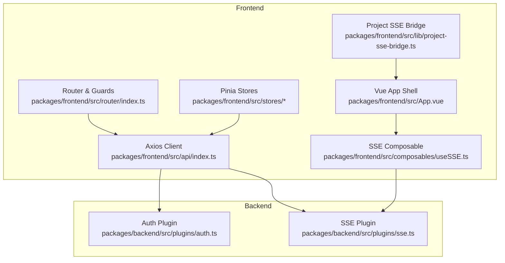
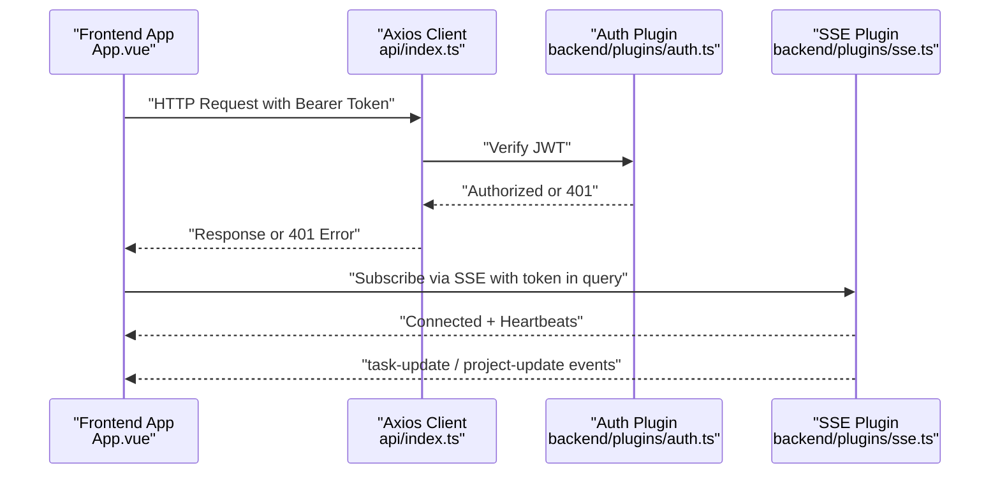
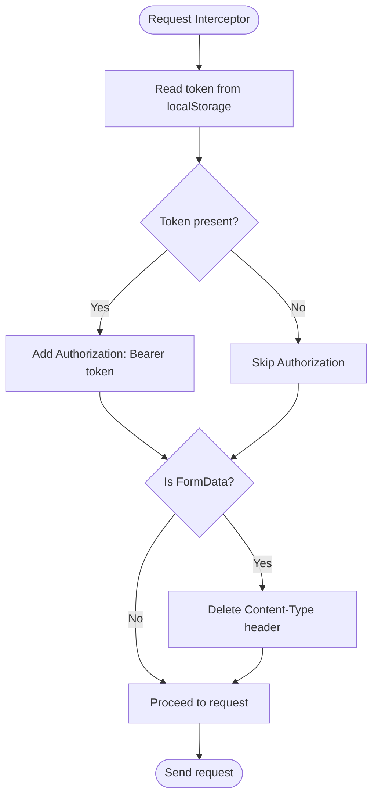
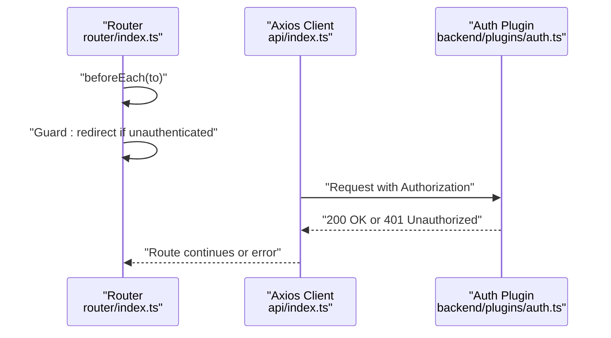
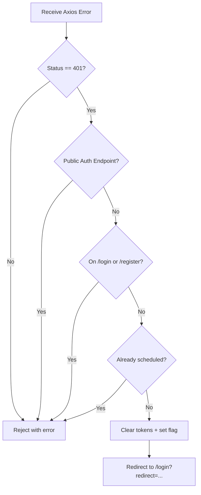
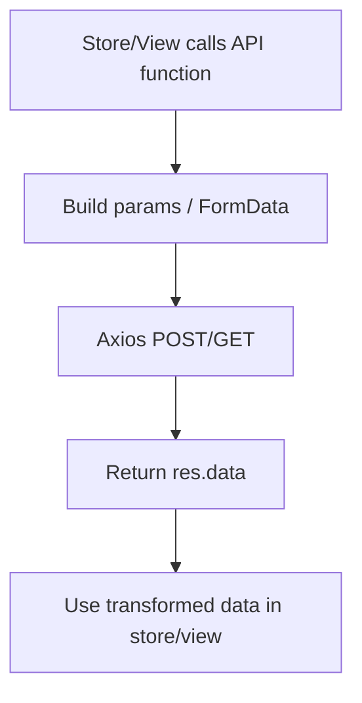
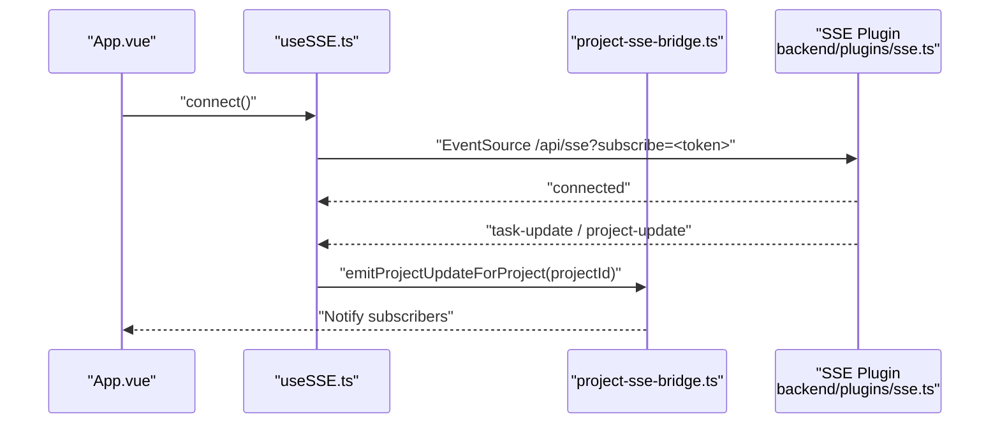
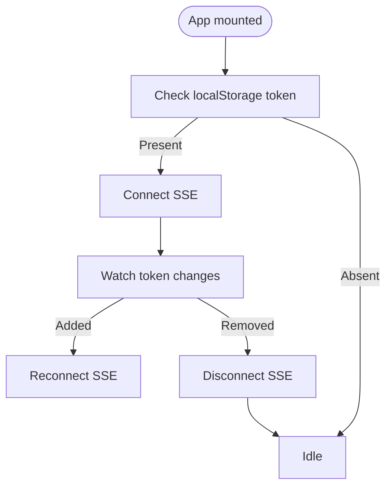
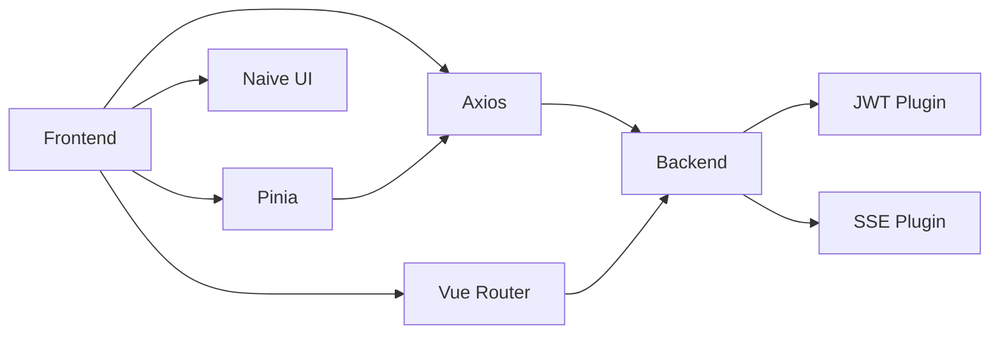

# API Integration Layer

<cite>
**Referenced Files in This Document**
- [packages/frontend/src/api/index.ts](file://packages/frontend/src/api/index.ts)
- [packages/frontend/src/composables/useSSE.ts](file://packages/frontend/src/composables/useSSE.ts)
- [packages/frontend/src/lib/project-sse-bridge.ts](file://packages/frontend/src/lib/project-sse-bridge.ts)
- [packages/frontend/src/App.vue](file://packages/frontend/src/App.vue)
- [packages/frontend/src/router/index.ts](file://packages/frontend/src/router/index.ts)
- [packages/frontend/src/stores/project.ts](file://packages/frontend/src/stores/project.ts)
- [packages/frontend/src/main.ts](file://packages/frontend/src/main.ts)
- [packages/backend/src/plugins/sse.ts](file://packages/backend/src/plugins/sse.ts)
- [packages/backend/src/plugins/auth.ts](file://packages/backend/src/plugins/auth.ts)
</cite>

## Table of Contents

1. [Introduction](#introduction)
2. [Project Structure](#project-structure)
3. [Core Components](#core-components)
4. [Architecture Overview](#architecture-overview)
5. [Detailed Component Analysis](#detailed-component-analysis)
6. [Dependency Analysis](#dependency-analysis)
7. [Performance Considerations](#performance-considerations)
8. [Troubleshooting Guide](#troubleshooting-guide)
9. [Conclusion](#conclusion)

## Introduction

This document describes the frontend-backend API integration layer for the Dreamer project. It covers HTTP client configuration, authentication integration, error handling strategies, API service architecture, request/response transformation, SSE-based real-time updates, token management, and API versioning. It also includes guidance on batch operations, offline-first patterns, error boundaries, retry strategies, and performance optimization techniques.

## Project Structure

The API integration layer spans the frontend and backend packages:

- Frontend: Axios-based HTTP client, Vue composables for SSE, Pinia stores, and route guards.
- Backend: Fastify plugins for authentication and SSE, with route handlers and services.

**Diagram sources**

- [packages/frontend/src/api/index.ts:1-332](file://packages/frontend/src/api/index.ts#L1-L332)
- [packages/frontend/src/composables/useSSE.ts:1-109](file://packages/frontend/src/composables/useSSE.ts#L1-L109)
- [packages/frontend/src/lib/project-sse-bridge.ts:1-48](file://packages/frontend/src/lib/project-sse-bridge.ts#L1-L48)
- [packages/frontend/src/App.vue:1-231](file://packages/frontend/src/App.vue#L1-L231)
- [packages/frontend/src/router/index.ts:1-145](file://packages/frontend/src/router/index.ts#L1-L145)
- [packages/frontend/src/stores/project.ts:1-51](file://packages/frontend/src/stores/project.ts#L1-L51)
- [packages/backend/src/plugins/auth.ts:1-98](file://packages/backend/src/plugins/auth.ts#L1-L98)
- [packages/backend/src/plugins/sse.ts:1-108](file://packages/backend/src/plugins/sse.ts#L1-L108)

**Section sources**

- [packages/frontend/src/main.ts:1-18](file://packages/frontend/src/main.ts#L1-L18)
- [packages/frontend/src/router/index.ts:1-145](file://packages/frontend/src/router/index.ts#L1-L145)

## Core Components

- Axios HTTP client configured with base URL, timeouts, and automatic bearer token injection via interceptors.
- Authentication guard at the router level and per-route protection via backend JWT verification.
- SSE integration for real-time updates with token-passing via query parameter and automatic reconnection.
- Project-specific SSE event distribution decoupled from global SSE.
- Pinia stores orchestrating API calls and local state synchronization.

Key responsibilities:

- HTTP client: centralized request/response handling, auth token propagation, and FormData support.
- SSE: connection lifecycle, event parsing, notifications, and project-scoped event routing.
- Stores: encapsulate CRUD operations and keep local state aligned with backend responses.

**Section sources**

- [packages/frontend/src/api/index.ts:1-332](file://packages/frontend/src/api/index.ts#L1-L332)
- [packages/frontend/src/composables/useSSE.ts:1-109](file://packages/frontend/src/composables/useSSE.ts#L1-L109)
- [packages/frontend/src/lib/project-sse-bridge.ts:1-48](file://packages/frontend/src/lib/project-sse-bridge.ts#L1-L48)
- [packages/frontend/src/stores/project.ts:1-51](file://packages/frontend/src/stores/project.ts#L1-L51)

## Architecture Overview

The frontend communicates with the backend through an Axios client that injects tokens and normalizes responses. Authentication is enforced by a backend JWT plugin. Real-time updates are delivered via Server-Sent Events (SSE) with a dedicated plugin that supports token verification via query or Authorization header. The Vue app initializes SSE after providers are mounted and reacts to token changes.

**Diagram sources**

- [packages/frontend/src/api/index.ts:11-55](file://packages/frontend/src/api/index.ts#L11-L55)
- [packages/backend/src/plugins/auth.ts:12-35](file://packages/backend/src/plugins/auth.ts#L12-L35)
- [packages/backend/src/plugins/sse.ts:45-107](file://packages/backend/src/plugins/sse.ts#L45-L107)
- [packages/frontend/src/App.vue:58-69](file://packages/frontend/src/App.vue#L58-L69)

## Detailed Component Analysis

### HTTP Client and Interceptors

- Base configuration sets the base URL to "/api", a 120-second timeout, and default JSON content type.
- Request interceptor:
  - Reads the token from localStorage and attaches an Authorization header.
  - Removes Content-Type for FormData to allow proper multipart/form-data boundary generation.
- Response interceptor:
  - Detects 401 Unauthorized globally except for public auth endpoints and current login/register pages.
  - Schedules a single redirect to login with a redirect query parameter, clearing stored tokens.

**Diagram sources**

- [packages/frontend/src/api/index.ts:11-23](file://packages/frontend/src/api/index.ts#L11-L23)

**Section sources**

- [packages/frontend/src/api/index.ts:1-332](file://packages/frontend/src/api/index.ts#L1-L332)

### Authentication Integration

- Backend JWT plugin verifies incoming requests and enriches the request context with a database-backed user session.
- Router guards enforce navigation policies: authenticated users cannot visit login/register; unauthenticated users are redirected to login with a safe internal redirect.
- Public endpoints exclude login and register from global 401 handling.

**Diagram sources**

- [packages/frontend/src/router/index.ts:129-142](file://packages/frontend/src/router/index.ts#L129-L142)
- [packages/backend/src/plugins/auth.ts:12-35](file://packages/backend/src/plugins/auth.ts#L12-L35)
- [packages/frontend/src/api/index.ts:25-55](file://packages/frontend/src/api/index.ts#L25-L55)

**Section sources**

- [packages/frontend/src/router/index.ts:1-145](file://packages/frontend/src/router/index.ts#L1-L142)
- [packages/backend/src/plugins/auth.ts:1-98](file://packages/backend/src/plugins/auth.ts#L1-L98)

### Error Handling Strategies

- Global 401 handling:
  - Skips redirect for public auth endpoints and current login/register page.
  - Prevents multiple redirects with a flag and clears tokens from localStorage.
  - Redirects to login with encoded redirect path.
- Localized error handling:
  - Stores and SSE handlers surface user-visible notifications for task/project updates.
  - SSE onerror triggers reconnection with exponential backoff-like delay.

**Diagram sources**

- [packages/frontend/src/api/index.ts:34-55](file://packages/frontend/src/api/index.ts#L34-L55)

**Section sources**

- [packages/frontend/src/api/index.ts:25-55](file://packages/frontend/src/api/index.ts#L25-L55)
- [packages/frontend/src/composables/useSSE.ts:44-51](file://packages/frontend/src/composables/useSSE.ts#L44-L51)

### API Service Architecture and Request/Response Transformation

- Centralized API module exports typed functions for import, stats, pipeline, and model API calls.
- Helpers:
  - postFormData for multipart uploads.
  - pollPipelineJob for long-running jobs with progress callbacks and timeouts.
- Request/response transformation:
  - Functions return res.data for clean consumption.
  - Query parameters are built via URLSearchParams for filtering and pagination.

**Diagram sources**

- [packages/frontend/src/api/index.ts:58-332](file://packages/frontend/src/api/index.ts#L58-L332)
- [packages/frontend/src/stores/project.ts:10-39](file://packages/frontend/src/stores/project.ts#L10-L39)

**Section sources**

- [packages/frontend/src/api/index.ts:1-332](file://packages/frontend/src/api/index.ts#L1-L332)
- [packages/frontend/src/stores/project.ts:1-51](file://packages/frontend/src/stores/project.ts#L1-L51)

### SSE Integration for Real-Time Updates

- SSE composable:
  - Connects to "/api/sse?subscribe=<token>" using EventSource.
  - Handles "connected", "task-update", and "project-update" events.
  - Provides notifications for task completion/failure and project updates.
  - Automatically reconnects on error with a fixed delay.
- Project SSE bridge:
  - Distributes "project-update" events to subscribers scoped by projectId.

**Diagram sources**

- [packages/frontend/src/composables/useSSE.ts:15-109](file://packages/frontend/src/composables/useSSE.ts#L15-L109)
- [packages/frontend/src/lib/project-sse-bridge.ts:17-47](file://packages/frontend/src/lib/project-sse-bridge.ts#L17-L47)
- [packages/backend/src/plugins/sse.ts:45-107](file://packages/backend/src/plugins/sse.ts#L45-L107)

**Section sources**

- [packages/frontend/src/composables/useSSE.ts:1-109](file://packages/frontend/src/composables/useSSE.ts#L1-L109)
- [packages/frontend/src/lib/project-sse-bridge.ts:1-48](file://packages/frontend/src/lib/project-sse-bridge.ts#L1-L48)
- [packages/backend/src/plugins/sse.ts:1-108](file://packages/backend/src/plugins/sse.ts#L1-L108)

### Authentication Token Management

- Token persistence: stored in localStorage under "token".
- Propagation:
  - Request interceptor reads token and adds Authorization header.
  - SSE connects using token passed as a query parameter because EventSource does not support custom headers.
- Lifecycle:
  - App watches token changes to connect/disconnect SSE and refresh user info.
  - Logout clears tokens and navigates to login.

**Diagram sources**

- [packages/frontend/src/App.vue:48-69](file://packages/frontend/src/App.vue#L48-L69)
- [packages/frontend/src/composables/useSSE.ts:19-51](file://packages/frontend/src/composables/useSSE.ts#L19-L51)
- [packages/frontend/src/api/index.ts:11-23](file://packages/frontend/src/api/index.ts#L11-L23)

**Section sources**

- [packages/frontend/src/App.vue:1-231](file://packages/frontend/src/App.vue#L1-L231)
- [packages/frontend/src/composables/useSSE.ts:1-109](file://packages/frontend/src/composables/useSSE.ts#L1-L109)
- [packages/frontend/src/api/index.ts:1-332](file://packages/frontend/src/api/index.ts#L1-L332)

### API Versioning

- No explicit versioning scheme is visible in the client or backend plugins shown here. The base URL "/api" suggests a single version namespace; versioning would typically be indicated by path segments like "/api/v1".

**Section sources**

- [packages/frontend/src/api/index.ts:3-9](file://packages/frontend/src/api/index.ts#L3-L9)
- [packages/backend/src/plugins/sse.ts:45-107](file://packages/backend/src/plugins/sse.ts#L45-L107)

### Examples of Complex API Operations

- Import script or project:
  - POST /import/script or /import/project with content and type.
  - Preview import via POST /import/preview returning structured preview data.
- Pipeline orchestration:
  - POST /pipeline/execute with project parameters.
  - Poll job status via GET /pipeline/job/{id} until completion or failure.
- Model API calls:
  - GET /model-api-calls with optional filters (limit, offset, model, op, projectId, status).
- Stats:
  - GET /stats/me, /stats/projects/{id}, and /stats/trend with optional query parameters.

These operations demonstrate request/response transformation and parameterized queries.

**Section sources**

- [packages/frontend/src/api/index.ts:67-332](file://packages/frontend/src/api/index.ts#L67-L332)

### Batch Requests and Offline-First Patterns

- Batch requests:
  - Not implemented in the client code reviewed. Consider grouping related operations and using optimistic updates in stores.
- Offline-first:
  - Not implemented in the client code reviewed. Consider local caching with IndexedDB or localStorage and sync-on-connect strategies.

[No sources needed since this section provides general guidance]

### Error Boundary Implementation and Retry Strategies

- Error boundaries:
  - Vue components can wrap API-dependent sections with error boundaries to gracefully handle network failures and show fallback UI.
- Retry strategies:
  - Implement exponential backoff for SSE reconnects and for transient HTTP errors.
  - For pipeline polling, consider jittered retries and configurable timeouts.

[No sources needed since this section provides general guidance]

## Dependency Analysis

- Frontend depends on:
  - Axios for HTTP transport.
  - Naive UI for notifications and UI primitives.
  - Vue Router for navigation guards.
  - Pinia for state management.
- Backend depends on:
  - Fastify for HTTP server and plugins.
  - JWT verification for authentication.
  - SSE plugin for real-time messaging.

**Diagram sources**

- [packages/frontend/src/main.ts:1-18](file://packages/frontend/src/main.ts#L1-L18)
- [packages/frontend/src/router/index.ts:1-145](file://packages/frontend/src/router/index.ts#L1-L145)
- [packages/frontend/src/stores/project.ts:1-51](file://packages/frontend/src/stores/project.ts#L1-L51)
- [packages/backend/src/plugins/auth.ts:1-98](file://packages/backend/src/plugins/auth.ts#L1-L98)
- [packages/backend/src/plugins/sse.ts:1-108](file://packages/backend/src/plugins/sse.ts#L1-L108)

**Section sources**

- [packages/frontend/src/main.ts:1-18](file://packages/frontend/src/main.ts#L1-L18)
- [packages/frontend/src/router/index.ts:1-145](file://packages/frontend/src/router/index.ts#L1-L145)
- [packages/frontend/src/stores/project.ts:1-51](file://packages/frontend/src/stores/project.ts#L1-L51)
- [packages/backend/src/plugins/auth.ts:1-98](file://packages/backend/src/plugins/auth.ts#L1-L98)
- [packages/backend/src/plugins/sse.ts:1-108](file://packages/backend/src/plugins/sse.ts#L1-L108)

## Performance Considerations

- Timeout tuning: adjust Axios timeout based on long-running operations (already set to 120 seconds).
- SSE heartbeats: backend sends periodic heartbeats to keep connections alive.
- Request deduplication: avoid duplicate requests for the same resource within short intervals.
- Pagination: use limit/offset or cursor-based pagination to reduce payload sizes.
- Conditional requests: leverage ETags or Last-Modified headers when supported by backend endpoints.

[No sources needed since this section provides general guidance]

## Troubleshooting Guide

- 401 Unauthorized:
  - Verify token presence and validity; check global interceptor logic and route guards.
  - Confirm that public auth endpoints are excluded from global redirect.
- SSE disconnections:
  - Inspect onerror handler and reconnect logic; ensure token remains valid.
  - Confirm backend SSE heartbeat and connection cleanup.
- Route guards:
  - Ensure redirect logic respects safe internal paths and avoids open redirect vulnerabilities.

**Section sources**

- [packages/frontend/src/api/index.ts:25-55](file://packages/frontend/src/api/index.ts#L25-L55)
- [packages/frontend/src/router/index.ts:129-142](file://packages/frontend/src/router/index.ts#L129-L142)
- [packages/frontend/src/composables/useSSE.ts:44-51](file://packages/frontend/src/composables/useSSE.ts#L44-L51)
- [packages/backend/src/plugins/sse.ts:78-100](file://packages/backend/src/plugins/sse.ts#L78-L100)

## Conclusion

The API integration layer combines a robust Axios client with centralized interceptors, backend JWT authentication, and SSE-driven real-time updates. The architecture emphasizes clear separation of concerns, with stores orchestrating data flows and the app reacting to token changes and SSE events. Extending the layer with explicit versioning, batch operations, and offline-first capabilities will further improve reliability and user experience.
