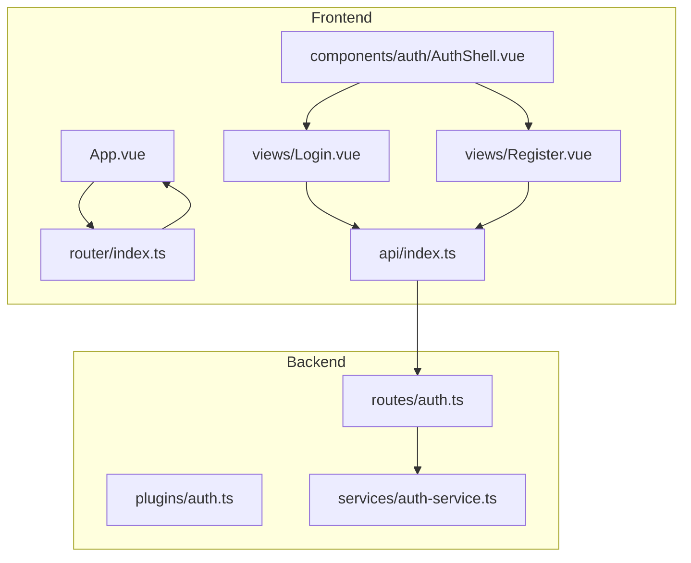
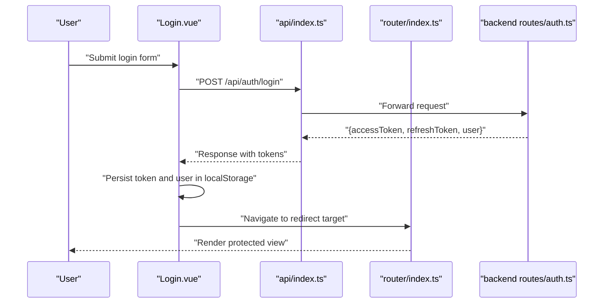
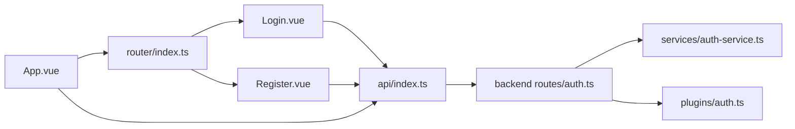

# Authentication Shell Component

<cite>
**Referenced Files in This Document**
- [AuthShell.vue](file://packages/frontend/src/components/auth/AuthShell.vue)
- [auth-platform.ts](file://packages/frontend/src/lib/auth-platform.ts)
- [index.ts](file://packages/frontend/src/router/index.ts)
- [Login.vue](file://packages/frontend/src/views/Login.vue)
- [Register.vue](file://packages/frontend/src/views/Register.vue)
- [index.ts](file://packages/frontend/src/api/index.ts)
- [App.vue](file://packages/frontend/src/App.vue)
- [main.ts](file://packages/frontend/src/main.ts)
- [auth.ts](file://packages/backend/src/routes/auth.ts)
- [auth-service.ts](file://packages/backend/src/services/auth-service.ts)
- [auth.ts](file://packages/backend/src/plugins/auth.ts)
</cite>

## Table of Contents

1. [Introduction](#introduction)
2. [Project Structure](#project-structure)
3. [Core Components](#core-components)
4. [Architecture Overview](#architecture-overview)
5. [Detailed Component Analysis](#detailed-component-analysis)
6. [Dependency Analysis](#dependency-analysis)
7. [Performance Considerations](#performance-considerations)
8. [Troubleshooting Guide](#troubleshooting-guide)
9. [Conclusion](#conclusion)

## Introduction

This document describes the AuthShell component and the surrounding authentication system that manages login/logout states, protected routing, and authentication context. It explains how the frontend handles JWT tokens via local storage, integrates with the backend authentication APIs, and synchronizes authentication state across the application layout. It also covers protected route implementation, error handling for authentication failures, and component composition patterns.

## Project Structure

The authentication system spans the frontend Vue application and the backend Fastify server. Key areas include:

- Frontend authentication shell and forms
- Router guard for protected routes
- API client with interceptor for token injection and 401 handling
- Backend authentication routes and middleware
- Application layout for logout and user menu

**Diagram sources**

- [App.vue:1-231](file://packages/frontend/src/App.vue#L1-L231)
- [index.ts:1-145](file://packages/frontend/src/router/index.ts#L1-L145)
- [AuthShell.vue:1-180](file://packages/frontend/src/components/auth/AuthShell.vue#L1-L180)
- [Login.vue:1-101](file://packages/frontend/src/views/Login.vue#L1-L101)
- [Register.vue:1-122](file://packages/frontend/src/views/Register.vue#L1-L122)
- [index.ts:1-332](file://packages/frontend/src/api/index.ts#L1-L332)
- [auth.ts:1-58](file://packages/backend/src/routes/auth.ts#L1-L58)
- [auth-service.ts:1-73](file://packages/backend/src/services/auth-service.ts#L1-L73)
- [auth.ts:1-41](file://packages/backend/src/plugins/auth.ts#L1-L41)

**Section sources**

- [main.ts:1-18](file://packages/frontend/src/main.ts#L1-L18)
- [index.ts:1-145](file://packages/frontend/src/router/index.ts#L1-L145)
- [index.ts:1-332](file://packages/frontend/src/api/index.ts#L1-L332)

## Core Components

- AuthShell: A reusable authentication page shell that renders platform branding and hosts login/register forms.
- Login/Register views: Form pages that call backend authentication APIs, persist tokens, and redirect on success.
- Router guard: Enforces authentication for non-public routes and redirects unauthenticated users to login.
- API client: Injects Authorization headers and handles 401 globally by clearing tokens and redirecting to login.
- Backend auth routes and middleware: Provide registration/login endpoints and JWT verification middleware.
- App layout: Manages logout, user menu, and SSE connection based on authentication state.

**Section sources**

- [AuthShell.vue:1-180](file://packages/frontend/src/components/auth/AuthShell.vue#L1-L180)
- [Login.vue:1-101](file://packages/frontend/src/views/Login.vue#L1-L101)
- [Register.vue:1-122](file://packages/frontend/src/views/Register.vue#L1-L122)
- [index.ts:129-142](file://packages/frontend/src/router/index.ts#L129-L142)
- [index.ts:11-55](file://packages/frontend/src/api/index.ts#L11-L55)
- [auth.ts:1-58](file://packages/backend/src/routes/auth.ts#L1-L58)
- [auth.ts:12-35](file://packages/backend/src/plugins/auth.ts#L12-L35)
- [App.vue:25-32](file://packages/frontend/src/App.vue#L25-L32)

## Architecture Overview

The authentication flow connects frontend forms to backend endpoints, persists tokens, and enforces protection via router guards and API interceptors.

**Diagram sources**

- [Login.vue:20-44](file://packages/frontend/src/views/Login.vue#L20-L44)
- [index.ts:25-55](file://packages/frontend/src/api/index.ts#L25-L55)
- [auth.ts:30-50](file://packages/backend/src/routes/auth.ts#L30-L50)
- [index.ts:131-142](file://packages/frontend/src/router/index.ts#L131-L142)

## Detailed Component Analysis

### AuthShell Component

AuthShell is a presentational wrapper that:

- Renders platform branding and feature highlights using AUTH_PLATFORM metadata.
- Provides a responsive two-column layout with an intro panel and a form container.
- Exposes a default slot for embedding login/register forms.

Key behaviors:

- Uses AUTH_PLATFORM to populate product name, title, tagline, and feature list.
- Maps feature keys to icons for visual consistency.
- Applies scoped styles for responsive layout and card styling.

Integration points:

- Consumed by Login.vue and Register.vue to provide consistent authentication UI.

**Section sources**

- [AuthShell.vue:1-180](file://packages/frontend/src/components/auth/AuthShell.vue#L1-L180)
- [auth-platform.ts:1-26](file://packages/frontend/src/lib/auth-platform.ts#L1-L26)

### Login View

Responsibilities:

- Validates form inputs and prevents submission with missing fields.
- Calls the backend login endpoint via the API client.
- On success, stores accessToken and user profile in localStorage and navigates to a safe redirect target.
- Handles errors with user-friendly messages.

Token and persistence:

- Stores accessToken in localStorage under the key "token".
- Stores user profile in localStorage under the key "user".

Protected route redirection:

- Reads the redirect query parameter and ensures it is a safe internal path.

**Section sources**

- [Login.vue:1-101](file://packages/frontend/src/views/Login.vue#L1-L101)

### Register View

Responsibilities:

- Validates required fields, password confirmation, and minimum length.
- Calls the backend register endpoint via the API client.
- On success, stores accessToken and user profile in localStorage and navigates to a safe redirect target.
- Handles errors with user-friendly messages.

Protected route redirection:

- Same mechanism as Login.vue for redirect handling.

**Section sources**

- [Register.vue:1-122](file://packages/frontend/src/views/Register.vue#L1-L122)

### Router Guard (Protected Routing)

Behavior:

- Defines public route names ("Login", "Register").
- Checks localStorage for a token before allowing navigation to non-public routes.
- Redirects unauthenticated users to Login with a redirect query parameter.
- Prevents authenticated users from accessing public routes by redirecting to "/projects".

Safety:

- Uses a helper to ensure redirect targets are internal relative paths.

**Section sources**

- [index.ts:129-142](file://packages/frontend/src/router/index.ts#L129-L142)

### API Client and Token Handling

Request interceptor:

- Automatically attaches Authorization: Bearer <token> when a token exists in localStorage.
- Removes Content-Type for FormData to allow proper multipart encoding.

Response interceptor:

- Detects 401 responses that are not part of public auth endpoints.
- Skips redirect when already on Login/Register pages.
- Schedules a single redirect to Login with the current path as redirect query parameter.
- Clears localStorage tokens and user data during redirect.

Public auth endpoints:

- Explicitly excludes "/auth/login" and "/auth/register" from triggering global 401 redirect.

**Section sources**

- [index.ts:11-55](file://packages/frontend/src/api/index.ts#L11-L55)

### Backend Authentication Routes and Middleware

Endpoints:

- POST /auth/register: Creates a new user, hashes password, signs JWTs, returns tokens and user.
- POST /auth/login: Verifies credentials, signs JWTs, returns tokens and user.
- GET /auth/me: Protected endpoint using JWT middleware to return current user.

JWT middleware:

- Verifies JWT signature and payload presence.
- Confirms user still exists in database; otherwise returns 401 with a specific message.
- Attaches verified user to request for downstream handlers.

**Section sources**

- [auth.ts:1-58](file://packages/backend/src/routes/auth.ts#L1-L58)
- [auth.ts:12-35](file://packages/backend/src/plugins/auth.ts#L12-L35)
- [auth-service.ts:1-73](file://packages/backend/src/services/auth-service.ts#L1-L73)

### Application Layout and Logout

Authentication state synchronization:

- Initializes isLoggedIn based on localStorage presence of "token".
- Watches localStorage token changes to update isLoggedIn and manage SSE connection lifecycle.

Logout:

- Removes "token" and "user" from localStorage.
- Resets isLoggedIn and navigates to Login.

User menu:

- Provides a dropdown with a logout action that triggers the above flow.

**Section sources**

- [App.vue:8-69](file://packages/frontend/src/App.vue#L8-L69)
- [App.vue:25-32](file://packages/frontend/src/App.vue#L25-L32)

## Dependency Analysis

The authentication system exhibits clear separation of concerns:

- Frontend views depend on the API client and router.
- API client depends on localStorage and backend endpoints.
- Router guard depends on localStorage and route names.
- Backend routes depend on the auth service and JWT plugin.
- App layout depends on localStorage and API client for user info.

**Diagram sources**

- [Login.vue:1-101](file://packages/frontend/src/views/Login.vue#L1-L101)
- [Register.vue:1-122](file://packages/frontend/src/views/Register.vue#L1-L122)
- [index.ts:1-332](file://packages/frontend/src/api/index.ts#L1-L332)
- [auth.ts:1-58](file://packages/backend/src/routes/auth.ts#L1-L58)
- [auth-service.ts:1-73](file://packages/backend/src/services/auth-service.ts#L1-L73)
- [auth.ts:1-41](file://packages/backend/src/plugins/auth.ts#L1-L41)
- [index.ts:1-145](file://packages/frontend/src/router/index.ts#L1-L145)
- [App.vue:1-231](file://packages/frontend/src/App.vue#L1-L231)

**Section sources**

- [index.ts:129-142](file://packages/frontend/src/router/index.ts#L129-L142)
- [index.ts:11-55](file://packages/frontend/src/api/index.ts#L11-L55)
- [auth.ts:1-58](file://packages/backend/src/routes/auth.ts#L1-L58)
- [auth.ts:12-35](file://packages/backend/src/plugins/auth.ts#L12-L35)

## Performance Considerations

- Token storage: Using localStorage avoids frequent re-authentication but requires careful cleanup on logout.
- Request interceptor overhead: Minimal impact; only adds Authorization header when a token exists.
- Router guard: Lightweight checks against localStorage and route names.
- Backend JWT verification: Occurs per protected request; keep token signing and verification efficient.

## Troubleshooting Guide

Common issues and resolutions:

- Stuck on Login after logout:
  - Ensure localStorage "token" and "user" are cleared and router navigates to Login.
  - Verify App.vue logout handler removes tokens and resets state.

- Redirect loops to Login:
  - Confirm router guard logic and safe redirect handling in Login/Register views.
  - Check that redirect query parameter is a safe internal path.

- 401 errors on protected routes:
  - Verify Authorization header is attached by API client.
  - Ensure backend JWT middleware validates token and user existence.
  - Confirm response interceptor does not trigger redirect on Login/Register pages.

- User menu not updating after login:
  - Ensure App.vue fetches user info using stored token and updates name.
  - Confirm SSE connection is established after login.

**Section sources**

- [App.vue:25-46](file://packages/frontend/src/App.vue#L25-L46)
- [index.ts:131-142](file://packages/frontend/src/router/index.ts#L131-L142)
- [Login.vue:14-18](file://packages/frontend/src/views/Login.vue#L14-L18)
- [Register.vue:14-18](file://packages/frontend/src/views/Register.vue#L14-L18)
- [index.ts:34-55](file://packages/frontend/src/api/index.ts#L34-L55)
- [auth.ts:12-35](file://packages/backend/src/plugins/auth.ts#L12-L35)

## Conclusion

The AuthShell component, combined with Login/Register views, router guards, and the API client, provides a cohesive authentication experience. Tokens are persisted securely in localStorage, protected routes are enforced, and the backend ensures JWT validity and user existence. The App layout synchronizes authentication state and supports logout and user menu actions. Together, these pieces deliver a robust, maintainable authentication flow aligned with the application’s architecture.
