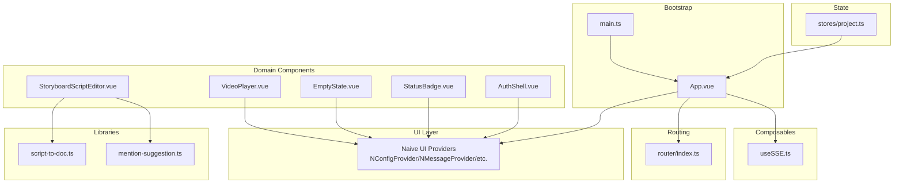
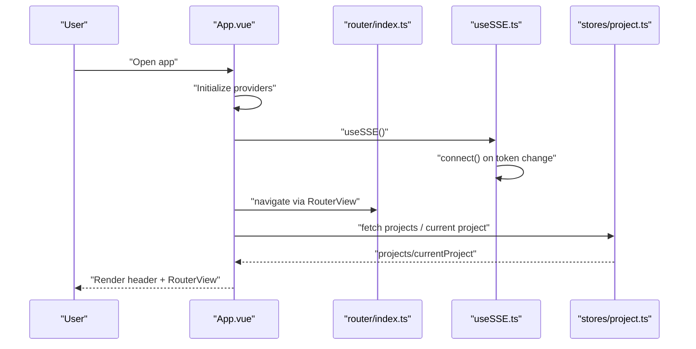
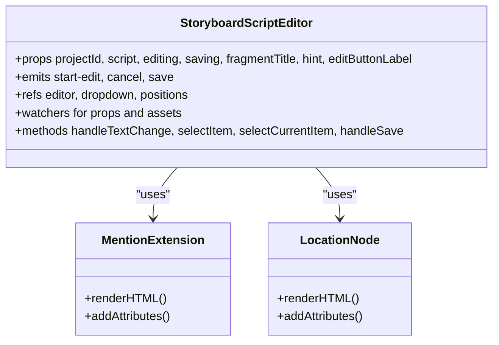
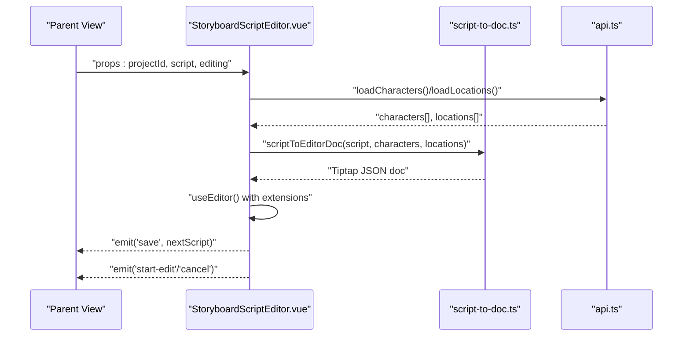
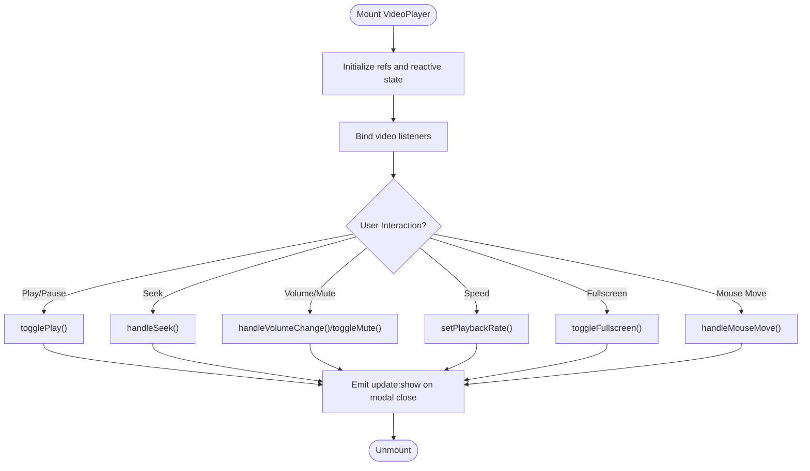
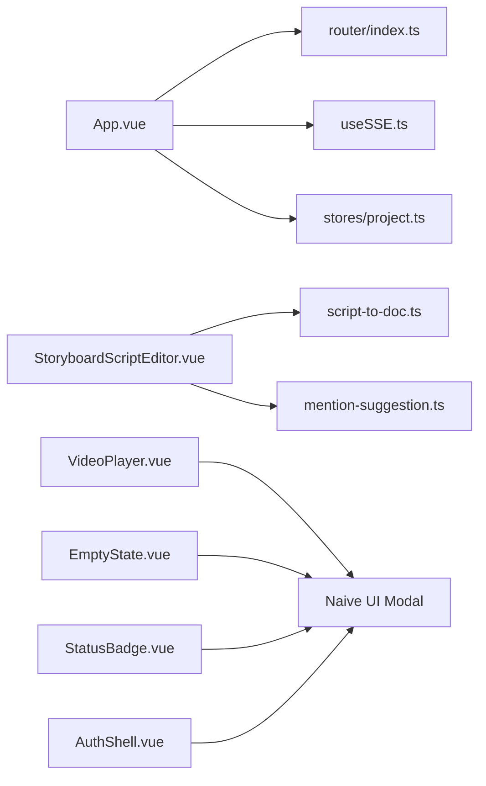

# Component Architecture

<cite>
**Referenced Files in This Document**
- [main.ts](file://packages/frontend/src/main.ts)
- [App.vue](file://packages/frontend/src/App.vue)
- [StoryboardScriptEditor.vue](file://packages/frontend/src/components/storyboard/StoryboardScriptEditor.vue)
- [VideoPlayer.vue](file://packages/frontend/src/components/VideoPlayer.vue)
- [EmptyState.vue](file://packages/frontend/src/components/EmptyState.vue)
- [StatusBadge.vue](file://packages/frontend/src/components/StatusBadge.vue)
- [AuthShell.vue](file://packages/frontend/src/components/auth/AuthShell.vue)
- [useSSE.ts](file://packages/frontend/src/composables/useSSE.ts)
- [script-to-doc.ts](file://packages/frontend/src/lib/storyboard-editor/script-to-doc.ts)
- [mention-suggestion.ts](file://packages/frontend/src/lib/storyboard-editor/mention-suggestion.ts)
- [router/index.ts](file://packages/frontend/src/router/index.ts)
- [stores/project.ts](file://packages/frontend/src/stores/project.ts)
- [TESTING_GUIDE.md](file://docs/TESTING_GUIDE.md)
</cite>

## Table of Contents

1. [Introduction](#introduction)
2. [Project Structure](#project-structure)
3. [Core Components](#core-components)
4. [Architecture Overview](#architecture-overview)
5. [Detailed Component Analysis](#detailed-component-analysis)
6. [Dependency Analysis](#dependency-analysis)
7. [Performance Considerations](#performance-considerations)
8. [Troubleshooting Guide](#troubleshooting-guide)
9. [Conclusion](#conclusion)
10. [Appendices](#appendices)

## Introduction

This document describes the Vue 3 frontend component architecture for the project. It focuses on component hierarchy, reusable component patterns, Composition API usage, and the distinction between presentational and container components. It also explains lifecycle management, prop/event communication, Naive UI integration, custom component development guidelines, and composition strategies. Specialized components such as the StoryboardScriptEditor, VideoPlayer, and status management components are analyzed in depth. Finally, it covers testing approaches, performance optimization techniques, and accessibility considerations.

## Project Structure

The frontend is organized around a Vue 3 + Pinia + Naive UI stack with a clear separation of concerns:

- Application bootstrap initializes the app, plugins, and global providers.
- App shell composes providers and layout, integrates routing and SSE.
- Components are grouped by domain and reusability (e.g., storyboard, auth).
- Composables encapsulate cross-cutting concerns (e.g., SSE).
- Libraries provide domain-specific utilities (e.g., Tiptap-based editor helpers).
- Stores manage application state with Pinia.
- Router defines navigation and guards.

**Diagram sources**

- [main.ts:1-18](file://packages/frontend/src/main.ts#L1-L18)
- [App.vue:1-231](file://packages/frontend/src/App.vue#L1-L231)
- [router/index.ts:1-145](file://packages/frontend/src/router/index.ts#L1-L145)
- [useSSE.ts:1-109](file://packages/frontend/src/composables/useSSE.ts#L1-L109)
- [StoryboardScriptEditor.vue:1-653](file://packages/frontend/src/components/storyboard/StoryboardScriptEditor.vue#L1-L653)
- [VideoPlayer.vue:1-371](file://packages/frontend/src/components/VideoPlayer.vue#L1-L371)
- [EmptyState.vue:1-56](file://packages/frontend/src/components/EmptyState.vue#L1-L56)
- [StatusBadge.vue:1-64](file://packages/frontend/src/components/StatusBadge.vue#L1-L64)
- [AuthShell.vue:1-180](file://packages/frontend/src/components/auth/AuthShell.vue#L1-L180)
- [script-to-doc.ts:1-291](file://packages/frontend/src/lib/storyboard-editor/script-to-doc.ts#L1-L291)
- [mention-suggestion.ts:1-150](file://packages/frontend/src/lib/storyboard-editor/mention-suggestion.ts#L1-L150)
- [stores/project.ts:1-51](file://packages/frontend/src/stores/project.ts#L1-L51)

**Section sources**

- [main.ts:1-18](file://packages/frontend/src/main.ts#L1-L18)
- [App.vue:1-231](file://packages/frontend/src/App.vue#L1-L231)
- [router/index.ts:1-145](file://packages/frontend/src/router/index.ts#L1-L145)

## Core Components

This section outlines reusable and foundational components and their roles.

- EmptyState.vue: Presentational, slot-based empty state with icon/title/description/action slots.
- StatusBadge.vue: Presentational badge with semantic status mapping and configurable size.
- AuthShell.vue: Presentational shell for auth pages with intro and form area.
- VideoPlayer.vue: Container-like media player with controls, state, and UI built on Naive UI modal.
- StoryboardScriptEditor.vue: Complex container/editor integrating Tiptap, custom mentions, and asset suggestions.

These components demonstrate:

- Presentational vs container distinction: EmptyState/StatusBadge/AuthShell are primarily presentational; StoryboardScriptEditor and VideoPlayer orchestrate state and interactions.
- Composition API usage: Props, emits, refs, computed, watchers, lifecycle hooks.
- Naive UI integration: Provider wrappers and UI primitives.

**Section sources**

- [EmptyState.vue:1-56](file://packages/frontend/src/components/EmptyState.vue#L1-L56)
- [StatusBadge.vue:1-64](file://packages/frontend/src/components/StatusBadge.vue#L1-L64)
- [AuthShell.vue:1-180](file://packages/frontend/src/components/auth/AuthShell.vue#L1-L180)
- [VideoPlayer.vue:1-371](file://packages/frontend/src/components/VideoPlayer.vue#L1-L371)
- [StoryboardScriptEditor.vue:1-653](file://packages/frontend/src/components/storyboard/StoryboardScriptEditor.vue#L1-L653)

## Architecture Overview

The runtime architecture centers on the App shell, routing, state, and UI providers. SSE is initialized after mount to ensure providers are ready. Components communicate via props/emits and Pinia stores. Domain libraries encapsulate editor logic.

**Diagram sources**

- [App.vue:1-231](file://packages/frontend/src/App.vue#L1-L231)
- [router/index.ts:1-145](file://packages/frontend/src/router/index.ts#L1-L145)
- [useSSE.ts:1-109](file://packages/frontend/src/composables/useSSE.ts#L1-L109)
- [stores/project.ts:1-51](file://packages/frontend/src/stores/project.ts#L1-L51)

**Section sources**

- [App.vue:1-231](file://packages/frontend/src/App.vue#L1-L231)
- [router/index.ts:1-145](file://packages/frontend/src/router/index.ts#L1-L145)
- [useSSE.ts:1-109](file://packages/frontend/src/composables/useSSE.ts#L1-L109)
- [stores/project.ts:1-51](file://packages/frontend/src/stores/project.ts#L1-L51)

## Detailed Component Analysis

### StoryboardScriptEditor.vue

This component is a complex, self-contained editor integrating:

- Tiptap editor with custom extensions (Mention and Location nodes).
- Asset loading for characters and locations.
- Custom mention suggestion dropdown with keyboard navigation and Teleport to body.
- Prop-driven editing state and save/cancel events.
- Lifecycle cleanup and watcher-driven synchronization.

Key patterns:

- Props/emits contract for parent-child communication.
- Composition API: refs, computed, watchers, lifecycle hooks.
- Custom extension rendering for mentions and locations.
- Utility conversions between script content and Tiptap JSON.

**Diagram sources**

- [StoryboardScriptEditor.vue:1-653](file://packages/frontend/src/components/storyboard/StoryboardScriptEditor.vue#L1-L653)

**Diagram sources**

- [StoryboardScriptEditor.vue:1-653](file://packages/frontend/src/components/storyboard/StoryboardScriptEditor.vue#L1-L653)
- [script-to-doc.ts:1-291](file://packages/frontend/src/lib/storyboard-editor/script-to-doc.ts#L1-L291)

**Section sources**

- [StoryboardScriptEditor.vue:1-653](file://packages/frontend/src/components/storyboard/StoryboardScriptEditor.vue#L1-L653)
- [script-to-doc.ts:1-291](file://packages/frontend/src/lib/storyboard-editor/script-to-doc.ts#L1-L291)
- [mention-suggestion.ts:1-150](file://packages/frontend/src/lib/storyboard-editor/mention-suggestion.ts#L1-L150)

### VideoPlayer.vue

A container component that wraps a video element with a modal and a comprehensive control overlay. It manages playback state, seeks, volume/mute, playback rate, fullscreen, and frame-by-frame stepping. It uses Naive UI’s modal and integrates SVG controls.

Patterns:

- Props/emits for controlled visibility.
- Reactive state for playback, timing, and UI.
- Event handlers for native video events.
- Computed helpers for formatted time and progress.

**Diagram sources**

- [VideoPlayer.vue:1-371](file://packages/frontend/src/components/VideoPlayer.vue#L1-L371)

**Section sources**

- [VideoPlayer.vue:1-371](file://packages/frontend/src/components/VideoPlayer.vue#L1-L371)

### StatusBadge.vue

A presentational component that renders a status indicator with color-coded background and dot. It maps status enums to labels and styles.

Patterns:

- Props-driven presentation.
- Scoped styles for consistent theming.
- Configurable size variants.

**Section sources**

- [StatusBadge.vue:1-64](file://packages/frontend/src/components/StatusBadge.vue#L1-L64)

### EmptyState.vue

A presentational, slot-based component for empty states with optional action slot.

**Section sources**

- [EmptyState.vue:1-56](file://packages/frontend/src/components/EmptyState.vue#L1-L56)

### AuthShell.vue

A presentational shell for auth pages with product intro, feature list, and form wrapper.

**Section sources**

- [AuthShell.vue:1-180](file://packages/frontend/src/components/auth/AuthShell.vue#L1-L180)

### useSSE.ts

A composable that manages server-sent events, connects/disconnects based on token presence, and emits notifications for task/project updates. It cleans up on unmount.

Patterns:

- Reactive connection state.
- Event handling with JSON parsing.
- Notification integration via Naive UI.

**Section sources**

- [useSSE.ts:1-109](file://packages/frontend/src/composables/useSSE.ts#L1-L109)

### Router and Guards

The router defines public/private routes and enforces authentication via a global guard. It redirects authenticated users away from login/register and unauthenticated users to login with a safe redirect.

**Section sources**

- [router/index.ts:1-145](file://packages/frontend/src/router/index.ts#L1-L145)

### Stores (example: project)

A Pinia store encapsulates CRUD operations for projects and exposes reactive state. It demonstrates Composition API store definition and async actions.

**Section sources**

- [stores/project.ts:1-51](file://packages/frontend/src/stores/project.ts#L1-L51)

## Dependency Analysis

This section maps key dependencies among components, composables, and libraries.

**Diagram sources**

- [App.vue:1-231](file://packages/frontend/src/App.vue#L1-L231)
- [router/index.ts:1-145](file://packages/frontend/src/router/index.ts#L1-L145)
- [useSSE.ts:1-109](file://packages/frontend/src/composables/useSSE.ts#L1-L109)
- [stores/project.ts:1-51](file://packages/frontend/src/stores/project.ts#L1-L51)
- [StoryboardScriptEditor.vue:1-653](file://packages/frontend/src/components/storyboard/StoryboardScriptEditor.vue#L1-L653)
- [script-to-doc.ts:1-291](file://packages/frontend/src/lib/storyboard-editor/script-to-doc.ts#L1-L291)
- [mention-suggestion.ts:1-150](file://packages/frontend/src/lib/storyboard-editor/mention-suggestion.ts#L1-L150)
- [VideoPlayer.vue:1-371](file://packages/frontend/src/components/VideoPlayer.vue#L1-L371)
- [EmptyState.vue:1-56](file://packages/frontend/src/components/EmptyState.vue#L1-L56)
- [StatusBadge.vue:1-64](file://packages/frontend/src/components/StatusBadge.vue#L1-L64)
- [AuthShell.vue:1-180](file://packages/frontend/src/components/auth/AuthShell.vue#L1-L180)

**Section sources**

- [StoryboardScriptEditor.vue:1-653](file://packages/frontend/src/components/storyboard/StoryboardScriptEditor.vue#L1-L653)
- [VideoPlayer.vue:1-371](file://packages/frontend/src/components/VideoPlayer.vue#L1-L371)
- [EmptyState.vue:1-56](file://packages/frontend/src/components/EmptyState.vue#L1-L56)
- [StatusBadge.vue:1-64](file://packages/frontend/src/components/StatusBadge.vue#L1-L64)
- [AuthShell.vue:1-180](file://packages/frontend/src/components/auth/AuthShell.vue#L1-L180)
- [useSSE.ts:1-109](file://packages/frontend/src/composables/useSSE.ts#L1-L109)
- [router/index.ts:1-145](file://packages/frontend/src/router/index.ts#L1-L145)
- [stores/project.ts:1-51](file://packages/frontend/src/stores/project.ts#L1-L51)

## Performance Considerations

- Virtualization and lists: For long lists (e.g., storyboards), consider virtualizing rows to reduce DOM nodes.
- Debounced input: For live search in mention dropdowns, debounce input handlers to avoid frequent recomputation.
- Memoization: Cache asset lookups (characters/locations) and editor doc conversions to avoid repeated work.
- Conditional rendering: Hide heavy overlays until needed (e.g., video controls).
- Event throttling: Throttle mousemove/touch events for progress bar seeking.
- Lazy loading: Keep large assets lazy-loaded; pre-warm thumbnails where possible.
- Avoid unnecessary watchers: Prefer computed where possible; minimize deep watchers on large objects.
- Image optimization: Use appropriate sizes and formats for thumbnails and avatars.

## Troubleshooting Guide

Common issues and resolutions:

- SSE not connecting: Verify token presence and provider initialization order. Ensure connect is called after mount and providers are ready.
- Mention dropdown mispositioned: Confirm Teleport target and coordinate calculations; ensure fixed positioning respects viewport boundaries.
- Editor content not updating: Ensure deep watchers and setContent calls are guarded against identical JSON to prevent cycles.
- Video controls not appearing: Check mousemove handler and timeout logic; ensure overlay visibility toggles correctly.
- Authentication loops: Review router guards and safe redirect logic to prevent open redirect and infinite loops.

**Section sources**

- [App.vue:1-231](file://packages/frontend/src/App.vue#L1-L231)
- [StoryboardScriptEditor.vue:1-653](file://packages/frontend/src/components/storyboard/StoryboardScriptEditor.vue#L1-L653)
- [VideoPlayer.vue:1-371](file://packages/frontend/src/components/VideoPlayer.vue#L1-L371)
- [router/index.ts:1-145](file://packages/frontend/src/router/index.ts#L1-L145)

## Conclusion

The frontend employs a clean separation of presentational and container components, leverages the Composition API for state and lifecycle management, and integrates Naive UI for consistent UX. Complex components like the StoryboardScriptEditor and VideoPlayer showcase advanced patterns: custom Tiptap extensions, reactive media controls, and robust prop/event contracts. The architecture supports scalability via Pinia stores, composable utilities, and modular libraries.

## Appendices

### Component Testing Approaches

- Use Vitest for unit and component tests.
- Favor pure function tests for utilities (e.g., script-to-doc conversion).
- Mock external dependencies (API, SSE) to isolate behavior.
- For component tests, stub child components and provide minimal props/emits.
- Validate lifecycle hooks and event emissions with spies.
- For UI components, snapshot or DOM assertion patterns to ensure rendering stability.

**Section sources**

- [TESTING_GUIDE.md:1-307](file://docs/TESTING_GUIDE.md#L1-L307)
