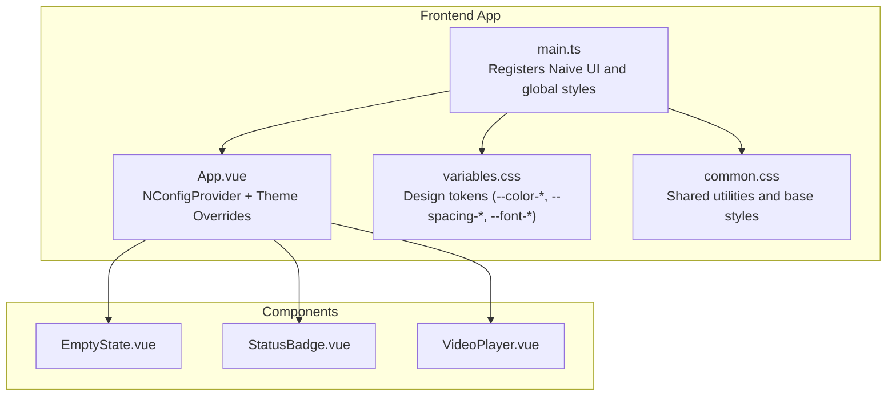
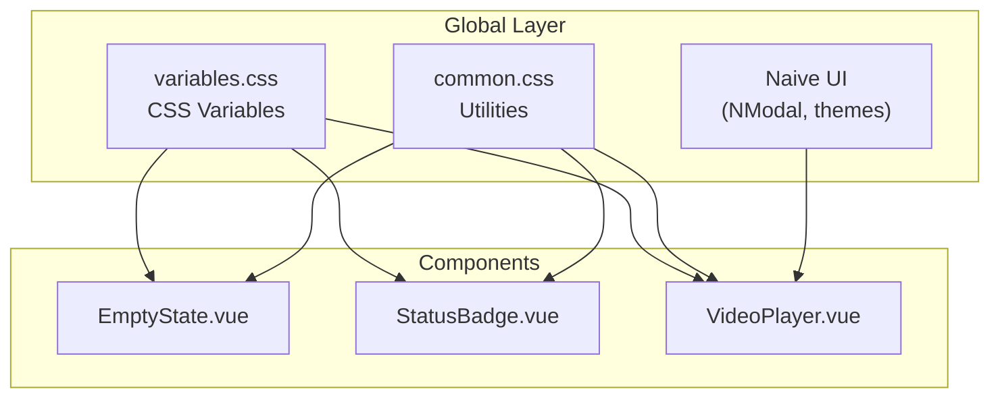
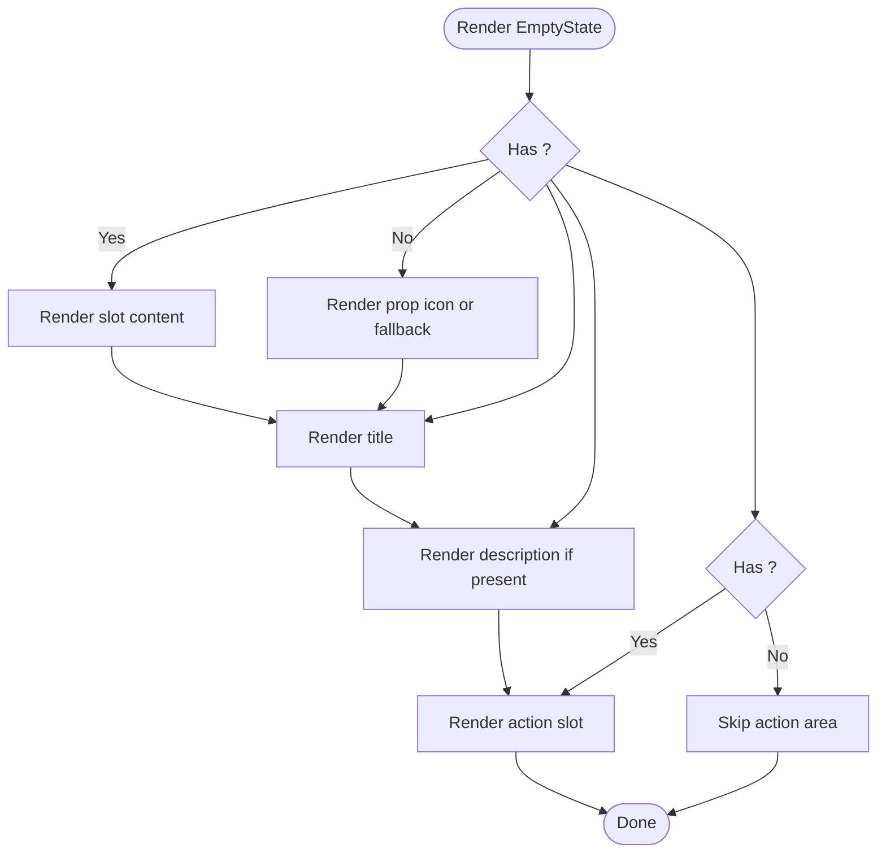
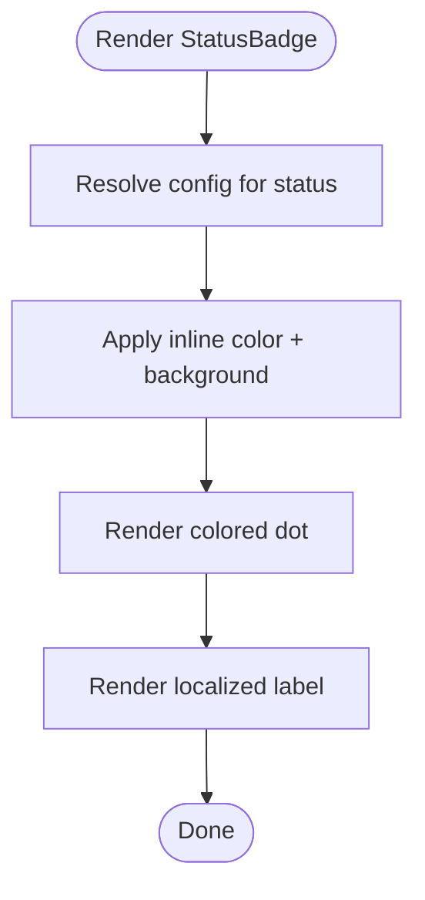
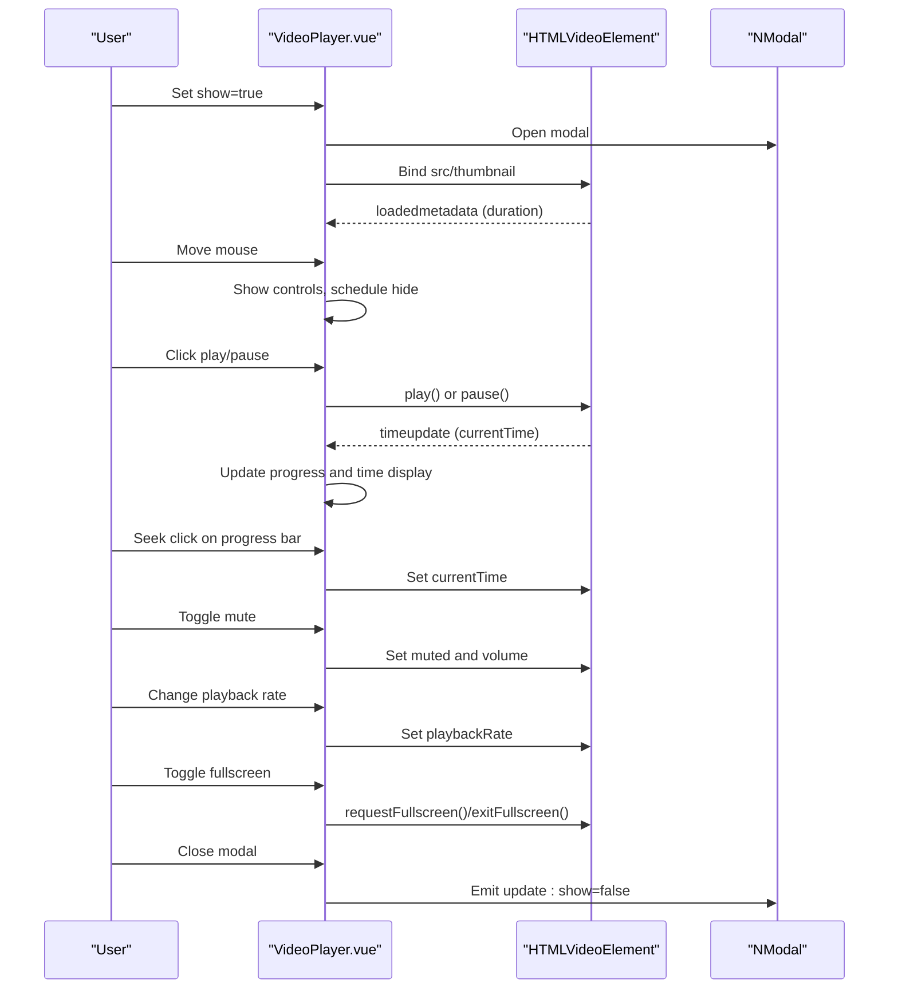
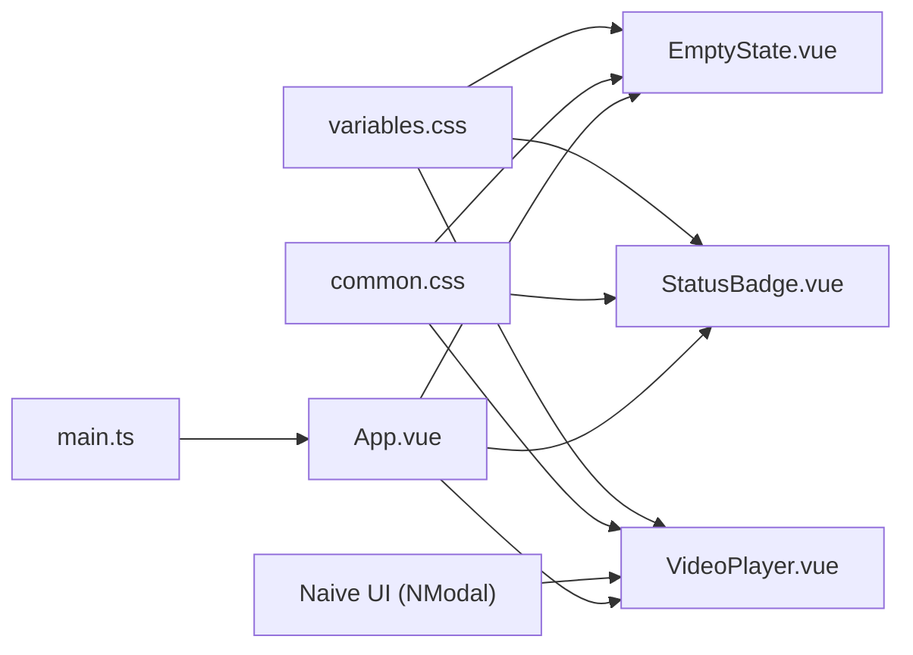

# Core UI Components

<cite>
**Referenced Files in This Document**
- [EmptyState.vue](file://packages/frontend/src/components/EmptyState.vue)
- [StatusBadge.vue](file://packages/frontend/src/components/StatusBadge.vue)
- [VideoPlayer.vue](file://packages/frontend/src/components/VideoPlayer.vue)
- [main.ts](file://packages/frontend/src/main.ts)
- [variables.css](file://packages/frontend/src/styles/variables.css)
- [common.css](file://packages/frontend/src/styles/common.css)
- [App.vue](file://packages/frontend/src/App.vue)
- [ProjectCompose.vue](file://packages/frontend/src/views/ProjectCompose.vue)
- [ProjectStoryboard.vue](file://packages/frontend/src/views/ProjectStoryboard.vue)
- [package.json](file://packages/frontend/package.json)
</cite>

## Table of Contents

1. [Introduction](#introduction)
2. [Project Structure](#project-structure)
3. [Core Components](#core-components)
4. [Architecture Overview](#architecture-overview)
5. [Detailed Component Analysis](#detailed-component-analysis)
6. [Dependency Analysis](#dependency-analysis)
7. [Performance Considerations](#performance-considerations)
8. [Troubleshooting Guide](#troubleshooting-guide)
9. [Conclusion](#conclusion)
10. [Appendices](#appendices)

## Introduction

This document describes the core reusable UI components in the Dreamer frontend: EmptyState, StatusBadge, and VideoPlayer. It explains component props, events, slots, styling options, and how they integrate with the Naive UI design system. It also covers accessibility, responsive behavior, and performance considerations, and provides usage examples and customization patterns drawn from real usage sites within the project.

## Project Structure

The components are located under the frontend package’s components directory and are integrated into the Vue application via the Naive UI design system. Global design tokens are defined in CSS variables and common styles.

**Diagram sources**

- [main.ts:1-18](file://packages/frontend/src/main.ts#L1-L18)
- [App.vue:152-183](file://packages/frontend/src/App.vue#L152-L183)
- [variables.css:1-114](file://packages/frontend/src/styles/variables.css#L1-L114)
- [common.css:1-331](file://packages/frontend/src/styles/common.css#L1-L331)
- [EmptyState.vue:1-56](file://packages/frontend/src/components/EmptyState.vue#L1-L56)
- [StatusBadge.vue:1-64](file://packages/frontend/src/components/StatusBadge.vue#L1-L64)
- [VideoPlayer.vue:1-371](file://packages/frontend/src/components/VideoPlayer.vue#L1-L371)

**Section sources**

- [main.ts:1-18](file://packages/frontend/src/main.ts#L1-L18)
- [variables.css:1-114](file://packages/frontend/src/styles/variables.css#L1-L114)
- [common.css:1-331](file://packages/frontend/src/styles/common.css#L1-L331)

## Core Components

This section summarizes the capabilities and APIs of each component.

- EmptyState
  - Purpose: Render empty states with optional action slot and customizable icon.
  - Props: title (required), description (optional), icon (optional).
  - Slots: icon (default renders prop or fallback emoji), action (optional).
  - Styling: Uses design tokens for spacing, typography, and colors.

- StatusBadge
  - Purpose: Visualize entity statuses with color-coded labels and dots.
  - Props: status (enum), size (small | medium).
  - Styling: Uses design tokens and inline styles derived from status config.

- VideoPlayer
  - Purpose: Modal-based video player with controls, progress, playback rate, mute, fullscreen, and frame stepping.
  - Props: show (boolean), videoUrl (optional), thumbnailUrl (optional).
  - Events: update:show (two-way binding).
  - Styling: Scoped styles with gradient overlays and responsive controls.

Integration with Naive UI:

- The app initializes Naive UI globally and applies theme overrides in App.vue.
- VideoPlayer composes with NModal for modal presentation.

**Section sources**

- [EmptyState.vue:1-56](file://packages/frontend/src/components/EmptyState.vue#L1-L56)
- [StatusBadge.vue:1-64](file://packages/frontend/src/components/StatusBadge.vue#L1-L64)
- [VideoPlayer.vue:1-371](file://packages/frontend/src/components/VideoPlayer.vue#L1-L371)
- [App.vue:71-149](file://packages/frontend/src/App.vue#L71-L149)

## Architecture Overview

The components are standalone Vue SFCs that rely on:

- Global design tokens from variables.css
- Shared utilities from common.css
- Naive UI primitives (NModal) for VideoPlayer
- Two-way binding via v-model for VideoPlayer visibility

**Diagram sources**

- [variables.css:1-114](file://packages/frontend/src/styles/variables.css#L1-L114)
- [common.css:140-198](file://packages/frontend/src/styles/common.css#L140-L198)
- [VideoPlayer.vue:3](file://packages/frontend/src/components/VideoPlayer.vue#L3)
- [EmptyState.vue:22-56](file://packages/frontend/src/components/EmptyState.vue#L22-L56)
- [StatusBadge.vue:36-64](file://packages/frontend/src/components/StatusBadge.vue#L36-L64)

## Detailed Component Analysis

### EmptyState

- Props
  - title: string (required)
  - description: string (optional)
  - icon: string (optional)
- Slots
  - icon: default renders prop or fallback emoji
  - action: optional container for actions
- Styling
  - Centered column layout with spacing tokens
  - Icon size and opacity tuned for emphasis
  - Title and description use semantic font sizes and weights
- Accessibility
  - Uses semantic headings and paragraphs
  - No interactive elements inside the component
- Responsive behavior
  - Flex column with centered alignment; scales with viewport
- Usage example
  - Refer to views that render EmptyState for empty lists or states

**Diagram sources**

- [EmptyState.vue:9-20](file://packages/frontend/src/components/EmptyState.vue#L9-L20)

**Section sources**

- [EmptyState.vue:1-56](file://packages/frontend/src/components/EmptyState.vue#L1-L56)
- [common.css:170-198](file://packages/frontend/src/styles/common.css#L170-L198)

### StatusBadge

- Props
  - status: enum of supported states
  - size: small | medium (default small)
- Behavior
  - Maps status to label, dot color, and background via internal config
  - Renders a dot and localized label
- Styling
  - Inline styles for color and background
  - Rounded pill shape with compact padding
  - Medium variant increases padding and font size
- Accessibility
  - Static badge; ensure sufficient color contrast against backgrounds
- Responsive behavior
  - Inline element; wraps naturally with text

**Diagram sources**

- [StatusBadge.vue:17-34](file://packages/frontend/src/components/StatusBadge.vue#L17-L34)

**Section sources**

- [StatusBadge.vue:1-64](file://packages/frontend/src/components/StatusBadge.vue#L1-L64)
- [common.css:140-169](file://packages/frontend/src/styles/common.css#L140-L169)

### VideoPlayer

- Props
  - show: boolean (controls modal visibility)
  - videoUrl: string (optional)
  - thumbnailUrl: string (optional)
- Events
  - update:show: two-way binding for show prop
- Internal state and behavior
  - Tracks play/pause, current time, duration, volume, mute, playback rate
  - Controls auto-hide after inactivity
  - Fullscreen support via native Fullscreen API
  - Progress bar seek and frame-by-frame stepping
- UI elements
  - Overlay controls with progress bar, play/pause, step buttons, volume slider, speed selector, fullscreen button
  - Play overlay appears when paused and controls are hidden
- Styling
  - Scoped styles with gradient overlays, rounded corners, and themed controls
  - Uses design tokens for colors and spacing
- Accessibility
  - Uses semantic SVG icons and aria-friendly button semantics
  - Consider adding native video attributes (e.g., title, aria-label) for screen readers
- Responsive behavior
  - Modal width adapts to viewport; controls remain usable on mobile touch surfaces

**Diagram sources**

- [VideoPlayer.vue:1126-124](file://packages/frontend/src/components/VideoPlayer.vue#L112-L124)
- [VideoPlayer.vue:127-227](file://packages/frontend/src/components/VideoPlayer.vue#L127-L227)

**Section sources**

- [VideoPlayer.vue:1-371](file://packages/frontend/src/components/VideoPlayer.vue#L1-L371)
- [package.json:25](file://packages/frontend/package.json#L25)

## Dependency Analysis

- Global design system
  - variables.css defines CSS variables consumed by all components
  - common.css provides shared utilities and base styles
- Component dependencies
  - EmptyState and StatusBadge depend on design tokens
  - VideoPlayer depends on Naive UI (NModal) and native HTMLVideoElement APIs
- App integration
  - main.ts registers Naive UI globally
  - App.vue configures theme overrides and providers

**Diagram sources**

- [variables.css:1-114](file://packages/frontend/src/styles/variables.css#L1-L114)
- [common.css:1-331](file://packages/frontend/src/styles/common.css#L1-L331)
- [VideoPlayer.vue:3](file://packages/frontend/src/components/VideoPlayer.vue#L3)
- [main.ts:1-18](file://packages/frontend/src/main.ts#L1-L18)
- [App.vue:152-183](file://packages/frontend/src/App.vue#L152-L183)

**Section sources**

- [package.json:14-29](file://packages/frontend/package.json#L14-L29)
- [main.ts:1-18](file://packages/frontend/src/main.ts#L1-L18)
- [App.vue:71-149](file://packages/frontend/src/App.vue#L71-L149)

## Performance Considerations

- EmptyState
  - Stateless and lightweight; minimal DOM overhead
- StatusBadge
  - Renders quickly; inline styles computed per render
  - Consider memoizing status config if used very frequently
- VideoPlayer
  - Heavyweight due to video element and modal; avoid rendering when not visible
  - Debounce or throttle mousemove handlers if extended usage patterns emerge
  - Prefer lazy initialization of video resources when possible
  - Use thumbnailUrl to reduce initial load when poster is sufficient

[No sources needed since this section provides general guidance]

## Troubleshooting Guide

- EmptyState
  - If icon does not appear, ensure the icon slot is populated or icon prop is set
  - If action area is missing, confirm the action slot is provided
- StatusBadge
  - If colors look incorrect, verify design tokens and theme overrides
  - If label is missing, ensure the status value exists in the config
- VideoPlayer
  - If controls do not show, check mousemove handler and showControls logic
  - If seeking fails, verify video metadata is loaded and duration is non-zero
  - If fullscreen does not work, ensure browser supports Fullscreen API and user gesture context
  - If playback rate changes do not apply, confirm videoRef is bound and playbackRate is set on the element

**Section sources**

- [EmptyState.vue:9-20](file://packages/frontend/src/components/EmptyState.vue#L9-L20)
- [StatusBadge.vue:17-34](file://packages/frontend/src/components/StatusBadge.vue#L17-L34)
- [VideoPlayer.vue:112-124](file://packages/frontend/src/components/VideoPlayer.vue#L112-L124)

## Conclusion

These three components form the foundation for consistent empty states, status communication, and media playback across the Dreamer frontend. They integrate cleanly with the design system and Naive UI, leveraging CSS variables for unified theming and scoped styles for encapsulation. Following the usage patterns and customization guidelines outlined here will help maintain visual coherence and performance.

[No sources needed since this section summarizes without analyzing specific files]

## Appendices

### Usage Examples and Integration Patterns

- EmptyState
  - Used in multiple views to indicate empty lists or states
  - Example usage sites: ProjectCharacterDetail.vue, ProjectCharacters.vue, Projects.vue, ProjectPipeline.vue, ProjectScript.vue, ProjectStoryboard.vue
- StatusBadge
  - Used to reflect task and composition statuses
  - Example usage sites: ProjectCompose.vue, ProjectScript.vue, ProjectStoryboard.vue, ProjectDetail.vue, Import.vue
- VideoPlayer
  - Used for previewing compositions and storyboards
  - Example usage sites: ProjectCompose.vue, ProjectStoryboard.vue

**Section sources**

- [ProjectCompose.vue:378-382](file://packages/frontend/src/views/ProjectCompose.vue#L378-L382)
- [ProjectStoryboard.vue:604-609](file://packages/frontend/src/views/ProjectStoryboard.vue#L604-L609)

### Accessibility and Responsive Notes

- Accessibility
  - Add native video attributes (e.g., title, aria-label) to improve screen reader support
  - Ensure sufficient color contrast for badges and overlays
- Responsive behavior
  - Components use flexible layouts; ensure parent containers constrain widths appropriately
  - Test controls on small screens for tap targets and visibility

[No sources needed since this section provides general guidance]
