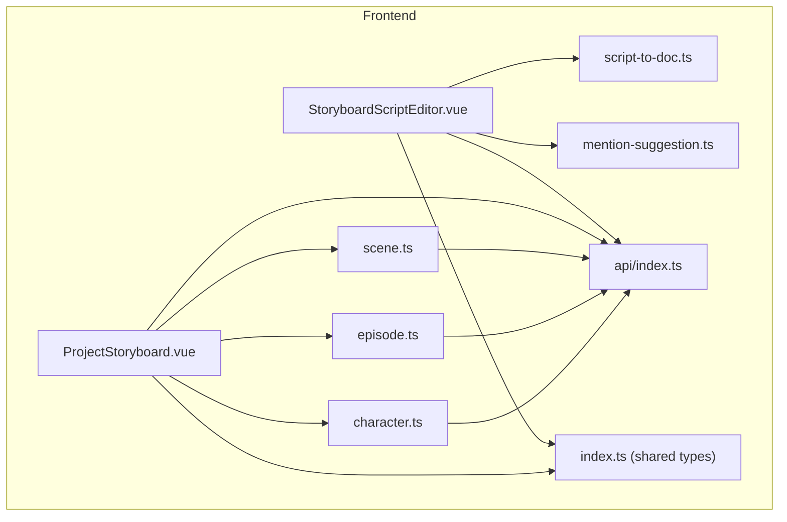
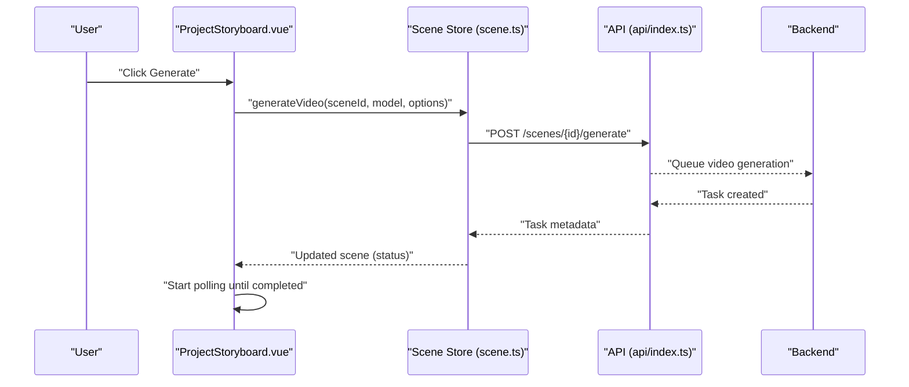
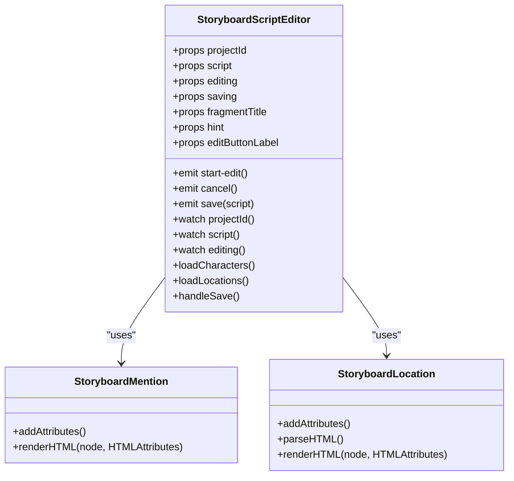
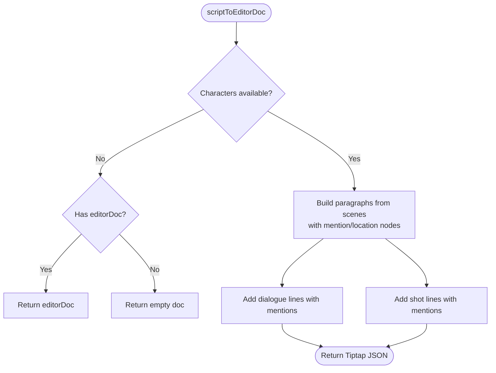
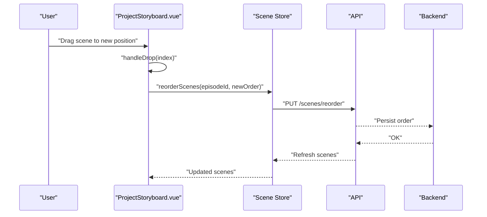
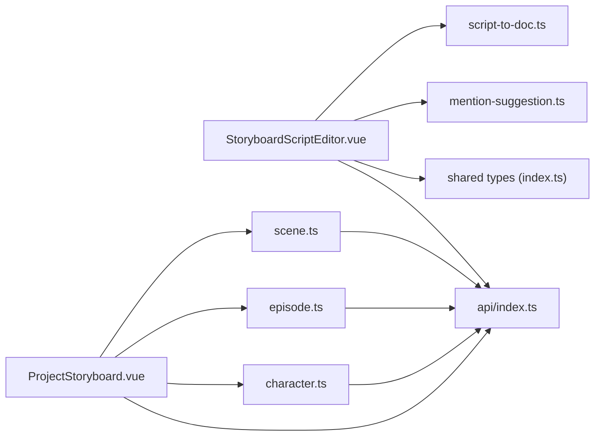

# Storyboard and Script Components

<cite>
**Referenced Files in This Document**
- [StoryboardScriptEditor.vue](file://packages/frontend/src/components/storyboard/StoryboardScriptEditor.vue)
- [script-to-doc.ts](file://packages/frontend/src/lib/storyboard-editor/script-to-doc.ts)
- [mention-suggestion.ts](file://packages/frontend/src/lib/storyboard-editor/mention-suggestion.ts)
- [ProjectStoryboard.vue](file://packages/frontend/src/views/ProjectStoryboard.vue)
- [scene.ts](file://packages/frontend/src/stores/scene.ts)
- [episode.ts](file://packages/frontend/src/stores/episode.ts)
- [character.ts](file://packages/frontend/src/stores/character.ts)
- [index.ts](file://packages/shared/src/types/index.ts)
- [api/index.ts](file://packages/frontend/src/api/index.ts)
- [main.ts](file://packages/frontend/src/main.ts)
</cite>

## Table of Contents

1. [Introduction](#introduction)
2. [Project Structure](#project-structure)
3. [Core Components](#core-components)
4. [Architecture Overview](#architecture-overview)
5. [Detailed Component Analysis](#detailed-component-analysis)
6. [Dependency Analysis](#dependency-analysis)
7. [Performance Considerations](#performance-considerations)
8. [Troubleshooting Guide](#troubleshooting-guide)
9. [Conclusion](#conclusion)

## Introduction

This document explains the StoryboardScriptEditor component and related storyboard functionality. It covers rich text editing powered by Tiptap, script formatting and parsing, asset linking for characters and locations, drag-and-drop scene reordering, and integration with AI-driven workflows. It also documents state management, event handling, and performance considerations for large scripts.

## Project Structure

The storyboard and script editing features are implemented in the frontend package under the Vue 3 application. Key areas:

- Component: StoryboardScriptEditor.vue renders a rich text editor and handles mentions and locations.
- Library: storyboard-editor utilities convert between structured script data and Tiptap JSON.
- Views: ProjectStoryboard.vue orchestrates scene lists, generation, and preview.
- Stores: Pinia stores manage scenes, episodes, and characters.
- Shared types: Strongly typed data models for scripts, scenes, and assets.
- API: Axios-based client for backend integration.

**Diagram sources**

- [StoryboardScriptEditor.vue:1-653](file://packages/frontend/src/components/storyboard/StoryboardScriptEditor.vue#L1-L653)
- [ProjectStoryboard.vue:1-882](file://packages/frontend/src/views/ProjectStoryboard.vue#L1-L882)
- [script-to-doc.ts:1-306](file://packages/frontend/src/lib/storyboard-editor/script-to-doc.ts#L1-L306)
- [mention-suggestion.ts:1-152](file://packages/frontend/src/lib/storyboard-editor/mention-suggestion.ts#L1-L152)
- [scene.ts:1-232](file://packages/frontend/src/stores/scene.ts#L1-L232)
- [episode.ts:1-125](file://packages/frontend/src/stores/episode.ts#L1-L125)
- [character.ts:1-158](file://packages/frontend/src/stores/character.ts#L1-L158)
- [index.ts:79-134](file://packages/shared/src/types/index.ts#L79-L134)
- [api/index.ts:1-332](file://packages/frontend/src/api/index.ts#L1-L332)

**Section sources**

- [main.ts:1-18](file://packages/frontend/src/main.ts#L1-L18)
- [ProjectStoryboard.vue:1-882](file://packages/frontend/src/views/ProjectStoryboard.vue#L1-L882)

## Core Components

- StoryboardScriptEditor: Rich text editor built on Tiptap with custom mention and location nodes, keyboard navigation, and dropdown suggestions.
- storyboard-editor utilities: Convert structured script data to Tiptap JSON and parse back to structured scenes.
- ProjectStoryboard view: Manages scenes, generation, selection, and preview; supports drag-and-drop reordering.
- Pinia stores: Scene, Episode, and Character stores encapsulate CRUD and orchestration for scenes and assets.
- Shared types: Define ScriptContent, ScriptScene, ScriptStoryboardShot, and related models.

Key responsibilities:

- Rich text editing: Formatting, mentions (@character), and location markers.
- Asset linking: Characters and locations are resolved and rendered inline.
- Script parsing/generation: Round-trip conversion between structured scenes and Tiptap JSON.
- Collaboration-ready UX: Real-time updates via polling and SSE bridges (see SSE composable).

**Section sources**

- [StoryboardScriptEditor.vue:1-653](file://packages/frontend/src/components/storyboard/StoryboardScriptEditor.vue#L1-L653)
- [script-to-doc.ts:1-306](file://packages/frontend/src/lib/storyboard-editor/script-to-doc.ts#L1-L306)
- [ProjectStoryboard.vue:1-882](file://packages/frontend/src/views/ProjectStoryboard.vue#L1-L882)
- [scene.ts:1-232](file://packages/frontend/src/stores/scene.ts#L1-L232)
- [episode.ts:1-125](file://packages/frontend/src/stores/episode.ts#L1-L125)
- [character.ts:1-158](file://packages/frontend/src/stores/character.ts#L1-L158)
- [index.ts:79-134](file://packages/shared/src/types/index.ts#L79-L134)

## Architecture Overview

The system integrates a Tiptap-based editor with backend APIs for scenes, episodes, and assets. The editor emits save events with Tiptap JSON, while the view manages scene lifecycle and generation.

**Diagram sources**

- [ProjectStoryboard.vue:172-178](file://packages/frontend/src/views/ProjectStoryboard.vue#L172-L178)
- [scene.ts:142-167](file://packages/frontend/src/stores/scene.ts#L142-L167)
- [api/index.ts:1-332](file://packages/frontend/src/api/index.ts#L1-L332)

## Detailed Component Analysis

### StoryboardScriptEditor Component

Responsibilities:

- Initialize Tiptap editor with StarterKit, Placeholder, custom Mention, and custom Location node.
- Detect "@" input and render a fixed-position dropdown with character suggestions.
- Insert mention nodes with avatar URLs and labels.
- Convert structured ScriptContent to Tiptap JSON and vice versa.
- Emit save events with updated editorDoc.

Custom nodes and extensions:

- StoryboardMention: Adds avatarUrl attribute and renders inline mention with avatar or icon.
- StoryboardLocation: Renders location markers inline with optional image.

State and events:

- Props: projectId, script, editing, saving, fragmentTitle, hint, editButtonLabel.
- Emits: start-edit, cancel, save(script).

Integration points:

- Loads characters and locations via API on projectId change.
- Uses scriptToEditorDoc to hydrate editor content.
- On save, emits Tiptap JSON as part of ScriptContent.

**Diagram sources**

- [StoryboardScriptEditor.vue:1-653](file://packages/frontend/src/components/storyboard/StoryboardScriptEditor.vue#L1-L653)

**Section sources**

- [StoryboardScriptEditor.vue:1-653](file://packages/frontend/src/components/storyboard/StoryboardScriptEditor.vue#L1-L653)

### Script-to-Doc Conversion Utilities

Responsibilities:

- scriptToEditorDoc: Converts ScriptContent to Tiptap JSON, inserting mention and location nodes.
- parseEditorDocToScene: Parses Tiptap JSON back into structured ScriptScene.

Processing logic:

- For each scene, build paragraph nodes for location/time-of-day, description, dialogues, and shots.
- Shots support two modes: explicit characters array (preferred) or regex parsing of “【Character·Image】” patterns.
- Mentions resolve to character images; locations resolve to stored ProjectLocation entries.

**Diagram sources**

- [script-to-doc.ts:99-221](file://packages/frontend/src/lib/storyboard-editor/script-to-doc.ts#L99-L221)

**Section sources**

- [script-to-doc.ts:1-306](file://packages/frontend/src/lib/storyboard-editor/script-to-doc.ts#L1-L306)

### Mention Suggestion Rendering

Responsibilities:

- Provide a DOM-based suggestion list for @mentions with keyboard navigation and click selection.
- Compute absolute/fixed positioning relative to the editor and viewport boundaries.
- Command injection to insert selected mention into the editor.

Behavior:

- Render list inside editor pane when positioned absolutely, otherwise fixed to body.
- Adjust position to avoid clipping off-screen.

**Section sources**

- [mention-suggestion.ts:1-152](file://packages/frontend/src/lib/storyboard-editor/mention-suggestion.ts#L1-L152)

### ProjectStoryboard View and Scene Management

Responsibilities:

- Manage episodes, scenes, and character references.
- Support creation, editing, deletion, and bulk operations on scenes.
- Drag-and-drop reordering of scenes.
- Trigger video generation per scene or in batch.
- Poll for generation status and update UI accordingly.

Key interactions:

- DragStart/Drop handlers update scene order and call reorderScenes.
- Generation triggers generateVideo or batchGenerate and starts polling.
- Optimizing prompts via optimizePrompt endpoint.

**Diagram sources**

- [ProjectStoryboard.vue:265-282](file://packages/frontend/src/views/ProjectStoryboard.vue#L265-L282)
- [scene.ts:136-140](file://packages/frontend/src/stores/scene.ts#L136-L140)

**Section sources**

- [ProjectStoryboard.vue:1-882](file://packages/frontend/src/views/ProjectStoryboard.vue#L1-L882)
- [scene.ts:1-232](file://packages/frontend/src/stores/scene.ts#L1-L232)

### Data Models and Types

Key types:

- ScriptContent: Top-level script with scenes and optional editorDoc.
- ScriptScene: Scene-level structure including location, timeOfDay, characters, description, dialogues, actions, and optional shots.
- ScriptStoryboardShot: Per-shot structure with shotNum, order, description, camera details, duration, and optional characters.
- Episode, Take, SceneStatus, VideoModel, TaskStatus: Episode-level orchestration and scene generation metadata.

These types define the contract between the editor, view, stores, and backend.

**Section sources**

- [index.ts:79-134](file://packages/shared/src/types/index.ts#L79-L134)
- [index.ts:166-195](file://packages/shared/src/types/index.ts#L166-L195)

## Dependency Analysis

Component and module relationships:

- StoryboardScriptEditor depends on Tiptap core and extensions, and on storyboard-editor utilities.
- ProjectStoryboard depends on scene, episode, and character stores.
- All components communicate with backend via the API module.
- Shared types unify data contracts across modules.

**Diagram sources**

- [StoryboardScriptEditor.vue:1-653](file://packages/frontend/src/components/storyboard/StoryboardScriptEditor.vue#L1-L653)
- [script-to-doc.ts:1-306](file://packages/frontend/src/lib/storyboard-editor/script-to-doc.ts#L1-L306)
- [mention-suggestion.ts:1-152](file://packages/frontend/src/lib/storyboard-editor/mention-suggestion.ts#L1-L152)
- [ProjectStoryboard.vue:1-882](file://packages/frontend/src/views/ProjectStoryboard.vue#L1-L882)
- [scene.ts:1-232](file://packages/frontend/src/stores/scene.ts#L1-L232)
- [episode.ts:1-125](file://packages/frontend/src/stores/episode.ts#L1-L125)
- [character.ts:1-158](file://packages/frontend/src/stores/character.ts#L1-L158)
- [index.ts:79-134](file://packages/shared/src/types/index.ts#L79-L134)
- [api/index.ts:1-332](file://packages/frontend/src/api/index.ts#L1-L332)

**Section sources**

- [StoryboardScriptEditor.vue:1-653](file://packages/frontend/src/components/storyboard/StoryboardScriptEditor.vue#L1-L653)
- [ProjectStoryboard.vue:1-882](file://packages/frontend/src/views/ProjectStoryboard.vue#L1-L882)
- [scene.ts:1-232](file://packages/frontend/src/stores/scene.ts#L1-L232)
- [episode.ts:1-125](file://packages/frontend/src/stores/episode.ts#L1-L125)
- [character.ts:1-158](file://packages/frontend/src/stores/character.ts#L1-L158)
- [index.ts:79-134](file://packages/shared/src/types/index.ts#L79-L134)
- [api/index.ts:1-332](file://packages/frontend/src/api/index.ts#L1-L332)

## Performance Considerations

- Large scripts: The editor uses Tiptap JSON. For very large documents, consider:
  - Debounced updates and selective re-rendering.
  - Virtualized lists for scene previews.
  - Lazy loading of assets (characters, locations).
- Rendering mentions and locations: Memoize lookups by name and cache resolved nodes.
- Parsing: parseEditorDocToScene walks paragraph content; keep parsing logic efficient and avoid redundant DOM queries.
- Network: Batch operations (e.g., batchGenerate) reduce round trips; use polling intervals judiciously.

[No sources needed since this section provides general guidance]

## Troubleshooting Guide

Common issues and resolutions:

- Mentions not appearing:
  - Ensure projectId is set so characters can be loaded.
  - Verify @ detection logic matches input patterns.
- Locations not rendering:
  - Confirm locations are fetched and matched by name.
- Save does not persist:
  - Check that save emits Tiptap JSON and that the backend accepts editorDoc.
- Generation not starting:
  - Verify sceneId and model selection.
  - Confirm network connectivity and API responses.
- Drag-and-drop order not updating:
  - Ensure reorderScenes is called and scenes are refreshed after reorder.

**Section sources**

- [StoryboardScriptEditor.vue:332-370](file://packages/frontend/src/components/storyboard/StoryboardScriptEditor.vue#L332-L370)
- [ProjectStoryboard.vue:172-178](file://packages/frontend/src/views/ProjectStoryboard.vue#L172-L178)
- [scene.ts:136-140](file://packages/frontend/src/stores/scene.ts#L136-L140)

## Conclusion

The StoryBoardScriptEditor integrates Tiptap with custom nodes for mentions and locations, enabling rich script authoring with asset linking. The surrounding view and stores provide scene lifecycle management, generation orchestration, and drag-and-drop reordering. With robust type definitions and API integration, the system supports scalable workflows for storyboard script generation and collaboration.
