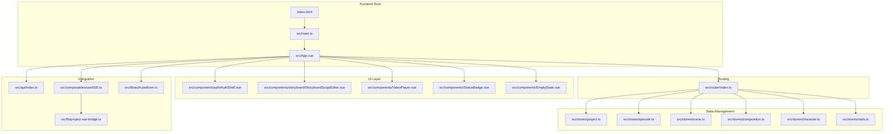
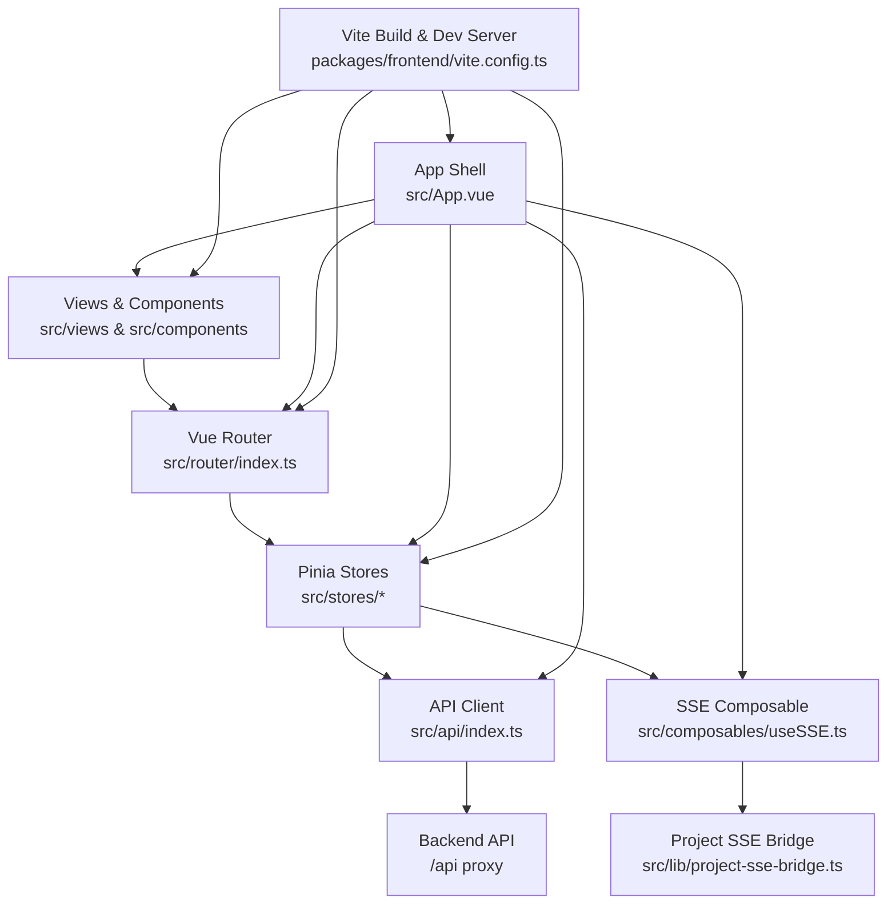
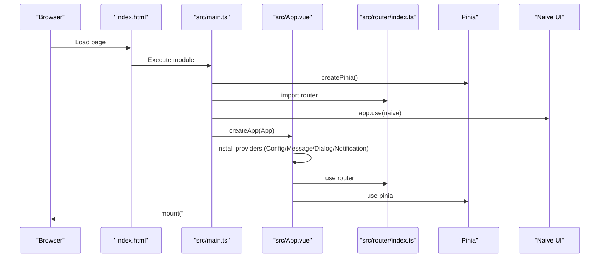
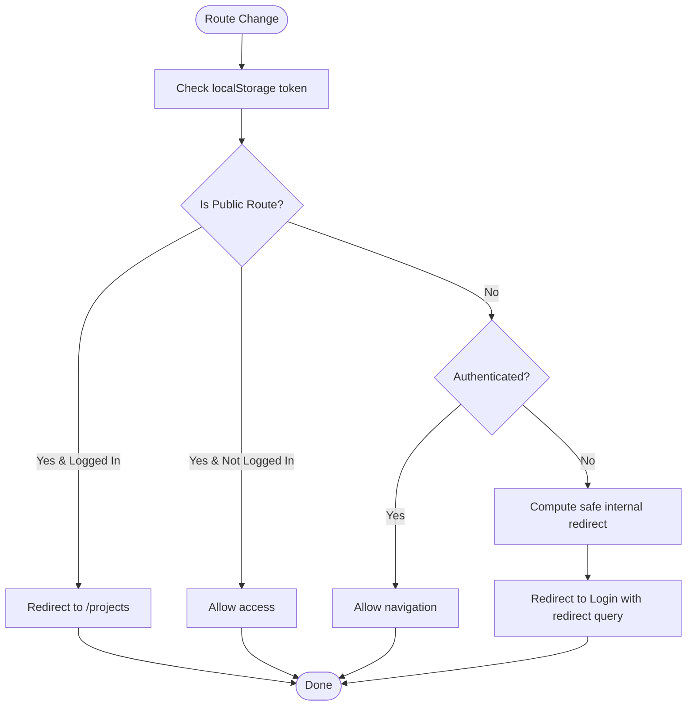
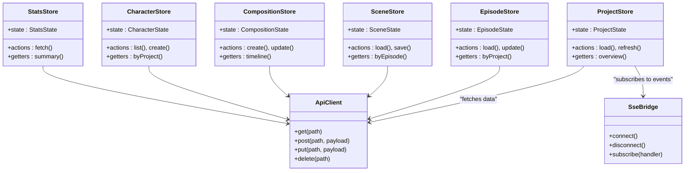
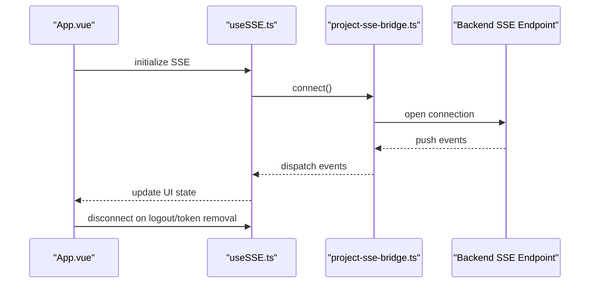
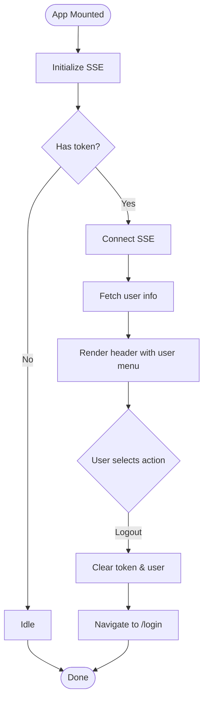
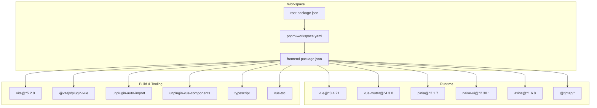

# Frontend Overview

<cite>
**Referenced Files in This Document**
- [package.json](file://packages/frontend/package.json)
- [main.ts](file://packages/frontend/src/main.ts)
- [App.vue](file://packages/frontend/src/App.vue)
- [vite.config.ts](file://packages/frontend/vite.config.ts)
- [index.html](file://packages/frontend/index.html)
- [tsconfig.json](file://packages/frontend/tsconfig.json)
- [tsconfig.node.json](file://packages/frontend/tsconfig.node.json)
- [env.d.ts](file://packages/frontend/src/env.d.ts)
- [router/index.ts](file://packages/frontend/src/router/index.ts)
- [stores/project.ts](file://packages/frontend/src/stores/project.ts)
- [stores/episode.ts](file://packages/frontend/src/stores/episode.ts)
- [stores/scene.ts](file://packages/frontend/src/stores/scene.ts)
- [stores/composition.ts](file://packages/frontend/src/stores/composition.ts)
- [stores/character.ts](file://packages/frontend/src/stores/character.ts)
- [stores/stats.ts](file://packages/frontend/src/stores/stats.ts)
- [composables/useSSE.ts](file://packages/frontend/src/composables/useSSE.ts)
- [lib/project-sse-bridge.ts](file://packages/frontend/src/lib/project-sse-bridge.ts)
- [lib/auth-platform.ts](file://packages/frontend/src/lib/auth-platform.ts)
- [components/auth/AuthShell.vue](file://packages/frontend/src/components/auth/AuthShell.vue)
- [components/storyboard/StoryboardScriptEditor.vue](file://packages/frontend/src/components/storyboard/StoryboardScriptEditor.vue)
- [components/VideoPlayer.vue](file://packages/frontend/src/components/VideoPlayer.vue)
- [components/StatusBadge.vue](file://packages/frontend/src/components/StatusBadge.vue)
- [components/EmptyState.vue](file://packages/frontend/src/components/EmptyState.vue)
- [api/index.ts](file://packages/frontend/src/api/index.ts)
- [package.json](file://package.json)
- [pnpm-workspace.yaml](file://pnpm-workspace.yaml)
</cite>

## Table of Contents

1. [Introduction](#introduction)
2. [Project Structure](#project-structure)
3. [Core Components](#core-components)
4. [Architecture Overview](#architecture-overview)
5. [Detailed Component Analysis](#detailed-component-analysis)
6. [Dependency Analysis](#dependency-analysis)
7. [Performance Considerations](#performance-considerations)
8. [Troubleshooting Guide](#troubleshooting-guide)
9. [Conclusion](#conclusion)

## Introduction

This document provides a comprehensive frontend overview for the Vue 3 application. It explains the overall architecture, project structure, and core technologies used. It documents the application bootstrap process, main entry point configuration, and global setup procedures. It also covers the build system with Vite, development server configuration, and environment setup. Finally, it outlines the technology stack choices, dependency management, and project organization principles, and presents an architectural overview of how different parts of the frontend system work together to deliver the user experience.

## Project Structure

The frontend is organized as a Vite-managed Vue 3 application under the packages/frontend directory. The structure follows a feature-based organization with clear separation of concerns:

- src/api: centralized API client
- src/components: reusable UI components and feature-specific components
- src/composables: reusable logic hooks
- src/lib: cross-cutting libraries and integrations
- src/router: route definitions and navigation guards
- src/stores: Pinia stores for state management
- src/styles: design system CSS
- src/views: page-level components rendered by the router
- Root configs: Vite, TypeScript, and HTML entry point

**Diagram sources**

- [index.html:1-14](file://packages/frontend/index.html#L1-L14)
- [main.ts:1-18](file://packages/frontend/src/main.ts#L1-L18)
- [App.vue:1-231](file://packages/frontend/src/App.vue#L1-L231)
- [router/index.ts:1-145](file://packages/frontend/src/router/index.ts#L1-L145)
- [stores/project.ts](file://packages/frontend/src/stores/project.ts)
- [stores/episode.ts](file://packages/frontend/src/stores/episode.ts)
- [stores/scene.ts](file://packages/frontend/src/stores/scene.ts)
- [stores/composition.ts](file://packages/frontend/src/stores/composition.ts)
- [stores/character.ts](file://packages/frontend/src/stores/character.ts)
- [stores/stats.ts](file://packages/frontend/src/stores/stats.ts)
- [components/auth/AuthShell.vue](file://packages/frontend/src/components/auth/AuthShell.vue)
- [components/storyboard/StoryboardScriptEditor.vue](file://packages/frontend/src/components/storyboard/StoryboardScriptEditor.vue)
- [components/VideoPlayer.vue](file://packages/frontend/src/components/VideoPlayer.vue)
- [components/StatusBadge.vue](file://packages/frontend/src/components/StatusBadge.vue)
- [components/EmptyState.vue](file://packages/frontend/src/components/EmptyState.vue)
- [api/index.ts](file://packages/frontend/src/api/index.ts)
- [composables/useSSE.ts](file://packages/frontend/src/composables/useSSE.ts)
- [lib/project-sse-bridge.ts](file://packages/frontend/src/lib/project-sse-bridge.ts)
- [lib/auth-platform.ts](file://packages/frontend/src/lib/auth-platform.ts)

**Section sources**

- [package.json:1-41](file://packages/frontend/package.json#L1-L41)
- [vite.config.ts:1-48](file://packages/frontend/vite.config.ts#L1-L48)
- [tsconfig.json:1-25](file://packages/frontend/tsconfig.json#L1-L25)
- [index.html:1-14](file://packages/frontend/index.html#L1-L14)

## Core Components

This section highlights the core building blocks of the frontend system.

- Application bootstrap and global setup
  - The application initializes via the main entry point, mounting the root Vue component and installing global plugins for routing, state management, and UI components.
  - Global CSS for design tokens and common styles is imported to establish a consistent theme and layout.

- Routing and navigation
  - The router defines public and protected routes, enforces safe internal redirects, and applies navigation guards to protect non-public pages. It supports nested routes for project-centric views.

- State management
  - Pinia stores encapsulate domain-specific state for projects, episodes, scenes, compositions, characters, and statistics. They centralize data fetching, mutations, and derived state computations.

- UI framework and design system
  - Naive UI provides a comprehensive set of components with built-in theming support. The application overrides theme tokens to match brand guidelines and ensures consistent spacing and typography.

- Real-time updates
  - A composable integrates Server-Sent Events (SSE) to stream live updates from the backend, connecting to a dedicated SSE bridge for project-related events.

- Authentication shell
  - An authentication shell component wraps protected areas and handles user menu actions, including logout and profile interactions.

**Section sources**

- [main.ts:1-18](file://packages/frontend/src/main.ts#L1-L18)
- [App.vue:1-231](file://packages/frontend/src/App.vue#L1-L231)
- [router/index.ts:1-145](file://packages/frontend/src/router/index.ts#L1-L145)
- [stores/project.ts](file://packages/frontend/src/stores/project.ts)
- [stores/episode.ts](file://packages/frontend/src/stores/episode.ts)
- [stores/scene.ts](file://packages/frontend/src/stores/scene.ts)
- [stores/composition.ts](file://packages/frontend/src/stores/composition.ts)
- [stores/character.ts](file://packages/frontend/src/stores/character.ts)
- [stores/stats.ts](file://packages/frontend/src/stores/stats.ts)
- [composables/useSSE.ts](file://packages/frontend/src/composables/useSSE.ts)
- [lib/project-sse-bridge.ts](file://packages/frontend/src/lib/project-sse-bridge.ts)
- [components/auth/AuthShell.vue](file://packages/frontend/src/components/auth/AuthShell.vue)

## Architecture Overview

The frontend architecture centers around a layered design:

- Presentation layer: Vue components (views and UI components) render the user interface.
- Routing layer: Vue Router manages navigation, guards, and nested routes.
- State layer: Pinia stores manage domain state and expose actions/selectors.
- Integration layer: API client and SSE composable handle backend communication.
- Infrastructure layer: Vite builds and serves the application with hot module replacement and proxying.

**Diagram sources**

- [App.vue:1-231](file://packages/frontend/src/App.vue#L1-L231)
- [router/index.ts:1-145](file://packages/frontend/src/router/index.ts#L1-L145)
- [stores/project.ts](file://packages/frontend/src/stores/project.ts)
- [stores/episode.ts](file://packages/frontend/src/stores/episode.ts)
- [stores/scene.ts](file://packages/frontend/src/stores/scene.ts)
- [stores/composition.ts](file://packages/frontend/src/stores/composition.ts)
- [stores/character.ts](file://packages/frontend/src/stores/character.ts)
- [stores/stats.ts](file://packages/frontend/src/stores/stats.ts)
- [api/index.ts](file://packages/frontend/src/api/index.ts)
- [composables/useSSE.ts](file://packages/frontend/src/composables/useSSE.ts)
- [lib/project-sse-bridge.ts](file://packages/frontend/src/lib/project-sse-bridge.ts)
- [vite.config.ts:1-48](file://packages/frontend/vite.config.ts#L1-L48)

## Detailed Component Analysis

### Bootstrap and Global Setup

The application bootstraps by creating a Vue app instance, installing Pinia, Vue Router, and Naive UI, then mounting to the DOM. Global styles are imported to apply design tokens and base styles.

**Diagram sources**

- [index.html:1-14](file://packages/frontend/index.html#L1-L14)
- [main.ts:1-18](file://packages/frontend/src/main.ts#L1-L18)
- [App.vue:1-231](file://packages/frontend/src/App.vue#L1-L231)
- [router/index.ts:1-145](file://packages/frontend/src/router/index.ts#L1-L145)

**Section sources**

- [main.ts:1-18](file://packages/frontend/src/main.ts#L1-L18)
- [App.vue:1-231](file://packages/frontend/src/App.vue#L1-L231)
- [index.html:1-14](file://packages/frontend/index.html#L1-L14)

### Routing and Navigation Guards

The router defines public and protected routes, enforces safe internal redirects, and redirects unauthenticated users to the login page while preserving intended destinations. Nested routes support a rich project-centric navigation model.

**Diagram sources**

- [router/index.ts:1-145](file://packages/frontend/src/router/index.ts#L1-L145)

**Section sources**

- [router/index.ts:1-145](file://packages/frontend/src/router/index.ts#L1-L145)

### State Management with Pinia

Pinia stores encapsulate domain state and logic. Example stores include project, episode, scene, composition, character, and stats. They coordinate with the API client and SSE bridge to keep the UI synchronized with backend data.

**Diagram sources**

- [stores/project.ts](file://packages/frontend/src/stores/project.ts)
- [stores/episode.ts](file://packages/frontend/src/stores/episode.ts)
- [stores/scene.ts](file://packages/frontend/src/stores/scene.ts)
- [stores/composition.ts](file://packages/frontend/src/stores/composition.ts)
- [stores/character.ts](file://packages/frontend/src/stores/character.ts)
- [stores/stats.ts](file://packages/frontend/src/stores/stats.ts)
- [api/index.ts](file://packages/frontend/src/api/index.ts)
- [lib/project-sse-bridge.ts](file://packages/frontend/src/lib/project-sse-bridge.ts)

**Section sources**

- [stores/project.ts](file://packages/frontend/src/stores/project.ts)
- [stores/episode.ts](file://packages/frontend/src/stores/episode.ts)
- [stores/scene.ts](file://packages/frontend/src/stores/scene.ts)
- [stores/composition.ts](file://packages/frontend/src/stores/composition.ts)
- [stores/character.ts](file://packages/frontend/src/stores/character.ts)
- [stores/stats.ts](file://packages/frontend/src/stores/stats.ts)
- [api/index.ts](file://packages/frontend/src/api/index.ts)
- [lib/project-sse-bridge.ts](file://packages/frontend/src/lib/project-sse-bridge.ts)

### Real-Time Updates with SSE

The application integrates Server-Sent Events to receive live updates from the backend. The SSE composable initializes connections after the app mounts and coordinates with the project SSE bridge to subscribe to relevant channels.

**Diagram sources**

- [App.vue:1-231](file://packages/frontend/src/App.vue#L1-L231)
- [composables/useSSE.ts](file://packages/frontend/src/composables/useSSE.ts)
- [lib/project-sse-bridge.ts](file://packages/frontend/src/lib/project-sse-bridge.ts)

**Section sources**

- [App.vue:1-231](file://packages/frontend/src/App.vue#L1-L231)
- [composables/useSSE.ts](file://packages/frontend/src/composables/useSSE.ts)
- [lib/project-sse-bridge.ts](file://packages/frontend/src/lib/project-sse-bridge.ts)

### Authentication Shell

The authentication shell component renders the top navigation bar and user menu. It handles logout by clearing local storage and redirecting to the login page.

**Diagram sources**

- [App.vue:1-231](file://packages/frontend/src/App.vue#L1-L231)
- [components/auth/AuthShell.vue](file://packages/frontend/src/components/auth/AuthShell.vue)

**Section sources**

- [App.vue:1-231](file://packages/frontend/src/App.vue#L1-L231)
- [components/auth/AuthShell.vue](file://packages/frontend/src/components/auth/AuthShell.vue)

## Dependency Analysis

The frontend uses a modern, modular stack with strong tooling and developer experience enhancements.

- Core runtime dependencies
  - Vue 3: reactive components and composition API
  - Vue Router 4: declarative routing with nested views
  - Pinia: state management with type safety
  - Naive UI: UI component library with theming
  - Axios: HTTP client for API requests
  - TipTap: Rich text editor extensions

- Build and tooling dependencies
  - Vite: fast dev server and optimized bundling
  - Vue plugin for Vite: single-file component support
  - Auto-import plugin: automatic imports for Vue APIs
  - Component auto-registration plugin: register UI components globally
  - TypeScript and vue-tsc: type checking and compilation

- Workspace integration
  - The monorepo uses pnpm workspaces to manage shared packages and scripts across frontend, backend, and shared modules.

**Diagram sources**

- [package.json:1-41](file://packages/frontend/package.json#L1-L41)
- [package.json:1-43](file://package.json#L1-L43)
- [pnpm-workspace.yaml:1-3](file://pnpm-workspace.yaml#L1-L3)

**Section sources**

- [package.json:1-41](file://packages/frontend/package.json#L1-L41)
- [package.json:1-43](file://package.json#L1-L43)
- [pnpm-workspace.yaml:1-3](file://pnpm-workspace.yaml#L1-L3)

## Performance Considerations

- Lazy loading routes: Views are dynamically imported to reduce initial bundle size.
- Component lazy loading: UI components are auto-registered and resolved on demand.
- Tree-shaking: Vite and modern module resolution enable dead code elimination.
- Hot module replacement: Fast feedback during development with minimal reloads.
- Source maps: Enabled in development for debugging without impacting production builds.
- Environment-aware configuration: API base URL can be overridden via environment variables.

[No sources needed since this section provides general guidance]

## Troubleshooting Guide

Common issues and resolutions:

- API requests failing
  - Verify the development proxy configuration for /api and ensure the backend is running on the configured target host and port.
  - Confirm the presence of a valid token in local storage for protected routes.

- Hot module replacement not working
  - Check the Vite server configuration for host, port, and HMR overlay settings.
  - Ensure file watching is enabled and polling intervals are appropriate for the development environment.

- Type errors in Vue SFCs
  - Run the type checker to identify issues and ensure the TS config includes Vue and TSX files.

- Missing environment variables
  - Define VITE_API_BASE_URL in the environment to override the default API base URL.

**Section sources**

- [vite.config.ts:1-48](file://packages/frontend/vite.config.ts#L1-L48)
- [env.d.ts:1-16](file://packages/frontend/src/env.d.ts#L1-L16)
- [router/index.ts:1-145](file://packages/frontend/src/router/index.ts#L1-L145)

## Conclusion

The Vue 3 frontend is structured as a modern, scalable monorepo package with clear separation of concerns. It leverages Vue Router for navigation, Pinia for state management, Naive UI for components, and Vite for a fast development experience. The architecture emphasizes modularity, real-time updates via SSE, and robust routing guards to ensure a secure and responsive user experience. The build system and tooling provide efficient development workflows and maintainable code quality.
