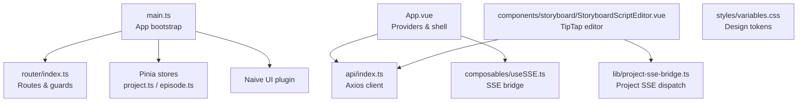
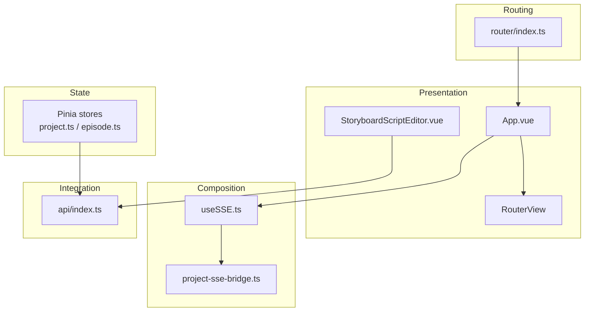
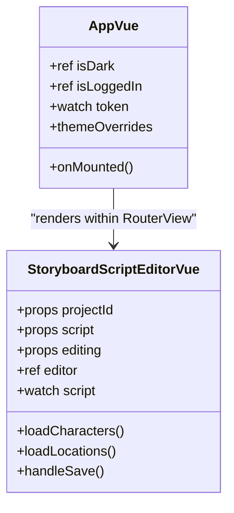
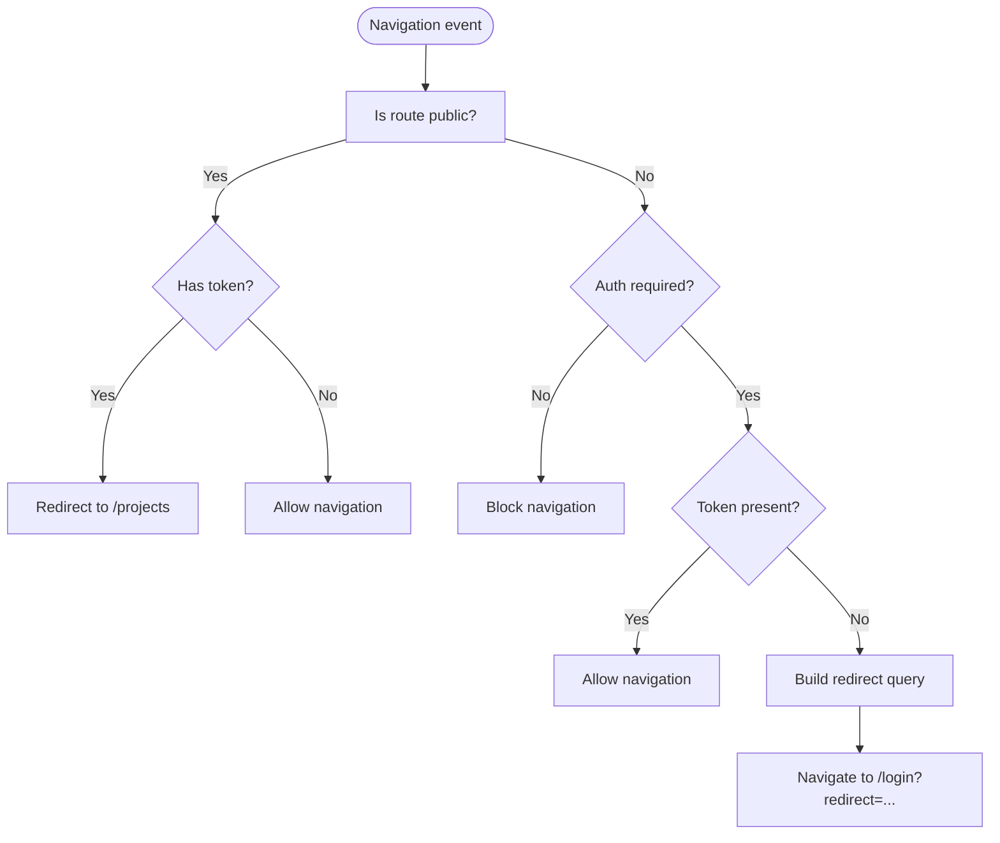
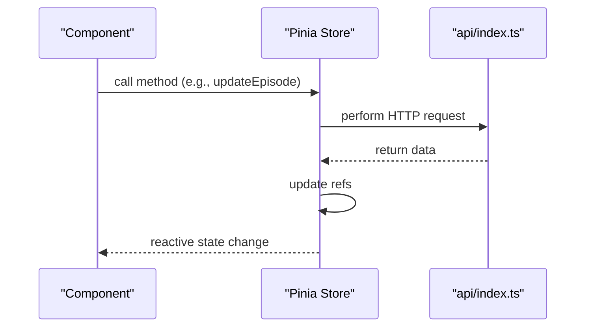
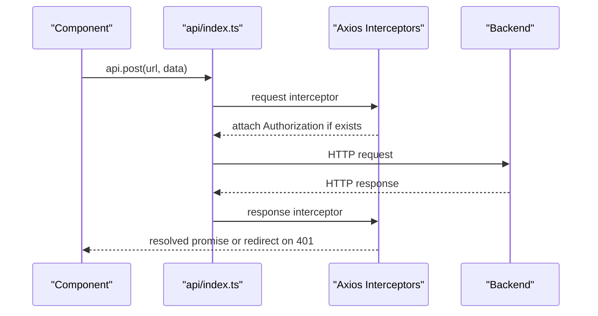
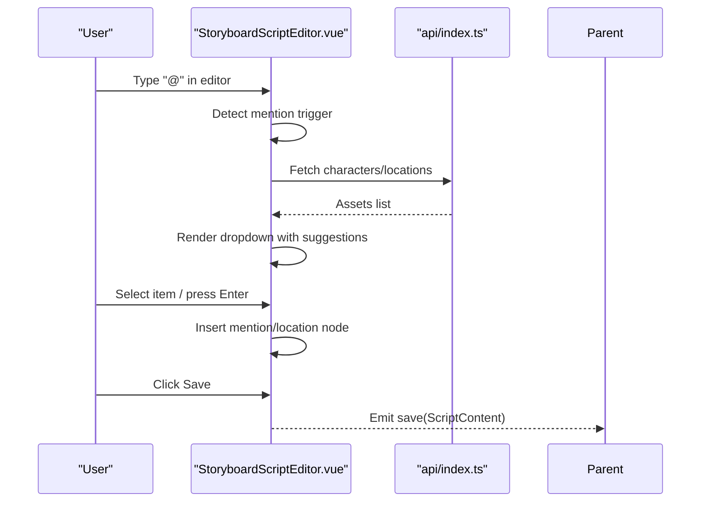
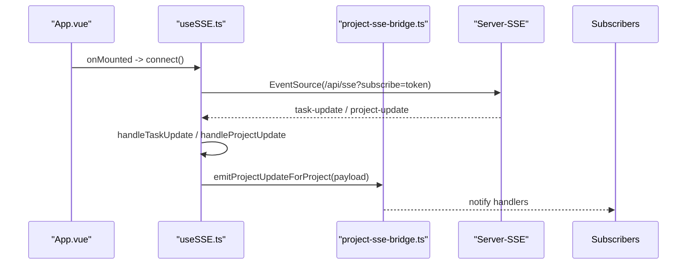
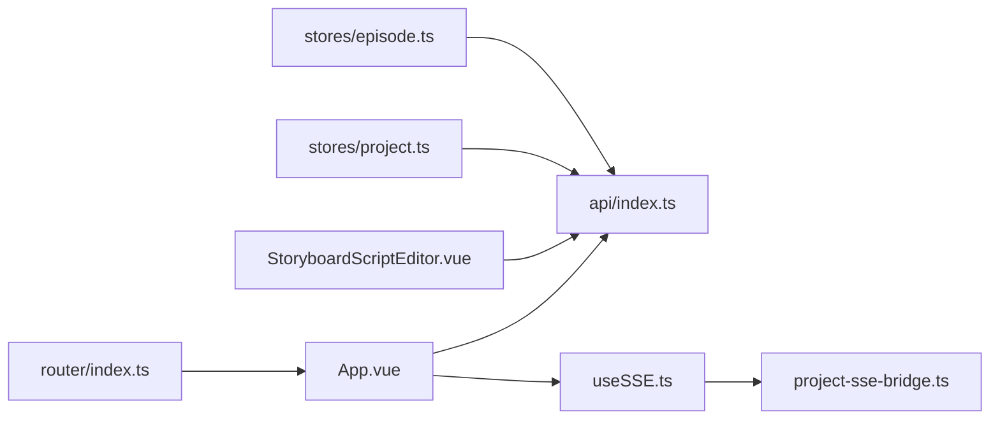

# Frontend System

<cite>
**Referenced Files in This Document**
- [package.json](file://packages/frontend/package.json)
- [vite.config.ts](file://packages/frontend/vite.config.ts)
- [main.ts](file://packages/frontend/src/main.ts)
- [App.vue](file://packages/frontend/src/App.vue)
- [router/index.ts](file://packages/frontend/src/router/index.ts)
- [api/index.ts](file://packages/frontend/src/api/index.ts)
- [stores/project.ts](file://packages/frontend/src/stores/project.ts)
- [stores/episode.ts](file://packages/frontend/src/stores/episode.ts)
- [composables/useSSE.ts](file://packages/frontend/src/composables/useSSE.ts)
- [lib/project-sse-bridge.ts](file://packages/frontend/src/lib/project-sse-bridge.ts)
- [components/storyboard/StoryboardScriptEditor.vue](file://packages/frontend/src/components/storyboard/StoryboardScriptEditor.vue)
- [styles/variables.css](file://packages/frontend/src/styles/variables.css)
</cite>

## Table of Contents

1. [Introduction](#introduction)
2. [Project Structure](#project-structure)
3. [Core Components](#core-components)
4. [Architecture Overview](#architecture-overview)
5. [Detailed Component Analysis](#detailed-component-analysis)
6. [Dependency Analysis](#dependency-analysis)
7. [Performance Considerations](#performance-considerations)
8. [Troubleshooting Guide](#troubleshooting-guide)
9. [Conclusion](#conclusion)
10. [Appendices](#appendices)

## Introduction

This document describes the frontend system built with Vue 3, focusing on component architecture using Naive UI, Pinia state management, Vue Router configuration, and the API integration layer. It explains reactive data flow, component composition patterns, and UI design principles. Special attention is given to the rich text editor integration powered by TipTap, real-time collaboration via Server-Sent Events (SSE), and responsive design implementation. The build configuration with Vite, development workflow, and deployment considerations are also covered, along with performance optimization techniques, accessibility compliance, and cross-browser compatibility strategies.

## Project Structure

The frontend is organized as a Vue 3 application under packages/frontend with the following high-level structure:

- Application bootstrap and global providers in main.ts
- Root component App.vue orchestrating navigation, theming, and providers
- Routing configuration in router/index.ts with route guards and nested routes
- API client in api/index.ts with interceptors and typed endpoints
- Pinia stores for domain entities (project, episode) and derived state
- Composables for reusable logic (e.g., SSE)
- UI components leveraging Naive UI
- Rich text editor component integrating TipTap
- Shared design tokens and CSS variables

**Diagram sources**

- [main.ts:1-18](file://packages/frontend/src/main.ts#L1-L18)
- [router/index.ts:1-145](file://packages/frontend/src/router/index.ts#L1-L145)
- [api/index.ts:1-332](file://packages/frontend/src/api/index.ts#L1-L332)
- [stores/project.ts:1-51](file://packages/frontend/src/stores/project.ts#L1-L51)
- [stores/episode.ts:1-125](file://packages/frontend/src/stores/episode.ts#L1-L125)
- [composables/useSSE.ts:1-109](file://packages/frontend/src/composables/useSSE.ts#L1-L109)
- [lib/project-sse-bridge.ts:1-48](file://packages/frontend/src/lib/project-sse-bridge.ts#L1-L48)
- [components/storyboard/StoryboardScriptEditor.vue:1-653](file://packages/frontend/src/components/storyboard/StoryboardScriptEditor.vue#L1-L653)
- [styles/variables.css:1-114](file://packages/frontend/src/styles/variables.css#L1-L114)

**Section sources**

- [main.ts:1-18](file://packages/frontend/src/main.ts#L1-L18)
- [router/index.ts:1-145](file://packages/frontend/src/router/index.ts#L1-L145)
- [api/index.ts:1-332](file://packages/frontend/src/api/index.ts#L1-L332)
- [stores/project.ts:1-51](file://packages/frontend/src/stores/project.ts#L1-L51)
- [stores/episode.ts:1-125](file://packages/frontend/src/stores/episode.ts#L1-L125)
- [composables/useSSE.ts:1-109](file://packages/frontend/src/composables/useSSE.ts#L1-L109)
- [lib/project-sse-bridge.ts:1-48](file://packages/frontend/src/lib/project-sse-bridge.ts#L1-L48)
- [components/storyboard/StoryboardScriptEditor.vue:1-653](file://packages/frontend/src/components/storyboard/StoryboardScriptEditor.vue#L1-L653)
- [styles/variables.css:1-114](file://packages/frontend/src/styles/variables.css#L1-L114)

## Core Components

- Application bootstrap and providers:
  - Creates the Vue app, installs Pinia, Vue Router, and Naive UI globally.
  - Imports design system CSS for theme overrides and base styles.
- Root shell and navigation:
  - Provides a header with user menu and logout flow.
  - Uses Naive UI providers for messages, dialogs, notifications, and theming.
  - Initializes SSE connection after mount and reacts to token changes.
- Routing:
  - Defines public and protected routes with guards checking localStorage for tokens.
  - Supports nested routes for project-centric views.
- API integration:
  - Centralized Axios instance with request/response interceptors.
  - Typed endpoints for import, stats, pipeline, and model API calls.
- State management:
  - Pinia stores encapsulate CRUD operations and loading states for projects and episodes.
- Real-time collaboration:
  - SSE composable connects to a server endpoint and emits notifications and project updates.
  - Project SSE bridge distributes updates per project ID to subscribers.

**Section sources**

- [main.ts:1-18](file://packages/frontend/src/main.ts#L1-L18)
- [App.vue:1-231](file://packages/frontend/src/App.vue#L1-L231)
- [router/index.ts:1-145](file://packages/frontend/src/router/index.ts#L1-L145)
- [api/index.ts:1-332](file://packages/frontend/src/api/index.ts#L1-L332)
- [stores/project.ts:1-51](file://packages/frontend/src/stores/project.ts#L1-L51)
- [stores/episode.ts:1-125](file://packages/frontend/src/stores/episode.ts#L1-L125)
- [composables/useSSE.ts:1-109](file://packages/frontend/src/composables/useSSE.ts#L1-L109)
- [lib/project-sse-bridge.ts:1-48](file://packages/frontend/src/lib/project-sse-bridge.ts#L1-L48)

## Architecture Overview

The frontend follows a layered architecture:

- Presentation layer: Vue components using Naive UI for UI primitives and App.vue as the shell.
- Composition layer: Composables for SSE and TipTap editor logic.
- State layer: Pinia stores for domain entities and derived state.
- Integration layer: Axios-based API client with interceptors for auth and redirects.
- Routing layer: Vue Router with route guards and nested routes.

**Diagram sources**

- [App.vue:1-231](file://packages/frontend/src/App.vue#L1-L231)
- [router/index.ts:1-145](file://packages/frontend/src/router/index.ts#L1-L145)
- [api/index.ts:1-332](file://packages/frontend/src/api/index.ts#L1-L332)
- [stores/project.ts:1-51](file://packages/frontend/src/stores/project.ts#L1-L51)
- [stores/episode.ts:1-125](file://packages/frontend/src/stores/episode.ts#L1-L125)
- [composables/useSSE.ts:1-109](file://packages/frontend/src/composables/useSSE.ts#L1-L109)
- [lib/project-sse-bridge.ts:1-48](file://packages/frontend/src/lib/project-sse-bridge.ts#L1-L48)
- [components/storyboard/StoryboardScriptEditor.vue:1-653](file://packages/frontend/src/components/storyboard/StoryboardScriptEditor.vue#L1-L653)

## Detailed Component Analysis

### Component Architecture and UI Design Principles

- Naive UI integration:
  - Global installation and theme overrides in App.vue configure primary colors, spacing, typography, and component-specific overrides.
  - Providers (messages, dialogs, notifications) wrap the application shell to enable global UI feedback.
- Responsive design:
  - CSS variables define spacing, typography, shadows, and z-index consistently across components.
  - App.vue enforces a flex-based shell with constrained heights and hidden overflow to avoid double scrollbars.
- Component composition:
  - App.vue composes header, main content area, and RouterView.
  - StoryboardScriptEditor.vue composes TipTap editor with custom mention and location nodes, dropdown suggestions, and save/cancel actions.

**Diagram sources**

- [App.vue:1-231](file://packages/frontend/src/App.vue#L1-L231)
- [components/storyboard/StoryboardScriptEditor.vue:1-653](file://packages/frontend/src/components/storyboard/StoryboardScriptEditor.vue#L1-L653)

**Section sources**

- [App.vue:1-231](file://packages/frontend/src/App.vue#L1-L231)
- [styles/variables.css:1-114](file://packages/frontend/src/styles/variables.css#L1-L114)
- [components/storyboard/StoryboardScriptEditor.vue:1-653](file://packages/frontend/src/components/storyboard/StoryboardScriptEditor.vue#L1-L653)

### Vue Router Configuration and Guards

- Routes:
  - Public routes: login, register, import, generate, stats, model-calls, jobs, settings.
  - Protected routes: projects and nested routes for project detail pages.
- Guards:
  - Checks localStorage for token presence.
  - Redirects authenticated users away from public routes and unauthenticated users to login with redirect query.
- Nested routes:
  - Project detail page hosts overview, script, characters, locations, episodes, episode detail, storyboard, compose, and pipeline sub-routes.

**Diagram sources**

- [router/index.ts:129-142](file://packages/frontend/src/router/index.ts#L129-L142)

**Section sources**

- [router/index.ts:1-145](file://packages/frontend/src/router/index.ts#L1-L145)

### Pinia State Management

- Project store:
  - Manages list and current project, with CRUD operations delegated to API.
- Episode store:
  - Manages episodes, current episode, loading flags, and episode-specific operations (expand script, generate storyboard script).
- Reactive data flow:
  - Stores expose refs and async methods; components watch and update state reactively.
  - Loading flags prevent concurrent operations and improve UX.

**Diagram sources**

- [stores/episode.ts:1-125](file://packages/frontend/src/stores/episode.ts#L1-L125)
- [api/index.ts:1-332](file://packages/frontend/src/api/index.ts#L1-L332)

**Section sources**

- [stores/project.ts:1-51](file://packages/frontend/src/stores/project.ts#L1-L51)
- [stores/episode.ts:1-125](file://packages/frontend/src/stores/episode.ts#L1-L125)

### API Integration Layer

- Axios client:
  - Base URL set to /api, with timeout and Content-Type defaults.
  - Request interceptor attaches Bearer token and removes Content-Type for FormData.
  - Response interceptor handles 401 globally, excluding auth public endpoints and current auth pages.
- Typed endpoints:
  - Import APIs (script/project preview), Stats APIs (user/project cost trends), Pipeline APIs (execute, poll, status), and Model API Calls.
- Helpers:
  - postFormData helper for multipart uploads.

**Diagram sources**

- [api/index.ts:1-332](file://packages/frontend/src/api/index.ts#L1-L332)

**Section sources**

- [api/index.ts:1-332](file://packages/frontend/src/api/index.ts#L1-L332)

### Rich Text Editor Integration (TipTap)

- Editor composition:
  - Uses @tiptap/vue-3 with StarterKit, Placeholder, and custom Mention and Location nodes.
  - Converts between stored ScriptContent and TipTap document JSON.
- Mentions and suggestions:
  - Custom Mention extension supports avatarUrl attribute and renders inline mentions with avatar or icon.
  - Dropdown suggestion list filters by query and supports keyboard navigation.
- Locations:
  - Custom Node renders location mentions with optional image.
- Lifecycle and events:
  - Watches props.editing to toggle editability.
  - Watches props.script to sync content without emitting updates.
  - Watches projectId and asset lists to rebuild content when data changes.
- Save and cancel:
  - Emits save event with updated ScriptContent containing editorDoc.

**Diagram sources**

- [components/storyboard/StoryboardScriptEditor.vue:1-653](file://packages/frontend/src/components/storyboard/StoryboardScriptEditor.vue#L1-L653)
- [api/index.ts:1-332](file://packages/frontend/src/api/index.ts#L1-L332)

**Section sources**

- [components/storyboard/StoryboardScriptEditor.vue:1-653](file://packages/frontend/src/components/storyboard/StoryboardScriptEditor.vue#L1-L653)

### Real-Time Collaboration (SSE)

- SSE composable:
  - Connects to /api/sse with token passed via query param (since Authorization cannot be set on EventSource).
  - Listens to task-update and project-update events, emitting notifications and forwarding project updates.
  - Reconnects automatically on error.
- Project SSE bridge:
  - Subscribes handlers per project ID and dispatches incoming payloads to listeners.
- App integration:
  - Initializes SSE after mount and reacts to token changes to connect/disconnect.

**Diagram sources**

- [App.vue:1-231](file://packages/frontend/src/App.vue#L1-L231)
- [composables/useSSE.ts:1-109](file://packages/frontend/src/composables/useSSE.ts#L1-L109)
- [lib/project-sse-bridge.ts:1-48](file://packages/frontend/src/lib/project-sse-bridge.ts#L1-L48)

**Section sources**

- [composables/useSSE.ts:1-109](file://packages/frontend/src/composables/useSSE.ts#L1-L109)
- [lib/project-sse-bridge.ts:1-48](file://packages/frontend/src/lib/project-sse-bridge.ts#L1-L48)
- [App.vue:1-231](file://packages/frontend/src/App.vue#L1-L231)

### Build Configuration with Vite

- Plugins:
  - Vue plugin for SFC support.
  - AutoImport for vue, vue-router, pinia (no manual imports).
  - Components with NaiveUiResolver for automatic component registration.
- Aliases:
  - @ resolves to src for clean imports.
- Dev server:
  - Port 3000, HMR overlay enabled, polling watcher for containerized environments.
  - Proxy /api to backend at http://localhost:4000.
- Build:
  - Output directory dist, source maps enabled.

**Section sources**

- [vite.config.ts:1-48](file://packages/frontend/vite.config.ts#L1-L48)
- [package.json:1-41](file://packages/frontend/package.json#L1-L41)

## Dependency Analysis

- Internal dependencies:
  - App.vue depends on api and composable hooks.
  - StoryboardScriptEditor.vue depends on api and editor conversion utilities.
  - Stores depend on api for network operations.
  - useSSE depends on project-sse-bridge for decoupled distribution.
- External dependencies:
  - Vue 3, Vue Router, Pinia, Naive UI, Axios, TipTap ecosystem.
- Coupling and cohesion:
  - Strong cohesion within stores and composables; low coupling via API client and bridges.
  - Route guards enforce separation of concerns between public and private areas.

**Diagram sources**

- [App.vue:1-231](file://packages/frontend/src/App.vue#L1-L231)
- [api/index.ts:1-332](file://packages/frontend/src/api/index.ts#L1-L332)
- [composables/useSSE.ts:1-109](file://packages/frontend/src/composables/useSSE.ts#L1-L109)
- [lib/project-sse-bridge.ts:1-48](file://packages/frontend/src/lib/project-sse-bridge.ts#L1-L48)
- [components/storyboard/StoryboardScriptEditor.vue:1-653](file://packages/frontend/src/components/storyboard/StoryboardScriptEditor.vue#L1-L653)
- [stores/project.ts:1-51](file://packages/frontend/src/stores/project.ts#L1-L51)
- [stores/episode.ts:1-125](file://packages/frontend/src/stores/episode.ts#L1-L125)
- [router/index.ts:1-145](file://packages/frontend/src/router/index.ts#L1-L145)

**Section sources**

- [package.json:1-41](file://packages/frontend/package.json#L1-L41)
- [vite.config.ts:1-48](file://packages/frontend/vite.config.ts#L1-L48)

## Performance Considerations

- Lazy loading:
  - Route components are dynamically imported to reduce initial bundle size.
- Tree shaking and imports:
  - AutoImport and Components plugins reduce boilerplate and enable tree-shaking.
- Editor performance:
  - TipTap editor content synchronization uses JSON comparison to avoid unnecessary updates.
  - Dropdown rendering uses Teleport to body to minimize reflows.
- Network:
  - Axios interceptors centralize auth and error handling to avoid repeated checks.
- Build:
  - Source maps enabled for production debugging; consider disabling for release builds.
- Recommendations:
  - Split large components further if needed.
  - Debounce or throttle frequent updates (e.g., mention dropdown filtering).
  - Use virtual scrolling for long lists in future enhancements.

[No sources needed since this section provides general guidance]

## Troubleshooting Guide

- Authentication redirects:
  - 401 responses trigger a global redirect to login unless the request is an auth public endpoint or the current page is login/register.
- SSE connectivity:
  - If SSE fails to connect, check token presence and backend SSE endpoint availability; the composable attempts to reconnect automatically.
- Editor issues:
  - If mentions do not appear, verify that assets are loaded for the current project and that the editor is editable.
- API errors:
  - Inspect request interceptors for Authorization header and Content-Type adjustments for FormData.

**Section sources**

- [api/index.ts:34-55](file://packages/frontend/src/api/index.ts#L34-L55)
- [composables/useSSE.ts:19-51](file://packages/frontend/src/composables/useSSE.ts#L19-L51)
- [components/storyboard/StoryboardScriptEditor.vue:332-370](file://packages/frontend/src/components/storyboard/StoryboardScriptEditor.vue#L332-L370)

## Conclusion

The frontend system integrates Vue 3, Naive UI, Pinia, and Vue Router with a robust API client and real-time collaboration via SSE. The TipTap-based rich text editor enables expressive scripting with mentions and locations. The Vite configuration streamlines development and build processes. By following the documented patterns and applying the recommended optimizations, the system remains maintainable, performant, and user-friendly.

[No sources needed since this section summarizes without analyzing specific files]

## Appendices

- Development workflow:
  - Run dev server, tests, and type-check as defined in package.json scripts.
- Deployment considerations:
  - Build with Vite; serve static assets behind a reverse proxy configured to forward /api to the backend service.

**Section sources**

- [package.json:6-13](file://packages/frontend/package.json#L6-L13)
- [vite.config.ts:43-47](file://packages/frontend/vite.config.ts#L43-L47)
