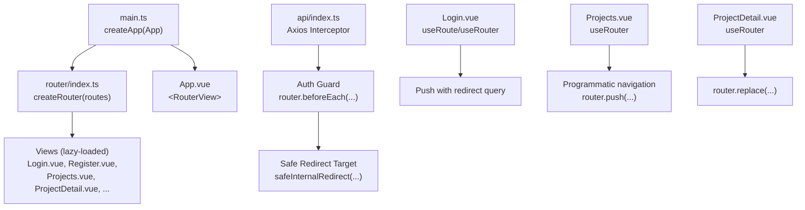
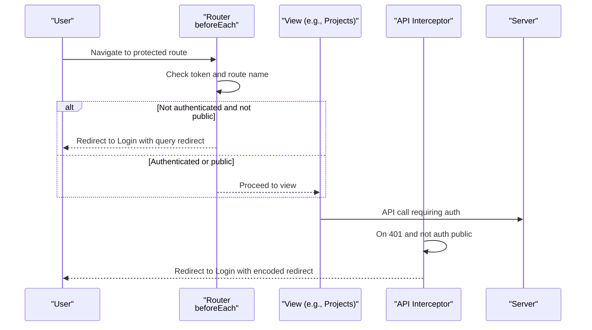
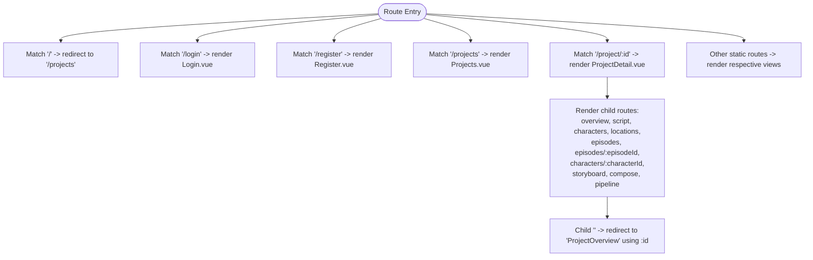
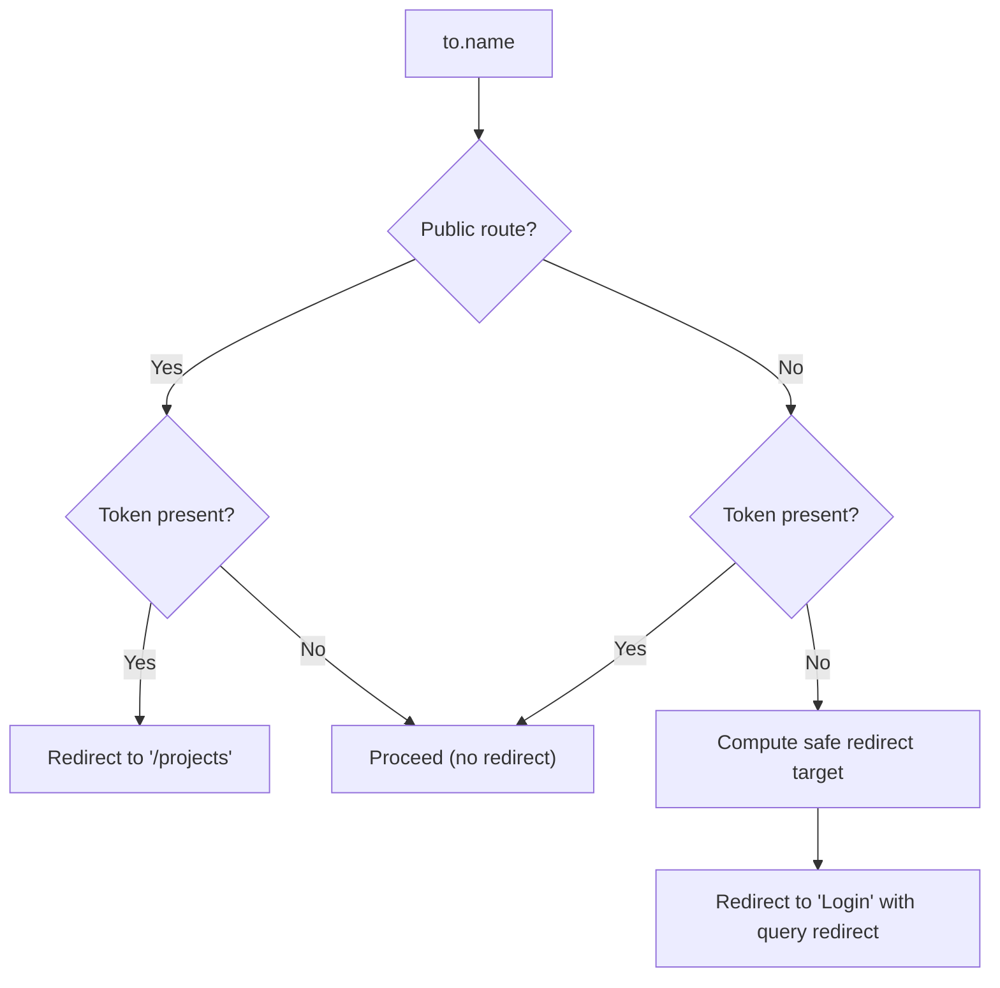
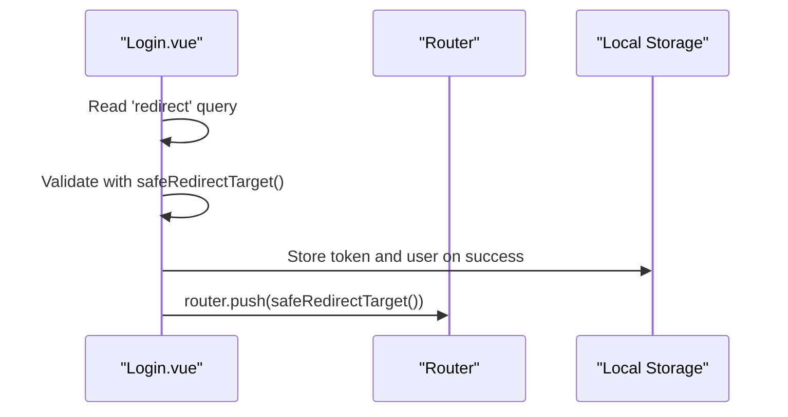
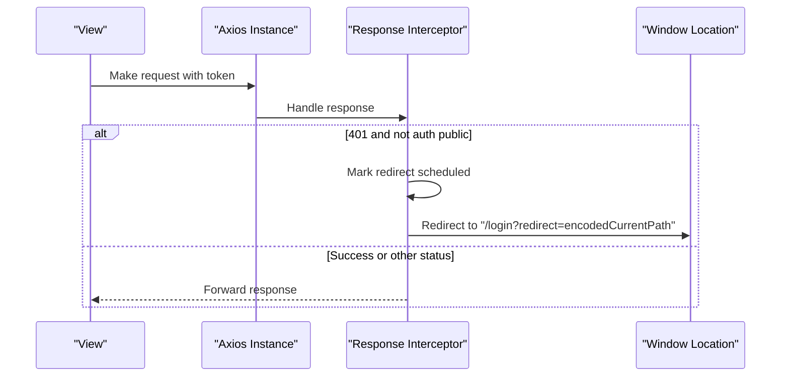
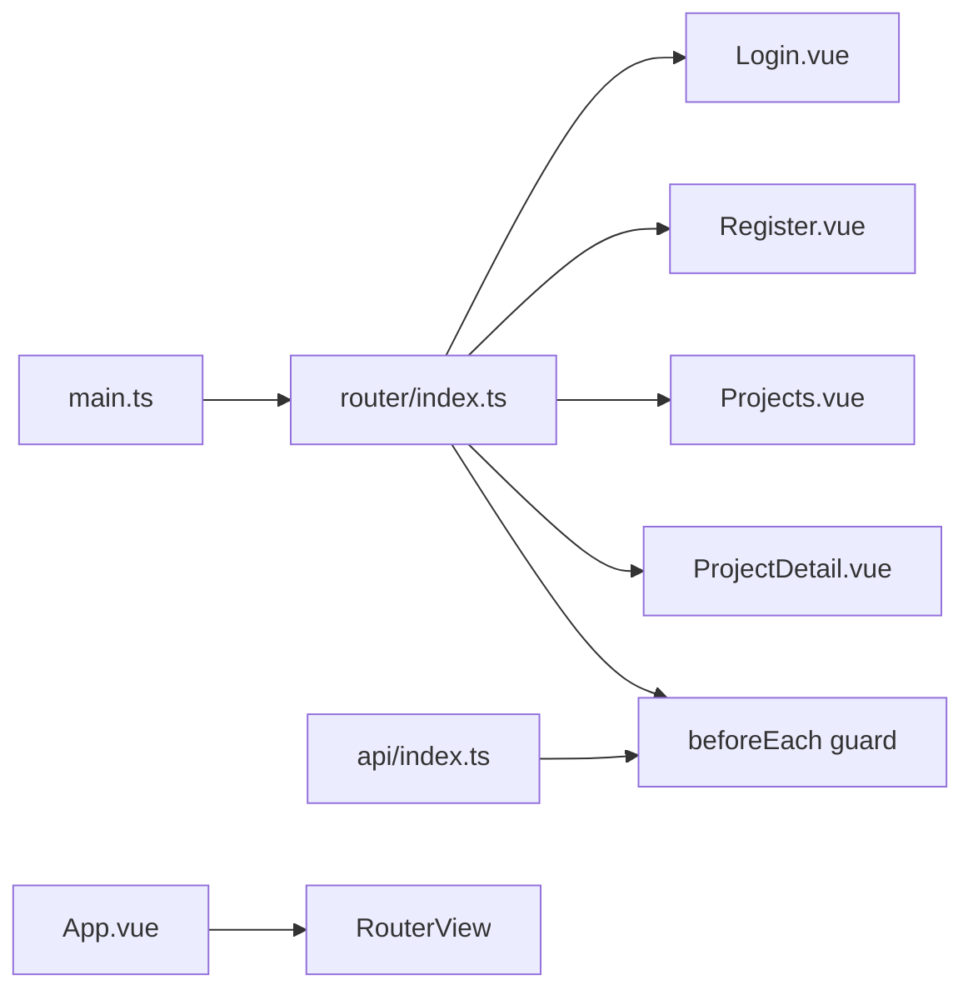

# Routing and Navigation

<cite>
**Referenced Files in This Document**
- [index.ts](file://packages/frontend/src/router/index.ts)
- [main.ts](file://packages/frontend/src/main.ts)
- [App.vue](file://packages/frontend/src/App.vue)
- [Login.vue](file://packages/frontend/src/views/Login.vue)
- [Register.vue](file://packages/frontend/src/views/Register.vue)
- [Projects.vue](file://packages/frontend/src/views/Projects.vue)
- [ProjectDetail.vue](file://packages/frontend/src/views/ProjectDetail.vue)
- [api/index.ts](file://packages/frontend/src/api/index.ts)
</cite>

## Table of Contents

1. [Introduction](#introduction)
2. [Project Structure](#project-structure)
3. [Core Components](#core-components)
4. [Architecture Overview](#architecture-overview)
5. [Detailed Component Analysis](#detailed-component-analysis)
6. [Dependency Analysis](#dependency-analysis)
7. [Performance Considerations](#performance-considerations)
8. [Troubleshooting Guide](#troubleshooting-guide)
9. [Conclusion](#conclusion)

## Introduction

This document explains the Vue Router implementation for the frontend, focusing on route configuration, navigation guards, dynamic route generation, and navigation patterns across user workflows. It covers authentication-based routing, deep-linking support, programmatic navigation, route parameter handling, and performance considerations such as lazy loading. It also documents the relationship between routes and views, and how navigation integrates with global state and API interceptors.

## Project Structure

The routing system is centered in the router module and wired into the application via the main entry point. Views are lazily loaded to optimize initial load performance. Authentication and navigation are coordinated between the router’s global guard, the login/register views, and the API interceptor.

**Diagram sources**

- [main.ts:1-18](file://packages/frontend/src/main.ts#L1-L18)
- [index.ts:10-127](file://packages/frontend/src/router/index.ts#L10-L127)
- [App.vue:176](file://packages/frontend/src/App.vue#L176)
- [Login.vue:14-44](file://packages/frontend/src/views/Login.vue#L14-L44)
- [Projects.vue:116-147](file://packages/frontend/src/views/Projects.vue#L116-L147)
- [ProjectDetail.vue:45](file://packages/frontend/src/views/ProjectDetail.vue#L45)
- [api/index.ts:34-55](file://packages/frontend/src/api/index.ts#L34-L55)

**Section sources**

- [main.ts:1-18](file://packages/frontend/src/main.ts#L1-L18)
- [index.ts:10-127](file://packages/frontend/src/router/index.ts#L10-L127)
- [App.vue:176](file://packages/frontend/src/App.vue#L176)

## Core Components

- Router configuration and routes: Defines static and nested routes, including a guarded project hierarchy with child routes.
- Global navigation guard: Enforces authentication by redirecting unauthenticated users to login and preventing authenticated users from accessing public pages.
- Safe internal redirect: Sanitizes redirect targets to prevent open redirect vulnerabilities.
- Lazy-loaded views: Routes use dynamic imports to defer loading of views until needed.
- Programmatic navigation: Views use useRouter to navigate programmatically, including redirects after auth actions and deep-linking into project contexts.
- Authentication integration: API interceptor handles 401 responses by clearing tokens and redirecting to login with a safe redirect query.

**Section sources**

- [index.ts:10-127](file://packages/frontend/src/router/index.ts#L10-L127)
- [index.ts:129-142](file://packages/frontend/src/router/index.ts#L129-L142)
- [index.ts:4-8](file://packages/frontend/src/router/index.ts#L4-L8)
- [Login.vue:14-44](file://packages/frontend/src/views/Login.vue#L14-L44)
- [Projects.vue:116-147](file://packages/frontend/src/views/Projects.vue#L116-L147)
- [ProjectDetail.vue:45](file://packages/frontend/src/views/ProjectDetail.vue#L45)
- [api/index.ts:34-55](file://packages/frontend/src/api/index.ts#L34-L55)

## Architecture Overview

The routing architecture combines:

- Static routes for auth and top-level pages
- Nested routes under the project detail page
- A global beforeEach guard enforcing auth policies
- Programmatic navigation in views
- API interceptor handling auth failures and redirecting to login with a safe redirect target

**Diagram sources**

- [index.ts:129-142](file://packages/frontend/src/router/index.ts#L129-L142)
- [Projects.vue:116-147](file://packages/frontend/src/views/Projects.vue#L116-L147)
- [api/index.ts:34-55](file://packages/frontend/src/api/index.ts#L34-L55)

## Detailed Component Analysis

### Route Configuration and Nested Navigation

- Root and public routes: Home redirect, login, register, import, generate, stats, model-calls, jobs, settings, projects.
- Project detail route: Dynamic parameter for project ID, with nested child routes for overview, script, characters, locations, episodes, episode detail, character detail, storyboard, compose, pipeline.
- Child route defaulting: The project home child route redirects to the overview child route using the parent dynamic parameter.

**Diagram sources**

- [index.ts:10-127](file://packages/frontend/src/router/index.ts#L10-L127)

**Section sources**

- [index.ts:10-127](file://packages/frontend/src/router/index.ts#L10-L127)

### Global Navigation Guard and Authentication-Based Routing

- Public route names set: Login and Register are considered public.
- Guard logic:
  - If a user is authenticated and tries to access a public route, redirect to projects.
  - If a user is not authenticated and tries to access a non-public route, compute a safe redirect target and redirect to login with a redirect query.
- Safe internal redirect ensures only internal relative paths are accepted, mitigating open redirect risks.

**Diagram sources**

- [index.ts:129-142](file://packages/frontend/src/router/index.ts#L129-L142)
- [index.ts:4-8](file://packages/frontend/src/router/index.ts#L4-L8)

**Section sources**

- [index.ts:129-142](file://packages/frontend/src/router/index.ts#L129-L142)
- [index.ts:4-8](file://packages/frontend/src/router/index.ts#L4-L8)

### Programmatic Navigation and Deep Linking

- Login view:
  - Reads redirect query, validates it via a safe redirect target function, and navigates after successful login.
- Projects view:
  - Handles project selection logic: navigates to project detail if characters exist, otherwise checks for an active parsing job and navigates with a parse job ID query, or falls back to the generate page.
  - Provides quick navigation to jobs, stats, model-calls, and settings.
- Project detail view:
  - Uses router.push for sidebar navigation and router.replace to refresh the current route after asynchronous operations complete.

**Diagram sources**

- [Login.vue:14-44](file://packages/frontend/src/views/Login.vue#L14-L44)

**Section sources**

- [Login.vue:14-44](file://packages/frontend/src/views/Login.vue#L14-L44)
- [Projects.vue:116-147](file://packages/frontend/src/views/Projects.vue#L116-L147)
- [ProjectDetail.vue:45](file://packages/frontend/src/views/ProjectDetail.vue#L45)

### Route Parameter Handling and Dynamic Route Generation

- Dynamic segments:
  - Project detail uses :id to capture the project identifier.
  - Episode detail uses :episodeId; character detail uses :characterId.
- Parameter-driven rendering:
  - Project detail computes derived state from route.params.id.
  - Project detail menu highlights current section based on route.path.
- Dynamic route generation patterns:
  - Programmatic navigation constructs URLs using captured parameters (e.g., navigating to project subpages).
  - Query parameters are used to pass transient state (e.g., parseJobId).

**Section sources**

- [index.ts:61-121](file://packages/frontend/src/router/index.ts#L61-L121)
- [ProjectDetail.vue:24-107](file://packages/frontend/src/views/ProjectDetail.vue#L24-L107)
- [Projects.vue:116-147](file://packages/frontend/src/views/Projects.vue#L116-L147)

### Authentication Integration and API Interceptor

- Request interceptor:
  - Attaches Authorization header when a token exists.
  - Adjusts Content-Type for FormData.
- Response interceptor:
  - Detects 401 responses for non-public auth endpoints.
  - Prevents repeated redirects by scheduling a single redirect.
  - Clears token and user, then redirects to login with the current path as a redirect query.

**Diagram sources**

- [api/index.ts:11-23](file://packages/frontend/src/api/index.ts#L11-L23)
- [api/index.ts:34-55](file://packages/frontend/src/api/index.ts#L34-L55)

**Section sources**

- [api/index.ts:11-23](file://packages/frontend/src/api/index.ts#L11-L23)
- [api/index.ts:34-55](file://packages/frontend/src/api/index.ts#L34-L55)

### Relationship Between Routes and Views

- RouterView renders the matched view component.
- Views are lazily loaded via dynamic imports in the route configuration.
- The application mounts the router globally and renders RouterView at the top level.

**Section sources**

- [App.vue:176](file://packages/frontend/src/App.vue#L176)
- [main.ts:14](file://packages/frontend/src/main.ts#L14)
- [index.ts:18-54](file://packages/frontend/src/router/index.ts#L18-L54)

### Navigation Patterns Across Workflows

- Anonymous user workflow:
  - Attempt to access protected route → guard redirects to login with a safe redirect.
- Authenticated user workflow:
  - Access public routes (login/register) → guard redirects to projects.
  - Navigate to project list → choose project → navigate into project subpages.
- Deep linking:
  - Project subpages use nested routes and dynamic parameters; deep links resolve to the correct view via RouterView.
- Post-authentication redirection:
  - Login and Register views read a redirect query and navigate to a safe internal path after successful auth.

**Section sources**

- [index.ts:129-142](file://packages/frontend/src/router/index.ts#L129-L142)
- [Login.vue:14-44](file://packages/frontend/src/views/Login.vue#L14-L44)
- [Projects.vue:116-147](file://packages/frontend/src/views/Projects.vue#L116-L147)
- [ProjectDetail.vue:63-107](file://packages/frontend/src/views/ProjectDetail.vue#L63-L107)

### Route Meta Properties

- No explicit meta fields are defined in the current route configuration.
- Consider adding meta fields (e.g., requiresAuth, title, breadcrumb) to support advanced navigation features like breadcrumbs or page titles.

[No sources needed since this section provides general guidance]

### Navigation Optimization Techniques

- Lazy loading:
  - Views are dynamically imported in routes to reduce initial bundle size.
- Minimal guard logic:
  - The guard performs simple checks and minimal computation.
- Efficient programmatic navigation:
  - Views use router.push and router.replace with precise destinations to avoid unnecessary re-renders.

**Section sources**

- [index.ts:18-54](file://packages/frontend/src/router/index.ts#L18-L54)
- [index.ts:129-142](file://packages/frontend/src/router/index.ts#L129-L142)
- [ProjectDetail.vue:45](file://packages/frontend/src/views/ProjectDetail.vue#L45)

## Dependency Analysis

The routing system depends on:

- Router creation and history mode
- Global guard for authentication policy
- View components for rendering
- API interceptor for auth failure handling

**Diagram sources**

- [index.ts:10-127](file://packages/frontend/src/router/index.ts#L10-L127)
- [Login.vue:1-101](file://packages/frontend/src/views/Login.vue#L1-L101)
- [Register.vue:1-122](file://packages/frontend/src/views/Register.vue#L1-L122)
- [Projects.vue:1-435](file://packages/frontend/src/views/Projects.vue#L1-L435)
- [ProjectDetail.vue:1-400](file://packages/frontend/src/views/ProjectDetail.vue#L1-L400)
- [api/index.ts:34-55](file://packages/frontend/src/api/index.ts#L34-L55)
- [App.vue:176](file://packages/frontend/src/App.vue#L176)
- [main.ts:14](file://packages/frontend/src/main.ts#L14)

**Section sources**

- [index.ts:10-127](file://packages/frontend/src/router/index.ts#L10-L127)
- [api/index.ts:34-55](file://packages/frontend/src/api/index.ts#L34-L55)
- [App.vue:176](file://packages/frontend/src/App.vue#L176)
- [main.ts:14](file://packages/frontend/src/main.ts#L14)

## Performance Considerations

- Lazy loading of views reduces initial JavaScript payload.
- Global guard is lightweight; keep future guard logic efficient.
- Avoid excessive re-computation in guards; rely on route.name and params.
- Prefer router.replace for in-place updates when appropriate to minimize re-render overhead.

[No sources needed since this section provides general guidance]

## Troubleshooting Guide

- Open redirect prevention:
  - The safe internal redirect function ensures only internal relative paths are accepted. Verify redirect queries conform to this rule.
- 401 handling:
  - If users are repeatedly redirected to login, confirm the API interceptor is not triggering for public auth endpoints and that the redirect is scheduled only once.
- Token lifecycle:
  - Ensure tokens are cleared from local storage on logout and on 401 responses to prevent stale sessions.
- Deep-linking:
  - Confirm nested routes and dynamic parameters are correctly defined so that deep links resolve to the intended child route.

**Section sources**

- [index.ts:4-8](file://packages/frontend/src/router/index.ts#L4-L8)
- [api/index.ts:34-55](file://packages/frontend/src/api/index.ts#L34-L55)
- [App.vue:25-32](file://packages/frontend/src/App.vue#L25-L32)

## Conclusion

The routing and navigation system is built around a clean set of static and nested routes, a concise global guard enforcing authentication, and programmatic navigation in views. Authentication is reinforced by the API interceptor, which handles 401 responses and redirects to login with a safe redirect query. The system leverages lazy-loaded views for performance and supports deep linking through nested routes and dynamic parameters. Extending the configuration with meta fields would enable richer navigation features like breadcrumbs and dynamic titles.
