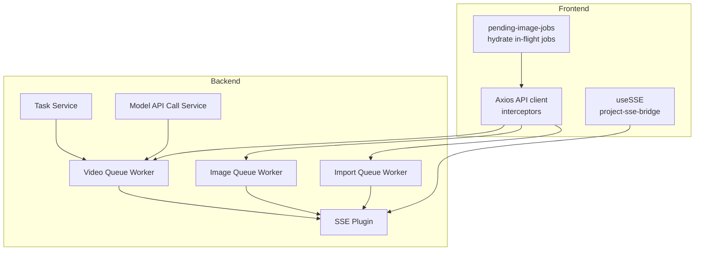
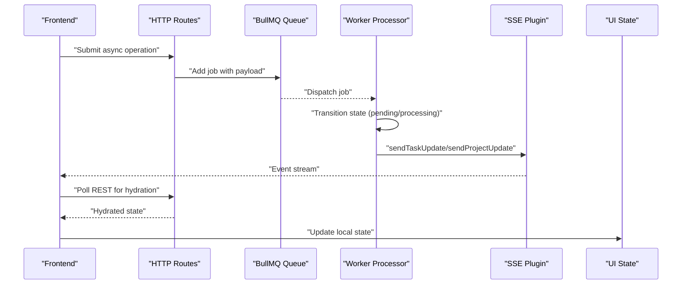
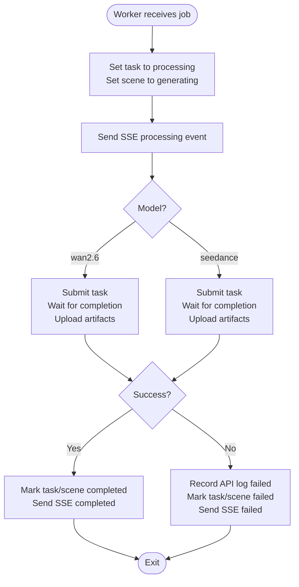
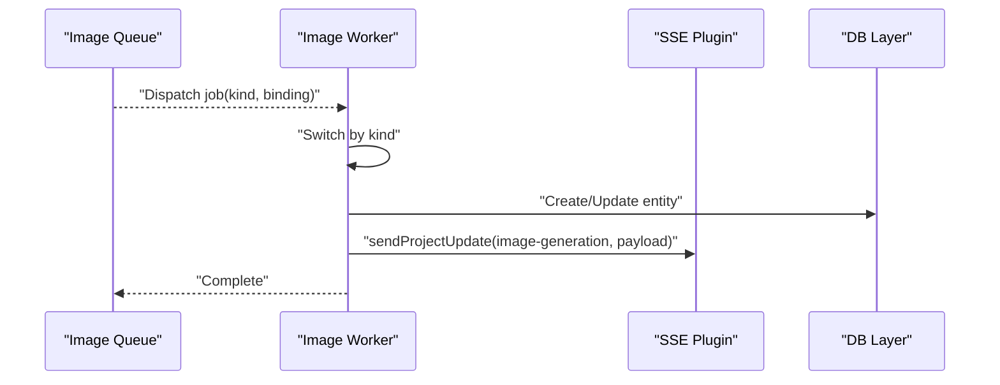
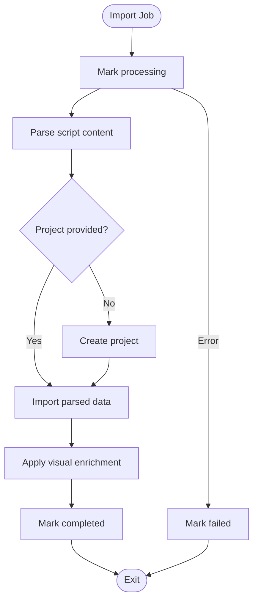
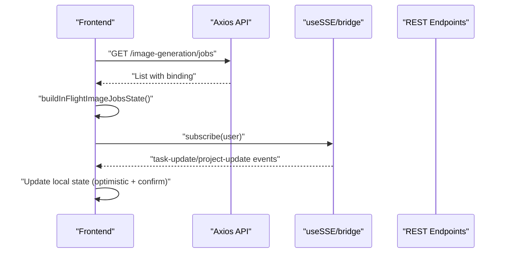
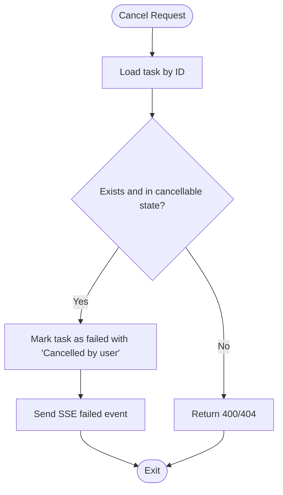
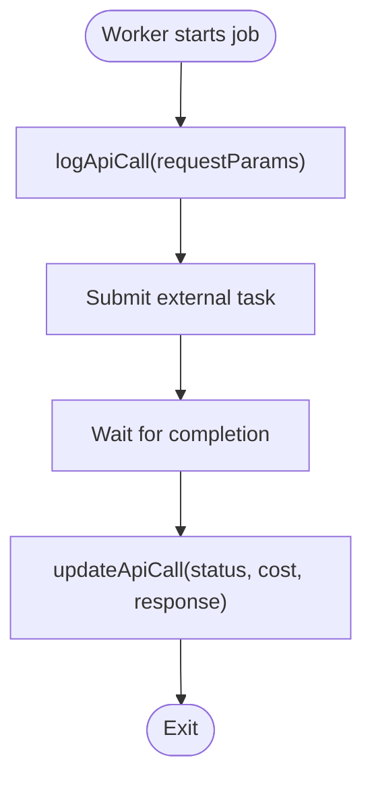
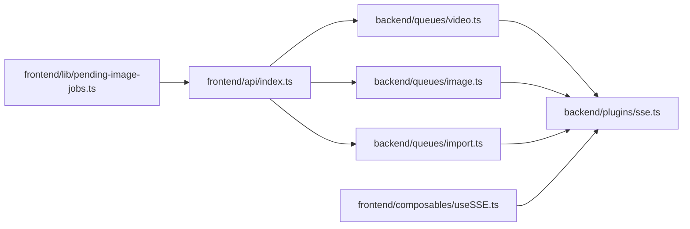

# Async State Operations

<cite>
**Referenced Files in This Document**
- [video.ts](file://packages/backend/src/queues/video.ts)
- [image.ts](file://packages/backend/src/queues/image.ts)
- [import.ts](file://packages/backend/src/queues/import.ts)
- [sse.ts](file://packages/backend/src/plugins/sse.ts)
- [tasks.test.ts](file://packages/backend/tests/tasks.test.ts)
- [video-queue-worker.test.ts](file://packages/backend/tests/video-queue-worker.test.ts)
- [pending-image-jobs.ts](file://packages/frontend/src/lib/pending-image-jobs.ts)
- [index.ts](file://packages/frontend/src/api/index.ts)
- [useSSE.ts](file://packages/frontend/src/composables/useSSE.ts)
- [project-sse-bridge.ts](file://packages/frontend/src/lib/project-sse-bridge.ts)
- [model-api-call-service.ts](file://packages/backend/src/services/ai/model-api-call-service.ts)
- [task-service.ts](file://packages/backend/src/services/task-service.ts)
</cite>

## Table of Contents

1. [Introduction](#introduction)
2. [Project Structure](#project-structure)
3. [Core Components](#core-components)
4. [Architecture Overview](#architecture-overview)
5. [Detailed Component Analysis](#detailed-component-analysis)
6. [Dependency Analysis](#dependency-analysis)
7. [Performance Considerations](#performance-considerations)
8. [Troubleshooting Guide](#troubleshooting-guide)
9. [Conclusion](#conclusion)

## Introduction

This document explains asynchronous state management patterns and operations across the backend queue workers and frontend state hydration. It covers async action patterns, loading/error handling, optimistic updates, state hydration from API responses, batch operations, transaction-like state changes, cancellation and timeout handling, state rollback, complex workflows, parallel operations, and state cleanup. It also documents performance optimization techniques, memoization strategies, and state caching patterns.

## Project Structure

The repository organizes async workloads via queue workers (BullMQ) and SSE-driven real-time updates. Frontend composes state from REST APIs and SSE streams, while backend enforces transaction-like state transitions and robust error handling.

**Diagram sources**

- [video.ts:1-279](file://packages/backend/src/queues/video.ts#L1-L279)
- [image.ts:1-304](file://packages/backend/src/queues/image.ts#L1-L304)
- [import.ts:1-114](file://packages/backend/src/queues/import.ts#L1-L114)
- [sse.ts:1-43](file://packages/backend/src/plugins/sse.ts#L1-L43)
- [pending-image-jobs.ts:1-118](file://packages/frontend/src/lib/pending-image-jobs.ts#L1-L118)
- [index.ts:32-81](file://packages/frontend/src/api/index.ts#L32-L81)
- [useSSE.ts](file://packages/frontend/src/composables/useSSE.ts)
- [project-sse-bridge.ts](file://packages/frontend/src/lib/project-sse-bridge.ts)
- [task-service.ts:1-45](file://packages/backend/src/services/task-service.ts#L1-L45)
- [model-api-call-service.ts:1-40](file://packages/backend/src/services/ai/model-api-call-service.ts#L1-L40)

**Section sources**

- [video.ts:1-279](file://packages/backend/src/queues/video.ts#L1-L279)
- [image.ts:1-304](file://packages/backend/src/queues/image.ts#L1-L304)
- [import.ts:1-114](file://packages/backend/src/queues/import.ts#L1-L114)
- [sse.ts:1-43](file://packages/backend/src/plugins/sse.ts#L1-L43)
- [pending-image-jobs.ts:1-118](file://packages/frontend/src/lib/pending-image-jobs.ts#L1-L118)
- [index.ts:32-81](file://packages/frontend/src/api/index.ts#L32-L81)

## Core Components

- Backend queue workers encapsulate long-running async actions, enforce retry/backoff, and emit SSE updates for real-time state changes.
- SSE plugin broadcasts task/project updates to subscribed clients.
- Frontend composable and bridge manage SSE subscriptions and hydrate local state from REST endpoints.
- Task service and API logging service coordinate cancellation, retries, and audit trails.

**Section sources**

- [video.ts:36-263](file://packages/backend/src/queues/video.ts#L36-L263)
- [image.ts:38-289](file://packages/backend/src/queues/image.ts#L38-L289)
- [import.ts:42-95](file://packages/backend/src/queues/import.ts#L42-L95)
- [sse.ts:1-43](file://packages/backend/src/plugins/sse.ts#L1-L43)
- [task-service.ts:1-45](file://packages/backend/src/services/task-service.ts#L1-L45)
- [model-api-call-service.ts:1-40](file://packages/backend/src/services/ai/model-api-call-service.ts#L1-L40)

## Architecture Overview

The system uses a queue-first architecture:

- HTTP routes enqueue jobs with structured payloads.
- Workers process jobs with explicit state transitions and SSE notifications.
- Frontend subscribes to SSE events and hydrates state from REST endpoints.

**Diagram sources**

- [video.ts:24-33](file://packages/backend/src/queues/video.ts#L24-L33)
- [image.ts:19-28](file://packages/backend/src/queues/image.ts#L19-L28)
- [import.ts:30-39](file://packages/backend/src/queues/import.ts#L30-L39)
- [sse.ts:20-34](file://packages/backend/src/plugins/sse.ts#L20-L34)
- [index.ts:32-81](file://packages/frontend/src/api/index.ts#L32-L81)

## Detailed Component Analysis

### Video Queue Worker: Async Actions, Loading, Errors, Optimistic Updates

- Async action pattern: Enqueue a video generation job with model-specific parameters; worker executes model API calls with exponential backoff and retry.
- Loading state management: Worker updates task and scene statuses to “processing” before work begins; SSE notifies clients immediately.
- Error handling: On failure, worker marks task/scene as “failed,” records API call status, and emits an SSE failure event.
- Optimistic updates: UI can optimistically render placeholders upon enqueue; SSE and polling confirm final state.
- Hydration: Frontend polls REST endpoints to hydrate final URLs and metadata after completion.
- Transaction-like state changes: Worker wraps DB writes and external API calls; failures roll back via “failed” state and SSE notifications.
- Cancellation/timeout: Not modeled in the video worker; see Task Service for cancellation semantics.
- Cleanup: Graceful shutdown closes worker and Redis connection.

**Diagram sources**

- [video.ts:36-263](file://packages/backend/src/queues/video.ts#L36-L263)

**Section sources**

- [video.ts:36-263](file://packages/backend/src/queues/video.ts#L36-L263)
- [sse.ts:20-34](file://packages/backend/src/plugins/sse.ts#L20-L34)

### Image Queue Worker: Batch Operations and Parallelism

- Async action pattern: Supports multiple job kinds (character base/create, derived regenerate/create, location establishing).
- Parallel operations: Worker configured with concurrency; jobs are processed concurrently.
- Batch operations: Multiple jobs can be enqueued; each job updates its binding targets (character/location).
- SSE notifications: Worker sends project-level image-generation events with kind-specific payloads.
- API logging: Records model API calls with request params and outcomes.

**Diagram sources**

- [image.ts:38-289](file://packages/backend/src/queues/image.ts#L38-L289)
- [sse.ts:28-34](file://packages/backend/src/plugins/sse.ts#L28-L34)

**Section sources**

- [image.ts:38-289](file://packages/backend/src/queues/image.ts#L38-L289)
- [sse.ts:28-34](file://packages/backend/src/plugins/sse.ts#L28-L34)

### Import Queue Worker: Transaction-like State Changes

- Async action pattern: Parses content, optionally creates a project, imports data, and applies downstream enrichment.
- Transaction-like behavior: Worker marks processing, performs all steps, then marks completed; on error, marks failed.
- SSE notifications: Worker logs progress via SSE-like mechanisms during processing.

**Diagram sources**

- [import.ts:42-95](file://packages/backend/src/queues/import.ts#L42-L95)

**Section sources**

- [import.ts:42-95](file://packages/backend/src/queues/import.ts#L42-L95)

### Frontend State Hydration and SSE Integration

- Axios interceptors centralize auth and error handling for async operations.
- useSSE and project-sse-bridge subscribe to server-sent events for real-time updates.
- pending-image-jobs hydrates in-flight image generation jobs and maps bindings to UI slots.

**Diagram sources**

- [index.ts:32-81](file://packages/frontend/src/api/index.ts#L32-L81)
- [useSSE.ts](file://packages/frontend/src/composables/useSSE.ts)
- [project-sse-bridge.ts](file://packages/frontend/src/lib/project-sse-bridge.ts)
- [pending-image-jobs.ts:67-117](file://packages/frontend/src/lib/pending-image-jobs.ts#L67-L117)

**Section sources**

- [index.ts:32-81](file://packages/frontend/src/api/index.ts#L32-L81)
- [pending-image-jobs.ts:67-117](file://packages/frontend/src/lib/pending-image-jobs.ts#L67-L117)

### Cancellation and Timeout Handling

- Cancellation: The Task Service defines cancellation semantics; attempting to cancel a task that is not pending/processing yields appropriate HTTP errors.
- Timeout handling: Not explicitly modeled in the tested workers; however, queue backoff and retry policies mitigate transient failures.
- State rollback: Workers set task/scene to “failed” and emit SSE failure events to propagate rollback to clients.

**Diagram sources**

- [task-service.ts:41-45](file://packages/backend/src/services/task-service.ts#L41-L45)
- [tasks.test.ts:153-218](file://packages/backend/tests/tasks.test.ts#L153-L218)

**Section sources**

- [task-service.ts:1-45](file://packages/backend/src/services/task-service.ts#L1-L45)
- [tasks.test.ts:153-218](file://packages/backend/tests/tasks.test.ts#L153-L218)

### API Logging and Audit Trails

- Model API call service parses queries, lists calls, and enriches request params for auditability.
- Workers record API call logs with status, cost, and metadata for traceability.

**Diagram sources**

- [model-api-call-service.ts:1-40](file://packages/backend/src/services/ai/model-api-call-service.ts#L1-L40)
- [video.ts:72-98](file://packages/backend/src/queues/video.ts#L72-L98)

**Section sources**

- [model-api-call-service.ts:1-40](file://packages/backend/src/services/ai/model-api-call-service.ts#L1-L40)
- [video.ts:72-98](file://packages/backend/src/queues/video.ts#L72-L98)

## Dependency Analysis

- Backend workers depend on:
  - Queue infrastructure (BullMQ) and Redis connection.
  - AI services (Wan 2.6, Seedance) and storage services.
  - SSE plugin for real-time updates.
  - Task/Project repositories/services for state persistence.
- Frontend depends on:
  - Axios API client for HTTP.
  - SSE composables for event subscription.
  - Utility modules for hydrating in-flight job state.

**Diagram sources**

- [index.ts:32-81](file://packages/frontend/src/api/index.ts#L32-L81)
- [video.ts:1-33](file://packages/backend/src/queues/video.ts#L1-L33)
- [image.ts:1-28](file://packages/backend/src/queues/image.ts#L1-L28)
- [import.ts:1-39](file://packages/backend/src/queues/import.ts#L1-L39)
- [sse.ts:1-43](file://packages/backend/src/plugins/sse.ts#L1-L43)
- [useSSE.ts](file://packages/frontend/src/composables/useSSE.ts)
- [pending-image-jobs.ts:1-118](file://packages/frontend/src/lib/pending-image-jobs.ts#L1-L118)

**Section sources**

- [index.ts:32-81](file://packages/frontend/src/api/index.ts#L32-L81)
- [video.ts:1-33](file://packages/backend/src/queues/video.ts#L1-L33)
- [image.ts:1-28](file://packages/backend/src/queues/image.ts#L1-L28)
- [import.ts:1-39](file://packages/backend/src/queues/import.ts#L1-L39)
- [sse.ts:1-43](file://packages/backend/src/plugins/sse.ts#L1-L43)
- [pending-image-jobs.ts:1-118](file://packages/frontend/src/lib/pending-image-jobs.ts#L1-L118)

## Performance Considerations

- Concurrency tuning: Workers configure concurrency to balance throughput and resource limits.
- Backoff and retries: Exponential backoff reduces thundering herd and improves resilience for external APIs.
- SSE efficiency: Minimal payload serialization; avoid redundant writes to closed connections.
- Frontend hydration: Use selective polling and SSE to minimize network overhead; cache hydrated job maps per project.
- Memoization: Build in-flight job state maps once per project and reuse until refresh.
- Large datasets: Paginate API listings; batch updates where supported; debounce frequent UI refreshes.

[No sources needed since this section provides general guidance]

## Troubleshooting Guide

- Worker failures:
  - Verify queue and Redis connectivity; check exponential backoff logs.
  - Confirm SSE event delivery to clients; inspect connection maps.
- Task cancellation:
  - Ensure task is in a cancellable state; otherwise return appropriate HTTP errors.
- SSE not received:
  - Confirm subscription lifecycle and that user IDs match.
- API logging anomalies:
  - Validate request params parsing and ensure update paths are executed on completion/failure.

**Section sources**

- [video-queue-worker.test.ts:281-303](file://packages/backend/tests/video-queue-worker.test.ts#L281-L303)
- [tasks.test.ts:153-218](file://packages/backend/tests/tasks.test.ts#L153-L218)
- [sse.ts:1-43](file://packages/backend/src/plugins/sse.ts#L1-L43)

## Conclusion

The system implements robust asynchronous state management through queue workers, SSE-driven updates, and REST-based hydration. It supports optimistic UI updates, transaction-like state transitions, error propagation, and scalable concurrency. Extending cancellation and timeouts, optimizing frontend hydration, and refining memoization patterns will further improve reliability and user experience.
