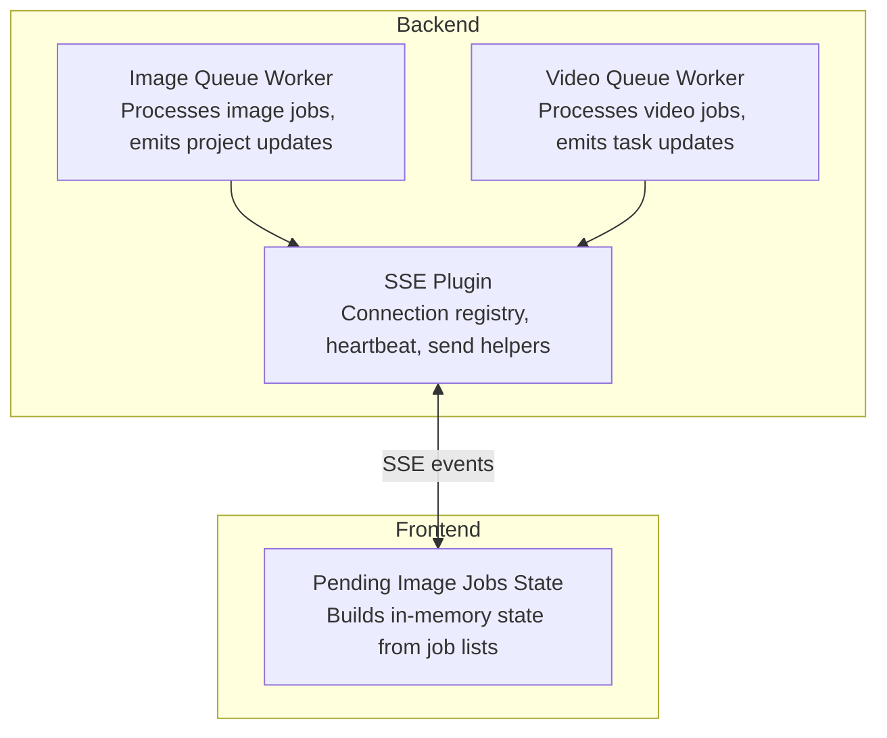
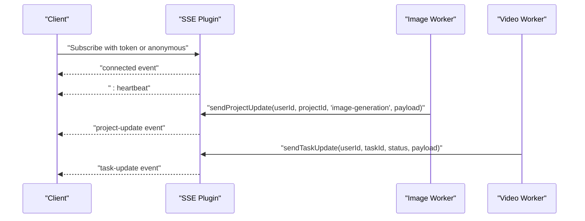
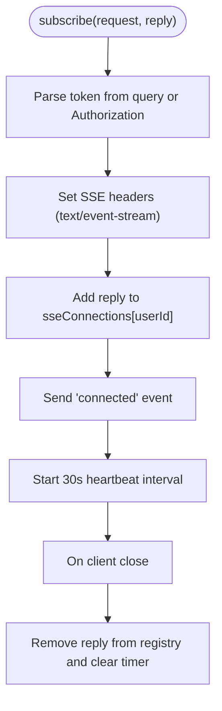
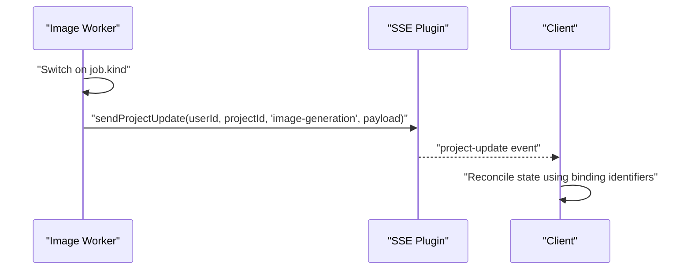
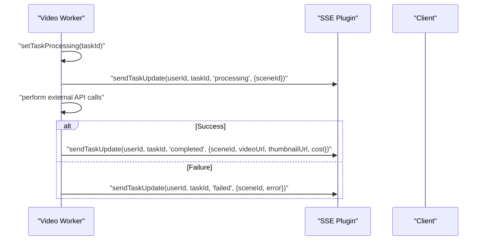
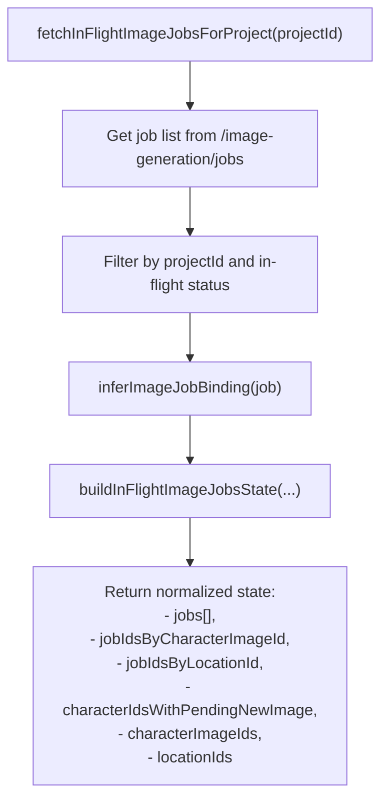
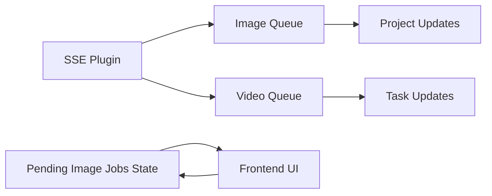

# Real-time Synchronization

<cite>
**Referenced Files in This Document**
- [packages/backend/src/plugins/sse.ts](file://packages/backend/src/plugins/sse.ts)
- [packages/backend/src/queues/image.ts](file://packages/backend/src/queues/image.ts)
- [packages/backend/src/queues/video.ts](file://packages/backend/src/queues/video.ts)
- [packages/backend/src/services/image-generation-job-service.ts](file://packages/backend/src/services/image-generation-job-service.ts)
- [packages/frontend/src/lib/pending-image-jobs.ts](file://packages/frontend/src/lib/pending-image-jobs.ts)
- [packages/backend/tests/sse-integration.test.ts](file://packages/backend/tests/sse-integration.test.ts)
- [packages/backend/tests/sse-plugin.test.ts](file://packages/backend/tests/sse-plugin.test.ts)
- [packages/backend/tests/video-queue-worker.test.ts](file://packages/backend/tests/video-queue-worker.test.ts)
- [packages/backend/tests/video-queue.test.ts](file://packages/backend/tests/video-queue.test.ts)
</cite>

## Table of Contents

1. [Introduction](#introduction)
2. [Project Structure](#project-structure)
3. [Core Components](#core-components)
4. [Architecture Overview](#architecture-overview)
5. [Detailed Component Analysis](#detailed-component-analysis)
6. [Dependency Analysis](#dependency-analysis)
7. [Performance Considerations](#performance-considerations)
8. [Troubleshooting Guide](#troubleshooting-guide)
9. [Conclusion](#conclusion)

## Introduction

This document explains the real-time state synchronization mechanisms in the project, focusing on:

- The Server-Sent Events (SSE) bridge for live project and task updates
- Connection management, event parsing, and state reconciliation
- The pending image jobs system for tracking asynchronous generation tasks and optimistic UI updates
- Conflict resolution strategies, offline state handling, and retry mechanisms
- Examples of SSE event handling, state update patterns, and user feedback during long-running operations
- Performance considerations for high-frequency updates and memory management for large datasets

## Project Structure

The real-time synchronization spans backend and frontend:

- Backend exposes an SSE plugin and workers that emit events to subscribed clients
- Workers publish progress and completion/failure notifications via SSE
- Frontend tracks in-flight image generation jobs and reconciles state with server-side updates

**Diagram sources**

- [packages/backend/src/plugins/sse.ts:1-109](file://packages/backend/src/plugins/sse.ts#L1-L109)
- [packages/backend/src/queues/image.ts:1-304](file://packages/backend/src/queues/image.ts#L1-L304)
- [packages/backend/src/queues/video.ts:1-279](file://packages/backend/src/queues/video.ts#L1-L279)
- [packages/frontend/src/lib/pending-image-jobs.ts:1-118](file://packages/frontend/src/lib/pending-image-jobs.ts#L1-L118)

**Section sources**

- [packages/backend/src/plugins/sse.ts:1-109](file://packages/backend/src/plugins/sse.ts#L1-L109)
- [packages/backend/src/queues/image.ts:1-304](file://packages/backend/src/queues/image.ts#L1-L304)
- [packages/backend/src/queues/video.ts:1-279](file://packages/backend/src/queues/video.ts#L1-L279)
- [packages/frontend/src/lib/pending-image-jobs.ts:1-118](file://packages/frontend/src/lib/pending-image-jobs.ts#L1-L118)

## Core Components

- SSE Bridge: Maintains per-user connections, sends heartbeat, and dispatches events to clients
- Image Generation Queue: Emits project-level image-generation updates to the SSE channel
- Video Generation Queue: Emits task-level updates to the SSE channel
- Pending Image Jobs State: Builds a normalized, in-memory view of in-flight image jobs for optimistic UI and reconciliation

Key responsibilities:

- SSE Bridge: Subscribe endpoint, connection registry, heartbeat, graceful cleanup
- Image/Video Workers: Emit structured events with binding-specific identifiers
- Frontend State Builder: Normalize job lists into maps and sets for quick UI binding and optimistic updates

**Section sources**

- [packages/backend/src/plugins/sse.ts:1-109](file://packages/backend/src/plugins/sse.ts#L1-L109)
- [packages/backend/src/queues/image.ts:1-304](file://packages/backend/src/queues/image.ts#L1-L304)
- [packages/backend/src/queues/video.ts:1-279](file://packages/backend/src/queues/video.ts#L1-L279)
- [packages/frontend/src/lib/pending-image-jobs.ts:1-118](file://packages/frontend/src/lib/pending-image-jobs.ts#L1-L118)

## Architecture Overview

The real-time pipeline connects workers to clients via SSE:

- Workers push updates to the SSE channel with event names and structured payloads
- Clients receive events and reconcile local state
- Frontend maintains a compact in-memory index of in-flight image jobs for optimistic rendering

**Diagram sources**

- [packages/backend/src/plugins/sse.ts:45-107](file://packages/backend/src/plugins/sse.ts#L45-L107)
- [packages/backend/src/queues/image.ts:30-36](file://packages/backend/src/queues/image.ts#L30-L36)
- [packages/backend/src/queues/video.ts:17-63](file://packages/backend/src/queues/video.ts#L17-L63)

## Detailed Component Analysis

### SSE Bridge Implementation

The SSE plugin manages:

- Token-based user identification (JWT) or anonymous fallback
- Connection registry per user
- Heartbeat messages to keep connections alive
- Event dispatch helpers for project and task updates
- Cleanup on client close

**Diagram sources**

- [packages/backend/src/plugins/sse.ts:45-107](file://packages/backend/src/plugins/sse.ts#L45-L107)

Operational notes:

- Anonymous connections are supported for public updates
- Heartbeat is sent as a comment line to avoid client parsing overhead
- Connections are removed from registry on close to prevent leaks

**Section sources**

- [packages/backend/src/plugins/sse.ts:1-109](file://packages/backend/src/plugins/sse.ts#L1-L109)
- [packages/backend/tests/sse-integration.test.ts:85-133](file://packages/backend/tests/sse-integration.test.ts#L85-L133)
- [packages/backend/tests/sse-plugin.test.ts:1-183](file://packages/backend/tests/sse-plugin.test.ts#L1-L183)

### Image Generation Queue and Project Updates

The image queue worker emits project-level image-generation updates:

- Normalizes job state to statuses compatible with the UI
- Emits structured payloads containing binding identifiers (character image, location, or new character image)
- Uses SSE to notify the owning user’s project channel

**Diagram sources**

- [packages/backend/src/queues/image.ts:30-36](file://packages/backend/src/queues/image.ts#L30-L36)
- [packages/backend/src/queues/image.ts:48-283](file://packages/backend/src/queues/image.ts#L48-L283)

Key behaviors:

- Payloads include identifiers that allow the UI to map updates to specific slots/cards
- Worker handles failures by emitting a failed event with error details
- API call logging is recorded alongside state transitions

**Section sources**

- [packages/backend/src/queues/image.ts:1-304](file://packages/backend/src/queues/image.ts#L1-L304)
- [packages/backend/src/services/image-generation-job-service.ts:32-125](file://packages/backend/src/services/image-generation-job-service.ts#L32-L125)

### Video Generation Queue and Task Updates

The video queue worker emits task-level updates:

- Sends “processing” immediately upon entering the worker
- On success, emits “completed” with media URLs and cost
- On failure, emits “failed” with error details
- Updates scene and task states accordingly

**Diagram sources**

- [packages/backend/src/queues/video.ts:56-257](file://packages/backend/src/queues/video.ts#L56-L257)

**Section sources**

- [packages/backend/src/queues/video.ts:1-279](file://packages/backend/src/queues/video.ts#L1-L279)
- [packages/backend/tests/video-queue-worker.test.ts:261-304](file://packages/backend/tests/video-queue-worker.test.ts#L261-L304)
- [packages/backend/tests/video-queue.test.ts:1-65](file://packages/backend/tests/video-queue.test.ts#L1-L65)

### Pending Image Jobs System and Optimistic UI

Frontend builds an in-memory state from the current user’s in-flight image jobs:

- Filters jobs by project and in-flight statuses
- Infers binding from either explicit binding or legacy flat fields
- Produces maps and sets for quick lookup and optimistic updates

**Diagram sources**

- [packages/frontend/src/lib/pending-image-jobs.ts:67-117](file://packages/frontend/src/lib/pending-image-jobs.ts#L67-L117)
- [packages/frontend/src/lib/pending-image-jobs.ts:29-51](file://packages/frontend/src/lib/pending-image-jobs.ts#L29-L51)

Optimistic UI patterns:

- When a new image job is enqueued, the UI can immediately bind it to a slot using the inferred binding and job id
- As SSE events arrive, the UI reconciles by removing entries from the maps/sets and updating cards

**Section sources**

- [packages/frontend/src/lib/pending-image-jobs.ts:1-118](file://packages/frontend/src/lib/pending-image-jobs.ts#L1-L118)

### State Reconciliation and Conflict Resolution

- Project updates: The image worker emits binding-specific payloads; the UI removes the corresponding job id from its maps and updates the card visuals
- Task updates: The video worker emits task-scoped updates; the UI updates the task row and associated scene state
- Conflict resolution: Later updates overwrite earlier ones; the UI relies on the latest SSE payload to converge to the authoritative state
- Offline handling: SSE reconnects automatically; the UI can re-fetch in-flight jobs to reconcile after disconnection

[No sources needed since this section synthesizes behavior from referenced files]

### Retry Mechanisms

- Image queue: Jobs are configured with retries and exponential backoff
- Video queue: Jobs are configured with retries and exponential backoff
- SSE failures: The SSE plugin swallows write errors to avoid crashing the server; clients should reconnect to receive missed events

**Section sources**

- [packages/backend/src/queues/image.ts:19-28](file://packages/backend/src/queues/image.ts#L19-L28)
- [packages/backend/src/queues/video.ts:24-33](file://packages/backend/src/queues/video.ts#L24-L33)
- [packages/backend/src/plugins/sse.ts:7-18](file://packages/backend/src/plugins/sse.ts#L7-L18)

## Dependency Analysis

The real-time subsystem exhibits clear separation of concerns:

- SSE plugin depends on Fastify’s request/response and maintains an in-memory registry
- Workers depend on Redis-backed queues and the SSE plugin for notifications
- Frontend depends on HTTP APIs and SSE to maintain a consistent view

**Diagram sources**

- [packages/backend/src/plugins/sse.ts:1-109](file://packages/backend/src/plugins/sse.ts#L1-L109)
- [packages/backend/src/queues/image.ts:1-304](file://packages/backend/src/queues/image.ts#L1-L304)
- [packages/backend/src/queues/video.ts:1-279](file://packages/backend/src/queues/video.ts#L1-L279)
- [packages/frontend/src/lib/pending-image-jobs.ts:1-118](file://packages/frontend/src/lib/pending-image-jobs.ts#L1-L118)

**Section sources**

- [packages/backend/src/plugins/sse.ts:1-109](file://packages/backend/src/plugins/sse.ts#L1-L109)
- [packages/backend/src/queues/image.ts:1-304](file://packages/backend/src/queues/image.ts#L1-L304)
- [packages/backend/src/queues/video.ts:1-279](file://packages/backend/src/queues/video.ts#L1-L279)
- [packages/frontend/src/lib/pending-image-jobs.ts:1-118](file://packages/frontend/src/lib/pending-image-jobs.ts#L1-L118)

## Performance Considerations

- SSE throughput: Heartbeat keeps connections alive; minimize payload sizes and avoid unnecessary events
- Worker concurrency: Tune concurrency to match downstream providers and storage limits
- Memory footprint: The frontend’s pending image jobs state uses maps and sets; keep only in-flight jobs to limit memory growth
- Queue backoff: Exponential backoff prevents thundering herds on transient failures
- Large datasets: Prefer incremental updates and pagination for job listings; avoid full-state replays

[No sources needed since this section provides general guidance]

## Troubleshooting Guide

Common issues and remedies:

- SSE connection drops: Clients should reconnect; the server cleans up stale connections on close
- Missed events: Reconnect to SSE and re-fetch in-flight jobs to reconcile state
- Worker failures: Inspect logs for failed events; the worker emits a failed payload with error details
- Binding mismatches: Ensure the UI infers binding correctly from job payloads; fall back to legacy fields when needed

Validation references:

- SSE lifecycle and heartbeat behavior are covered by integration tests
- SSE send helpers and graceful handling of closed connections are covered by unit tests
- Video worker emits task updates for processing/completion/failure scenarios

**Section sources**

- [packages/backend/tests/sse-integration.test.ts:85-133](file://packages/backend/tests/sse-integration.test.ts#L85-L133)
- [packages/backend/tests/sse-plugin.test.ts:1-183](file://packages/backend/tests/sse-plugin.test.ts#L1-L183)
- [packages/backend/tests/video-queue-worker.test.ts:261-304](file://packages/backend/tests/video-queue-worker.test.ts#L261-L304)

## Conclusion

The real-time synchronization system combines an SSE bridge with queue-driven workers to deliver timely, structured updates to clients. The frontend’s pending image jobs state enables optimistic UI updates while ensuring eventual consistency through SSE reconciliation. Robust retry policies and heartbeat mechanisms support reliability, while careful memory management and payload minimization help sustain performance under load.
