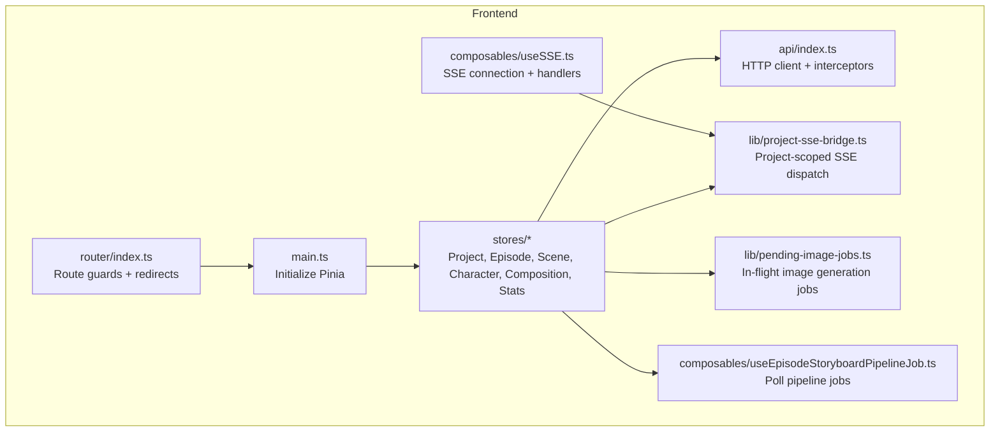
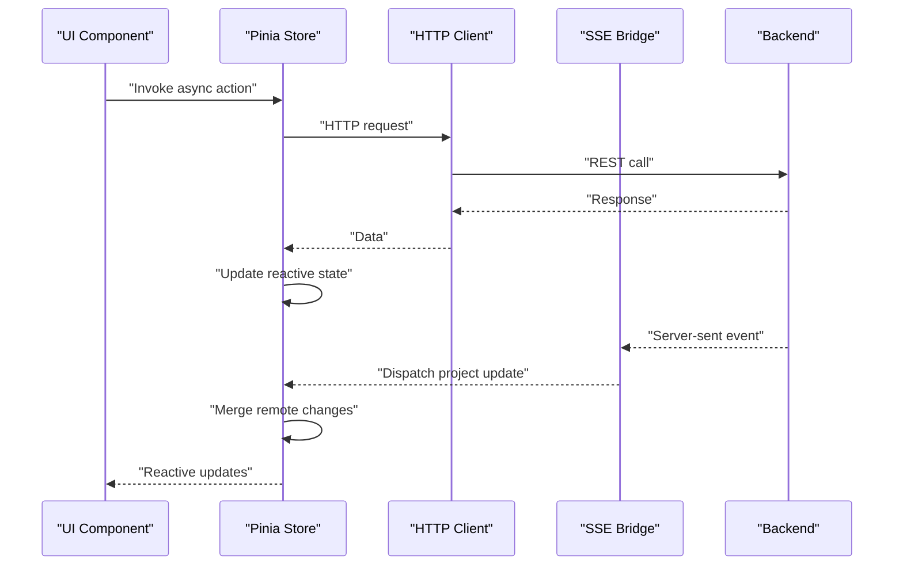
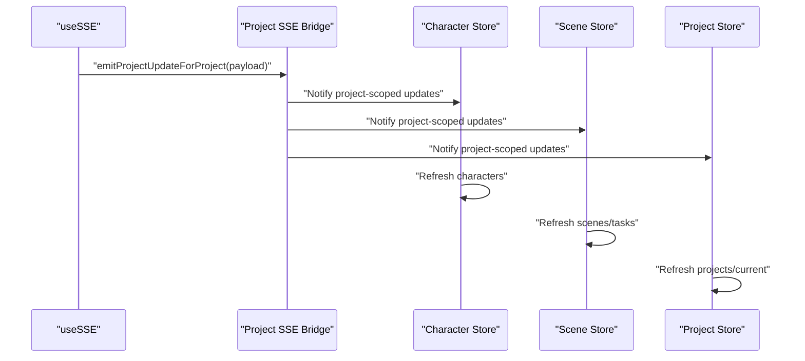
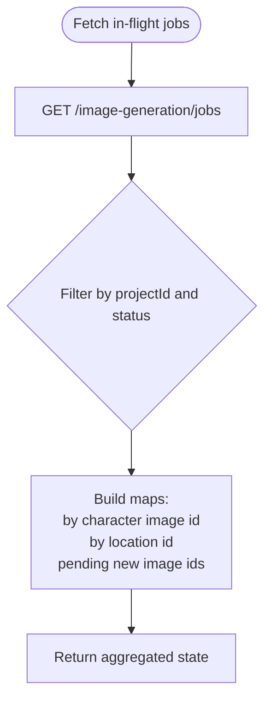
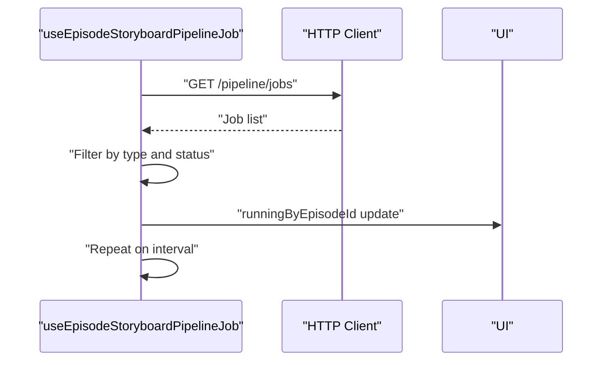
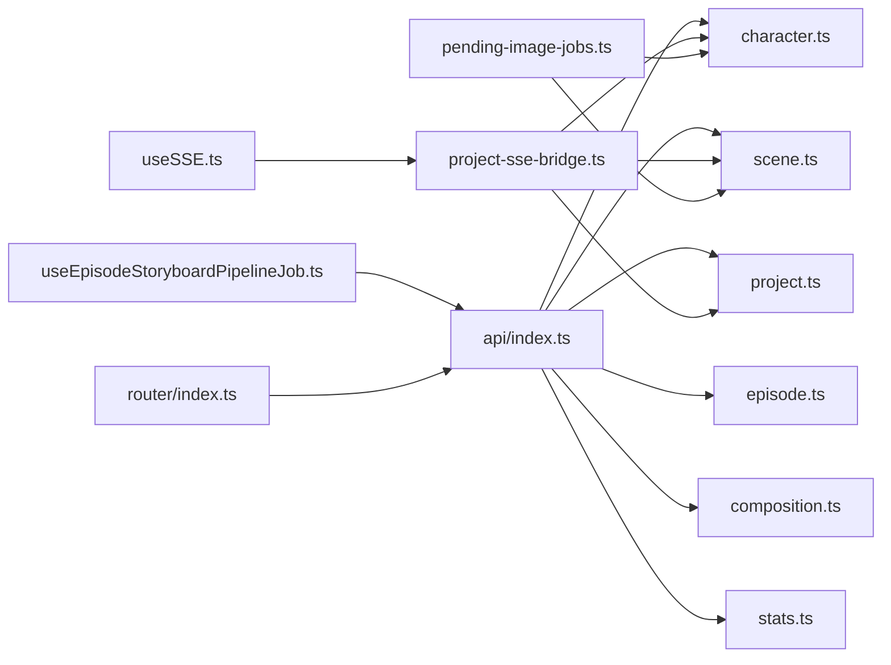

# State Management

<cite>
**Referenced Files in This Document**
- [main.ts](file://packages/frontend/src/main.ts)
- [project.ts](file://packages/frontend/src/stores/project.ts)
- [episode.ts](file://packages/frontend/src/stores/episode.ts)
- [scene.ts](file://packages/frontend/src/stores/scene.ts)
- [character.ts](file://packages/frontend/src/stores/character.ts)
- [composition.ts](file://packages/frontend/src/stores/composition.ts)
- [stats.ts](file://packages/frontend/src/stores/stats.ts)
- [index.ts](file://packages/frontend/src/api/index.ts)
- [useSSE.ts](file://packages/frontend/src/composables/useSSE.ts)
- [project-sse-bridge.ts](file://packages/frontend/src/lib/project-sse-bridge.ts)
- [pending-image-jobs.ts](file://packages/frontend/src/lib/pending-image-jobs.ts)
- [useEpisodeStoryboardPipelineJob.ts](file://packages/frontend/src/composables/useEpisodeStoryboardPipelineJob.ts)
- [router/index.ts](file://packages/frontend/src/router/index.ts)
</cite>

## Table of Contents

1. [Introduction](#introduction)
2. [Project Structure](#project-structure)
3. [Core Components](#core-components)
4. [Architecture Overview](#architecture-overview)
5. [Detailed Component Analysis](#detailed-component-analysis)
6. [Dependency Analysis](#dependency-analysis)
7. [Performance Considerations](#performance-considerations)
8. [Troubleshooting Guide](#troubleshooting-guide)
9. [Conclusion](#conclusion)
10. [Appendices](#appendices)

## Introduction

This document explains the Pinia-based state management system used in the frontend. It covers store architecture, state modules for projects, episodes, scenes, characters, and compositions, and how they integrate with backend APIs via HTTP and server-sent events (SSE). It also documents optimistic UI patterns, pending job management, cross-store communication, persistence strategies, debugging techniques, and cleanup procedures.

## Project Structure

The frontend initializes Pinia globally and organizes state into focused stores under a dedicated folder. Stores encapsulate domain-specific state and async actions. Supporting libraries provide SSE bridging, pending job tracking, and pipeline job polling. The API module centralizes HTTP interactions and authentication.

**Diagram sources**

- [main.ts:1-18](file://packages/frontend/src/main.ts#L1-L18)
- [project.ts:1-51](file://packages/frontend/src/stores/project.ts#L1-L51)
- [episode.ts:1-125](file://packages/frontend/src/stores/episode.ts#L1-L125)
- [scene.ts:1-213](file://packages/frontend/src/stores/scene.ts#L1-L213)
- [character.ts:1-151](file://packages/frontend/src/stores/character.ts#L1-L151)
- [composition.ts:1-92](file://packages/frontend/src/stores/composition.ts#L1-L92)
- [stats.ts:1-48](file://packages/frontend/src/stores/stats.ts#L1-L48)
- [index.ts:1-332](file://packages/frontend/src/api/index.ts#L1-L332)
- [useSSE.ts:1-109](file://packages/frontend/src/composables/useSSE.ts#L1-L109)
- [project-sse-bridge.ts:1-48](file://packages/frontend/src/lib/project-sse-bridge.ts#L1-L48)
- [pending-image-jobs.ts:1-118](file://packages/frontend/src/lib/pending-image-jobs.ts#L1-L118)
- [useEpisodeStoryboardPipelineJob.ts:1-82](file://packages/frontend/src/composables/useEpisodeStoryboardPipelineJob.ts#L1-L82)
- [router/index.ts:1-145](file://packages/frontend/src/router/index.ts#L1-L145)

**Section sources**

- [main.ts:1-18](file://packages/frontend/src/main.ts#L1-L18)
- [router/index.ts:1-145](file://packages/frontend/src/router/index.ts#L1-L145)

## Core Components

- Pinia initialization and global registration
- HTTP client with interceptors for auth and multipart forms
- SSE bridge for project-scoped real-time updates
- Pending job utilities for image generation
- Pipeline job polling composable
- Domain stores: Project, Episode, Scene, Character, Composition, Stats

Key characteristics:

- Reactive state via Vue refs inside Pinia stores
- Async actions that mutate state after API responses
- Optimistic updates where appropriate (e.g., local reordering, immediate notifications)
- SSE-driven refreshes for long-running tasks and project-wide changes
- Polling for pipeline jobs and in-flight image generation

**Section sources**

- [main.ts:1-18](file://packages/frontend/src/main.ts#L1-L18)
- [index.ts:1-332](file://packages/frontend/src/api/index.ts#L1-L332)
- [useSSE.ts:1-109](file://packages/frontend/src/composables/useSSE.ts#L1-L109)
- [project-sse-bridge.ts:1-48](file://packages/frontend/src/lib/project-sse-bridge.ts#L1-L48)
- [pending-image-jobs.ts:1-118](file://packages/frontend/src/lib/pending-image-jobs.ts#L1-L118)
- [useEpisodeStoryboardPipelineJob.ts:1-82](file://packages/frontend/src/composables/useEpisodeStoryboardPipelineJob.ts#L1-L82)

## Architecture Overview

The state system follows a unidirectional data flow:

- UI triggers actions on stores
- Stores perform async operations via the HTTP client
- Stores update reactive state
- SSE and polling keep state synchronized with backend changes
- Cross-store subscriptions react to project-level updates

**Diagram sources**

- [index.ts:1-332](file://packages/frontend/src/api/index.ts#L1-L332)
- [useSSE.ts:1-109](file://packages/frontend/src/composables/useSSE.ts#L1-L109)
- [project-sse-bridge.ts:1-48](file://packages/frontend/src/lib/project-sse-bridge.ts#L1-L48)
- [project.ts:1-51](file://packages/frontend/src/stores/project.ts#L1-L51)
- [episode.ts:1-125](file://packages/frontend/src/stores/episode.ts#L1-L125)
- [scene.ts:1-213](file://packages/frontend/src/stores/scene.ts#L1-L213)
- [character.ts:1-151](file://packages/frontend/src/stores/character.ts#L1-L151)
- [composition.ts:1-92](file://packages/frontend/src/stores/composition.ts#L1-L92)
- [stats.ts:1-48](file://packages/frontend/src/stores/stats.ts#L1-L48)

## Detailed Component Analysis

### Project Store

Purpose:

- Manage list and current project
- CRUD operations via HTTP
- Synchronize with backend and SSE

State:

- Reactive arrays and current selection
- Loading flags for bulk operations

Actions:

- Fetch projects, get project by id
- Create, update, delete project
- Error handling via API interceptors

Persistence:

- No client-side persistence; state resets on reload

Optimistic patterns:

- Immediate push/unshift on create
- Local replace on update/delete

Cross-store communication:

- Subscribes to project-scoped SSE updates

**Section sources**

- [project.ts:1-51](file://packages/frontend/src/stores/project.ts#L1-L51)
- [index.ts:1-332](file://packages/frontend/src/api/index.ts#L1-L332)
- [project-sse-bridge.ts:1-48](file://packages/frontend/src/lib/project-sse-bridge.ts#L1-L48)

### Episode Store

Purpose:

- Manage episodes within a project
- Support episode detail retrieval and editing
- Trigger asynchronous storyboard generation jobs

State:

- Episodes list, current episode
- Loading flags for long-running operations

Actions:

- Fetch episodes by project, get episode by id
- Create, update, delete episode
- Expand script and generate storyboard script (async job)
- Error boundaries around async operations

Optimistic patterns:

- None for episode edits; refresh after mutation
- Loading flags to reflect async operations

Cross-store communication:

- Uses SSE bridge for project-level updates

**Section sources**

- [episode.ts:1-125](file://packages/frontend/src/stores/episode.ts#L1-L125)
- [index.ts:1-332](file://packages/frontend/src/api/index.ts#L1-L332)
- [project-sse-bridge.ts:1-48](file://packages/frontend/src/lib/project-sse-bridge.ts#L1-L48)

### Scene Store

Purpose:

- Manage scenes and takes within episodes
- Video generation orchestration
- Timeline and task management

State:

- Scenes list and editor-scene aggregation
- Current scene, loading flags
- Generation flag for batch/video ops

Actions:

- Fetch scenes, get scene by id
- Create, update, delete scene
- Reorder scenes (optimistic sort then refresh)
- Generate video and batch generate
- Select task, fetch tasks, optimize prompt
- Error boundaries around async operations

Optimistic patterns:

- Reorder scenes locally, then refresh to sync backend ordering

Cross-store communication:

- SSE bridge for project-level updates
- Pending image jobs utilities for image generation tasks

**Section sources**

- [scene.ts:1-213](file://packages/frontend/src/stores/scene.ts#L1-L213)
- [index.ts:1-332](file://packages/frontend/src/api/index.ts#L1-L332)
- [pending-image-jobs.ts:1-118](file://packages/frontend/src/lib/pending-image-jobs.ts#L1-L118)
- [project-sse-bridge.ts:1-48](file://packages/frontend/src/lib/project-sse-bridge.ts#L1-L48)

### Character Store

Purpose:

- Manage characters and associated images within a project
- Queue image generation jobs and manage image slots

State:

- Characters list, loading flag

Actions:

- Fetch characters by project, get character by id
- Create, update, delete character
- Image management: add, update, delete, move images
- Upload avatar images (multipart)
- Queue image generation and batch missing avatars
- Add image slot via AI (JSON-only creation)

Optimistic patterns:

- None for character edits; refresh after mutation
- Image operations refresh character list after mutation

Cross-store communication:

- SSE bridge for project-level updates
- Pending image jobs utilities for image generation tasks

**Section sources**

- [character.ts:1-151](file://packages/frontend/src/stores/character.ts#L1-L151)
- [index.ts:1-332](file://packages/frontend/src/api/index.ts#L1-L332)
- [pending-image-jobs.ts:1-118](file://packages/frontend/src/lib/pending-image-jobs.ts#L1-L118)
- [project-sse-bridge.ts:1-48](file://packages/frontend/src/lib/project-sse-bridge.ts#L1-L48)

### Composition Store

Purpose:

- Manage compositions and timeline clips within a project
- Export compositions

State:

- Compositions list, current composition
- Loading and export flags

Actions:

- Fetch compositions by project, get composition by id
- Create, update, delete composition
- Update timeline clips
- Trigger export and refresh after completion

Optimistic patterns:

- None for composition edits; refresh after mutation

Cross-store communication:

- SSE bridge for project-level updates

**Section sources**

- [composition.ts:1-92](file://packages/frontend/src/stores/composition.ts#L1-L92)
- [index.ts:1-332](file://packages/frontend/src/api/index.ts#L1-L332)
- [project-sse-bridge.ts:1-48](file://packages/frontend/src/lib/project-sse-bridge.ts#L1-L48)

### Stats Store

Purpose:

- Provide user-level and project-level statistics and cost trends

State:

- User stats, project stats, daily costs
- Loading flag

Actions:

- Fetch user stats, project stats, cost trend
- Centralized loading state

Optimistic patterns:

- None; refresh on demand

**Section sources**

- [stats.ts:1-48](file://packages/frontend/src/stores/stats.ts#L1-L48)
- [index.ts:169-185](file://packages/frontend/src/api/index.ts#L169-L185)

### SSE Bridge and Real-Time Updates

The SSE bridge decouples global SSE handling from domain stores:

- Global SSE composable connects to backend and parses events
- Project-scoped bridge dispatches project-update events to subscribers
- Stores subscribe to project updates and refresh affected data

**Diagram sources**

- [useSSE.ts:1-109](file://packages/frontend/src/composables/useSSE.ts#L1-L109)
- [project-sse-bridge.ts:1-48](file://packages/frontend/src/lib/project-sse-bridge.ts#L1-L48)
- [character.ts:1-151](file://packages/frontend/src/stores/character.ts#L1-L151)
- [scene.ts:1-213](file://packages/frontend/src/stores/scene.ts#L1-L213)
- [project.ts:1-51](file://packages/frontend/src/stores/project.ts#L1-L51)

**Section sources**

- [useSSE.ts:1-109](file://packages/frontend/src/composables/useSSE.ts#L1-L109)
- [project-sse-bridge.ts:1-48](file://packages/frontend/src/lib/project-sse-bridge.ts#L1-L48)

### Pending Job Management

- In-flight image generation jobs are tracked per project
- Utilities infer bindings and maintain maps for character images, locations, and pending new image jobs
- Stores can use these utilities to disable actions or show placeholders while jobs are in flight

**Diagram sources**

- [pending-image-jobs.ts:112-118](file://packages/frontend/src/lib/pending-image-jobs.ts#L112-L118)
- [pending-image-jobs.ts:68-106](file://packages/frontend/src/lib/pending-image-jobs.ts#L68-L106)

**Section sources**

- [pending-image-jobs.ts:1-118](file://packages/frontend/src/lib/pending-image-jobs.ts#L1-L118)

### Episode Storyboard Pipeline Job Polling

- Polls pipeline jobs to track running “episode-storyboard-script” jobs
- Builds a map of episode IDs currently in progress
- Integrates with UI to show loading states during storyboard generation

**Diagram sources**

- [useEpisodeStoryboardPipelineJob.ts:34-82](file://packages/frontend/src/composables/useEpisodeStoryboardPipelineJob.ts#L34-L82)
- [index.ts:252-291](file://packages/frontend/src/api/index.ts#L252-L291)

**Section sources**

- [useEpisodeStoryboardPipelineJob.ts:1-82](file://packages/frontend/src/composables/useEpisodeStoryboardPipelineJob.ts#L1-L82)
- [index.ts:252-291](file://packages/frontend/src/api/index.ts#L252-L291)

### Cross-Store Communication Patterns

- Project-scoped SSE subscriptions allow stores to react to changes without tight coupling
- Pending job utilities enable stores to coordinate actions based on in-flight tasks
- Pipeline job polling provides centralized visibility into long-running operations

**Section sources**

- [project-sse-bridge.ts:1-48](file://packages/frontend/src/lib/project-sse-bridge.ts#L1-L48)
- [pending-image-jobs.ts:1-118](file://packages/frontend/src/lib/pending-image-jobs.ts#L1-L118)
- [useEpisodeStoryboardPipelineJob.ts:1-82](file://packages/frontend/src/composables/useEpisodeStoryboardPipelineJob.ts#L1-L82)

## Dependency Analysis

Stores depend on:

- HTTP client for API calls
- SSE bridge for real-time updates
- Pending job utilities for image generation coordination
- Router for authentication guards and redirects

**Diagram sources**

- [index.ts:1-332](file://packages/frontend/src/api/index.ts#L1-L332)
- [project.ts:1-51](file://packages/frontend/src/stores/project.ts#L1-L51)
- [episode.ts:1-125](file://packages/frontend/src/stores/episode.ts#L1-L125)
- [scene.ts:1-213](file://packages/frontend/src/stores/scene.ts#L1-L213)
- [character.ts:1-151](file://packages/frontend/src/stores/character.ts#L1-L151)
- [composition.ts:1-92](file://packages/frontend/src/stores/composition.ts#L1-L92)
- [stats.ts:1-48](file://packages/frontend/src/stores/stats.ts#L1-L48)
- [useSSE.ts:1-109](file://packages/frontend/src/composables/useSSE.ts#L1-L109)
- [project-sse-bridge.ts:1-48](file://packages/frontend/src/lib/project-sse-bridge.ts#L1-L48)
- [pending-image-jobs.ts:1-118](file://packages/frontend/src/lib/pending-image-jobs.ts#L1-L118)
- [useEpisodeStoryboardPipelineJob.ts:1-82](file://packages/frontend/src/composables/useEpisodeStoryboardPipelineJob.ts#L1-L82)
- [router/index.ts:1-145](file://packages/frontend/src/router/index.ts#L1-L145)

**Section sources**

- [index.ts:1-332](file://packages/frontend/src/api/index.ts#L1-L332)
- [useSSE.ts:1-109](file://packages/frontend/src/composables/useSSE.ts#L1-L109)
- [project-sse-bridge.ts:1-48](file://packages/frontend/src/lib/project-sse-bridge.ts#L1-L48)
- [pending-image-jobs.ts:1-118](file://packages/frontend/src/lib/pending-image-jobs.ts#L1-L118)
- [useEpisodeStoryboardPipelineJob.ts:1-82](file://packages/frontend/src/composables/useEpisodeStoryboardPipelineJob.ts#L1-L82)
- [router/index.ts:1-145](file://packages/frontend/src/router/index.ts#L1-L145)

## Performance Considerations

- Prefer optimistic updates for fast feedback (e.g., scene reordering) and follow up with a refresh to reconcile with backend
- Use loading flags to avoid redundant requests and to gate UI interactions
- Batch operations where possible (e.g., batch video generation) to reduce network overhead
- Debounce or throttle polling intervals for SSE and pipeline job polling to minimize load
- Keep SSE subscriptions scoped to project IDs to avoid unnecessary work
- Avoid frequent deep reactivity by structuring state as shallow refs and replacing arrays/objects rather than mutating deeply nested structures

## Troubleshooting Guide

Common issues and remedies:

- Authentication errors
  - Symptom: Redirect to login or 401 responses
  - Cause: Missing/expired token or interceptor logic
  - Action: Verify token presence and lifecycle; ensure interceptors remove stale tokens and redirect appropriately
  - Reference: [index.ts:34-55](file://packages/frontend/src/api/index.ts#L34-L55), [router/index.ts:131-142](file://packages/frontend/src/router/index.ts#L131-L142)

- SSE disconnections
  - Symptom: Disconnected state and retries
  - Cause: Network issues or token invalidation
  - Action: Confirm token validity and automatic reconnect behavior
  - Reference: [useSSE.ts:19-51](file://packages/frontend/src/composables/useSSE.ts#L19-L51)

- Long-running tasks not reflecting updates
  - Symptom: Tasks complete but UI does not update
  - Cause: Missing SSE subscription or polling fallback
  - Action: Ensure stores subscribe to project updates and/or poll pipeline jobs
  - References: [useSSE.ts:34-89](file://packages/frontend/src/composables/useSSE.ts#L34-L89), [useEpisodeStoryboardPipelineJob.ts:34-82](file://packages/frontend/src/composables/useEpisodeStoryboardPipelineJob.ts#L34-L82)

- Image generation jobs stuck or duplicated
  - Symptom: Confusion about in-flight jobs
  - Cause: Missing or incorrect binding inference
  - Action: Use pending job utilities to build in-flight state and correlate with UI
  - Reference: [pending-image-jobs.ts:68-106](file://packages/frontend/src/lib/pending-image-jobs.ts#L68-L106)

- Export or generation not updating state
  - Symptom: UI remains busy after completion
  - Cause: Missing refresh after async operation
  - Action: Call store getters or refresh actions after async completion
  - References: [composition.ts:65-76](file://packages/frontend/src/stores/composition.ts#L65-L76), [scene.ts:140-154](file://packages/frontend/src/stores/scene.ts#L140-L154)

**Section sources**

- [index.ts:34-55](file://packages/frontend/src/api/index.ts#L34-L55)
- [router/index.ts:131-142](file://packages/frontend/src/router/index.ts#L131-L142)
- [useSSE.ts:19-51](file://packages/frontend/src/composables/useSSE.ts#L19-L51)
- [useEpisodeStoryboardPipelineJob.ts:34-82](file://packages/frontend/src/composables/useEpisodeStoryboardPipelineJob.ts#L34-L82)
- [pending-image-jobs.ts:68-106](file://packages/frontend/src/lib/pending-image-jobs.ts#L68-L106)
- [composition.ts:65-76](file://packages/frontend/src/stores/composition.ts#L65-L76)
- [scene.ts:140-154](file://packages/frontend/src/stores/scene.ts#L140-L154)

## Conclusion

The state management system leverages Pinia for reactive domain stores, Axios for HTTP, and SSE plus polling for real-time synchronization. It balances optimistic UI updates with robust reconciliation via SSE and polling. Pending job utilities and project-scoped subscriptions enable coordinated, efficient handling of long-running tasks across characters, scenes, and compositions.

## Appendices

### State Persistence Strategies

- No client-side persistence is implemented in the stores; state is cleared on page reload
- Token and user metadata are stored in local storage for authentication continuity
- Recommendation: For critical transient UI state (e.g., draft edits), consider lightweight local persistence with controlled TTL and explicit cleanup

**Section sources**

- [index.ts:13-16](file://packages/frontend/src/api/index.ts#L13-L16)
- [router/index.ts:131-142](file://packages/frontend/src/router/index.ts#L131-L142)

### State Reset/Cleanup Procedures

- On authentication failure, interceptors remove tokens and redirect to login
- On component unmount, SSE connection is closed to prevent leaks
- Stores should refresh data after async operations to ensure consistency

**Section sources**

- [index.ts:34-55](file://packages/frontend/src/api/index.ts#L34-L55)
- [useSSE.ts:99-101](file://packages/frontend/src/composables/useSSE.ts#L99-L101)
