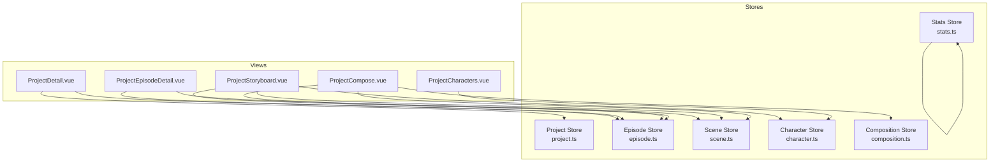
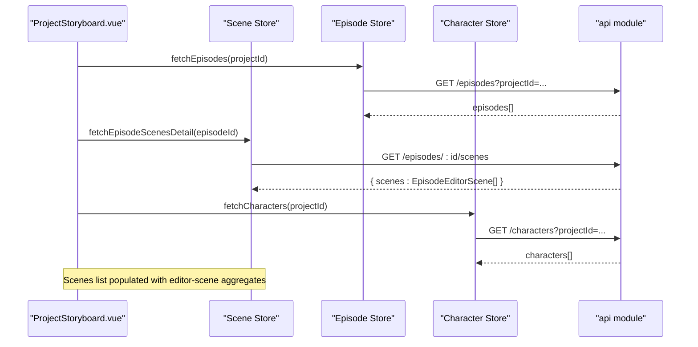
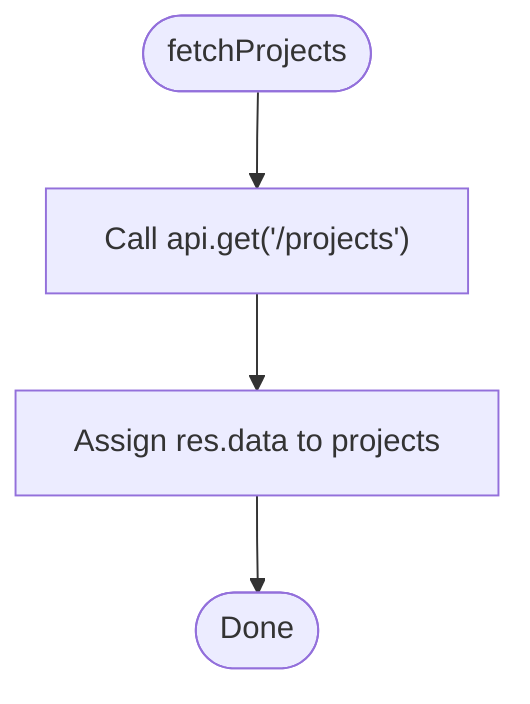
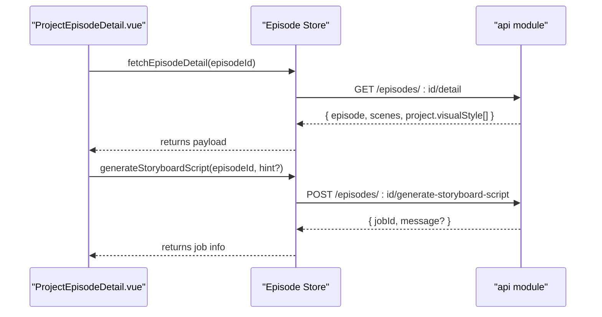
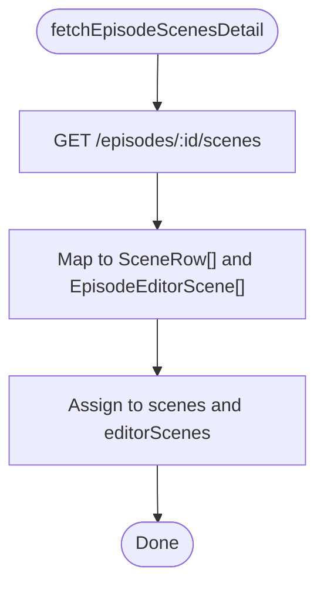
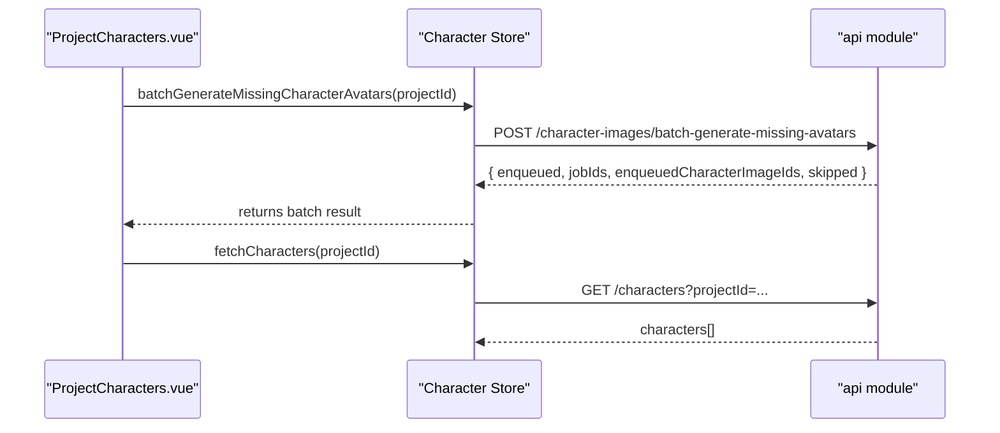
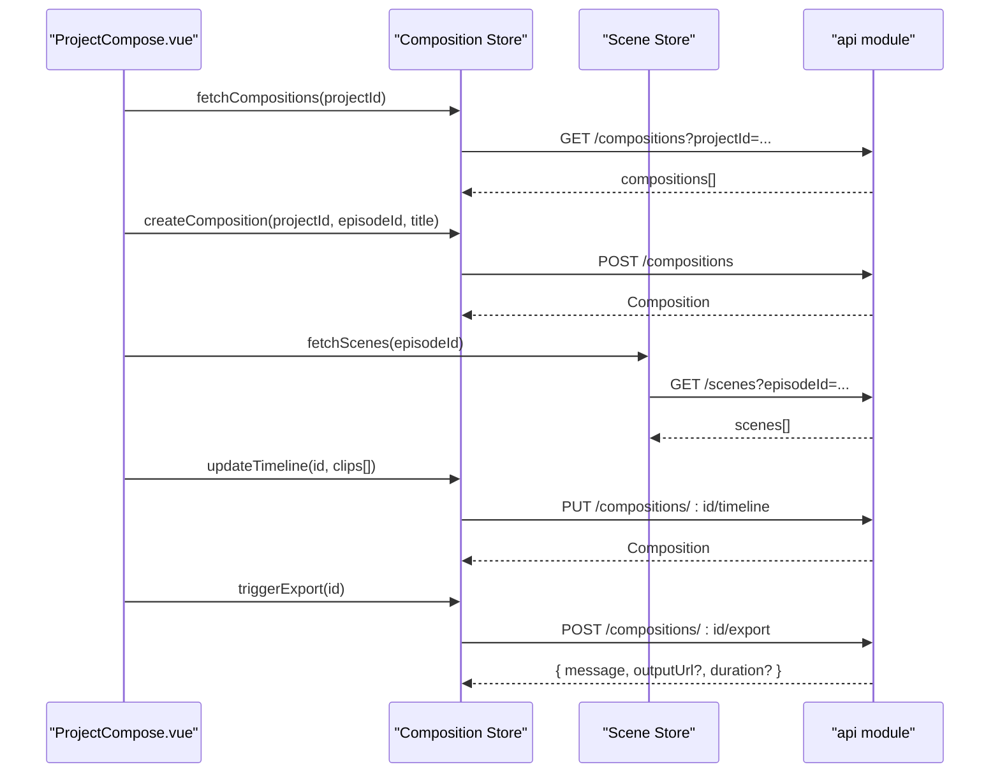
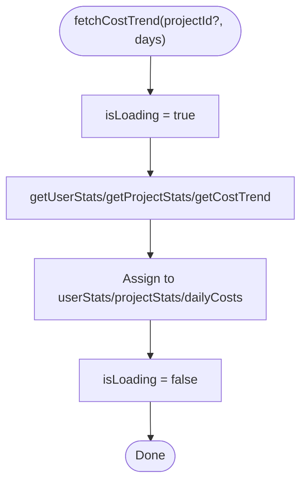
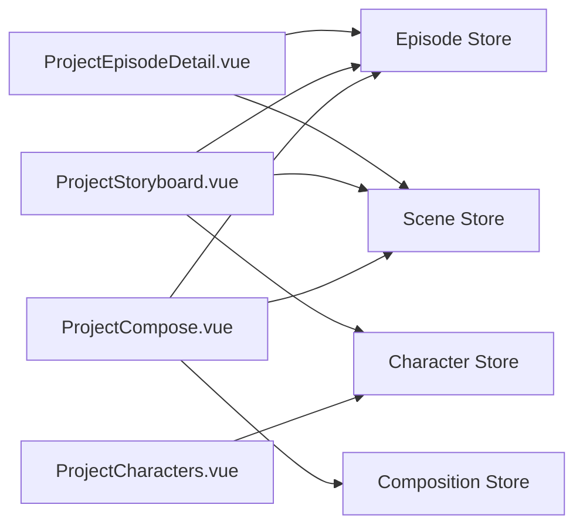

# Store Modules

<cite>
**Referenced Files in This Document**
- [project.ts](file://packages/frontend/src/stores/project.ts)
- [episode.ts](file://packages/frontend/src/stores/episode.ts)
- [scene.ts](file://packages/frontend/src/stores/scene.ts)
- [character.ts](file://packages/frontend/src/stores/character.ts)
- [composition.ts](file://packages/frontend/src/stores/composition.ts)
- [stats.ts](file://packages/frontend/src/stores/stats.ts)
- [ProjectDetail.vue](file://packages/frontend/src/views/ProjectDetail.vue)
- [ProjectEpisodeDetail.vue](file://packages/frontend/src/views/ProjectEpisodeDetail.vue)
- [ProjectStoryboard.vue](file://packages/frontend/src/views/ProjectStoryboard.vue)
- [ProjectCharacters.vue](file://packages/frontend/src/views/ProjectCharacters.vue)
- [ProjectCompose.vue](file://packages/frontend/src/views/ProjectCompose.vue)
- [index.d.ts](file://packages/shared/src/types/index.d.ts)
</cite>

## Table of Contents

1. [Introduction](#introduction)
2. [Project Structure](#project-structure)
3. [Core Components](#core-components)
4. [Architecture Overview](#architecture-overview)
5. [Detailed Component Analysis](#detailed-component-analysis)
6. [Dependency Analysis](#dependency-analysis)
7. [Performance Considerations](#performance-considerations)
8. [Troubleshooting Guide](#troubleshooting-guide)
9. [Conclusion](#conclusion)

## Introduction

This document describes the Pinia store modules that power the frontend data layer. It covers the state structure, actions, and how stores integrate with components to manage:

- Project content and metadata
- Episode narrative structure and AI expansion
- Scene generation units and take management
- Character assets and image generation workflows
- Composition timelines and exports
- Analytics and cost statistics

It also documents state initialization patterns, action composition, inter-store dependencies, and data normalization strategies observed in the codebase.

## Project Structure

The stores are defined under packages/frontend/src/stores and expose composable functions via Pinia’s functional store API. Each store encapsulates a bounded domain and exposes reactive state and async actions for CRUD and orchestration.

**Diagram sources**

- [project.ts:1-51](file://packages/frontend/src/stores/project.ts#L1-L51)
- [episode.ts:1-125](file://packages/frontend/src/stores/episode.ts#L1-L125)
- [scene.ts:1-213](file://packages/frontend/src/stores/scene.ts#L1-L213)
- [character.ts:1-151](file://packages/frontend/src/stores/character.ts#L1-L151)
- [composition.ts:1-92](file://packages/frontend/src/stores/composition.ts#L1-L92)
- [stats.ts:1-48](file://packages/frontend/src/stores/stats.ts#L1-L48)
- [ProjectDetail.vue:15-61](file://packages/frontend/src/views/ProjectDetail.vue#L15-L61)
- [ProjectEpisodeDetail.vue:18-31](file://packages/frontend/src/views/ProjectEpisodeDetail.vue#L18-L31)
- [ProjectStoryboard.vue:9-21](file://packages/frontend/src/views/ProjectStoryboard.vue#L9-L21)
- [ProjectCharacters.vue:21-32](file://packages/frontend/src/views/ProjectCharacters.vue#L21-L32)
- [ProjectCompose.vue:8-19](file://packages/frontend/src/views/ProjectCompose.vue#L8-L19)

**Section sources**

- [project.ts:1-51](file://packages/frontend/src/stores/project.ts#L1-L51)
- [episode.ts:1-125](file://packages/frontend/src/stores/episode.ts#L1-L125)
- [scene.ts:1-213](file://packages/frontend/src/stores/scene.ts#L1-L213)
- [character.ts:1-151](file://packages/frontend/src/stores/character.ts#L1-L151)
- [composition.ts:1-92](file://packages/frontend/src/stores/composition.ts#L1-L92)
- [stats.ts:1-48](file://packages/frontend/src/stores/stats.ts#L1-L48)

## Core Components

- Project Store: Manages project list and current project, with CRUD actions against /projects.
- Episode Store: Manages episodes, loading flags, and episode-level operations including AI expansion and storyboard generation.
- Scene Store: Manages scenes per episode, editor-side aggregation, tasks/takes, generation, and reordering.
- Character Store: Manages characters and images, including image upload, avatar replacement, batch generation, and queueing.
- Composition Store: Manages compositions (final outputs), timeline clips, and export triggers.
- Stats Store: Fetches user/project stats and cost trends.

Each store exposes:

- Reactive state (refs)
- Async actions for persistence and orchestration
- No explicit getters/mutations in the functional store pattern; state is mutated via direct assignment to refs.

**Section sources**

- [project.ts:6-50](file://packages/frontend/src/stores/project.ts#L6-L50)
- [episode.ts:12-124](file://packages/frontend/src/stores/episode.ts#L12-L124)
- [scene.ts:59-212](file://packages/frontend/src/stores/scene.ts#L59-L212)
- [character.ts:6-150](file://packages/frontend/src/stores/character.ts#L6-L150)
- [composition.ts:6-91](file://packages/frontend/src/stores/composition.ts#L6-L91)
- [stats.ts:5-47](file://packages/frontend/src/stores/stats.ts#L5-L47)

## Architecture Overview

The stores coordinate with the backend via an api module and with Vue components via composables. Views orchestrate store usage, often combining multiple stores for complex flows (e.g., episode detail uses episode and scene stores).

**Diagram sources**

- [ProjectStoryboard.vue:64-84](file://packages/frontend/src/views/ProjectStoryboard.vue#L64-L84)
- [episode.ts:19-27](file://packages/frontend/src/stores/episode.ts#L19-L27)
- [scene.ts:67-83](file://packages/frontend/src/stores/scene.ts#L67-L83)
- [character.ts:10-18](file://packages/frontend/src/stores/character.ts#L10-L18)

**Section sources**

- [ProjectStoryboard.vue:64-84](file://packages/frontend/src/views/ProjectStoryboard.vue#L64-L84)
- [episode.ts:19-27](file://packages/frontend/src/stores/episode.ts#L19-L27)
- [scene.ts:67-83](file://packages/frontend/src/stores/scene.ts#L67-L83)
- [character.ts:10-18](file://packages/frontend/src/stores/character.ts#L10-L18)

## Detailed Component Analysis

### Project Store

- State
  - projects: array of Project
  - currentProject: Project | null
- Actions
  - fetchProjects(): loads all projects
  - getProject(id): loads current project
  - createProject(data): posts to /projects
  - updateProject(id, data): patches to /projects/:id
  - deleteProject(id): deletes /projects/:id
- Usage patterns
  - Hydration: views set currentProject after fetching
  - Normalization: maintains list and single entity in parallel

**Diagram sources**

- [project.ts:10-13](file://packages/frontend/src/stores/project.ts#L10-L13)

**Section sources**

- [project.ts:6-50](file://packages/frontend/src/stores/project.ts#L6-L50)
- [ProjectDetail.vue:54-61](file://packages/frontend/src/views/ProjectDetail.vue#L54-L61)

### Episode Store

- State
  - episodes: Episode[]
  - currentEpisode: Episode | null
  - isLoading: boolean
  - isExpanding: boolean
  - isGeneratingStoryboard: boolean
- Actions
  - fetchEpisodes(projectId): GET /episodes?projectId=...
  - getEpisode(id): GET /episodes/:id
  - fetchEpisodeDetail(id): GET /episodes/:id/detail
  - createEpisode(data): POST /episodes
  - updateEpisode(id, data): PATCH /episodes/:id
  - deleteEpisode(id): DELETE /episodes/:id
  - expandScript(episodeId, summary): POST /episodes/:id/expand
  - generateStoryboardScript(episodeId, hint?): POST /episodes/:id/generate-storyboard-script
- Business logic
  - Loading flags gate UI and prevent concurrent operations
  - updateEpisode supports partial updates and refreshes both list and currentEpisode
  - expandScript and generateStoryboardScript return server-provided jobs/messages

**Diagram sources**

- [ProjectEpisodeDetail.vue:272-293](file://packages/frontend/src/views/ProjectEpisodeDetail.vue#L272-L293)
- [episode.ts:40-107](file://packages/frontend/src/stores/episode.ts#L40-L107)

**Section sources**

- [episode.ts:12-124](file://packages/frontend/src/stores/episode.ts#L12-L124)
- [ProjectEpisodeDetail.vue:272-380](file://packages/frontend/src/views/ProjectEpisodeDetail.vue#L272-L380)

### Scene Store

- State
  - scenes: SceneRow[]
  - editorScenes: EpisodeEditorScene[] (aggregated for editor)
  - currentScene: SceneWithTakes | null
  - isLoading: boolean
  - isGenerating: boolean
- Types
  - SceneRow: minimal scene with status and optional takes
  - EpisodeEditorScene: expanded structure with shots, dialogues, takes
- Actions
  - fetchEpisodeScenesDetail(episodeId): GET /episodes/:id/scenes → populate scenes/editorScenes
  - fetchScenes(episodeId): GET /scenes?episodeId=...
  - getScene(id): GET /scenes/:id
  - createScene(data): POST /scenes
  - updateScene(id, data): PUT /scenes/:id
  - deleteScene(id): DELETE /scenes/:id
  - reorderScenes(episodeId, ids[]): batches updateScene and reloads
  - generateVideo(sceneId, model, options?): POST /scenes/:id/generate
  - batchGenerate(sceneIds, model, options?): POST /scenes/batch-generate
  - selectTask(sceneId, taskId): POST /scenes/:id/tasks/:id/select
  - optimizePrompt(sceneId, prompt?): POST /scenes/:id/optimize-prompt
  - fetchTasks(sceneId): GET /scenes/:id/tasks
- Data normalization
  - fetchEpisodeScenesDetail normalizes EpisodeEditorScene into SceneRow for list rendering while keeping expanded editorScenes for the editor

**Diagram sources**

- [scene.ts:67-83](file://packages/frontend/src/stores/scene.ts#L67-L83)

**Section sources**

- [scene.ts:59-212](file://packages/frontend/src/stores/scene.ts#L59-L212)
- [ProjectStoryboard.vue:64-84](file://packages/frontend/src/views/ProjectStoryboard.vue#L64-L84)

### Character Store

- State
  - characters: Character[]
  - isLoading: boolean
- Actions
  - fetchCharacters(projectId): GET /characters?projectId=...
  - getCharacter(id): GET /characters/:id
  - createCharacter(data): POST /characters
  - updateCharacter(id, data): PUT /characters/:id
  - deleteCharacter(id): DELETE /characters/:id
  - addImage(characterId, file, name, ...): multipart POST /characters/:id/images
  - updateImage(characterId, imageId, data): PUT /characters/:id/images/:id
  - uploadCharacterImageAvatar(characterId, imageId, file): multipart POST /characters/:id/images/:id/avatar
  - deleteImage(characterId, imageId): DELETE /characters/:id/images/:id
  - moveImage(characterId, imageId, parentId?): PUT /characters/:id/images/:id/move
  - queueCharacterImageGenerate(imageId, body?): POST /character-images/:id/generate
  - batchGenerateMissingCharacterAvatars(projectId, options?): POST /character-images/batch-generate-missing-avatars
  - addImageSlotByAi(characterId, body): POST /characters/:id/images (JSON, no file)
- Asset management patterns
  - Uploads use FormData for binary payloads
  - After mutating image slots, stores refresh characters for consistency
  - Batch generation queues missing avatars and returns counts/skips

**Diagram sources**

- [ProjectCharacters.vue:158-178](file://packages/frontend/src/views/ProjectCharacters.vue#L158-L178)
- [character.ts:106-120](file://packages/frontend/src/stores/character.ts#L106-L120)

**Section sources**

- [character.ts:6-150](file://packages/frontend/src/stores/character.ts#L6-L150)
- [ProjectCharacters.vue:158-205](file://packages/frontend/src/views/ProjectCharacters.vue#L158-L205)

### Composition Store

- State
  - compositions: Composition[]
  - currentComposition: Composition | null
  - isLoading: boolean
  - isExporting: boolean
- Actions
  - fetchCompositions(projectId): GET /compositions?projectId=...
  - getComposition(id): GET /compositions/:id
  - createComposition(projectId, episodeId, title): POST /compositions
  - updateComposition(id, data): PUT /compositions/:id
  - deleteComposition(id): DELETE /compositions/:id
  - updateTimeline(id, clips[]): PUT /compositions/:id/timeline
  - triggerExport(id): POST /compositions/:id/export
- Orchestration
  - Compositions aggregate selected takes into a timeline
  - Export triggers server-side assembly and updates composition state

**Diagram sources**

- [ProjectCompose.vue:56-62](file://packages/frontend/src/views/ProjectCompose.vue#L56-L62)
- [composition.ts:12-76](file://packages/frontend/src/stores/composition.ts#L12-L76)
- [scene.ts:85-93](file://packages/frontend/src/stores/scene.ts#L85-L93)

**Section sources**

- [composition.ts:6-91](file://packages/frontend/src/stores/composition.ts#L6-L91)
- [ProjectCompose.vue:56-177](file://packages/frontend/src/views/ProjectCompose.vue#L56-L177)

### Stats Store

- State
  - userStats: UserCostStats | null
  - projectStats: ProjectCostStats | null
  - dailyCosts: DailyCost[]
  - isLoading: boolean
- Actions
  - fetchUserStats(): loads user cost stats
  - fetchProjectStats(projectId): loads project stats
  - fetchCostTrend(projectId?, days): loads daily costs
- Notes
  - Uses dedicated API functions getUserStats/getProjectStats/getCostTrend

**Diagram sources**

- [stats.ts:11-36](file://packages/frontend/src/stores/stats.ts#L11-L36)

**Section sources**

- [stats.ts:5-47](file://packages/frontend/src/stores/stats.ts#L5-L47)

## Dependency Analysis

- Cross-store dependencies
  - ProjectEpisodeDetail.vue depends on Episode Store and Scene Store to render episode detail and manage scene generation.
  - ProjectStoryboard.vue depends on Scene Store, Episode Store, and Character Store to manage scenes, polling, and character references.
  - ProjectCompose.vue depends on Composition Store, Scene Store, and Episode Store to build timelines and export.
  - ProjectCharacters.vue depends on Character Store and SSE bridge for live updates.
- Backend integration
  - All stores rely on an api module for HTTP requests; no mutations are defined—state is updated via direct ref assignment after API responses.
- Data normalization
  - Scene Store normalizes two representations: a compact list (SceneRow[]) and an editor-focused aggregate (EpisodeEditorScene[]), enabling efficient list rendering and detailed editing.

**Diagram sources**

- [ProjectEpisodeDetail.vue:18-31](file://packages/frontend/src/views/ProjectEpisodeDetail.vue#L18-L31)
- [ProjectStoryboard.vue:9-21](file://packages/frontend/src/views/ProjectStoryboard.vue#L9-L21)
- [ProjectCompose.vue:8-19](file://packages/frontend/src/views/ProjectCompose.vue#L8-L19)
- [ProjectCharacters.vue:21-32](file://packages/frontend/src/views/ProjectCharacters.vue#L21-L32)

**Section sources**

- [ProjectEpisodeDetail.vue:18-31](file://packages/frontend/src/views/ProjectEpisodeDetail.vue#L18-L31)
- [ProjectStoryboard.vue:9-21](file://packages/frontend/src/views/ProjectStoryboard.vue#L9-L21)
- [ProjectCompose.vue:8-19](file://packages/frontend/src/views/ProjectCompose.vue#L8-L19)
- [ProjectCharacters.vue:21-32](file://packages/frontend/src/views/ProjectCharacters.vue#L21-L32)

## Performance Considerations

- Loading flags
  - Stores set isLoading/isGenerating flags around long-running operations to avoid redundant requests and to provide responsive UI feedback.
- Batching
  - reorderScenes and batchGenerate use Promise.all to reduce round-trips.
- Polling
  - Scene polling is implemented in views to refresh scene status after generation tasks are submitted.
- Memory
  - Stores keep minimal state; normalization avoids duplicating large editor payloads in list views.

[No sources needed since this section provides general guidance]

## Troubleshooting Guide

- Episode detail mismatch
  - Ensure the returned episode belongs to the current project; otherwise treat as not found.
- Scene generation stuck
  - Verify status transitions and start polling until completed or failed.
- Character image generation
  - Use SSE subscription and queue hydration to track in-flight jobs and update UI accordingly.
- Composition export
  - Save timeline before export; monitor composition status and outputUrl availability.

**Section sources**

- [ProjectEpisodeDetail.vue:272-293](file://packages/frontend/src/views/ProjectEpisodeDetail.vue#L272-L293)
- [ProjectStoryboard.vue:113-130](file://packages/frontend/src/views/ProjectStoryboard.vue#L113-L130)
- [ProjectCharacters.vue:131-205](file://packages/frontend/src/views/ProjectCharacters.vue#L131-L205)
- [ProjectCompose.vue:159-164](file://packages/frontend/src/views/ProjectCompose.vue#L159-L164)

## Conclusion

The store modules implement a clean separation of concerns with straightforward async actions and reactive state. They integrate tightly with views to support complex workflows such as episode scripting, scene generation, character asset management, and final composition export. The functional Pinia store pattern keeps stores lightweight, with explicit loading flags and normalized data structures to balance performance and maintainability.
