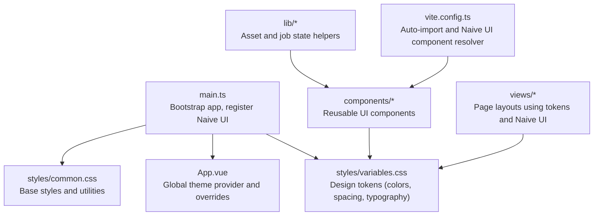
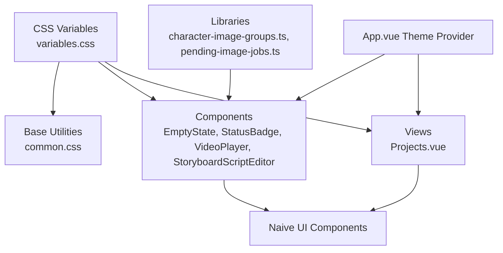
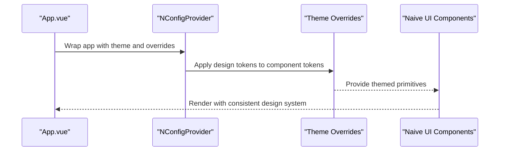
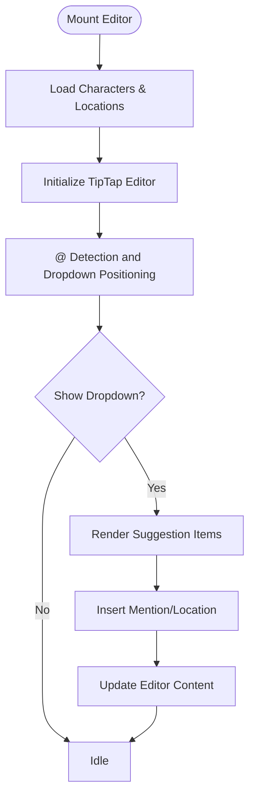
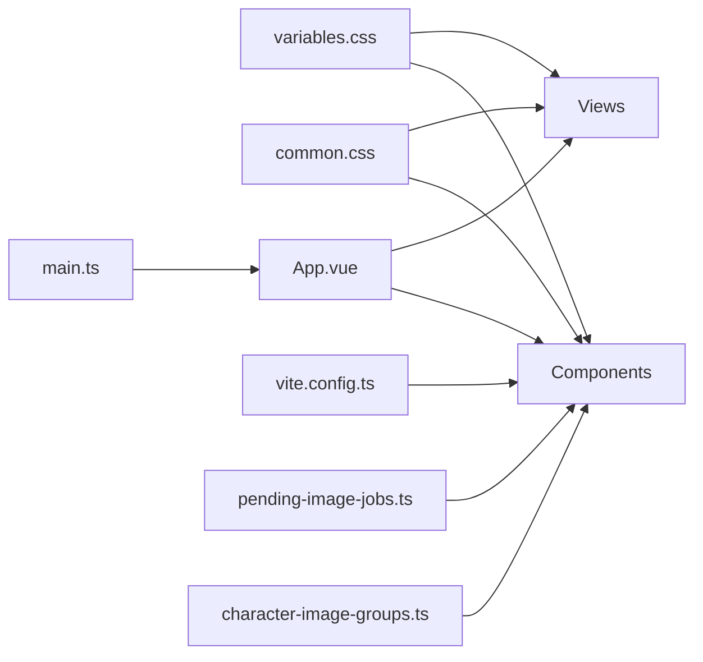

# UI Design System

<cite>
**Referenced Files in This Document**
- [variables.css](file://packages/frontend/src/styles/variables.css)
- [common.css](file://packages/frontend/src/styles/common.css)
- [main.ts](file://packages/frontend/src/main.ts)
- [App.vue](file://packages/frontend/src/App.vue)
- [EmptyState.vue](file://packages/frontend/src/components/EmptyState.vue)
- [StatusBadge.vue](file://packages/frontend/src/components/StatusBadge.vue)
- [VideoPlayer.vue](file://packages/frontend/src/components/VideoPlayer.vue)
- [StoryboardScriptEditor.vue](file://packages/frontend/src/components/storyboard/StoryboardScriptEditor.vue)
- [character-image-groups.ts](file://packages/frontend/src/lib/character-image-groups.ts)
- [pending-image-jobs.ts](file://packages/frontend/src/lib/pending-image-jobs.ts)
- [Projects.vue](file://packages/frontend/src/views/Projects.vue)
- [package.json](file://packages/frontend/package.json)
- [vite.config.ts](file://packages/frontend/vite.config.ts)
</cite>

## Table of Contents

1. [Introduction](#introduction)
2. [Project Structure](#project-structure)
3. [Core Components](#core-components)
4. [Architecture Overview](#architecture-overview)
5. [Detailed Component Analysis](#detailed-component-analysis)
6. [Dependency Analysis](#dependency-analysis)
7. [Performance Considerations](#performance-considerations)
8. [Troubleshooting Guide](#troubleshooting-guide)
9. [Conclusion](#conclusion)
10. [Appendices](#appendices)

## Introduction

This document describes the frontend UI design system for the Dreamer project. It covers the styling architecture, CSS variables and design tokens, Naive UI integration and theming, responsive patterns, color palette, typography, spacing, component variants, image handling, character asset management, and visual consistency across the application. It also includes practical usage examples, customization guidance, and accessibility considerations.

## Project Structure

The design system is organized around:

- Global CSS variables and base styles
- Vue application bootstrap integrating Naive UI
- Reusable components implementing design tokens
- View pages leveraging both design tokens and Naive UI primitives
- Libraries for image generation job state and character asset grouping

**Diagram sources**

- [main.ts:1-18](file://packages/frontend/src/main.ts#L1-L18)
- [App.vue:152-182](file://packages/frontend/src/App.vue#L152-L182)
- [variables.css:1-114](file://packages/frontend/src/styles/variables.css#L1-L114)
- [common.css:1-331](file://packages/frontend/src/styles/common.css#L1-L331)
- [vite.config.ts:1-48](file://packages/frontend/vite.config.ts#L1-L48)

**Section sources**

- [main.ts:1-18](file://packages/frontend/src/main.ts#L1-L18)
- [variables.css:1-114](file://packages/frontend/src/styles/variables.css#L1-L114)
- [common.css:1-331](file://packages/frontend/src/styles/common.css#L1-L331)
- [vite.config.ts:1-48](file://packages/frontend/vite.config.ts#L1-L48)

## Core Components

- Design tokens via CSS custom properties for colors, spacing, borders, shadows, typography, transitions, layout, and z-index.
- Base styles and utilities for resets, scrollbars, selection, links, page containers, cards, status badges, empty states, grids, flex utilities, text utilities, and animations.
- Global theme provider with Naive UI theme overrides and dark mode support.
- Reusable components that consume design tokens (EmptyState, StatusBadge, VideoPlayer, StoryboardScriptEditor).
- View pages that combine design tokens and Naive UI components for consistent layouts.

**Section sources**

- [variables.css:1-114](file://packages/frontend/src/styles/variables.css#L1-L114)
- [common.css:1-331](file://packages/frontend/src/styles/common.css#L1-L331)
- [App.vue:71-149](file://packages/frontend/src/App.vue#L71-L149)
- [EmptyState.vue:1-56](file://packages/frontend/src/components/EmptyState.vue#L1-L56)
- [StatusBadge.vue:1-64](file://packages/frontend/src/components/StatusBadge.vue#L1-L64)
- [VideoPlayer.vue:1-371](file://packages/frontend/src/components/VideoPlayer.vue#L1-L371)
- [StoryboardScriptEditor.vue:1-653](file://packages/frontend/src/components/storyboard/StoryboardScriptEditor.vue#L1-L653)
- [Projects.vue:179-307](file://packages/frontend/src/views/Projects.vue#L179-L307)

## Architecture Overview

The design system architecture integrates:

- Global CSS variables as the single source of truth for design tokens.
- Base CSS utilities that apply tokens consistently across components.
- Naive UI as the component library, with theme overrides aligned to the design tokens.
- Scoped component styles that reference tokens for colors, spacing, radius, and shadows.
- View pages that compose tokens and Naive UI primitives to maintain visual consistency.

**Diagram sources**

- [variables.css:1-114](file://packages/frontend/src/styles/variables.css#L1-L114)
- [common.css:1-331](file://packages/frontend/src/styles/common.css#L1-L331)
- [App.vue:152-182](file://packages/frontend/src/App.vue#L152-L182)
- [EmptyState.vue:22-56](file://packages/frontend/src/components/EmptyState.vue#L22-L56)
- [StatusBadge.vue:36-64](file://packages/frontend/src/components/StatusBadge.vue#L36-L64)
- [VideoPlayer.vue:229-371](file://packages/frontend/src/components/VideoPlayer.vue#L229-L371)
- [StoryboardScriptEditor.vue:461-653](file://packages/frontend/src/components/storyboard/StoryboardScriptEditor.vue#L461-L653)
- [Projects.vue:309-435](file://packages/frontend/src/views/Projects.vue#L309-L435)
- [character-image-groups.ts:1-51](file://packages/frontend/src/lib/character-image-groups.ts#L1-L51)
- [pending-image-jobs.ts:1-118](file://packages/frontend/src/lib/pending-image-jobs.ts#L1-L118)

## Detailed Component Analysis

### Design Token System

- Color palette: primary, secondary, success, warning, error, info, neutral backgrounds and text, borders.
- Spacing scale: xs, sm, md, lg, xl, 2xl.
- Border radius scale: sm, md, lg, xl, full.
- Shadow scale: sm, md, lg, xl.
- Typography scale: family, sizes (xs to 3xl), weights (normal, medium, semibold, bold), line heights (tight, normal, relaxed).
- Transitions: fast, normal, slow.
- Layout: page max widths and paddings.
- Z-index stack: dropdown, sticky, fixed, modal-backdrop, modal, popover, tooltip.

These tokens are consumed by base utilities, components, and views to ensure consistency.

**Section sources**

- [variables.css:3-99](file://packages/frontend/src/styles/variables.css#L3-L99)

### Base Styles and Utilities

- Resets and base typography inherit from tokens.
- Scrollbar styling, selection, and link styles.
- Page container and shell utilities with max-width and padding.
- Card styles with hover elevation.
- Status badge variants with semantic colors.
- Empty state pattern with icon, title, description, and action slot.
- Grid and flex utilities, text utilities, and animation keyframes.

**Section sources**

- [common.css:3-331](file://packages/frontend/src/styles/common.css#L3-L331)

### Global Theme Provider and Naive UI Integration

- App.vue wraps the application with NConfigProvider and applies darkTheme conditionally.
- Theme overrides align Naive UI colors, radii, spacing, fonts, and component-specific styles to design tokens.
- Providers for messages, dialogs, notifications are included at the root.

**Diagram sources**

- [App.vue:71-149](file://packages/frontend/src/App.vue#L71-L149)
- [App.vue:152-182](file://packages/frontend/src/App.vue#L152-L182)

**Section sources**

- [App.vue:152-182](file://packages/frontend/src/App.vue#L152-L182)
- [App.vue:71-149](file://packages/frontend/src/App.vue#L71-L149)

### EmptyState Component

- Uses design tokens for padding, spacing, and typography.
- Provides slots for icon and action to customize content while preserving layout consistency.

**Section sources**

- [EmptyState.vue:1-56](file://packages/frontend/src/components/EmptyState.vue#L1-L56)
- [EmptyState.vue:22-56](file://packages/frontend/src/components/EmptyState.vue#L22-L56)

### StatusBadge Component

- Implements semantic status variants with token-driven colors and typography.
- Supports size variants and dot indicators.

**Section sources**

- [StatusBadge.vue:1-64](file://packages/frontend/src/components/StatusBadge.vue#L1-L64)
- [StatusBadge.vue:36-64](file://packages/frontend/src/components/StatusBadge.vue#L36-L64)

### VideoPlayer Component

- Integrates Naive UI modal for presentation.
- Uses tokens for progress bar, controls, and overlays.
- Implements keyboard and mouse interactions with consistent spacing and typography.

**Section sources**

- [VideoPlayer.vue:1-371](file://packages/frontend/src/components/VideoPlayer.vue#L1-L371)
- [VideoPlayer.vue:229-371](file://packages/frontend/src/components/VideoPlayer.vue#L229-L371)

### StoryboardScriptEditor Component

- Rich text editing with TipTap, styled with design tokens.
- Custom mention and location nodes with avatar and image rendering.
- Dropdown suggestion list positioned absolutely and styled with tokens.

**Diagram sources**

- [StoryboardScriptEditor.vue:119-284](file://packages/frontend/src/components/storyboard/StoryboardScriptEditor.vue#L119-L284)
- [StoryboardScriptEditor.vue:407-432](file://packages/frontend/src/components/storyboard/StoryboardScriptEditor.vue#L407-L432)

**Section sources**

- [StoryboardScriptEditor.vue:1-653](file://packages/frontend/src/components/storyboard/StoryboardScriptEditor.vue#L1-L653)

### Projects View

- Demonstrates consistent use of tokens for headers, cards, grids, and actions.
- Integrates Naive UI components (NCard, NButton, NInput, NDropdown) with design tokens.

**Section sources**

- [Projects.vue:179-307](file://packages/frontend/src/views/Projects.vue#L179-L307)
- [Projects.vue:309-435](file://packages/frontend/src/views/Projects.vue#L309-L435)

### Image Handling and Character Asset Management

- Pending image jobs state builder and inference logic for binding kinds.
- Character image grouping helpers for base and derived images, ensuring consistent asset presentation.

**Section sources**

- [pending-image-jobs.ts:1-118](file://packages/frontend/src/lib/pending-image-jobs.ts#L1-L118)
- [character-image-groups.ts:1-51](file://packages/frontend/src/lib/character-image-groups.ts#L1-L51)

## Dependency Analysis

- Bootstrap and integration:
  - main.ts registers Naive UI and imports design tokens.
  - vite.config.ts auto-imports and resolves Naive UI components.
- Component dependencies:
  - Components depend on design tokens for consistent visuals.
  - Views compose components and Naive UI primitives.
- Libraries:
  - pending-image-jobs.ts and character-image-groups.ts provide state and grouping logic used by components.

**Diagram sources**

- [main.ts:1-18](file://packages/frontend/src/main.ts#L1-L18)
- [vite.config.ts:1-48](file://packages/frontend/vite.config.ts#L1-L48)
- [variables.css:1-114](file://packages/frontend/src/styles/variables.css#L1-L114)
- [common.css:1-331](file://packages/frontend/src/styles/common.css#L1-L331)
- [App.vue:152-182](file://packages/frontend/src/App.vue#L152-L182)
- [pending-image-jobs.ts:1-118](file://packages/frontend/src/lib/pending-image-jobs.ts#L1-L118)
- [character-image-groups.ts:1-51](file://packages/frontend/src/lib/character-image-groups.ts#L1-L51)

**Section sources**

- [main.ts:1-18](file://packages/frontend/src/main.ts#L1-L18)
- [vite.config.ts:1-48](file://packages/frontend/vite.config.ts#L1-L48)
- [package.json:14-29](file://packages/frontend/package.json#L14-L29)

## Performance Considerations

- Prefer CSS custom properties for theme tokens to avoid re-rendering on theme switches.
- Use scoped styles in components to minimize global style conflicts.
- Keep heavy assets (videos, images) lazy-loaded and sized appropriately to reduce layout shifts.
- Consolidate animations and transitions to reduce repaints.

## Troubleshooting Guide

- Theme not applying:
  - Verify NConfigProvider wrapping and theme overrides in App.vue.
  - Confirm design tokens are imported in main.ts.
- Dark mode not toggling:
  - Ensure darkTheme is passed conditionally and CSS variables update in .dark scope.
- Component styles overridden unexpectedly:
  - Check specificity and avoid overriding tokens globally; prefer component-scoped styles.
- Image or video assets not displaying:
  - Validate URLs and CORS policies; ensure fallbacks are present.

**Section sources**

- [App.vue:152-182](file://packages/frontend/src/App.vue#L152-L182)
- [main.ts:7-9](file://packages/frontend/src/main.ts#L7-L9)
- [variables.css:101-114](file://packages/frontend/src/styles/variables.css#L101-L114)

## Conclusion

The design system centers on a robust set of CSS variables and base utilities, unified by Naive UI with explicit theme overrides. Components and views consistently consume these tokens to ensure visual coherence, while libraries manage image generation and character asset states. This approach enables scalable customization, predictable maintenance, and accessible UI patterns.

## Appendices

### Design Token Reference

- Colors: primary, secondary, success, warning, error, info, neutral backgrounds and text, borders.
- Spacing: xs, sm, md, lg, xl, 2xl.
- Radius: sm, md, lg, xl, full.
- Shadows: sm, md, lg, xl.
- Typography: family, sizes (xs to 3xl), weights (normal, medium, semibold, bold), line heights (tight, normal, relaxed).
- Transitions: fast, normal, slow.
- Layout: page max widths and paddings.
- Z-index: dropdown, sticky, fixed, modal-backdrop, modal, popover, tooltip.

**Section sources**

- [variables.css:3-99](file://packages/frontend/src/styles/variables.css#L3-L99)

### Example Usage Patterns

- Applying tokens in components:
  - Use CSS variables for padding, margin, color, font-size, border-radius, and shadow.
  - Reference tokens in scoped styles to keep overrides local.
- Theming Naive UI:
  - Configure theme overrides in App.vue to align component tokens with design tokens.
- Responsive patterns:
  - Combine CSS grid and flex utilities with tokens for consistent spacing and breakpoints.
- Accessibility:
  - Ensure sufficient color contrast against token-defined backgrounds and text.
  - Provide focus styles and keyboard navigation support in interactive components.

**Section sources**

- [common.css:72-94](file://packages/frontend/src/styles/common.css#L72-L94)
- [App.vue:71-149](file://packages/frontend/src/App.vue#L71-L149)
