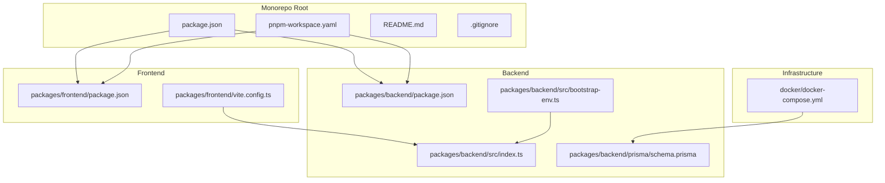
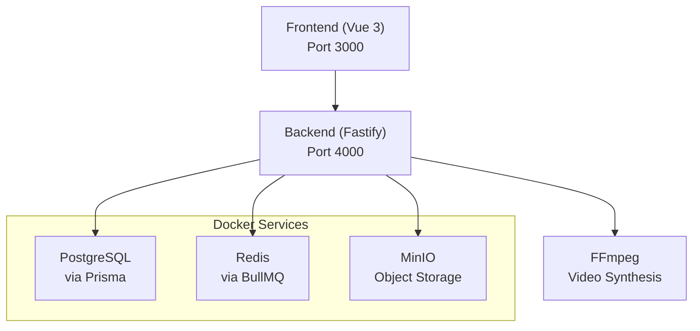
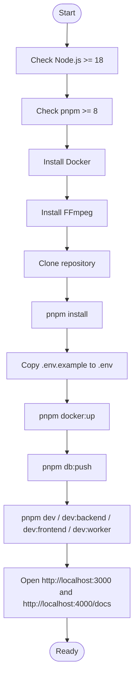
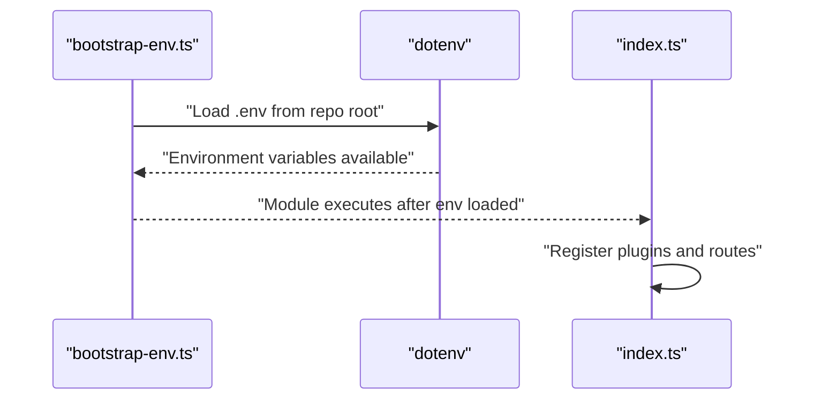
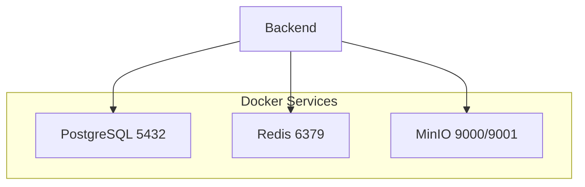
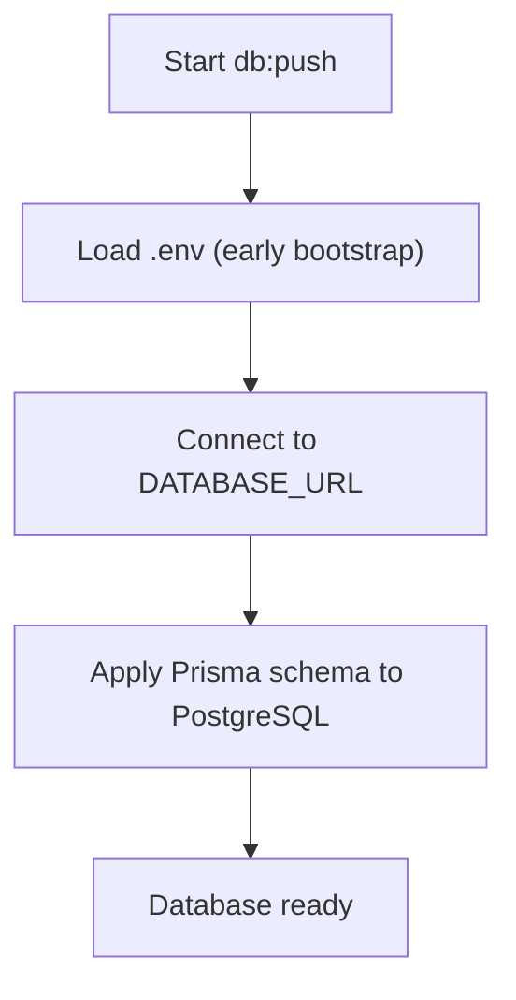
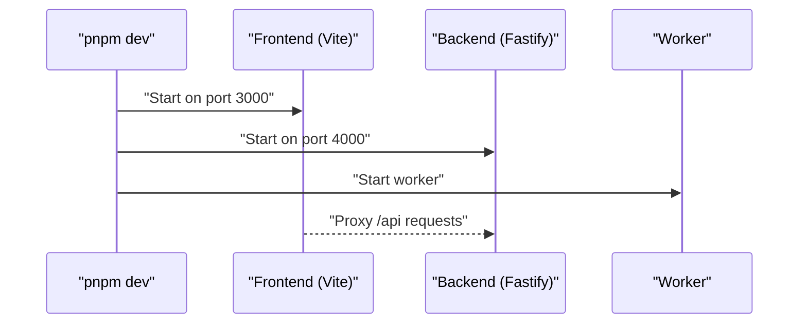
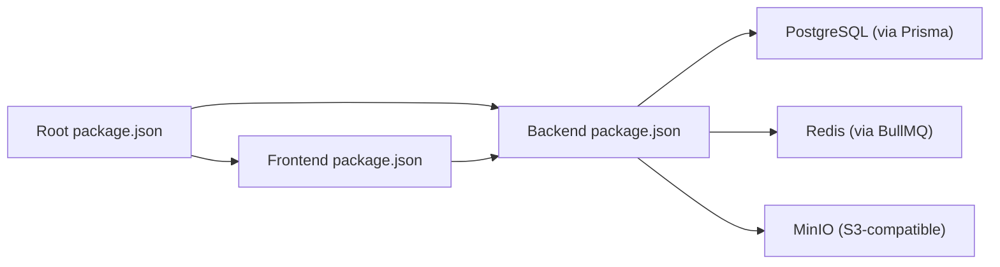

# Getting Started

<cite>
**Referenced Files in This Document**
- [README.md](file://README.md)
- [package.json](file://package.json)
- [pnpm-workspace.yaml](file://pnpm-workspace.yaml)
- [.gitignore](file://.gitignore)
- [docker/docker-compose.yml](file://docker/docker-compose.yml)
- [packages/backend/package.json](file://packages/backend/package.json)
- [packages/backend/src/index.ts](file://packages/backend/src/index.ts)
- [packages/backend/src/bootstrap-env.ts](file://packages/backend/src/bootstrap-env.ts)
- [packages/backend/prisma/schema.prisma](file://packages/backend/prisma/schema.prisma)
- [packages/frontend/package.json](file://packages/frontend/package.json)
- [packages/frontend/vite.config.ts](file://packages/frontend/vite.config.ts)
</cite>

## Table of Contents

1. [Introduction](#introduction)
2. [Project Structure](#project-structure)
3. [Core Components](#core-components)
4. [Architecture Overview](#architecture-overview)
5. [Detailed Component Analysis](#detailed-component-analysis)
6. [Dependency Analysis](#dependency-analysis)
7. [Performance Considerations](#performance-considerations)
8. [Troubleshooting Guide](#troubleshooting-guide)
9. [Conclusion](#conclusion)
10. [Appendices](#appendices)

## Introduction

This guide helps you set up the Dreamer platform locally for development. Dreamer is an AI-powered short-video production platform built with a modern stack: Vue 3 + TypeScript (frontend), Node.js + Fastify (backend), Prisma + PostgreSQL, BullMQ + Redis, MinIO, and FFmpeg. It supports end-to-end workflows from idea to finished video, integrating AI services for writing, low-cost iteration, and fine-grained optimization.

Key prerequisites:

- Node.js >= 18.0.0
- pnpm >= 8.0.0
- Docker (to run PostgreSQL, Redis, and MinIO)
- FFmpeg (for video synthesis)

After installing prerequisites, you will clone the repository, install dependencies, configure environment variables, start infrastructure via Docker Compose, initialize the database, and launch the development servers for frontend, backend, and worker.

## Project Structure

The repository is a monorepo managed by pnpm workspaces:

- packages/frontend: Vue 3 + TypeScript frontend app
- packages/backend: Fastify + Prisma backend with API routes, services, queues, and plugins
- docker: Docker Compose configuration for PostgreSQL, Redis, and MinIO
- Root scripts and configuration tie everything together

**Diagram sources**

- [package.json:1-43](file://package.json#L1-L43)
- [pnpm-workspace.yaml:1-3](file://pnpm-workspace.yaml#L1-L3)
- [packages/frontend/package.json:1-41](file://packages/frontend/package.json#L1-L41)
- [packages/frontend/vite.config.ts:1-48](file://packages/frontend/vite.config.ts#L1-L48)
- [packages/backend/package.json:1-51](file://packages/backend/package.json#L1-L51)
- [packages/backend/src/index.ts:1-131](file://packages/backend/src/index.ts#L1-L131)
- [packages/backend/src/bootstrap-env.ts:1-11](file://packages/backend/src/bootstrap-env.ts#L1-L11)
- [packages/backend/prisma/schema.prisma:1-430](file://packages/backend/prisma/schema.prisma#L1-L430)
- [docker/docker-compose.yml:1-71](file://docker/docker-compose.yml#L1-L71)

**Section sources**

- [README.md:26-42](file://README.md#L26-L42)
- [package.json:6-8](file://package.json#L6-L8)
- [pnpm-workspace.yaml:1-3](file://pnpm-workspace.yaml#L1-L3)

## Core Components

- Frontend (Vue 3 + Vite): Runs on port 3000, proxies API requests to the backend.
- Backend (Fastify + Prisma): Exposes REST APIs, Swagger UI, and SSE; runs on port 4000.
- Infrastructure (Docker Compose): PostgreSQL, Redis, and MinIO with preconfigured buckets.
- Environment configuration: Centralized via .env loaded before application modules.

What you will do:

- Install prerequisites
- Clone repository and install dependencies
- Configure environment variables
- Start infrastructure
- Initialize database
- Launch development servers

**Section sources**

- [README.md:46-95](file://README.md#L46-L95)
- [packages/frontend/vite.config.ts:25-42](file://packages/frontend/vite.config.ts#L25-L42)
- [packages/backend/src/index.ts:35-122](file://packages/backend/src/index.ts#L35-L122)
- [docker/docker-compose.yml:1-71](file://docker/docker-compose.yml#L1-L71)

## Architecture Overview

The development environment consists of:

- Frontend (port 3000) communicating with backend (port 4000)
- Backend connecting to PostgreSQL (via Prisma), Redis (queues), and MinIO (object storage)
- FFmpeg used by the backend for video synthesis tasks

**Diagram sources**

- [packages/frontend/vite.config.ts:25-42](file://packages/frontend/vite.config.ts#L25-L42)
- [packages/backend/src/index.ts:35-122](file://packages/backend/src/index.ts#L35-L122)
- [packages/backend/prisma/schema.prisma:5-8](file://packages/backend/prisma/schema.prisma#L5-L8)
- [docker/docker-compose.yml:3-71](file://docker/docker-compose.yml#L3-L71)

## Detailed Component Analysis

### Prerequisites and Installation

- Node.js: Ensure version meets the requirement.
- pnpm: Ensure version meets the requirement.
- Docker: Required for infrastructure services.
- FFmpeg: Required for video synthesis.

Installation steps:

1. Clone the repository and enter the project directory.
2. Install dependencies using pnpm.
3. Copy the example environment file to .env and fill in required keys.
4. Start infrastructure with Docker Compose.
5. Initialize the database using Prisma.
6. Start development servers for frontend, backend, and worker.

**Section sources**

- [README.md:46-95](file://README.md#L46-L95)
- [package.json:38-42](file://package.json#L38-L42)
- [package.json:9-23](file://package.json#L9-L23)

### Environment Variables and Configuration

- Copy the example environment file to .env and add the following keys:
  - DATABASE_URL: PostgreSQL connection string
  - REDIS_URL: Redis connection string
  - S3\_\*: MinIO access key, secret, endpoint, bucket, region
  - JWT_SECRET: Secret for signing JWT tokens
  - DEEPSEEK_API_KEY: API key for DeepSeek
  - ATLAS_API_KEY: API key for Wan 2.6
  - VOLC\_\*: API key and related identifiers for Seedance 2.0

The backend loads .env early to ensure AI service configurations are available before other modules are imported.

**Diagram sources**

- [packages/backend/src/bootstrap-env.ts:1-11](file://packages/backend/src/bootstrap-env.ts#L1-L11)
- [packages/backend/src/index.ts:1-131](file://packages/backend/src/index.ts#L1-L131)

**Section sources**

- [README.md:104-115](file://README.md#L104-L115)
- [packages/backend/src/bootstrap-env.ts:1-11](file://packages/backend/src/bootstrap-env.ts#L1-L11)

### Infrastructure Setup with Docker Compose

The Compose file defines:

- PostgreSQL: database for application data
- Redis: queue and caching
- MinIO: S3-compatible object storage with console
- Automated bucket creation for videos and assets

Ports exposed:

- PostgreSQL: 5432
- Redis: 6379
- MinIO API: 9000
- MinIO Console: 9001

**Diagram sources**

- [docker/docker-compose.yml:1-71](file://docker/docker-compose.yml#L1-L71)

**Section sources**

- [docker/docker-compose.yml:1-71](file://docker/docker-compose.yml#L1-L71)

### Database Initialization

- Use Prisma to push the schema to the database.
- The backend package exposes scripts for generating Prisma client, pushing schema, and running migrations.

**Diagram sources**

- [packages/backend/package.json:15-16](file://packages/backend/package.json#L15-L16)
- [packages/backend/src/bootstrap-env.ts:1-11](file://packages/backend/src/bootstrap-env.ts#L1-11)
- [packages/backend/prisma/schema.prisma:1-8](file://packages/backend/prisma/schema.prisma#L1-L8)

**Section sources**

- [README.md:74-78](file://README.md#L74-L78)
- [packages/backend/package.json:15-16](file://packages/backend/package.json#L15-L16)
- [packages/backend/prisma/schema.prisma:1-8](file://packages/backend/prisma/schema.prisma#L1-L8)

### Development Servers

- Full-stack: pnpm dev (starts frontend, backend, and worker in parallel)
- Backend only: pnpm dev:backend (Fastify on port 4000)
- Frontend only: pnpm dev:frontend (Vite on port 3000)
- Worker only: pnpm dev:worker (video generation worker)

Access:

- Frontend: http://localhost:3000
- Backend API: http://localhost:4000
- API Docs: http://localhost:4000/docs
- MinIO Console: http://localhost:9001

**Diagram sources**

- [package.json:9-13](file://package.json#L9-L13)
- [packages/frontend/vite.config.ts:25-42](file://packages/frontend/vite.config.ts#L25-L42)
- [packages/backend/src/index.ts:115-118](file://packages/backend/src/index.ts#L115-L118)

**Section sources**

- [README.md:80-95](file://README.md#L80-L95)
- [package.json:9-13](file://package.json#L9-L13)
- [packages/frontend/vite.config.ts:25-42](file://packages/frontend/vite.config.ts#L25-L42)
- [packages/backend/src/index.ts:115-118](file://packages/backend/src/index.ts#L115-L118)

## Dependency Analysis

- Root package.json orchestrates workspace scripts and enforces Node.js version.
- Frontend depends on Vue 3, Pinia, and Naive UI; configured to proxy API to backend.
- Backend depends on Fastify, Prisma, BullMQ, OpenAI SDK, and AWS S3 client; loads environment early.
- Docker Compose provides PostgreSQL, Redis, and MinIO.

**Diagram sources**

- [package.json:1-43](file://package.json#L1-L43)
- [packages/frontend/package.json:1-41](file://packages/frontend/package.json#L1-L41)
- [packages/backend/package.json:1-51](file://packages/backend/package.json#L1-L51)
- [packages/backend/prisma/schema.prisma:5-8](file://packages/backend/prisma/schema.prisma#L5-L8)

**Section sources**

- [package.json:6-8](file://package.json#L6-L8)
- [packages/frontend/package.json:14-29](file://packages/frontend/package.json#L14-L29)
- [packages/backend/package.json:22-38](file://packages/backend/package.json#L22-L38)
- [packages/backend/prisma/schema.prisma:5-8](file://packages/backend/prisma/schema.prisma#L5-L8)

## Performance Considerations

- Use pnpm workspaces to avoid duplicate installs and speed up builds.
- Keep Docker services minimal during local development; start only what you need.
- Increase Node.js heap size for tests if necessary (already configured in backend test script).
- Ensure FFmpeg is installed globally for video synthesis tasks.

[No sources needed since this section provides general guidance]

## Troubleshooting Guide

Common setup issues and resolutions:

- Node.js or pnpm version too low
  - Verify versions meet minimum requirements.
- Missing .env or incorrect keys
  - Copy .env.example to .env and add required API keys for DeepSeek, Wan 2.6, and Seedance 2.0.
  - Confirm DATABASE*URL, REDIS_URL, S3*\* match your running infrastructure.
- Docker services not starting
  - Ensure Docker is running and ports 5432, 6379, 9000, 9001 are free.
  - Re-run pnpm docker:up to recreate containers.
- Database initialization fails
  - Confirm PostgreSQL is healthy and reachable.
  - Run pnpm db:push again after fixing connection string.
- Frontend cannot reach backend
  - Check Vite proxy configuration targets port 4000.
  - Ensure backend is running and listening on 0.0.0.0:4000.
- MinIO buckets missing
  - The Compose setup creates dreamer-videos and dreamer-assets automatically; verify console at port 9001.

Security note:

- Never commit .env or other sensitive files. They are ignored by .gitignore except .env.example.

**Section sources**

- [README.md:46-95](file://README.md#L46-L95)
- [docker/docker-compose.yml:52-65](file://docker/docker-compose.yml#L52-L65)
- [.gitignore:9-14](file://.gitignore#L9-L14)
- [packages/frontend/vite.config.ts:36-41](file://packages/frontend/vite.config.ts#L36-L41)
- [packages/backend/src/index.ts:115-118](file://packages/backend/src/index.ts#L115-L118)

## Conclusion

You now have the prerequisites, environment configuration, infrastructure, and development servers needed to run Dreamer locally. Start with copying and filling .env, bringing up Docker services, initializing the database, and launching the development servers. Refer to the troubleshooting section if you encounter issues.

[No sources needed since this section summarizes without analyzing specific files]

## Appendices

### Quick Commands Reference

- Install dependencies: pnpm install
- Start infrastructure: pnpm docker:up
- Initialize database: pnpm db:push
- Start development:
  - Full stack: pnpm dev
  - Backend only: pnpm dev:backend
  - Frontend only: pnpm dev:frontend
  - Worker only: pnpm dev:worker

**Section sources**

- [README.md:53-87](file://README.md#L53-L87)
- [package.json:9-13](file://package.json#L9-L13)
