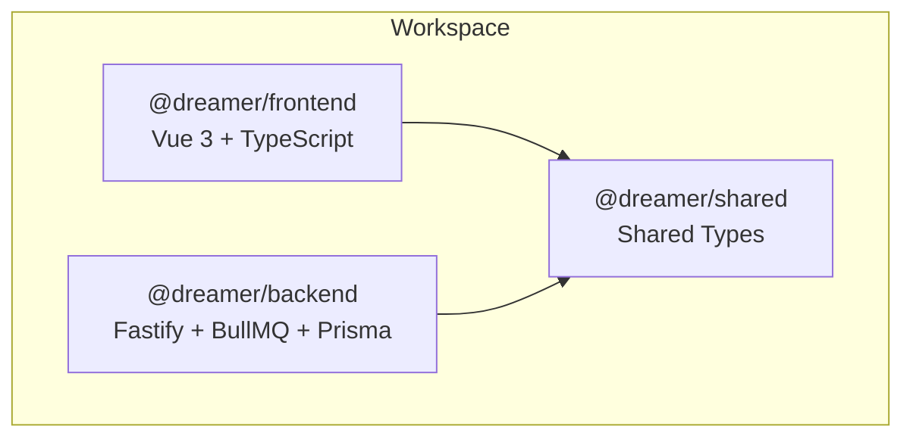
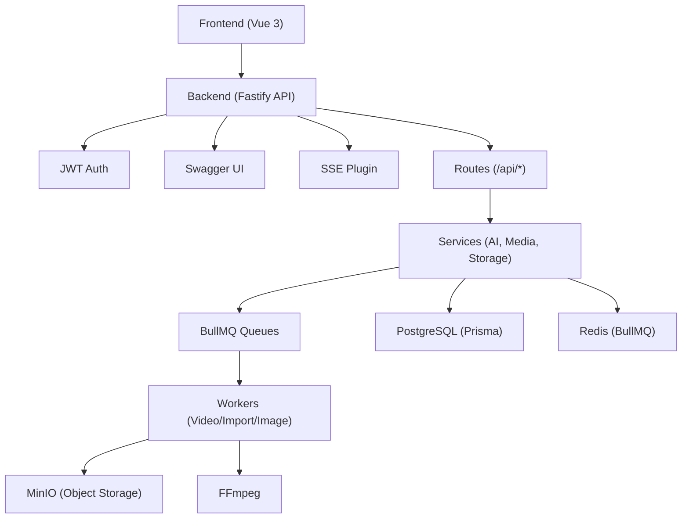
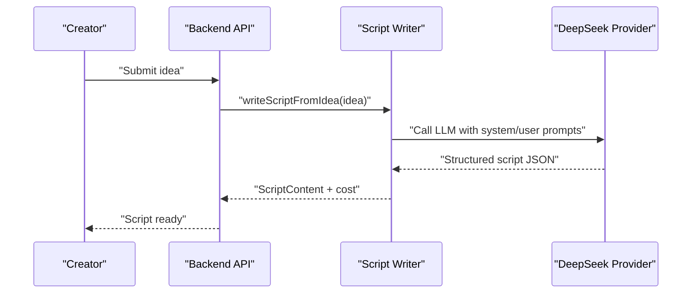
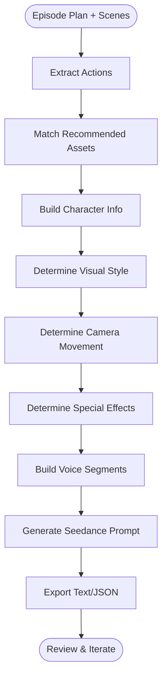
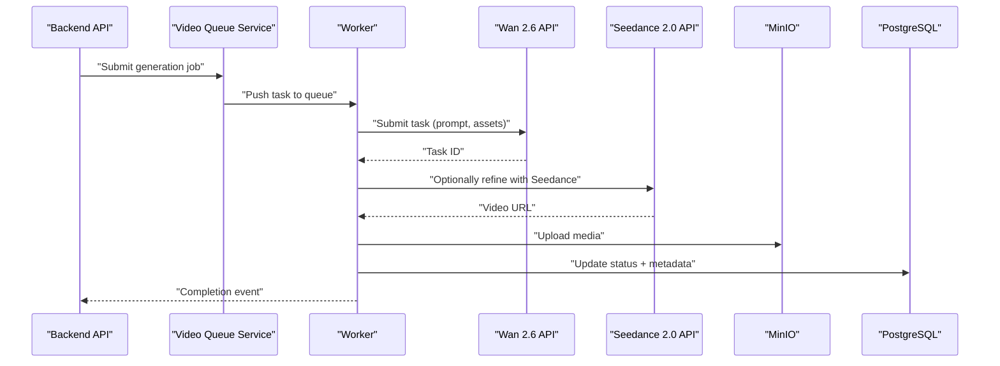
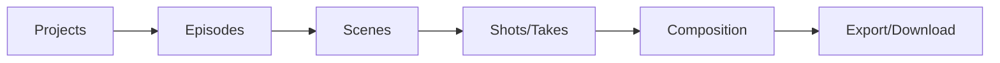
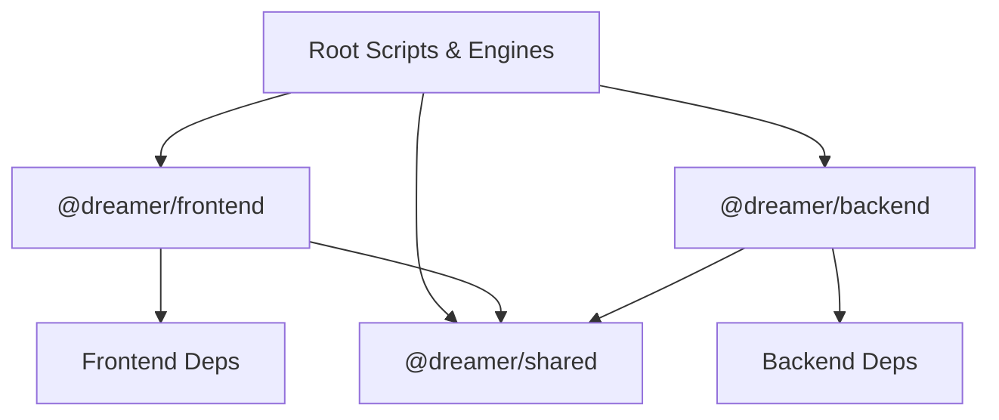

# Project Overview

<cite>
**Referenced Files in This Document**
- [README.md](file://README.md)
- [package.json](file://package.json)
- [packages/backend/package.json](file://packages/backend/package.json)
- [packages/frontend/package.json](file://packages/frontend/package.json)
- [packages/shared/package.json](file://packages/shared/package.json)
- [packages/backend/src/index.ts](file://packages/backend/src/index.ts)
- [packages/backend/src/worker.ts](file://packages/backend/src/worker.ts)
- [packages/backend/src/services/script-writer.ts](file://packages/backend/src/services/script-writer.ts)
- [packages/backend/src/services/storyboard-generator.ts](file://packages/backend/src/services/storyboard-generator.ts)
- [packages/backend/src/services/ai/deepseek.ts](file://packages/backend/src/services/ai/deepseek.ts)
- [packages/backend/src/services/ai/wan26.ts](file://packages/backend/src/services/ai/wan26.ts)
- [packages/backend/src/services/ai/seedance.ts](file://packages/backend/src/services/ai/seedance.ts)
</cite>

## Table of Contents

1. [Introduction](#introduction)
2. [Project Structure](#project-structure)
3. [Core Components](#core-components)
4. [Architecture Overview](#architecture-overview)
5. [Detailed Component Analysis](#detailed-component-analysis)
6. [Dependency Analysis](#dependency-analysis)
7. [Performance Considerations](#performance-considerations)
8. [Troubleshooting Guide](#troubleshooting-guide)
9. [Conclusion](#conclusion)

## Introduction

Dreamer is an end-to-end AI-powered short video production platform designed to transform a simple concept into a professional short-form video. It emphasizes full controllability and intervention, enabling creators to guide every stage of production while leveraging AI for intelligent scripting, visual storytelling, and multi-stage video generation. The platform targets content creators, marketers, and teams who want to streamline the journey from “one-line idea” to finished product, reducing friction in traditional workflows.

Core value proposition:

- AI-first authoring: AI script generation and enrichment powered by DeepSeek.
- Multi-stage production: From structured scenes to optimized prompts, then to AI video generation via Wan 2.6 and Seedance 2.0.
- Collaborative workflows: Shared project spaces, role-aware editing, and real-time collaboration through API-driven orchestration.
- Infrastructure-ready: Built-in task queues, object storage, and media processing for scalable production.

Target audience:

- Independent creators and small teams needing efficient short-form content production.
- Marketing and brand teams requiring repeatable, high-quality video assets.
- Educators and trainers producing instructional or promotional shorts.

Key capabilities:

- AI script generation and iteration from a one-line idea.
- Scene-to-shot conversion with enriched visual and audio cues.
- Multi-model AI video generation with quality refinement.
- Project lifecycle management, including roles, assets, and exports.

## Project Structure

Dreamer follows a monorepo workspace managed by pnpm, with three primary packages:

- Frontend: Vue 3 + TypeScript application for authoring and collaboration.
- Backend: Fastify-based Node.js API server with routing, services, queues, and plugins.
- Shared: Cross-package TypeScript types and shared utilities.

**Diagram sources**

- [package.json:6-8](file://package.json#L6-L8)
- [packages/frontend/package.json:14-28](file://packages/frontend/package.json#L14-L28)
- [packages/backend/package.json:22-38](file://packages/backend/package.json#L22-L38)
- [packages/shared/package.json:8-16](file://packages/shared/package.json#L8-L16)

**Section sources**

- [README.md:26-42](file://README.md#L26-L42)
- [package.json:6-8](file://package.json#L6-L8)

## Core Components

- API Server (Fastify): Provides REST endpoints, Swagger UI, JWT auth, multipart uploads, and SSE for streaming updates.
- Workers: Dedicated BullMQ workers for video generation, import tasks, and image generation.
- AI Services: Integrations with DeepSeek for script generation, Wan 2.6 for low-cost experimentation, and Seedance 2.0 for refined output.
- Media Pipeline: Orchestration of prompts, assets, and AI models to produce polished clips.
- Collaboration Layer: Projects, episodes, scenes, and takes with role-aware permissions and real-time updates.

**Section sources**

- [packages/backend/src/index.ts:35-122](file://packages/backend/src/index.ts#L35-L122)
- [packages/backend/src/worker.ts:1-30](file://packages/backend/src/worker.ts#L1-L30)
- [README.md:5-25](file://README.md#L5-L25)

## Architecture Overview

The platform uses a modular, API-driven architecture:

- Frontend (Vue 3) consumes the backend REST API and displays production workflows.
- Backend (Fastify) exposes routes for projects, episodes, scenes, and AI orchestration.
- Workers handle long-running tasks (video generation, imports, images) asynchronously.
- AI services integrate external providers (DeepSeek, Wan 2.6, Seedance 2.0).
- Infrastructure: PostgreSQL (Prisma), Redis (BullMQ), MinIO (object storage), FFmpeg (media processing).

**Diagram sources**

- [packages/backend/src/index.ts:35-122](file://packages/backend/src/index.ts#L35-L122)
- [packages/backend/src/worker.ts:1-30](file://packages/backend/src/worker.ts#L1-L30)
- [README.md:13-25](file://README.md#L13-L25)

## Detailed Component Analysis

### AI Script Generation

The script writer converts a one-line idea into a structured screenplay using DeepSeek. It supports:

- Generating a full script from an idea.
- Expanding existing scripts with additional scenes.
- Improving scripts based on feedback.
- Optimizing scene descriptions for AI video generation.

**Diagram sources**

- [packages/backend/src/services/script-writer.ts:31-61](file://packages/backend/src/services/script-writer.ts#L31-L61)
- [packages/backend/src/services/script-writer.ts:254-259](file://packages/backend/src/services/script-writer.ts#L254-L259)
- [packages/backend/src/services/ai/deepseek.ts:1-30](file://packages/backend/src/services/ai/deepseek.ts#L1-L30)

**Section sources**

- [packages/backend/src/services/script-writer.ts:31-103](file://packages/backend/src/services/script-writer.ts#L31-L103)
- [packages/backend/src/services/script-writer.ts:280-381](file://packages/backend/src/services/script-writer.ts#L280-L381)

### Storyboard and Prompt Enrichment

The storyboard generator transforms scenes into actionable segments with:

- Visual style and camera movement suggestions.
- Audio segment generation for dialogue.
- Seedance-friendly prompts enriched with references and context.
- Export formats for human review and machine consumption.

**Diagram sources**

- [packages/backend/src/services/storyboard-generator.ts:29-125](file://packages/backend/src/services/storyboard-generator.ts#L29-L125)
- [packages/backend/src/services/storyboard-generator.ts:394-452](file://packages/backend/src/services/storyboard-generator.ts#L394-L452)

**Section sources**

- [packages/backend/src/services/storyboard-generator.ts:29-62](file://packages/backend/src/services/storyboard-generator.ts#L29-L62)
- [packages/backend/src/services/storyboard-generator.ts:477-486](file://packages/backend/src/services/storyboard-generator.ts#L477-L486)

### AI Video Generation (Wan 2.6 and Seedance 2.0)

Two complementary AI models power the video generation stages:

- Wan 2.6 (Atlas Cloud): Lower-cost experimentation with rapid iteration.
- Seedance 2.0 (ByteDance/Volcengine): Higher-fidelity refinement with audio synthesis.

**Diagram sources**

- [packages/backend/src/services/ai/wan26.ts:26-85](file://packages/backend/src/services/ai/wan26.ts#L26-L85)
- [packages/backend/src/services/ai/seedance.ts:124-217](file://packages/backend/src/services/ai/seedance.ts#L124-L217)
- [packages/backend/src/worker.ts:5-12](file://packages/backend/src/worker.ts#L5-L12)

**Section sources**

- [packages/backend/src/services/ai/wan26.ts:1-92](file://packages/backend/src/services/ai/wan26.ts#L1-L92)
- [packages/backend/src/services/ai/seedance.ts:1-229](file://packages/backend/src/services/ai/seedance.ts#L1-L229)

### Collaboration and Project Lifecycle

The backend exposes routes for projects, episodes, scenes, and takes, enabling collaborative workflows:

- Create and manage projects with ownership and permissions.
- Define episodes and scenes, track progress, and export compositions.
- Integrate with AI services and media storage for end-to-end production.

**Diagram sources**

- [packages/backend/src/index.ts:13-31](file://packages/backend/src/index.ts#L13-L31)

**Section sources**

- [packages/backend/src/index.ts:84-110](file://packages/backend/src/index.ts#L84-L110)

## Dependency Analysis

- Workspace management: pnpm workspaces define three packages with shared scripts and engines.
- Backend dependencies: Fastify, Prisma, BullMQ, Redis, MinIO SDK, OpenAI client, Zod, bcrypt, and Swagger.
- Frontend dependencies: Vue 3, Naive UI, Pinia, Vue Router, Tiptap, Axios, and shared types.
- Shared package: Centralized type exports consumed by both frontend and backend.

**Diagram sources**

- [package.json:6-22](file://package.json#L6-L22)
- [packages/frontend/package.json:14-28](file://packages/frontend/package.json#L14-L28)
- [packages/backend/package.json:22-38](file://packages/backend/package.json#L22-L38)
- [packages/shared/package.json:8-16](file://packages/shared/package.json#L8-L16)

**Section sources**

- [package.json:6-22](file://package.json#L6-L22)
- [packages/frontend/package.json:14-28](file://packages/frontend/package.json#L14-L28)
- [packages/backend/package.json:22-38](file://packages/backend/package.json#L22-L38)
- [packages/shared/package.json:8-16](file://packages/shared/package.json#L8-L16)

## Performance Considerations

- Asynchronous task processing: Offload heavy AI generation to workers to keep the API responsive.
- Queue concurrency tuning: Adjust worker concurrency per model throughput and resource availability.
- Caching and retries: Implement retry strategies for AI provider calls and cache frequently accessed assets.
- Streaming updates: Use SSE to inform clients of long-running task progress without polling.
- Media optimization: Pre-encode and normalize assets to reduce downstream processing overhead.

## Troubleshooting Guide

Common issues and remedies:

- Authentication failures: Verify JWT secret and token validity; ensure CORS origins are configured for development and production.
- AI provider errors: Confirm API keys and endpoints; implement exponential backoff and circuit breaker patterns.
- Queue timeouts: Increase max wait thresholds and monitor Redis connectivity; scale workers as needed.
- Storage upload failures: Validate MinIO credentials and bucket policies; ensure FFmpeg binaries are available for post-processing.
- Database drift: Use Prisma migrations and push commands during development; keep schema aligned across environments.

**Section sources**

- [packages/backend/src/index.ts:42-57](file://packages/backend/src/index.ts#L42-L57)
- [packages/backend/src/services/ai/wan26.ts:49-85](file://packages/backend/src/services/ai/wan26.ts#L49-L85)
- [packages/backend/src/services/ai/seedance.ts:147-217](file://packages/backend/src/services/ai/seedance.ts#L147-L217)

## Conclusion

Dreamer delivers a cohesive, API-driven platform that automates the most time-consuming steps in short video production while preserving creative control. Its monorepo structure, robust backend architecture, and integrated AI services enable teams to move from concept to finished product efficiently. By combining AI script generation, enriched storyboard prompts, and multi-stage video synthesis, Dreamer reduces the barriers to high-quality short-form content at scale.
