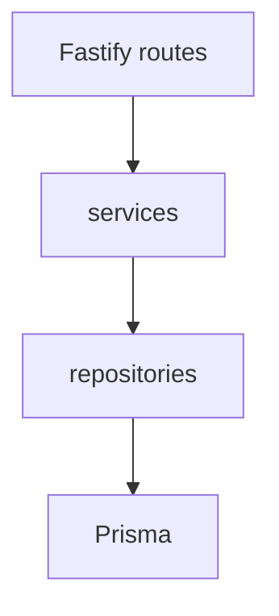

# 后端 Repository + Service 重构清单（一次性照单执行）

## 已完成（无需再排）

- [locations](packages/backend/src/routes/locations.ts) + `LocationRepository` / `LocationService`
- [character-images](packages/backend/src/routes/character-images.ts) + `CharacterImageRepository` / `CharacterImageService`
- [characters](packages/backend/src/routes/characters.ts) + `CharacterRepository` / `CharacterService`
- [scenes](packages/backend/src/routes/scenes.ts) + `SceneRepository` / `SceneService`
- [takes](packages/backend/src/routes/takes.ts) + `TakeRepository` / `TakeService`

## 待办（建议顺序）

按下列顺序推进；每一项模式一致：**Repository（Prisma）→ Service（编排 / 队列 / 外部 API）→ 路由变薄 → 跑 `packages/backend` 相关测试 + 全量 `vitest run`**。

### Phase A — 大块业务（优先）

| #   | 模块          | 路由文件（约行数）                                            | 要点                                                                                                                                                                                                                             |
| --- | ------------- | ------------------------------------------------------------- | -------------------------------------------------------------------------------------------------------------------------------------------------------------------------------------------------------------------------------- |
| A1  | 项目          | [projects.ts](packages/backend/src/routes/projects.ts) (~398) | 与 [project-script-jobs.ts](packages/backend/src/services/project-script-jobs.ts) 协作；管线入口多，拆时保持现有 job 调用与权限校验                                                                                              |
| A2  | 分集          | [episodes.ts](packages/backend/src/routes/episodes.ts) (~367) | Episode CRUD、与 Scene/Episode 关系；注意与已存在的 `SceneService` 边界（避免重复造轮子）                                                                                                                                        |
| A3  | 统计          | [stats.ts](packages/backend/src/routes/stats.ts) (~363)       | 多为聚合查询；适合 `StatsRepository` + `StatsService`，纯读可测性高                                                                                                                                                              |
| A4  | Pipeline HTTP | [pipeline.ts](packages/backend/src/routes/pipeline.ts) (~275) | 路由薄化；核心逻辑多数已在 [pipeline-orchestrator.ts](packages/backend/src/services/pipeline-orchestrator.ts) / [pipeline-executor.ts](packages/backend/src/services/pipeline-executor.ts)，Repository 只收「仍需内联的 prisma」 |

### Phase B — 任务与合成

| #   | 模块                | 路由文件                                                              | 要点                                                                                                   |
| --- | ------------------- | --------------------------------------------------------------------- | ------------------------------------------------------------------------------------------------------ |
| B1  | 任务（Take 列表等） | [tasks.ts](packages/backend/src/routes/tasks.ts) (~149)               | 与 [videoQueue](packages/backend/src/queues/video.ts) 的衔接；可与 `TakeRepository` 复用或合并扩展     |
| B2  | 合成导出            | [compositions.ts](packages/backend/src/routes/compositions.ts) (~190) | 与 [composition-export.ts](packages/backend/src/services/composition-export.ts) 分工：路由只调 Service |

### Phase C — 导入与设置

| #   | 模块 | 路由文件                                                      | 要点                                                                                                                                         |
| --- | ---- | ------------------------------------------------------------- | -------------------------------------------------------------------------------------------------------------------------------------------- |
| C1  | 导入 | [import.ts](packages/backend/src/routes/import.ts) (~203)     | 与 [importer](packages/backend/src/services/importer.ts)、队列 [import.ts](packages/backend/src/queues/import.ts)；Repository 收 prisma 片段 |
| C2  | 设置 | [settings.ts](packages/backend/src/routes/settings.ts) (~162) | 通常 CRUD 简单，可小步 `SettingsRepository` + `SettingsService`                                                                              |

### Phase D — 认证与任务查询（收尾）

| #   | 模块           | 路由文件                                                                                | 要点                                                                                                    |
| --- | -------------- | --------------------------------------------------------------------------------------- | ------------------------------------------------------------------------------------------------------- |
| D1  | 认证           | [auth.ts](packages/backend/src/routes/auth.ts) (~79)                                    | 密码哈希、JWT；改动需格外谨慎，单测覆盖注册/登录/刷新                                                   |
| D2  | 图片任务 API   | [image-generation-jobs.ts](packages/backend/src/routes/image-generation-jobs.ts) (~129) | 以队列为主；若有剩余 prisma/拼装逻辑收到 Service                                                        |
| D3  | Model 调用查询 | [model-api-calls.ts](packages/backend/src/routes/model-api-calls.ts) (~33)              | 已较薄；若仍希望统一，可把查询参数解析 + `getApiCalls` 再包一层 `ModelApiCallService`（可选、低优先级） |

### Phase E — 可选横切（单独 PR 亦可）

- **Prisma 单例**：将 `export const prisma` 从 [index.ts](packages/backend/src/index.ts) 迁到例如 `lib/prisma.ts`（或 `db.ts`），入口只 `import './bootstrap-env.js'` 后引用，减轻与 `index` 的循环依赖风险（与 [docs/CODING_STANDARDS.md](docs/CODING_STANDARDS.md) §10 一致）。
- **Worker**：[worker.ts](packages/backend/src/worker.ts) 若存在大量内联 DB 逻辑，可按同一模式抽 Service（与 HTTP 解耦）。

## 每步统一验收

1. 该路由文件不再直接 `import { prisma } from '../index.js'`（或仅剩不可避免的一行若横切未做）。
2. 新增/调整测试：`vitest related` + 全量 `pnpm exec vitest run`（[AGENTS.md](AGENTS.md) 要求）。
3. 涉及 LLM/外部 API 的调用路径：**ModelApiCall / ModelCallLogContext** 规则不变。
4. 不批量改 API 响应形状；与 [CODING_STANDARDS.md](docs/CODING_STANDARDS.md) 命名一致（`kebab-case` 文件名、`XxxService` / `XxxRepository`）。

## 执行说明

照 **A1 → A2 → A3 → A4 → B1 → B2 → C1 → C2 → D1 → D2 → D3** 顺序在同一开发周期内做完即可；若某一 Phase 过大，可在该 Phase 内再拆 PR（例如 `projects` 先只抽「列表 + CRUD」，再抽「管线任务」），但**不要**跳过验收步骤。
