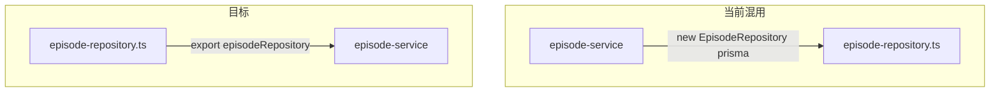

# 后端第三阶段重构规划

## 基线（第二阶段已达成）

- [routes/](packages/backend/src/routes/) 无直接 `prisma`；[plugins/](packages/backend/src/plugins/) 与 [queues/](packages/backend/src/queues/) 无 `prisma`。
- 分层主链：`routes → services → repositories → prisma`（见 [CODING_STANDARDS.md §2](docs/CODING_STANDARDS.md)）。
- 已出现 **Service 文件内导出 `*Repository` 单例** 与 **Repository 文件内导出单例** 两种并存（例如 [project-repository.ts](packages/backend/src/repositories/project-repository.ts) vs 仍在 [episode-service.ts](packages/backend/src/services/episode-service.ts)、[scene-service.ts](packages/backend/src/services/scene-service.ts) 等末尾 `new XRepository(prisma)`）。

## 第三阶段目标

1. **统一 Repository 单例位置**，避免 Service ↔ Queue 等模块因「从 service 拉 repository」再次产生 **TDZ / 循环依赖**（参考已修复的 [location-repository / image-queue / location-service](packages/backend/src/repositories/location-repository.ts) 模式）。
2. **将仍散落在 Service 中的裸 `prisma.` 读写** 迁入既有或扩展的 Repository（或极薄的专用 Service），保持对外行为与 API 不变。
3. **可选**：`services/ai/` 继续收纳模型相关封装；`api-logger` / `ModelApiCall` 可抽 **薄 Repository** 便于 mock（非强制）。

---

## 优先级 A — Repository 单例统一（低风险、优先做）

**现状**：多处仅在文件末尾使用 `prisma` 构造 Repository，例如：

- [episode-service.ts](packages/backend/src/services/episode-service.ts)：`export const episodeRepository = new EpisodeRepository(prisma)`
- [scene-service.ts](packages/backend/src/services/scene-service.ts)：`sceneRepository`
- [take-service.ts](packages/backend/src/services/take-service.ts)：`takeRepository`
- [composition-service.ts](packages/backend/src/services/composition-service.ts)：`compositionRepository`
- [settings-service.ts](packages/backend/src/settings-service.ts)：`settingsRepository`
- [stats-service.ts](packages/backend/src/services/stats-service.ts)：`statsRepository`
- [character-image-service.ts](packages/backend/src/services/character-image-service.ts)：`characterImageRepository`

**建议**：

- 与各模块已迁移方式一致：在对应 [repositories/\*.ts](packages/backend/src/repositories/) 文件末尾增加 `export const xRepository = new XRepository(prisma)`，**Service 只 import 单例**，删除 Service 内对 `prisma` 的 import（若仅用于构造单例）。
- 全仓库 grep 原导出路径并改为从 `repositories` 引用。

**验收**：`pnpm --filter @dreamer/backend exec vitest run` 全绿；`tsc --noEmit` 无报错；无新增 Service→Queue→Service 循环。

---

## 优先级 B — 仍含裸 `prisma.` 的 Service（按体量与依赖排序）

| 区域          | 文件                                                                               | 说明                                                                                                                                                                                                                                                                                                                      |
| ------------- | ---------------------------------------------------------------------------------- | ------------------------------------------------------------------------------------------------------------------------------------------------------------------------------------------------------------------------------------------------------------------------------------------------------------------------- |
| 剧本导入落库  | [importer.ts](packages/backend/src/services/importer.ts)                           | 多实体 create/update/deleteMany；可 orchestrate **Project/Character/Episode/Scene/Shot** 相关 Repository 方法（必要时新增 `Shot` 小方法或 `SceneRepository` 扩展）                                                                                                                                                        |
| 视觉补全落库  | [script-visual-enrich.ts](packages/backend/src/services/script-visual-enrich.ts)   | project/location/character/characterImage 更新；对齐 [location-repository](packages/backend/src/repositories/location-repository.ts)、[character-repository](packages/backend/src/repositories/character-repository.ts)、[character-image-repository](packages/backend/src/repositories/character-image-repository.ts) 等 |
| 实体保存      | [script-entities.ts](packages/backend/src/services/script-entities.ts)             | character/location upsert → 同上                                                                                                                                                                                                                                                                                          |
| 合成导出      | [composition-export.ts](packages/backend/src/services/composition-export.ts)       | composition find/update → [composition-repository.ts](packages/backend/src/repositories/composition-repository.ts) 扩展                                                                                                                                                                                                   |
| Seedance 音频 | [seedance-audio.ts](packages/backend/src/services/seedance-audio.ts)               | `sceneDialogue.findMany` → 小 Repository（或挂在 `EpisodeRepository`/`Scene` 相关）按需抽取                                                                                                                                                                                                                               |
| Worker 辅助   | [import-worker-service.ts](packages/backend/src/services/import-worker-service.ts) | 若仍保留 `new ProjectRepository(prisma)`，可与 A 一并改为 `projectRepository` 单例                                                                                                                                                                                                                                        |

**说明**：[api-logger.ts](packages/backend/src/services/api-logger.ts) 的 `ModelApiCall` 写入可 **第三阶段末尾** 再决定是否抽 `ModelApiCallRepository`；横切模块改动面大时需单独小 PR。

---

## 优先级 C（可选）— `services/ai/` 与规范对齐

- [CODING_STANDARDS.md §2](docs/CODING_STANDARDS.md) 中仍点名 `seedream-client`、`model-api-call-logger` 等：可在 **独立 PR** 将强模型相关的纯客户端/日志封装迁入 `services/ai/`，避免与 B 混做。
- 已有 [services/ai/deepseek.ts](packages/backend/src/services/ai/deepseek.ts) + [deepseek.ts](packages/backend/src/services/deepseek.ts) 重导出模式可复用。

---

## 优先级 D（可选）— `repositories/index.ts`

- 第二阶段规划曾提及：若 `new XRepository(prisma)` 重复消除后仍希望统一入口，可增加 barrel；**非必须**，以团队偏好为准。

---

## 统一验收（每步）

1. 目标文件无多余裸 `prisma.`（或横切模块有意识的例外并文档化）。
2. `pnpm --filter @dreamer/backend exec vitest run` 全绿；相关路由/Service 测试同步更新 import。
3. [AGENTS.md](AGENTS.md)：**ModelApiCall** / **ModelCallLogContext** 规则不变。
4. 不批量变更对外 API JSON 形状。

---

## 建议实施顺序

1. **A Repository 单例统一**（防循环、减噪音，1～2 个小 PR 亦可）。
2. **B** 按风险：`composition-export` → `script-entities` → `seedance-audio` → `script-visual-enrich` → **`importer`（最大，可单独 PR）**。
3. **C / D** 按需排期。
