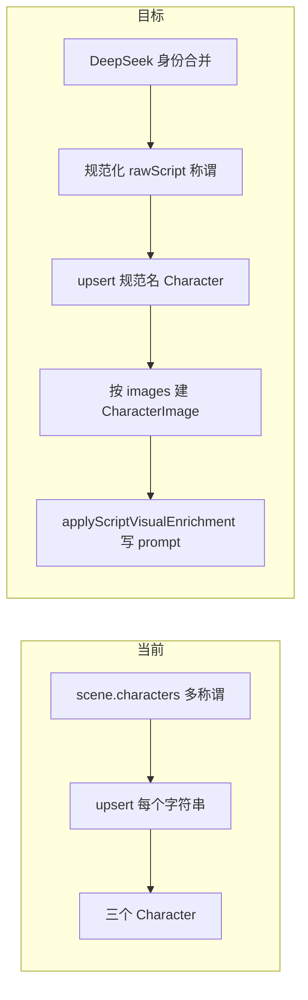

# 角色身份合并与形象槽位落地计划

本文档为仓库内**唯一事实来源**（与 `~/.cursor/plans/` 草稿无关）。若需归档或复盘，以本文件为准。

## 落地状态与实现对照（可逐项核对）

| 计划要点 | 代码位置 |
|----------|----------|
| 解析类型与 `images` 规范化 | `packages/backend/src/services/ai/parsed-script-types.ts` |
| Markdown/JSON 解析与 `PARSER_SYSTEM_PROMPT` | `packages/backend/src/services/ai/parser.ts` |
| 导入落库 Character + CharacterImage | `packages/backend/src/services/importer.ts` |
| 身份合并 DeepSeek、`op: character_identity_merge` | `packages/backend/src/services/ai/character-identity-merge.ts` |
| rawScript 称谓替换 | `packages/backend/src/services/character-identity-normalize.ts`（`normalizeScriptContent`） |
| 解析剧本 + Pipeline 共用流水线 | `packages/backend/src/services/parse-script-entity-pipeline.ts`（`runParseScriptEntityPipeline`） |
| 大纲解析任务入口 | `packages/backend/src/services/project-script-jobs.ts`（`runParseScriptJob`） |
| Pipeline 执行器 | `packages/backend/src/services/pipeline-executor.ts` |
| 视觉补全 + prompt 兜底 | `packages/backend/src/services/script-visual-enrich.ts`（`applyScriptVisualEnrichment`、`fillMissingCharacterImagePrompts`）、`packages/backend/src/services/ai/script-visual-enrichment.ts` |
| 单槽 prompt 生成 | `packages/backend/src/services/ai/character-slot-image-prompt.ts` |
| 导入 Worker 后补全定妆 | `packages/backend/src/queues/import.ts` |
| 别名 `Character` 删除 | `parse-script-entity-pipeline.ts` 内 `deleteAliasCharacterRows`；`characterRepository.findFirstByProjectAndName` |

**说明**：原计划第 4 节写「`saveCharacters` + `applyScriptVisualEnrichment`」在 Pipeline 里分步调用；落地时改为 **`runParseScriptEntityPipeline` 统一封装**（内含身份合并、写回 rawScript、saveLocations、saveCharacters、槽位与默认 base），再 `applyScriptVisualEnrichment`，避免两条链路行为不一致。

---

## 问题根因（与方案的关系）

- **大纲「解析剧本」**（[`runParseScriptJob`](packages/backend/src/services/project-script-jobs.ts)）并不调用 [`parseScriptDocument`](packages/backend/src/services/ai/parser.ts)。角色来自 [`saveCharacters`](packages/backend/src/services/script-entities.ts)：遍历 `ScriptContent.scenes[].characters`，对每个字符串执行 [`upsertPlaceholderByProjectName`](packages/backend/src/repositories/character-repository.ts)。因此「宋应星 / 宋工部尚书 / 宋家居形象」会变成三条 `Character`。
- **视觉补全** [`applyScriptVisualEnrichment`](packages/backend/src/services/script-visual-enrich.ts) 已能按 `characters[].images[]`（base/outfit/…）落库 prompt，但它按 **库内已有角色名** 匹配；若上游已拆成多人，只能给多人各做一套，无法从结构上修复。
- **剧本导入** [`importParsedData`](packages/backend/src/services/importer.ts）在改造前只建 `Character`，**不建** `CharacterImage`；与用户期望的「先 Character 再槽位」不一致（现已按槽位落库）。
- **定妆 prompt 未落库**：[`applyScriptVisualEnrichment`](packages/backend/src/services/script-visual-enrich.ts) 对每个槽位要求 **`slot.prompt` 非空**（约 `if (!slot?.name || !slot.prompt?.trim()) continue`）。若 DeepSeek 在 [`script-visual-enrichment.ts`](packages/backend/src/services/ai/script-visual-enrichment.ts) 返回的 JSON 里某条 `images[]` 只有 `description` 没有 `prompt`，该槽位会被 **整段跳过**，`CharacterImage.prompt` 长期为 `null`。另：角色名与库不一致时整角色被 `continue` 跳过；**导入任务**完成后若未再调视觉补全，也不会有 prompt（导入 Worker 已补）。

因此需要 **两条链路都改**：导入侧改 parser + importer，并在导入成功后 **补一轮定妆 prompt**（或共用与解析剧本相同的补全函数）；大纲侧在 `saveCharacters` 之前增加「身份合并 + rawScript 规范化 + 按槽位建图」，并处理 **prompt 兜底**（见 3.1）。

## 1. 共享类型与 AI 契约

- 在 [`packages/backend/src/services/ai/parser.ts`](packages/backend/src/services/ai/parser.ts)（或模块 [`parsed-script-types.ts`](packages/backend/src/services/ai/parsed-script-types.ts)）扩展：
  - `ParsedCharacterImage`: `{ name: string; type: 'base' | 'outfit' | string; description: string }`
  - `ParsedCharacter`: `name`, `description`, `images?: ParsedCharacterImage[]`
- **规范化函数**（可与现有 `normalizeParsedData` 并列）：
  - 若缺 `images` 或为空：补一条 `{ name: '基础形象', type: 'base', description: character.description || '' }`
  - 保证至少一条 `type === 'base'`（可排序：base 在前）
- [`importer.ts`](packages/backend/src/services/importer.ts) 从 parser **导出类型复用**，避免三处漂移（与 [`script-visual-enrich.ts`](packages/backend/src/services/script-visual-enrich.ts) 内本地 interface 对齐）。

## 2. 调整「导入」DeepSeek 系统指令与落库

- 更新 [`PARSER_SYSTEM_PROMPT`](packages/backend/src/services/ai/parser.ts)：加入「独特个体 / 身份变化 / images 数组」规则；JSON 示例改为嵌套 `images`。
- [`importParsedData`](packages/backend/src/services/importer.ts)：
  - 对每个 `charData`：`createCharacter` 后，按 `charData.images` **顺序** `createCharacterImage`（`prompt` 可先 `null`，`order` 为索引；`type` 取自槽位；与现有 `CharacterImage.type` 字段一致）。
  - 若项目已有「仅 base、无 outfit」的兼容需求，由规范化保证至少 base 槽位即可。
- [`parser.test.ts`](packages/backend/tests/parser.test.ts)：JSON 输入含 `images` 的用例；[`importer.test.ts`](packages/backend/tests/importer.test.ts) mock `characterImage`。

## 3. 大纲「解析剧本」：DeepSeek 身份合并 + rawScript 写回

- 实现文件：[`character-identity-merge.ts`](packages/backend/src/services/ai/character-identity-merge.ts)
- **输入**：合并后的 [`ScriptContent`](packages/shared/src/types/index.ts)（或 `title/summary` + 各场 `characters` + `dialogues` 的序列化文本），以及从剧本中收集的 **去重称谓列表**（排除 [`isCrowdExtraCharacterName`](packages/backend/src/services/script-entities.ts)）。
- **输出 JSON**：`{ characters: ParsedCharacter[] }`，并额外包含 **`aliasToCanonical`** 以便替换剧本（顶层映射；实现见 `CharacterIdentityMergeResult`）。
- **DeepSeek 调用**：[`getDeepSeekClient`](packages/backend/src/services/ai/deepseek-client.ts) + [`logDeepSeekChat`](packages/backend/src/services/ai/model-call-log.js)，`ModelCallLogContext`，`op`：`character_identity_merge`。
- **rawScript 规范化**（[`character-identity-normalize.ts`](packages/backend/src/services/character-identity-normalize.ts)）：
  - 对每个 `ScriptScene`：`characters` 中名字若在 `aliasToCanonical` 中则替换为规范名（去重保留顺序）。
  - 对每个 `ScriptDialogueLine`：`character` 字段同样替换。
  - 可选：`metadata.characters` 若存在也替换。
- **写回分集**：[`runParseScriptJob`](packages/backend/src/services/project-script-jobs.ts) 经 [`runParseScriptEntityPipeline`](packages/backend/src/services/parse-script-entity-pipeline.ts)：对 `targetEpisodes` 范围内各 episode 读 `rawScript` → 规范化 → [`episodeRepository.update`](packages/backend/src/repositories/episode-repository.ts) 写回；再 `mergeEpisodesToScriptContent`。
- **落库顺序（核心）**：
  1. `mergeEpisodesToScriptContent`（供身份合并模型输入）
  2. 调用身份合并 DeepSeek
  3. 逐集规范化并持久化 `rawScript`
  4. 再次 `mergeEpisodesToScriptContent` 得到 `merged`
  5. `saveLocations(projectId, merged)`
  6. `saveCharacters(projectId, merged)` — 此时只会 upsert 规范名
  7. 删别名 `Character`、更新规范名描述、按合并结果补 `CharacterImage`、无 base 时 `createDefaultBaseCharacterImage`（逻辑在 `parse-script-entity-pipeline.ts`）
  8. `applyScriptVisualEnrichment`；若仍缺 prompt，走 **兜底**（见 3.1）

## 3.1 定妆 prompt 覆盖（解决「没有图片生成提示词」）

目标：每个应参与文生图的 `CharacterImage`（至少 base，及需要的 outfit）在解析/导入结束后 **`prompt` 非空**，或明确可重试。

**根因归纳**

| 原因 | 说明 |
|------|------|
| 视觉补全硬门槛 | 无 `prompt` 的槽位不写库，description alone 不够 |
| 名称对不上 | `payload.characters[].name` 与 DB `Character.name` 不一致则整段跳过 |
| 导入无补全 | 改造前 import worker 只 `importParsedData`，不调 `applyScriptVisualEnrichment` |
| 模型偶发空字段 | `temperature`、长 JSON 下部分 `images[].prompt` 为空 |

**对策**

1. **契约收紧**：在 [`buildScriptVisualEnrichmentUserContent`](packages/backend/src/services/ai/script-visual-enrichment.ts) 中强调「每条 `images[]` 必须含非空 `prompt`；`description` 可辅助但不可替代 prompt」。
2. **服务端兜底**：在 `applyScriptVisualEnrichment` 末尾 [`fillMissingCharacterImagePrompts`](packages/backend/src/services/script-visual-enrich.ts) 调用 [`generateCharacterSlotImagePrompt`](packages/backend/src/services/ai/character-slot-image-prompt.ts)，`op`：`character_slot_prompt_fallback`。
3. **导入链路**：[`import` worker](packages/backend/src/queues/import.ts) 在 `importParsedData` 成功后 `mergeEpisodesToScriptContent` + `applyScriptVisualEnrichment`。

**测试**：单测 mock `generateCharacterSlotImagePrompt`；[`script-visual-enrich.test.ts`](packages/backend/tests/script-visual-enrich.test.ts)、[`import-queue-worker.test.ts`](packages/backend/tests/import-queue-worker.test.ts)。

## 4. Pipeline 全链路对齐

[`executePipelineJob`](packages/backend/src/services/pipeline-executor.ts) 在 **skipEarlySteps** 与 **非 skip**（写完分集落库后）均调用 **`runParseScriptEntityPipeline`**，再 `applyScriptVisualEnrichment`，与「解析剧本」一致。需 `projectMeta.userId`（身份合并与日志审计）。

## 5. 数据一致性与边界

- **已生成头像的槽位**：首次实现宜 **只增补** 缺失槽位、不删除用户已有 `CharacterImage`；合并导致的「别名 Character」若已存在，合并为规范名后尝试删除别名行（仅当无 `SceneDialogue` 等外键引用时）；删除失败则打日志。
- **唯一约束**：`Character` 的 `@@unique([projectId, name])` 要求规范名全局唯一；合并后写回 rawScript 可避免再次创建别名行。

## 6. 测试清单（与 AGENTS.md 一致）

- [`parser.test.ts`](packages/backend/tests/parser.test.ts)：嵌套 `images`、缺省补 base。
- [`character-identity-normalize.test.ts`](packages/backend/tests/character-identity-normalize.test.ts)：`normalizeScriptContent`。
- [`script-visual-enrich.test.ts`](packages/backend/tests/script-visual-enrich.test.ts)、[`import-queue-worker.test.ts`](packages/backend/tests/import-queue-worker.test.ts)：`generateCharacterSlotImagePrompt` mock。
- 回归：[`script-entities.test.ts`](packages/backend/tests/script-entities.test.ts) 等。

## 关键文件索引

| 区域 | 文件 |
|------|------|
| 导入解析 | [`parser.ts`](packages/backend/src/services/ai/parser.ts), [`importer.ts`](packages/backend/src/services/importer.ts) |
| 大纲流水线 | [`parse-script-entity-pipeline.ts`](packages/backend/src/services/parse-script-entity-pipeline.ts), [`project-script-jobs.ts`](packages/backend/src/services/project-script-jobs.ts), [`script-entities.ts`](packages/backend/src/services/script-entities.ts) |
| 视觉补全 | [`script-visual-enrich.ts`](packages/backend/src/services/script-visual-enrich.ts), [`script-visual-enrichment.ts`](packages/backend/src/services/ai/script-visual-enrichment.ts) |
| 定妆 prompt 兜底 | [`character-slot-image-prompt.ts`](packages/backend/src/services/ai/character-slot-image-prompt.ts), [`character-service.ts`](packages/backend/src/services/character-service.ts) |
| 导入 Worker | [`packages/backend/src/queues/import.ts`](packages/backend/src/queues/import.ts) |
| Pipeline | [`pipeline-executor.ts`](packages/backend/src/services/pipeline-executor.ts) |
| 测试 | [`parser.test.ts`](packages/backend/tests/parser.test.ts), [`character-identity-normalize.test.ts`](packages/backend/tests/character-identity-normalize.test.ts) |
