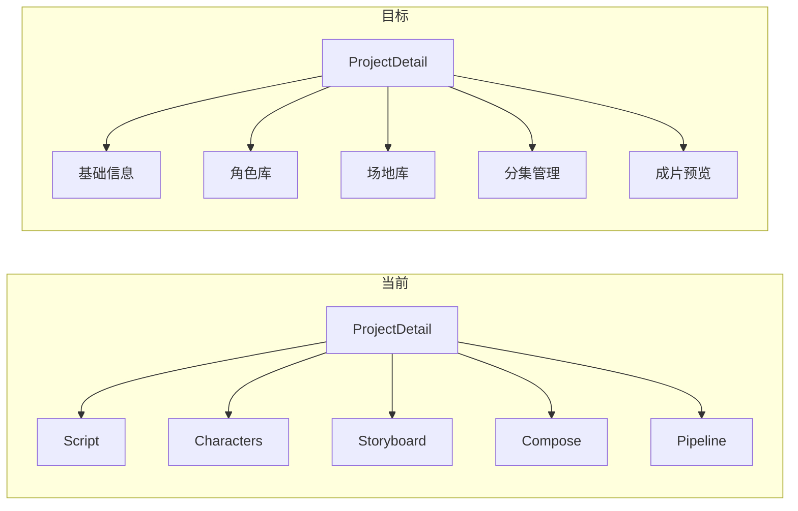

# 项目详情页（终版交互）实施计划

> **归档说明**：由 Cursor 内部计划 `项目详情页对齐设计_ca4cbdac` 归档至本目录。  
> **归档日期**：2026-04-13  
> **状态**：待实施  
> **对齐**：交互设计终版（路由 `/project/:id`）、[DREAMER_DATA_MODEL.md](../../DREAMER_DATA_MODEL.md) v4.1、图片模型 SeedEdit 3.0（首选）、Kling-Omni（备选）

## 任务清单

- [ ] Prisma：`CharacterImage.prompt`、`Location.imagePrompt` + migrate；同步 shared 类型
- [ ] `GET /api/projects/:id` 展开 `characters.images`；必要时补 `PATCH` 别名
- [ ] `POST /character-images/:id/generate`、JSON `POST /characters/:id/images`、locations 路由与 `generate-image`；`imageQueue.add` + 单测
- [ ] `runParseScriptJob`：AI 输出多形象 + `imagePrompt` + `parentId` 落库
- [ ] `PATCH /takes/:id/select` 封装；`POST /episodes/:id/compose` 复用 ffmpeg 导出
- [ ] `ProjectDetail` 五 Tab + 各视图/弹窗/SSE；收敛旧侧栏
- [ ] `image-generation` 可插拔 provider + Kling-Omni 备选（可选后置）

---

## 现状与差距摘要

| 设计文档 | 当前实现 |
| -------- | -------- |
| 左侧 Tab：基础信息 / 角色库 / 场地库 / 分集管理 / 成片预览 | `ProjectDetail.vue` 为「AI编剧 / 角色库 / 分镜控制台 / 视频合成 / AI流水线」子路由，默认进 `ProjectScript.vue` |
| `GET /api/projects/:id` 含角色形象（含 `prompt`）与场地 | `projects.ts` 仅 `characters: true` / `locations: true`，**不展开** `images`；`CharacterImage` **无 `prompt` 列**，`Location` **无 `imagePrompt` 列**（见 `schema.prisma`） |
| `PATCH /api/projects/:id` | 后端为 **`PUT`** `PUT /api/projects/:id`（语义可接受，文档需对齐或增加 `PATCH` 别名） |
| `POST /api/character-images/:id/generate` | **无** HTTP 路由；`image-queue` Worker 已实现 `character_base_*` / `character_derived_*` / `location_establishing`，但**未发现任何 `imageQueue.add` 调用**（图片生成未接入 API） |
| `POST /api/characters/:id/images`（JSON + DeepSeek 写 prompt） | 仅支持 **multipart 上传文件** `characters.ts` |
| `POST /api/locations/:id/generate-image` | **无** `locations` 路由注册（`index.ts` 未注册） |
| `PATCH /api/takes/:id/select` | 选用 Take 为 `POST /api/scenes/:id/tasks/:taskId/select` |
| `POST /api/episodes/:id/compose` | 成片为 `POST /api/compositions` + `timeline` + `export`，需封装或前端组合 |
| 解析剧本预生成 `images[].prompt`、`location.imagePrompt` | `runParseScriptJob` 仅 `saveLocations` + `ensureCharacterBaseSlot`（默认「默认形象」槽，**无多形象、无英文 prompt**） |

---

## 1. 数据模型（v4.1 对齐）

- 在 Prisma 增加：
  - `CharacterImage.prompt String?`（解析与 UI 编辑共用）
  - `Location.imagePrompt String?`（解析与定场图生成弹窗）
- 使用项目既有迁移流程（**禁止** `--force-reset`）：`pnpm --filter @dreamer/backend run db:migrate` 或团队约定的 `db:migrate`。
- 同步 `packages/shared/src/types/index.ts` 中 `CharacterImage`、`ProjectLocation` 类型。

---

## 2. 解析剧本（前置数据）

- 扩展 **AI 输出结构**（与交互设计文档 §4.1 一致）：角色多 `images[]`（`name/type/description/prompt`）、场地 `imagePrompt`。
- 落库逻辑（与 §4.2、§4.3 一致）：
  - 写入 `Character` / `CharacterImage`（含 `prompt`；`type`=`base`/`outfit`；`outfit` 的 `parentId` 指向该角色 `base` 的 `id`）。
  - 写入 `Location`（含 `imagePrompt`）。
- 实现位置：`ensureCharacterBaseSlot` / `saveLocations` 的增强版，或独立 `parse-script-entities.ts`，由 `runParseScriptJob` 调用。
- **Prompt 工程**：需单独 DeepSeek 调用（或合并进一次结构化输出），与现有 `script-entities.ts` 的「仅名称 upsert」区分。

---

## 3. 图片生成服务（SeedEdit 3.0 首选 / Kling-Omni 备选）

- **现状**：`image-generation.ts` 已用方舟 `DEFAULT_T2I_MODEL` / `DEFAULT_EDIT_MODEL`（SeedEdit 3.0 编辑模型名已存在），与「SeedEdit 3.0」一致。
- **备选**：实现 `Kling-Omni` 为**可切换 provider**（环境变量如 `IMAGE_PROVIDER=ark|kling`），失败时回退（策略在文档层写清，避免静默吞错）。
- 队列 Worker：已有 `character_base_regenerate` 等；需与「解析阶段已预建槽位、`avatarUrl=null`」对齐：**首生成**应走 `character_base_regenerate`（按 `characterImageId` 更新）而非 `character_base_create`（当前会新建行），或新增 `kind` 专门表示「填充已有槽位」。

---

## 4. 后端 HTTP API（与设计映射）

建议新增/调整（保持现有路由可用，减少前端大爆炸）：

1. **`GET /api/projects/:id`**：`include` 中 `characters: { include: { images: { orderBy: { order: 'asc' } } } }`，`locations` 全量。
2. **`POST /api/character-images/:id/generate`**：`body: { prompt?: string }`（可选覆盖 DB 中 `prompt`）→ `imageQueue.add` + 返回 `jobId` 或同步 `202`；**SSE** 已有 `sendProjectUpdate` + `image-generation` 事件，前端可订阅刷新。
3. **`POST /api/characters/:id/images`**：在保留现有 multipart 的前提下，增加 **JSON body** 分支：`name/type/description/parentId` → 调 DeepSeek 生成 `prompt` → `create`（`avatarUrl=null`），与文档「生成提示词并创建」一致。
4. **注册 `locations` 路由**（前缀 `/api/locations`）：`GET`（按 `projectId`）、`PUT`（编辑描述/时间）、`POST /:id/generate-image`（入队 `location_establishing`）。
5. **选用 Take**：增加 **`PATCH /api/takes/:id/select`** 作为薄封装，内部复用现有 `sceneId` + `clear others + set isSelected` 逻辑（或转发到现有 service），便于与文档一致。
6. **合成导出**：`POST /api/episodes/:id/compose` 实现为：校验该集所有 `Scene` 均有 `isSelected` Take → 创建/更新 `Composition` → 写入 `CompositionScene` 顺序 → 调用现有 `composeVideo` 与 `outputUrl` 更新（与 `compositions/:id/export` 逻辑复用）。

每个新路由需按 `AGENTS.md` 在 `packages/backend/tests/` 补 Vitest（Mock prisma / queue / 外部 API）。

---

## 5. 前端 `/project/:id` 结构

- **路由**：在 `router/index.ts` 的 `ProjectDetail` children 下，用 **5 个子路由** 对应五 Tab（或单页 + `query`/本地 state 控制 Tab，二选一；多路由便于深链与懒加载）。
- **布局**：复用 `ProjectDetail.vue` 的 `NLayoutSider` + `NMenu`，替换 `menuOptions` 与文案；顶栏「保存草稿」→ 调 `PUT /api/projects/:id`（`projectStore.updateProject`）。
- **各 Tab 实现策略**：
  - **基础信息**：`name/description/synopsis/visualStyle` + 分集 `Episode.synopsis` 列表（`PUT /projects/:id` + `PUT /episodes/:id` 或批量接口）。
  - **角色库**：在 `ProjectCharacters.vue` 上改，或抽新组件；槽位弹窗、SSE 刷新 `avatarUrl`。
  - **场地库**：新视图；网格卡片 + 生成弹窗。
  - **分集管理**：左侧集列表 + 右侧 `sceneStore` 拉取场景与 `takes`；`一键生成` → `POST /api/scenes/batch-generate`（已存在）；进度可轮询 `/api/tasks` 或任务中心。
  - **成片预览**：复用 `ProjectCompose.vue` 播放器与选集逻辑，改为「按 Composition 状态」展示文档中的「已合成/合成中/未合成」。
- **旧页面**：`script` / `storyboard` / `pipeline` 可保留路由供过渡期，或从侧栏移除仅保留直达 URL（产品决策）。

---

## 6. 风险与依赖

- **解析剧本 Prompt 体量**：多角色多形象 + 全场地，需控制 token 与分段生成策略。
- **Kling-Omni**：需 API 文档与密钥；若未就绪，可先实现 **SeedEdit + 环境变量开关**，预留接口。
- **与现有「分镜控制台」关系**：分集管理 Tab 与「场景/Shot」模型在 v4.1 已对齐 `DREAMER_DATA_MODEL.md`；若分集管理 UI 与 `ProjectStoryboard` 重复，应合并数据源（`GET /api/scenes?episodeId=`）避免两套状态。

---

## 建议实施顺序

1. Schema + shared types + `GET /projects/:id` 展开 `images`。
2. 图片 HTTP + Worker 与「预建槽位」对齐。
3. Locations API + 场地 Tab。
4. 解析剧本 AI 输出与落库。
5. 项目详情壳 + 五 Tab（可先 MVP：基础信息 + 角色 + 场地，再分集 + 成片）。
6. Kling 备选与合成便捷接口。
